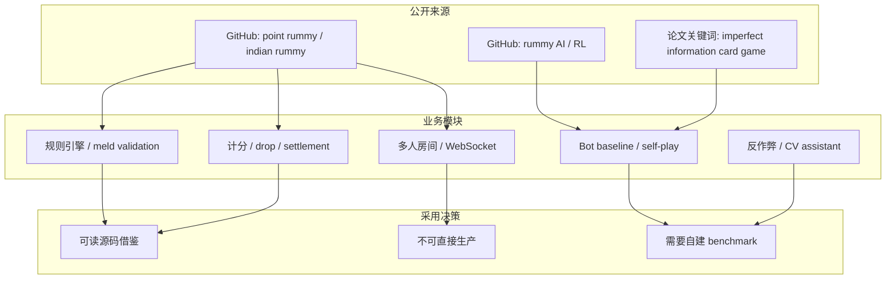
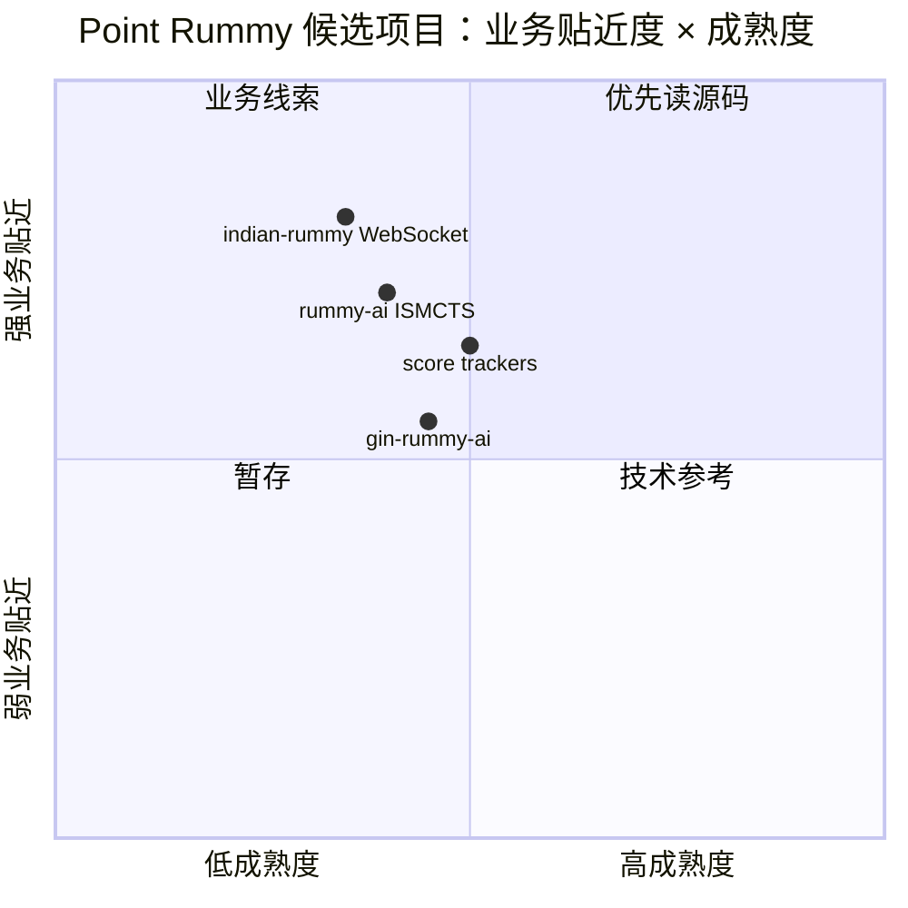

# Point Rummy / Indian Rummy GitHub Watchlist - 2026-06-30

> 返回日报：[[Daily/2026-06-30]]  
> 来源：GitHub Search + AI Radar snapshot  
> 说明：该主题是用户近期业务重点；当前公开 GitHub 生态整体 star 较低，因此更适合作为规则/实现/仿真线索，不作为成熟生产方案直接采用。

## 一句话结论
Point Rummy / Indian Rummy 公开 GitHub 项目数量不少但成熟度偏低，最值得先看的不是 star，而是规则引擎、计分、AI opponent、WebSocket 多人房间和仿真环境是否可复用。

## TL;DR
- **最高 star**：`rickgorman/gin-rummy-ai`、`nakkekakke/rummy-ai`、`mudont/indian-rummy` 等，规模小但能提供 bot/规则参考。
- **最新信号**：`shivayya-ln-21303/indian-rummy` 是 Spring Boot 3 + React + WebSocket，多人 Indian Rummy 方向对业务实现更接近。
- **业务价值**：优先抽规则校验、计分、meld 检测、bot baseline、局域网/多人房间结构。
- **风险**：多数项目未必覆盖印度 Point Rummy 完整规则、drop/declare/joker/settlement/anti-cheat。

## 信息压缩图示

## GitHub 高 star 候选
| 标签 | repo | stars | forks | language | updated_at | 重点概括 | 业务可用性 | Obsidian 详情 | 原文 |
|---|---|---:|---:|---|---|---|---|---|---|
| 后续 | rickgorman/gin-rummy-ai | 13 | 5 | Python | 2025-03-25T13:47:09Z | A hand-rolled neuroevolution AI for gin rummy. | AI/bot/仿真参考 | [[Business/PointRummy/2026-06-30/point-rummy-github-watchlist]] | [原文](https://github.com/rickgorman/gin-rummy-ai) |
| 后续 | nakkekakke/rummy-ai | 11 | 5 | Java | 2026-04-17T10:02:59Z | Text based classic Rummy game with an AI that uses ISMCTS. Data Structures and Algorithms  | AI/bot/仿真参考 | [[Business/PointRummy/2026-06-30/point-rummy-github-watchlist]] | [原文](https://github.com/nakkekakke/rummy-ai) |
| 后续 | jmhummel/Gin-Rummy-Java | 8 | 0 | Java | 2023-08-16T16:12:58Z | Java-based Gin Rummy console game, with an AI opponent | AI/bot/仿真参考 | [[Business/PointRummy/2026-06-30/point-rummy-github-watchlist]] | [原文](https://github.com/jmhummel/Gin-Rummy-Java) |
| 可 skim | mudont/indian-rummy | 5 | 0 | TypeScript | 2025-08-08T21:05:04Z | Typescript library for Indian Rummy card game | 规则/实现参考 | [[Business/PointRummy/2026-06-30/point-rummy-github-watchlist]] | [原文](https://github.com/mudont/indian-rummy) |
| 可 skim | dv-rastogi/Rummy | 5 | 0 | Python | 2023-09-26T11:21:39Z | Variation of classical Indian Rummy made in Pygame | AI/bot/仿真参考 | [[Business/PointRummy/2026-06-30/point-rummy-github-watchlist]] | [原文](https://github.com/dv-rastogi/Rummy) |
| 可 skim | vahsek300501/Indian-Rummy- | 4 | 3 | Python | 2023-09-26T11:21:46Z | Indian Rummy made in Python using PyGame | AI/bot/仿真参考 | [[Business/PointRummy/2026-06-30/point-rummy-github-watchlist]] | [原文](https://github.com/vahsek300501/Indian-Rummy-) |
| 可 skim | SCFlanagan/Rummy | 4 | 6 | JavaScript | 2025-07-25T21:17:08Z | This project is a recreation of the classic card game Rummy. It features an AI player to p | 规则/实现参考 | [[Business/PointRummy/2026-06-30/point-rummy-github-watchlist]] | [原文](https://github.com/SCFlanagan/Rummy) |
| 可 skim | mcartmell/gin-rummy-bot | 4 | 2 | Perl | 2024-10-30T20:06:17Z | A web-based Gin Rummy game and AI | AI/bot/仿真参考 | [[Business/PointRummy/2026-06-30/point-rummy-github-watchlist]] | [原文](https://github.com/mcartmell/gin-rummy-bot) |
| 可 skim | Mohitkumar-559/RummyServer | 2 | 1 | JavaScript | 2024-03-17T03:48:34Z | Rummy game server for game that contain deal rummy and point rummy | 规则/实现参考 | [[Business/PointRummy/2026-06-30/point-rummy-github-watchlist]] | [原文](https://github.com/Mohitkumar-559/RummyServer) |
| 可 skim | abubakarmunir712/dsa-final-project | 2 | 1 | Python | 2026-06-27T06:34:26Z | A Python-based multiplayer Indian Rummy game with support for AI opponents and LAN play. I | AI/bot/仿真参考 | [[Business/PointRummy/2026-06-30/point-rummy-github-watchlist]] | [原文](https://github.com/abubakarmunir712/dsa-final-project) |

## 最新 / 增长代理候选
| 标签 | repo | stars | forks | language | updated_at | 重点概括 | 业务可用性 | Obsidian 详情 | 原文 |
|---|---|---:|---:|---|---|---|---|---|---|
| 后续 | shivayya-ln-21303/indian-rummy | 0 | 0 | Java | 2026-06-30T05:22:44Z | Multiplayer Indian Rummy — Spring Boot 3 + React + WebSocket | 规则/实现参考 | [[Business/PointRummy/2026-06-30/point-rummy-github-watchlist]] | [原文](https://github.com/shivayya-ln-21303/indian-rummy) |
| 后续 | Hari-sys786/rummy-scoreboard | 0 | 0 | Dart | 2026-06-29T13:14:32Z | Premium Flutter Android scoreboard for Indian Rummy — local storage, dealer rotation, drop | 规则/实现参考 | [[Business/PointRummy/2026-06-30/point-rummy-github-watchlist]] | [原文](https://github.com/Hari-sys786/rummy-scoreboard) |
| 后续 | debabrata-mandal/RummyPulse | 1 | 0 | Java | 2026-06-28T09:58:44Z | RummyPulse - Smart Rummy Game Analytics & Management Android App with Firebase integration | 规则/实现参考 | [[Business/PointRummy/2026-06-30/point-rummy-github-watchlist]] | [原文](https://github.com/debabrata-mandal/RummyPulse) |
| 后续 | abubakarmunir712/dsa-final-project | 2 | 1 | Python | 2026-06-27T06:34:26Z | A Python-based multiplayer Indian Rummy game with support for AI opponents and LAN play. I | AI/bot/仿真参考 | [[Business/PointRummy/2026-06-30/point-rummy-github-watchlist]] | [原文](https://github.com/abubakarmunir712/dsa-final-project) |
| 后续 | Nethaji003/rummy2 | 0 | 0 | HTML | 2026-06-18T07:31:53Z | point | AI/bot/仿真参考 | [[Business/PointRummy/2026-06-30/point-rummy-github-watchlist]] | [原文](https://github.com/Nethaji003/rummy2) |
| 后续 | SRathinaGiri/IndianRummy | 1 | 1 | JavaScript | 2026-06-17T11:46:14Z | Browser-based Indian Rummy game with AI play and offline Progressive Web App support. | AI/bot/仿真参考 | [[Business/PointRummy/2026-06-30/point-rummy-github-watchlist]] | [原文](https://github.com/SRathinaGiri/IndianRummy) |

## 专业解读
Point Rummy 业务最缺的通常不是 UI demo，而是严格规则状态机：合法 meld / sequence / set、joker 处理、drop/declare、结算、多人轮转和异常状态恢复。公开 repo 可以作为规则命名、状态划分和 bot baseline 的素材，但需要用自己的规则测试集重新验收。

## 通俗解释
这些项目更像“别人写过的小样本”，可以帮我们少踩规则和界面坑，但不能直接拿来当线上印度 Rummy 产品。

## 我应该如何跟进
1. 先读 `mudont/indian-rummy`、`nakkekakke/rummy-ai`、`shivayya-ln-21303/indian-rummy`。
2. 抽一份规则测试表：发牌、摸弃、meld、joker、declare、drop、计分。
3. 用这些 repo 的 AI/bot 做 baseline，不要直接相信策略强度。

## 相关链接
- GitHub search: https://github.com/search?q=point+rummy&type=repositories
- GitHub search: https://github.com/search?q=indian+rummy&type=repositories

## 标签
#ai-radar #point-rummy #indian-rummy #game-ai #rl
