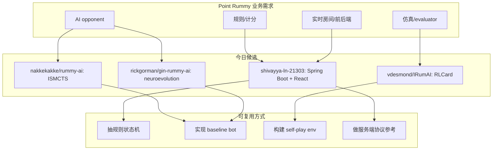

# Point Rummy / Indian Rummy GitHub Watchlist

> 日期：2026-07-01  
> 来源：GitHub Search snapshot  
> 原文集合：见下表。

## 一句话结论
今日 Point Rummy / Indian Rummy 主题命中 97 个 repo；整体 star 很低，但有 ISMCTS、neuroevolution、RLCard、Spring Boot + React + WebSocket 等可拆组件。

## TL;DR
- 最值得看：`nakkekakke/rummy-ai`（ISMCTS）、`rickgorman/gin-rummy-ai`（neuroevolution）、`vdesmond/IRumAI`（Indian Rummy RL）。
- 业务价值：规则建模、bot 策略、仿真评测、前后端实时房间。
- 风险：多数 repo 停更或教学性质强，不能直接生产复用。

## 元信息表
| 字段 | 内容 |
|---|---|
| 来源类型 | GitHub Repository Snapshot |
| 命中数 | 97 |
| 原文 | GitHub repo URLs |

## 信息压缩图示

## 高 star 候选
| 排名 | repo | stars | forks | language | updated_at | 重点概括 | 原文 |
|---:|---|---:|---:|---|---|---|---|
| 1 | rickgorman/gin-rummy-ai | 13 | 5 | Python | 2025-03-25T13:47:09Z | A hand-rolled neuroevolution AI for gin rummy. | https://github.com/rickgorman/gin-rummy-ai |
| 2 | nakkekakke/rummy-ai | 11 | 5 | Java | 2026-04-17T10:02:59Z | Text based classic Rummy game with an AI that uses ISMCTS. Data Structures and Algorithms course project, University of Helsinki | https://github.com/nakkekakke/rummy-ai |
| 3 | jmhummel/Gin-Rummy-Java | 8 | 0 | Java | 2023-08-16T16:12:58Z | Java-based Gin Rummy console game, with an AI opponent | https://github.com/jmhummel/Gin-Rummy-Java |
| 4 | mudont/indian-rummy | 5 | 0 | TypeScript | 2025-08-08T21:05:04Z | Typescript library for Indian Rummy card game | https://github.com/mudont/indian-rummy |
| 5 | dv-rastogi/Rummy | 5 | 0 | Python | 2023-09-26T11:21:39Z | Variation of classical Indian Rummy made in Pygame | https://github.com/dv-rastogi/Rummy |
| 6 | vahsek300501/Indian-Rummy- | 4 | 3 | Python | 2023-09-26T11:21:46Z | Indian Rummy made in Python using PyGame | https://github.com/vahsek300501/Indian-Rummy- |
| 7 | SCFlanagan/Rummy | 4 | 6 | JavaScript | 2025-07-25T21:17:08Z | This project is a recreation of the classic card game Rummy. It features an AI player to play against, a hand of cards that can be dragged and sorted, and a scoreboard that keeps track of multiple rounds. | https://github.com/SCFlanagan/Rummy |
| 8 | mcartmell/gin-rummy-bot | 4 | 2 | Perl | 2024-10-30T20:06:17Z | A web-based Gin Rummy game and AI | https://github.com/mcartmell/gin-rummy-bot |
| 9 | Mohitkumar-559/RummyServer | 2 | 1 | JavaScript | 2024-03-17T03:48:34Z | Rummy game server for game that contain deal rummy and point rummy | https://github.com/Mohitkumar-559/RummyServer |
| 10 | abubakarmunir712/dsa-final-project | 2 | 1 | Python | 2026-06-27T06:34:26Z | A Python-based multiplayer Indian Rummy game with support for AI opponents and LAN play. Implements data structures like linked lists, stacks, queues, hashmaps, and graphs to ensure efficient gameplay and intelligent AI  | https://github.com/abubakarmunir712/dsa-final-project |

## 专业解读
Rummy 主题不应按 star 筛选，因为生态本身小。更有价值的判断是：是否包含可抽象的状态表示、meld 判定、discard policy、self-play loop、MCTS/ISMCTS 或服务端实时同步。

## 通俗解释
这些项目更像“零件库”和“参考实现”，不是能直接上线的产品。

## 对我的影响
- 可先抽 Indian Rummy 的规则状态机和 scorer。
- 再用 ISMCTS / heuristic bot 做 baseline，之后才考虑 DQN/自博弈。
- 对真钱业务还需要风控、反作弊、审计和合规层，GitHub 项目通常没有。

## 可信度与局限性
GitHub 元数据来自今日 snapshot；部分 repo star 为 0 且描述稀疏，需要人工打开 README 复核。

## 我应该如何跟进
1. 优先读 `nakkekakke/rummy-ai` 和 `vdesmond/IRumAI`。
2. 提取 meld/scoring 状态机，写统一 simulator interface。
3. 用 1-2 个 baseline bot 生成 evaluator。

## 相关链接
- 今日日报：[[Daily/2026-07-01]]

#ai-radar #point-rummy #game-ai #rl
