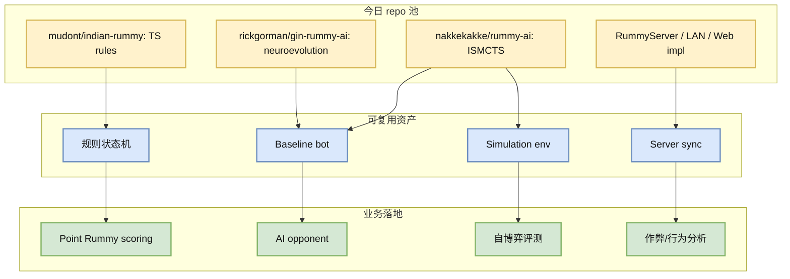
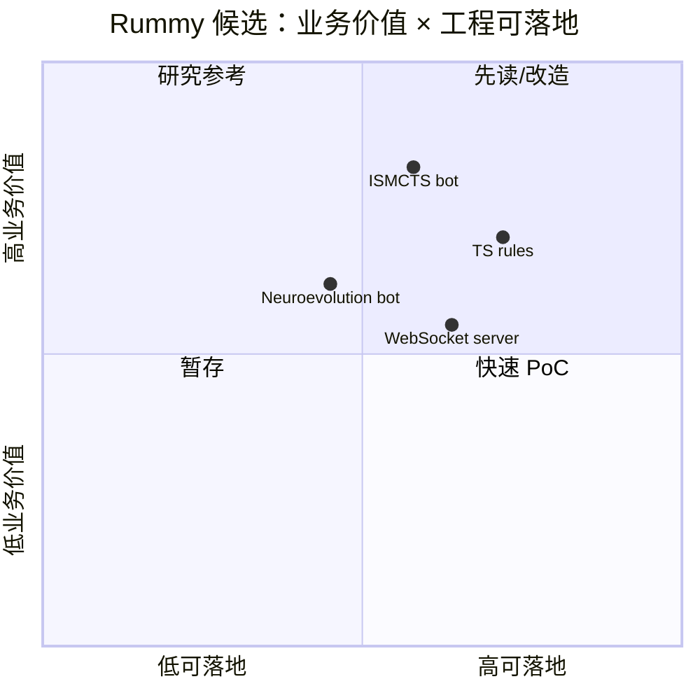

# Point Rummy / Indian Rummy GitHub watchlist - 2026-07-02

> 类型：业务主题  
> 大类：GitHub / Business  
> 小类：Point Rummy / Game AI  
> 推荐等级：后续  
> 创建日期：2026-07-02  
> 原文链接：https://github.com/search?q=indian+rummy+ai&type=repositories  
> 返回日报：[[Daily/2026-07-02]]

## 一句话结论
今日 rummy 主题 snapshot 命中 98 个 repo，但整体 star 低、增长为 0；更适合作为规则引擎、ISMCTS baseline、仿真环境和服务端实现参考，而不是直接生产依赖。

## TL;DR
- **它是什么**：Point Rummy / Indian Rummy / Gin Rummy 相关 GitHub 项目集合。
- **为什么重要**：业务可用资产不在 star，而在规则建模、AI opponent、仿真、评测和服务端同步。
- **和我相关的点**：可以拆出 meld/scoring/drop/round transition、自博弈 bot baseline、WebSocket server 三类参考。
- **建议动作**：优先读 `nakkekakke/rummy-ai` 的 ISMCTS 思路和 `mudont/indian-rummy` 的 TypeScript 规则结构。

## 信息压缩图示

### 辅助图：业务可用性矩阵

## Top candidates
| repo | stars | language | updated_at | 可用性 | 原文 |
|---|---:|---|---|---|---|
| rickgorman/gin-rummy-ai | 13 | Python | 2025-03-25T13:47:09Z | AI/bot/仿真参考 | [原文](https://github.com/rickgorman/gin-rummy-ai) |
| nakkekakke/rummy-ai | 11 | Java | 2026-04-17T10:02:59Z | AI/bot/仿真参考 | [原文](https://github.com/nakkekakke/rummy-ai) |
| jmhummel/Gin-Rummy-Java | 8 | Java | 2023-08-16T16:12:58Z | AI/bot/仿真参考 | [原文](https://github.com/jmhummel/Gin-Rummy-Java) |
| mudont/indian-rummy | 5 | TypeScript | 2025-08-08T21:05:04Z | 规则/实现参考 | [原文](https://github.com/mudont/indian-rummy) |
| dv-rastogi/Rummy | 5 | Python | 2023-09-26T11:21:39Z | 规则/实现参考 | [原文](https://github.com/dv-rastogi/Rummy) |
| vahsek300501/Indian-Rummy- | 4 | Python | 2023-09-26T11:21:46Z | 规则/实现参考 | [原文](https://github.com/vahsek300501/Indian-Rummy-) |
| SCFlanagan/Rummy | 4 | JavaScript | 2025-07-25T21:17:08Z | AI/bot/仿真参考 | [原文](https://github.com/SCFlanagan/Rummy) |
| mcartmell/gin-rummy-bot | 4 | Perl | 2024-10-30T20:06:17Z | AI/bot/仿真参考 | [原文](https://github.com/mcartmell/gin-rummy-bot) |
| Mohitkumar-559/RummyServer | 2 | JavaScript | 2024-03-17T03:48:34Z | AI/bot/仿真参考 | [原文](https://github.com/Mohitkumar-559/RummyServer) |
| abubakarmunir712/dsa-final-project | 2 | Python | 2026-06-27T06:34:26Z | AI/bot/仿真参考 | [原文](https://github.com/abubakarmunir712/dsa-final-project) |

## 专业解读
Rummy 主题的困难不在 UI，而在 imperfect information、可行动作枚举、meld 组合爆炸、discard/draw 策略和积分/回合状态转换。今天没有高 star repo，但 `rummy-ai` 的 ISMCTS 方向值得作为非完美信息 baseline；TypeScript/Python 小项目可以帮助快速补齐规则测试。

## 关键机制拆解
| 机制 | 解决的问题 | 为什么有效 | 可能的坑 |
|---|---|---|---|
| ISMCTS | 对手手牌不可见 | 用信息集采样做搜索 | 计算量和规则细节敏感 |
| 规则状态机 | 回合/计分一致性 | 单测可覆盖边界 | 印度 Rummy 变种多 |
| 仿真环境 | bot/RL 训练 | 可批量 rollout | 如果规则错，训练无意义 |

## 对我的影响
| 维度 | 影响 | 建议动作 |
|---|---|---|
| RL / Game AI | 可建立 random/heuristic/ISMCTS baseline。 | 抽象 Gym/RLCard adapter。 |
| 工程实现 | 可参考前后端同步与计分。 | 先写规则单测再做 UI。 |
| 业务评估 | 今日无真实增长信号。 | 低置信保留，不投入过多。 |

## 可信度与局限性
- GitHub 当前主题 snapshot 有 99 个 repo，主题命中 98 个；但 broad 查询 rate limited。
- rummy repo 普遍 star 低，README/可运行性需人工复核。
- 论文 API 429，今日没有可靠新论文。

#ai-radar #point-rummy #game-ai #rl
