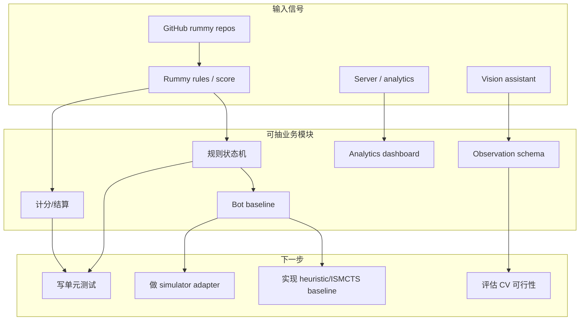

# Point Rummy / Indian Rummy GitHub watchlist - 2026-07-03

> 类型：业务主题 watchlist  
> 返回日报：[[Daily/2026-07-03]]  
> 来源：`Automation/state/github-stars-2026-07-03.json`

## 一句话结论

今日 Point Rummy 主题只命中低 star、低增长项目；更适合拆业务模块和测试样例，不适合直接判断算法趋势。

## 今日候选

| repo | stars | language | 业务可用性 | 原文 |
|---|---:|---|---|---|
| Mohitkumar-559/RummyServer | 2 | JavaScript | 服务端状态流参考 | https://github.com/Mohitkumar-559/RummyServer |
| debabrata-mandal/RummyPulse | 1 | Java | 数据分析 / Android / GST 报表参考 | https://github.com/debabrata-mandal/RummyPulse |
| Alan-seb/RummyVision | 1 | Python | 视觉识别 + Monte Carlo 策略提示方向 | https://github.com/Alan-seb/RummyVision |
| codingmickey/rummy-points-calculator | 1 | C++ | 计分测试样例 | https://github.com/codingmickey/rummy-points-calculator |
| samikshamodi/PointsRummy | 0 | Python | Pygame + computer opponent 低置信参考 | https://github.com/samikshamodi/PointsRummy |
| Navomi1/RummyPointCounter | 0 | Swift | iOS 计分 UI 参考 | https://github.com/Navomi1/RummyPointCounter |
| Soumyadeep-Kar2006/RummyPointCalculator | 0 | HTML | Web 计分交互参考 | https://github.com/Soumyadeep-Kar2006/RummyPointCalculator |
| kikiongame/3-Plus-Games | 0 | Unknown | 竞品/合规观察，不作为代码资产 | https://github.com/kikiongame/3-Plus-Games |

## 业务拆解图

## 风险

- 今日项目 star 很低，不能当作成熟技术选型。
- 多数 repo 可能没有完整测试、license、可运行说明。
- 论文源今日 429，缺少新研究佐证。

## 标签

#ai-radar #point-rummy #business #game-ai
