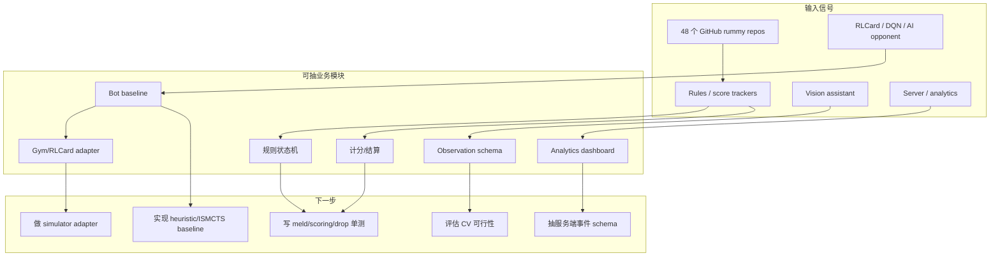

# Point Rummy / Indian Rummy GitHub watchlist - 2026-07-04

> 类型：业务主题 watchlist  
> 返回日报：[[Daily/2026-07-04]]  
> 来源：`Automation/state/github-stars-2026-07-04.json`

## 一句话结论

今日 Point Rummy 主题命中 48 个 repo，但仍以低 star、低增长、工具型项目为主；更适合拆规则、计分、服务端、视觉识别、bot baseline，而不是直接当成熟算法资产。

## 今日候选

| repo | stars | forks | language | updated_at | 业务可用性 | 原文 |
|---|---:|---:|---|---|---|---|
| mudont/indian-rummy | 5 | 0 | TypeScript | 2025-08-08T21:05:04Z | TypeScript Indian Rummy library，可参考规则建模 API | https://github.com/mudont/indian-rummy |
| dv-rastogi/Rummy | 5 | 0 | Python | 2023-09-26T11:21:39Z | Pygame Indian Rummy，可抽交互/状态机样例 | https://github.com/dv-rastogi/Rummy |
| vahsek300501/Indian-Rummy- | 4 | 3 | Python | 2023-09-26T11:21:46Z | Pygame 实现，适合低置信规则参考 | https://github.com/vahsek300501/Indian-Rummy- |
| Mohitkumar-559/RummyServer | 2 | 1 | JavaScript | 2024-03-17T03:48:34Z | Deal / point rummy server，服务端状态流参考 | https://github.com/Mohitkumar-559/RummyServer |
| abubakarmunir712/dsa-final-project | 2 | 1 | Python | 2026-06-27T06:34:26Z | AI opponents + LAN play 描述，需复核可运行性 | https://github.com/abubakarmunir712/dsa-final-project |
| Alan-seb/RummyVision | 1 | 0 | Python | 2025-12-03T03:14:55Z | CV + Monte Carlo discard suggestions，视觉助手方向 | https://github.com/Alan-seb/RummyVision |
| debabrata-mandal/RummyPulse | 1 | 0 | Java | 2026-06-28T09:58:44Z | Android analytics / score tracking / GST，运营报表参考 | https://github.com/debabrata-mandal/RummyPulse |
| SRathinaGiri/IndianRummy | 1 | 1 | JavaScript | 2026-06-17T11:46:14Z | Browser-based Indian Rummy with AI play，前端/PWA 参考 | https://github.com/SRathinaGiri/IndianRummy |
| RamSundarRadhakrishnan/IndianRummyRLCard | 0 | 0 | Jupyter Notebook | 2025-09-26T13:19:13Z | RLCard + DQN agent，算法方向高相关但低置信 | https://github.com/RamSundarRadhakrishnan/IndianRummyRLCard |
| vdesmond/IRumAI | 0 | 0 | Python | 2026-05-23T17:04:28Z | Reinforcement learning agent for Indian Rummy，算法方向高相关但需验证 | https://github.com/vdesmond/IRumAI |

## 业务拆解图

## 业务可用性判断

| 方向 | 今日信号 | 可用性 | 下一步 |
|---|---|---|---|
| 规则引擎 / 计分 | TypeScript/Python/JavaScript 规则和计分 repo 较多 | 中低：可抽测试样例，不宜直接复用 | 写 meld/scoring/drop/dealer rotation 单元测试清单 |
| Bot / RL Agent | IRumAI / IndianRummyRLCard / RummyVision / AI opponent repo | 低到中：方向相关但 star 和验证弱 | 先实现 random/heuristic/ISMCTS baseline，再接 RL |
| 仿真 / 评测 | RummyServer / Pygame / Browser game repo | 中低：服务端和状态流可参考 | 设计统一 Gym/RLCard adapter 和 replay schema |
| 视觉识别 | RummyVision | 低：可做概念验证 | 验证牌面识别数据集、延迟、作弊/合规风险 |

## 可信度与局限性

- 今日 GitHub API 在 rummy 查询后被 rate limit；已保存 snapshot，但 broader AI/loop 查询失败。
- 多数 repo star 很低、license/测试/可运行说明未知，不能直接作为技术选型。
- arXiv 今日 429/timeout，论文候选低置信。

## 标签

#ai-radar #point-rummy #business #game-ai #reinforcement-learning
