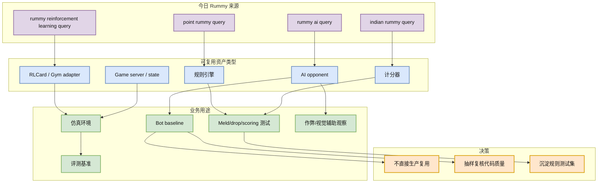

# Point Rummy / Indian Rummy：今日主题 GitHub snapshot 部分成功，仍以规则与仿真资产为主

> 类型：业务主题详情  
> 大类：Business / Point Rummy  
> 推荐等级：后续  
> 创建日期：2026-07-06  
> 原始来源：https://github.com/search?q=point+rummy&type=repositories  
> 网页详情：https://github.com/dyt27666-oss/AI-news-report-obsidians/blob/main/Business/PointRummy/2026-07-06/point-rummy-github-watchlist.md  
> 返回日报：[[Daily/2026-07-06]]

## 一句话结论

今日 Point Rummy / Indian Rummy GitHub 查询部分成功，snapshot 中有 86 个 rummy 主题 repo，但整体 star 极低，最有用的是规则、计分、server state、bot baseline 与 RLCard adapter 线索。

## TL;DR

- **今日状态**：rummy 主题结果保存到 `github-stars-2026-07-06.json`，但后续 GitHub 查询触发 403。
- **高 star 候选**：`rickgorman/gin-rummy-ai`、`nakkekakke/rummy-ai`、`mudont/indian-rummy` 等。
- **业务价值**：不适合直接复用为生产系统，更适合抽测试样例、规则边界和 bot baseline。
- **建议动作**：优先做规则引擎单元测试和 Gym/RLCard adapter，而不是追逐 star。

## 元信息

| 字段 | 内容 |
|---|---|
| 来源 | GitHub Search API / local snapshot |
| 来源类型 | Repository metadata |
| 今日 snapshot | `Automation/state/github-stars-2026-07-06.json` |
| 主题 repo 数 | 86 |
| 高相关方向 | rules engine / scoring / AI opponent / simulation / RL baseline |
| 原文 | https://github.com/search?q=point+rummy&type=repositories |

## 信息压缩图示

## 候选 repo 分组

| 类型 | repo | stars | 业务可用性 |
|---|---|---:|---|
| AI / bot | rickgorman/gin-rummy-ai | 13 | 观察 AI opponent 状态表示和策略 |
| AI / bot | nakkekakke/rummy-ai | 11 | 可抽 heuristic baseline 思路 |
| 规则/实现 | jmhummel/Gin-Rummy-Java | 8 | Java 规则实现可做边界参考 |
| 规则库 | mudont/indian-rummy | 5 | TypeScript Indian Rummy API 参考 |
| Pygame demo | dv-rastogi/Rummy | 5 | 状态流和 UI demo 参考 |
| Pygame demo | vahsek300501/Indian-Rummy- | 4 | 规则/UI 参考，需复核质量 |
| bot | mcartmell/gin-rummy-bot | 4 | bot 结构参考 |
| server | Mohitkumar-559/RummyServer | 2 | deal/point rummy server state 参考 |
| AI opponent | abubakarmunir712/dsa-final-project | 2 | LAN + AI opponent demo，需复核 |
| scoring | codingmickey/rummy-points-calculator | 1 | 计分逻辑样例 |

## 专业解读

Point Rummy / Indian Rummy 的开源生态仍然很稀疏：repo star 普遍在个位数，说明不能把 star 当作成熟度信号。它们的主要价值是帮助构造业务侧的规则测试、状态机和 baseline：比如 meld 判定、drop penalty、joker 规则、round scoring、server state transition、bot action space。

对 RL 游戏模型训练来说，最应该沉淀的是统一环境接口，而不是直接复用某个小 repo。建议先做 deterministic rules engine + replay schema，再接 heuristic bot、ISMCTS、DQN 或 RLCard adapter。这样后续即使换模型或换前端，也有稳定评测基准。

## 业务可用性判断

| 方向 | 今日信号 | 可用性 | 下一步 |
|---|---|---|---|
| 规则引擎 / 计分 | TypeScript/Java/Python 小 repo 较多 | 中低 | 抽 20 个规则边界测试 |
| Bot / RL Agent | 少量 gin-rummy-ai / rummy-ai / AI opponent | 低 | 复核 observation/action/reward 定义 |
| 仿真 / 评测 | server / Pygame / LAN demo | 中低 | 设计统一 Gym/RLCard adapter |
| 视觉 / 辅助 | 今日无强信号 | 低置信 | 继续单独搜 OCR/card recognition |

## 可信度与局限性

- 今日主题 snapshot 部分成功，但 broad GitHub 查询随后 403。
- repo star 很低，代码质量和 license 需要逐个复核。
- 未发现今日可靠新论文，论文方向继续用 imperfect-information card game / ISMCTS / RLCard 泛化检索。

## 我应该如何跟进

1. 选 3 个规则 repo 和 2 个 bot repo 做代码质量抽检。
2. 建立 Point Rummy rules test suite：meld、joker、drop、score、declare、invalid move。
3. 设计 Gym/RLCard adapter，并先实现 random / heuristic / ISMCTS baseline。

## 相关链接

- GitHub search：https://github.com/search?q=point+rummy&type=repositories
- 今日 snapshot：`Automation/state/github-stars-2026-07-06.json`
- 返回：[[Daily/2026-07-06]]

## 标签

#ai-radar #point-rummy #indian-rummy #game-ai
