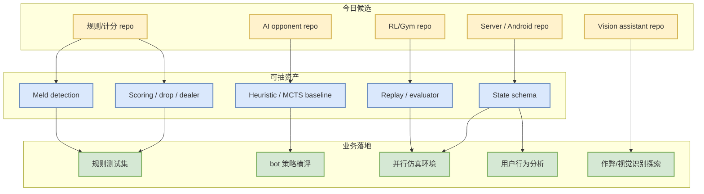

# Point Rummy / Indian Rummy GitHub Watchlist - 2026-07-07

> 日期：2026-07-07  
> 来源类型：GitHub API snapshot / business theme watchlist  
> 今日 snapshot：Automation/state/github-stars-2026-07-07.json  
> 原文：https://github.com/search?q=point+rummy&type=repositories

## 一句话结论

今日 Point Rummy / Indian Rummy 主题仍是低 star 长尾生态，但出现一些可抽规则、计分、AI opponent、MCTS/RL、视觉辅助和 server state 的候选资产。

## TL;DR

- 今日主题结果：97 个 Point Rummy / Indian Rummy / Gin Rummy 相关 repo。
- 最高 star 仍只有 13，不能按热度判断生产成熟度。
- 价值在于抽取规则边界、状态表示、计分、server API、bot baseline、RL/Gym adapter。
- 新增值得看：`drewmcgee/gin-rummy-rl-lab`、`Alan-seb/RummyVision`、`heli3939/Gin-Rummy-Card-Game`。

## 信息压缩图示

## 今日候选 Top 10

| repo | stars | forks | language | updated_at | 业务可用性 | 原文 |
|---|---:|---:|---|---|---|---|
| rickgorman/gin-rummy-ai | 13 | 4 | Python | 2025-03-25 | AI opponent / 状态表示参考 | https://github.com/rickgorman/gin-rummy-ai |
| nakkekakke/rummy-ai | 11 | 3 | Java | 2026-04-17 | heuristic baseline 参考 | https://github.com/nakkekakke/rummy-ai |
| jmhummel/Gin-Rummy-Java | 8 | 0 | Java | 2023-08-16 | Java 规则和 AI opponent | https://github.com/jmhummel/Gin-Rummy-Java |
| mudont/indian-rummy | 5 | 0 | TypeScript | 2025-08-08 | Indian Rummy 规则 API 参考 | https://github.com/mudont/indian-rummy |
| drewmcgee/gin-rummy-rl-lab | 0 | 0 | Python | 2026-04-30 | Java game server + Python agents + C++ rollout infra | https://github.com/drewmcgee/gin-rummy-rl-lab |
| Alan-seb/RummyVision | 1 | 0 | Python | 2025-12-03 | CV + Monte Carlo discard suggestion | https://github.com/Alan-seb/RummyVision |
| heli3939/Gin-Rummy-Card-Game | 0 | 0 | Java | 2025-11-20 | meld/scoring logic + smart AI + tests | https://github.com/heli3939/Gin-Rummy-Card-Game |
| lukebhan/RummyGym | 1 | 0 | Python | 2021-12-08 | OpenAI Gym style env 参考 | https://github.com/lukebhan/RummyGym |
| Mohitkumar-559/RummyServer | 2 | 1 | JavaScript | 2024-03-17 | deal rummy / point rummy server state | https://github.com/Mohitkumar-559/RummyServer |
| abubakarmunir712/dsa-final-project | 2 | 1 | Python | 2026-06-27 | multiplayer Indian Rummy + AI opponents + LAN | https://github.com/abubakarmunir712/dsa-final-project |

## 业务可用性判断

| 方向 | 今日信号 | 可用性 | 下一步 |
|---|---|---|---|
| 规则引擎 / 计分 | mudont、Gin-Rummy-Java、heli3939 | 中：可抽测试样例 | 写 meld/scoring/drop/dealer rotation 单元测试 |
| Bot / RL Agent | gin-rummy-ai、rummy-ai、gin-rummy-rl-lab、RummyGym | 中低：适合 baseline，不适合直接上线 | 实现 random/heuristic/MCTS baseline |
| 仿真 / 评测 | RummyServer、Gym/RL lab、LAN demo | 中低：状态流可参考 | 设计 Gym/RLCard adapter 和 replay schema |
| 视觉辅助 | RummyVision | 低到中：适合作弊/辅助识别探索 | 先抽牌面识别 pipeline，不接生产 |

## 专业解读

Rummy 生态的问题不是没有项目，而是项目非常长尾且质量不稳定。业务上应把这些 repo 当“样例库/反例库”，而不是依赖库。最优先应该构建 deterministic rules engine 与 evaluator，因为没有可复现规则与评测，后续 RL / MCTS / LLM agent 都不可控。

## 通俗解释

这些项目大多不够成熟，不能直接拿来用。但它们能帮我们知道别人怎么写规则、怎么计分、怎么做简单 bot。

## 可信度与局限性

- 可信度：中，来自 GitHub API snapshot。
- 局限：未逐个 clone / run tests；star 极低，README 可能夸大。

## 我应该如何跟进

1. 选 3 个规则实现 repo 抽 20 个边界测试。
2. 设计统一 game state / action / reward schema。
3. 建立 bot baseline：random、heuristic、MCTS、RL stub。

## 相关链接

- GitHub search：https://github.com/search?q=point+rummy&type=repositories
- 今日 snapshot：Automation/state/github-stars-2026-07-07.json

#ai-radar #point-rummy #indian-rummy #game-ai #rl
