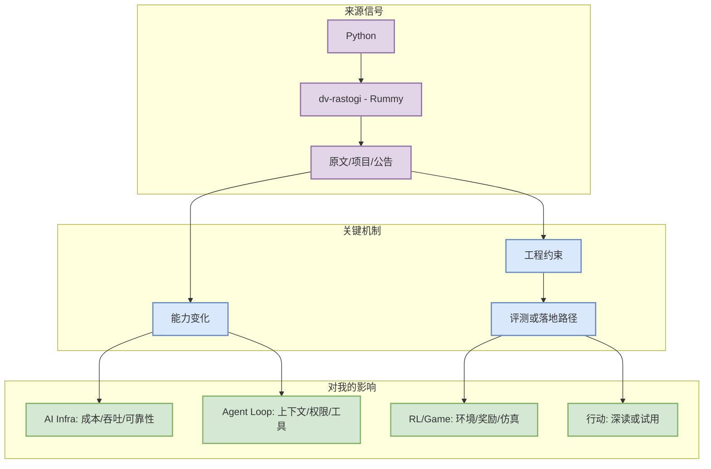
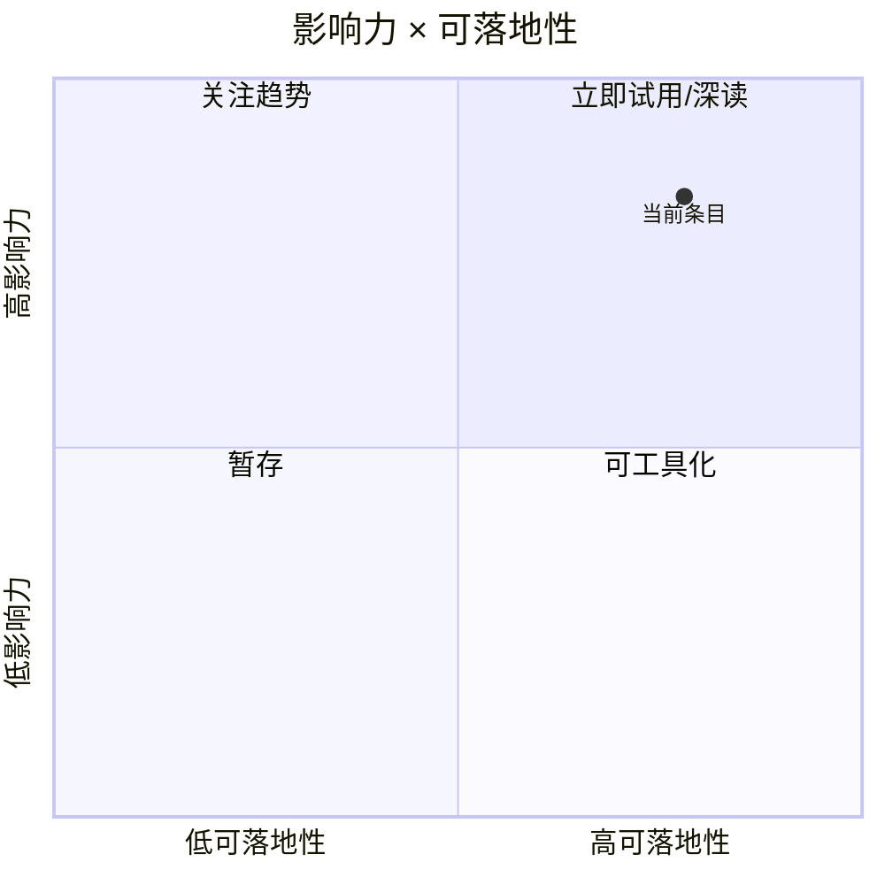

# dv-rastogi - Rummy

> 类型：Point Rummy GitHub
> 大类：Business
> 小类：Python
> 推荐等级：必读
> 创建日期：2026-07-08
> 原文链接：https://github.com/dv-rastogi/Rummy
> 网页详情：https://github.com/dyt27666-oss/AI-news-report-obsidians/blob/main/Business/PointRummy/2026-07-08/dv-rastogi-rummy.md
> 返回日报：[[Daily/2026-07-08]]

## 一句话结论

Variation of classical Indian Rummy made in Pygame

## TL;DR

- **它是什么**：dv-rastogi/Rummy，5 stars。
- **为什么重要**：可作为规则建模、计分、前后端实现或 AI opponent 的低成本参考。
- **和我相关的点**：它落在 AI Infra / Agent Loop / RL 环境构造的交叉区域，适合转化为 benchmark、试用清单或架构改造输入。
- **建议动作**：阅读代码结构，抽取规则/环境接口

## 元信息

| 字段 | 内容 |
|---|---|
| 发布方/来源 | Business |
| 大厂/实验室 | Python |
| 栏目/来源类型 | Point Rummy GitHub |
| 作者/机构 | 见原文 |
| 发布时间 | 2026-07-08 扫描 / 原文为准 |
| 原文 | [原文](https://github.com/dv-rastogi/Rummy) |
| 代码 | 未发现 / 见原文 |
| PDF | 不适用 |
| 标签 | #ai-radar #python |

## 信息压缩图示

### 辅助图：影响力 × 可落地性

## 专业解读

可作为规则建模、计分、前后端实现或 AI opponent 的低成本参考。 这类信号的关键不是“又有一个发布”，而是它能否改变工程闭环：输入如何被路由，状态如何被保存，失败如何被观测，评测如何从静态样例变成可重复实验。对 AI Infra 来说，应优先观察它是否引入新的 scheduler/cache/runtime 约束；对 Agent 和 coding workflow 来说，应观察权限、上下文窗口、工具调用和人类接管点。

## 通俗解释

可以把它理解为今天 radar 里一个需要放进工作台的零件：不一定马上上线，但它能提示我们下一轮 agent、serving 或 RL 环境应该补哪块能力。

## 关键机制拆解

| 机制 | 解决的问题 | 为什么有效 | 可能的坑 |
|---|---|---|---|
| 信号抽取 | 从来源中保留高相关内容 | 避免日报被泛 AI 新闻稀释 | 页面扫描可能低置信 |
| 工程映射 | 映射到 serving/agent/RL | 让阅读直接服务系统设计 | 需要后续复现验证 |
| 行动分级 | 区分必读、试用、观察 | 控制信息过载 | 需要持续更新 |

## 对我的影响

| 维度 | 影响 | 建议动作 |
|---|---|---|
| AI Infra | 关注吞吐、成本、调度或缓存约束 | 加入 watchlist |
| LLM 工程 | 关注 post-training、上下文和工具调用 | 深读原文 |
| RL / Game AI | 关注环境、奖励和仿真可复用性 | 抽象成实验任务 |
| Agent / Eval | 关注 loop、权限、评测统计 | 纳入 agent benchmark |

## 可信度与局限性

- 证据强度：中等，基于公开页面/API 扫描。
- 局限性：部分来源存在 403/rate limit，发布日期以原文为准。
- 潜在风险：标题级信号可能不足以判断实现质量。
- 还需要确认：release note、论文全文或代码 examples。

## 我应该如何跟进

1. 打开原文确认细节和发布日期。
2. 若有代码，跑最小 demo 或阅读 examples。
3. 把可复用机制写入 serving/agent/RL 设计备忘。

## 相关链接

- 原文：https://github.com/dv-rastogi/Rummy
- 网页详情：https://github.com/dyt27666-oss/AI-news-report-obsidians/blob/main/Business/PointRummy/2026-07-08/dv-rastogi-rummy.md
- 相关卡片：[[Daily/2026-07-08]]

## 标签

#ai-radar #business #python
