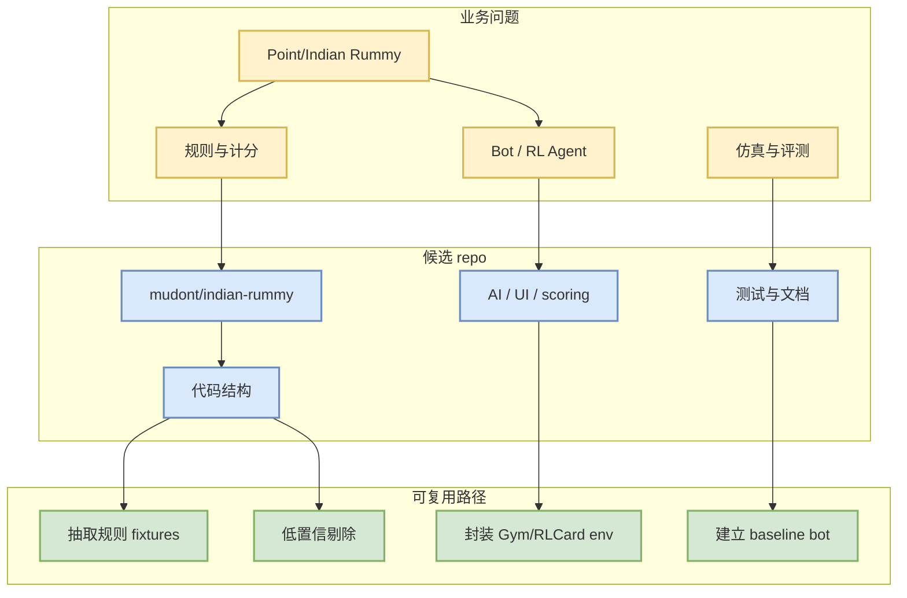

# mudont/indian-rummy - Point Rummy 候选 - 2026-07-10

## 一句话结论
Typescript library for Indian Rummy card game

## TL;DR
- repo：[mudont/indian-rummy](https://github.com/mudont/indian-rummy)
- stars / forks：5 / 0
- language：TypeScript
- updated_at：2025-08-08T21:05:04Z
- 业务价值：优先抽取规则、计分、AI opponent、MCTS/RL baseline 或环境接口。

## 元信息表
| 字段 | 内容 |
|---|---|
| 来源 | GitHub Search theme snapshot |
| 来源类型 | Point Rummy / Indian Rummy 业务主题 |
| repo | mudont/indian-rummy |
| 原文 | https://github.com/mudont/indian-rummy |
| topics | 无 |
| 可信度 | 中低：小 repo，需跑通测试 |

## 信息压缩图示

## 专业解读
这个 repo 的 star 很低，不能按成熟开源项目看待；它的价值是帮助发现 Rummy 业务中的状态空间、动作集合、meld/sequence/set 规则、drop/scoring 边界条件，以及 AI opponent 的 baseline 写法。

## 通俗解释
不是直接拿来上线，而是当作样例代码和测试用例来源。

## 关键机制拆解
| 方向 | 今日信号 | 业务可用性 |
|---|---|---|
| 规则引擎 | 描述/代码中含 Rummy 规则 | 可抽取 fixtures |
| Bot / Agent | 可能含 AI opponent / MCTS / RL | 需跑通再判断 |
| 仿真 | 多数项目偏 UI | 可能需要重写 env |
| 风险 | star 低、文档不稳 | 只做参考，不直接采用 |

## 对我的影响
- 规则建模：积累边界牌型、计分和 drop 规则。
- RL 训练：定义 state/action/reward schema。
- 评测：建立 baseline bot 和 deterministic fixtures。

## 可信度与局限性
- GitHub metadata 可信。
- 代码质量、license、测试覆盖未验证。
- 今日没有高质量新论文支撑，需要后续人工跑通。

## 我应该如何跟进
1. clone 后检查 license 和 tests。
2. 抽取 20 个关键牌型 fixtures。
3. 用统一 interface 包装可用规则逻辑。

## 相关链接
- 原文：https://github.com/mudont/indian-rummy
- 今日日报：[[Daily/2026-07-10]]

## 标签
#ai-radar #point-rummy #game-ai #rl
