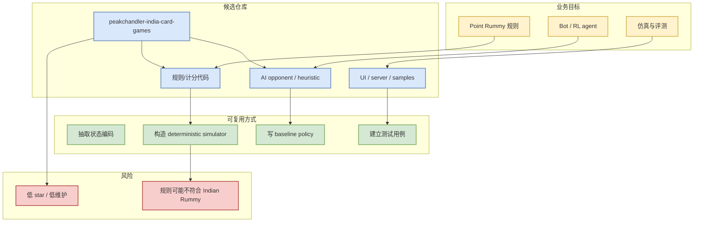

# PeakChandler/india-card-games Point Rummy 候选

> 类型：Business / GitHub
> 大类：Point Rummy / Indian Rummy
> 小类：规则引擎 / Bot / 仿真候选
> 推荐等级：可 skim
> 创建日期：2026-07-27
> 原文链接：https://github.com/PeakChandler/india-card-games
> 网页详情：https://github.com/dyt27666-oss/AI-news-report-obsidians/blob/main/Business/PointRummy/2026-07-27/peakchandler-india-card-games.md
> 返回日报：[[Daily/2026-07-27]]

## 一句话结论

PeakChandler/india-card-games 是低 star 但可用于抽取 Rummy 规则、AI opponent 或 baseline bot 的业务候选。

## TL;DR

- **它是什么**：Popular Indian mobile card and casual games including Ludo, Rummy, and Teen Patti
- **为什么重要**：Point Rummy 业务需要规则、状态编码、动作空间、bot baseline 和 evaluator 的长期积累。
- **和我相关的点**：可借鉴规则建模、计分、仿真或 AI 策略，但必须先审代码质量。
- **建议动作**：只把它当样本库，不要直接生产使用。

## 元信息

| 字段 | 内容 |
|---|---|
| repo | [PeakChandler/india-card-games](https://github.com/PeakChandler/india-card-games) |
| stars / forks | 73 / 0 |
| language | Unknown |
| updated_at | 2026-07-27T00:58:32Z |
| topics | ludo, ludo-game, rummy, rummy-card-game, teenpatti |

## 信息压缩图示

### 辅助结构：业务可用性矩阵

| 方向 | 可用性 | 下一步 |
|---|---|---|
| 规则引擎 / 计分 | 中低 | 抽规则并写单元测试 |
| Bot / RL Agent | 中低 | 提取 heuristic / state-action |
| 仿真 / 评测 | 低 | 自建 deterministic evaluator |

## 专业解读

Rummy 相关开源生态整体 star 较低，不应按 GitHub 热度判断业务价值。更合理的做法是把它们当“规则与策略样本库”：检查是否覆盖 13-card Indian Rummy、Point Rummy 计分、joker/wildcard、drop、meld validation、turn order、合法动作生成，以及是否能支撑 self-play。

## 通俗解释

这些项目像散落的积木，不能直接拿来盖房子，但可以拆出规则、计分和简单 bot 的零件。

## 关键机制拆解

| 机制 | 解决的问题 | 为什么有效 | 可能的坑 |
|---|---|---|---|
| 规则抽取 | 快速建立游戏环境 | 直接来自可运行代码 | 规则变体可能不一致 |
| Bot baseline | 给 RL/self-play 一个起点 | heuristic 易解释 | 强度有限 |
| 测试样例 | 防止 evaluator 错误 | 可以复用边界 case | 代码质量未知 |

## 对我的影响

| 维度 | 影响 | 建议动作 |
|---|---|---|
| AI Infra | 可作为小规模并行环境样本 | 暂存 |
| LLM 工程 | 可用 LLM 辅助抽规则和写测试 | 审核输出 |
| RL / Game AI | 直接关联状态/动作/奖励设计 | 优先审规则 |
| Agent / Eval | 可构造 game-agent benchmark | 后续深挖 |

## 可信度与局限性

- 证据强度：低到中；来自 GitHub 元数据和描述。
- 局限性：未审源码，可能与 Point Rummy 规则不同。
- 潜在风险：低维护、无测试、AI 逻辑较弱。
- 还需要确认：规则完整性、license、可运行性。

## 我应该如何跟进

1. Clone 后先跑 tests / demo。
2. 列出规则差异：13 cards、joker、drop、meld、scoring。
3. 抽象状态空间和合法动作接口。

## 相关链接

- 原文：https://github.com/PeakChandler/india-card-games
- 网页详情：https://github.com/dyt27666-oss/AI-news-report-obsidians/blob/main/Business/PointRummy/2026-07-27/peakchandler-india-card-games.md
- 返回日报：[[Daily/2026-07-27]]

## 标签

#ai-radar #point-rummy #game-ai #low-confidence
