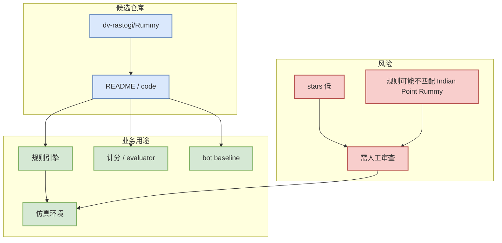

# dv-rastogi/Rummy - Point Rummy 候选

> 来源类型：GitHub theme search snapshot  
> 原文：https://github.com/dv-rastogi/Rummy  
> 可信度：低到中；小仓库候选，需人工审代码质量。

## 一句话结论
该仓库可作为 Point/Indian/Gin Rummy 规则、bot baseline、计分器或仿真参考，但不是成熟生产项目。

## TL;DR
- Stars/Forks：5 / 0；语言：Python。
- 描述：Variation of classical Indian Rummy made in Pygame
- 业务可用性：规则建模、动作空间、状态编码或 evaluator 样例。

## Rummy 业务映射图

## 下一步
| 方向 | 动作 |
|---|---|
| 规则 | 对照 Indian Rummy / Point Rummy 规则检查 meld、sequence、joker、drop、points。 |
| Bot | 抽取 heuristic / MCTS / RL baseline。 |
| 仿真 | 改造成 deterministic simulator + evaluator。 |

#ai-radar #point-rummy #github
