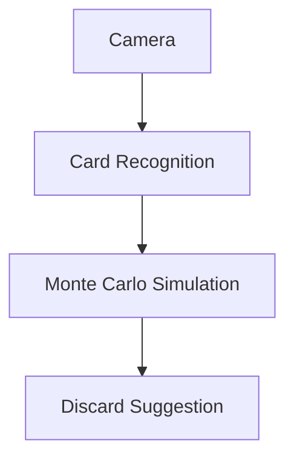

# Alan-seb/RummyVision

> 类型：Point Rummy 业务候选
> 创建日期：2026-08-26
> 原文链接：https://github.com/Alan-seb/RummyVision
> 返回日报：[[Daily/2026-08-26]]

## 一句话结论

RummyVision 结合 CV 与 Monte Carlo simulation，可作为视觉辅助和策略建议的低置信参考。

#ai-radar #point-rummy #cv
