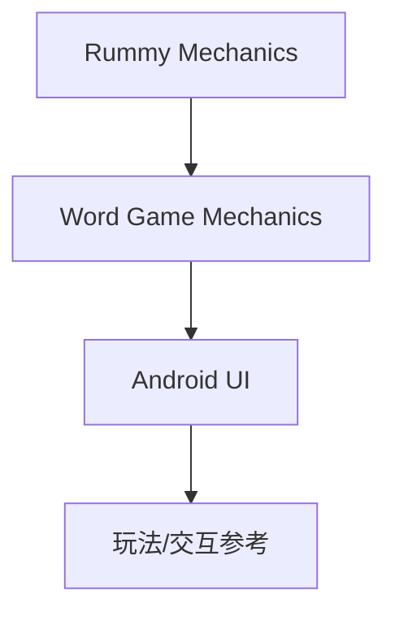

# Kurukshetran/WordRummy

> 类型：Point Rummy 业务候选
> 创建日期：2026-08-26
> 原文链接：https://github.com/Kurukshetran/WordRummy
> 返回日报：[[Daily/2026-08-26]]

## 一句话结论

WordRummy 是 Android/card-game 混合玩法低置信参考，业务迁移价值有限。

#ai-radar #point-rummy
