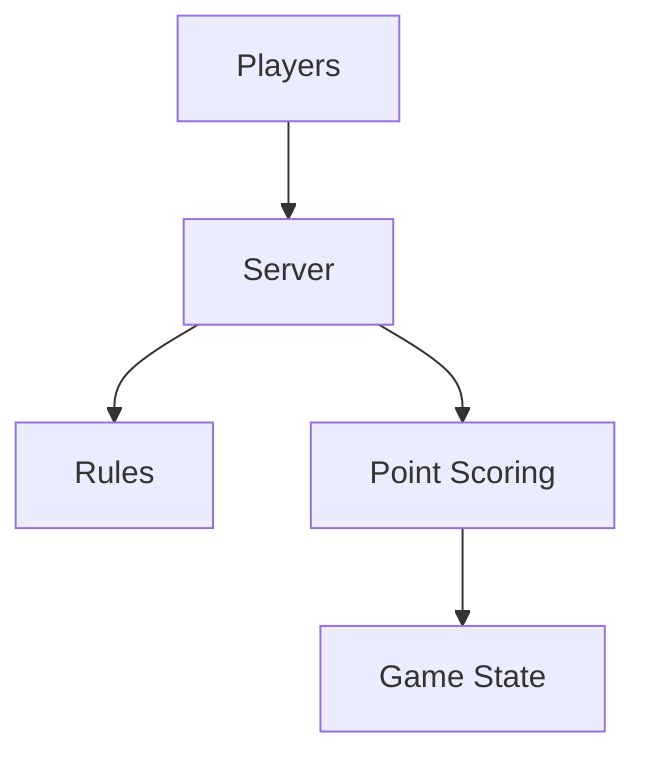

# Mohitkumar-559/RummyServer

> 类型：Point Rummy 业务候选
> 创建日期：2026-08-26
> 原文链接：https://github.com/Mohitkumar-559/RummyServer
> 返回日报：[[Daily/2026-08-26]]

## 一句话结论

RummyServer 可作为 deal rummy / point rummy 服务端流程的低置信参考。

#ai-radar #point-rummy #server
