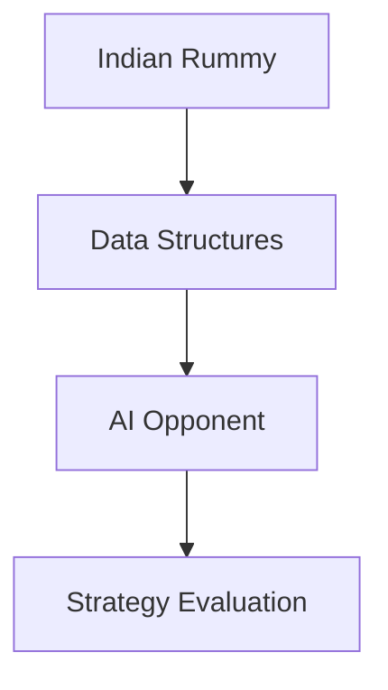

# abubakarmunir712/dsa-final-project

> 类型：Point Rummy 业务候选
> 创建日期：2026-08-26
> 原文链接：https://github.com/abubakarmunir712/dsa-final-project
> 返回日报：[[Daily/2026-08-26]]

## 一句话结论

该 Python Indian Rummy 项目可作为 AI opponent 与 LAN gameplay 的低置信代码参考。

#ai-radar #point-rummy #ai-opponent
