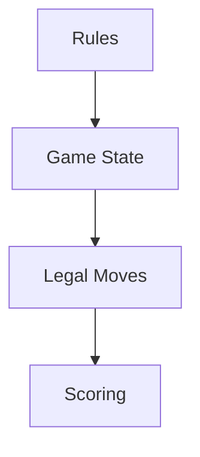

# atreyayelishetti/indian-rummy-game-rust

> 类型：Point Rummy 业务候选
> 创建日期：2026-08-26
> 原文链接：https://github.com/atreyayelishetti/indian-rummy-game-rust
> 返回日报：[[Daily/2026-08-26]]

## 一句话结论

Rust 版 Indian Rummy 可作为规则状态建模的低置信参考。

#ai-radar #point-rummy #rust
