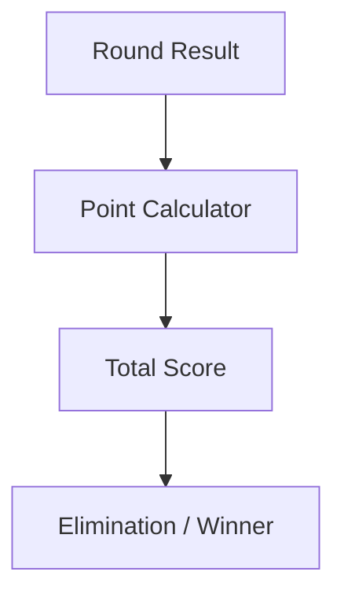

# codingmickey/rummy-points-calculator

> 类型：Point Rummy 业务候选
> 创建日期：2026-08-26
> 原文链接：https://github.com/codingmickey/rummy-points-calculator
> 返回日报：[[Daily/2026-08-26]]

## 一句话结论

该项目可作为 Rummy points 计分逻辑的低置信参考。

#ai-radar #point-rummy #scoring
