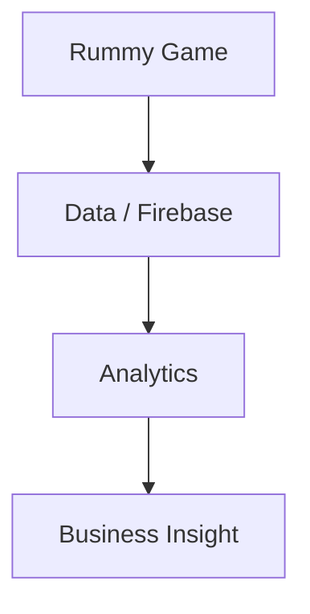

# debabrata-mandal/RummyPulse

> 类型：Point Rummy 业务候选
> 创建日期：2026-08-26
> 原文链接：https://github.com/debabrata-mandal/RummyPulse
> 返回日报：[[Daily/2026-08-26]]

## 一句话结论

RummyPulse 可作为 Rummy 管理/分析 App 的低置信参考。

#ai-radar #point-rummy
