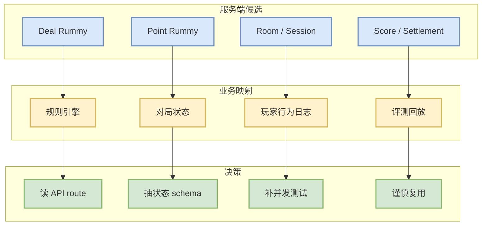

# Mohitkumar-559/RummyServer

> 一句话结论：Rummy server for deal/point rummy，适合观察服务端房间、回合和计分接口，但活跃度和质量需要验证。

## TL;DR

- 来源：GitHub Repository
- 来源类型：GitHub Search / Point Rummy 主题候选
- Repo：[Mohitkumar-559/RummyServer](https://github.com/Mohitkumar-559/RummyServer)
- stars / forks：2 / 1
- 语言：JavaScript
- updated_at：2024-03-17T03:48:34Z
- 原文：https://github.com/Mohitkumar-559/RummyServer

## 信息压缩图示

## 影响矩阵

| 方向 | 今日判断 | 跟进 |
|---|---|---|
| Point Rummy 服务端 | 中 | 查看 route/model/schema |
| 计分结算 | 中 | 对照业务规则抽测试集 |
| Bot/RL 环境 | 低 | 需要改造为仿真 API |
| 生产风险 | 高 | 低星项目，不直接依赖 |

## 专业解读

RummyServer 对业务的价值主要是服务端状态建模而非 AI 算法。可以用它检查 deal rummy 和 point rummy 的 domain object 命名、session lifecycle 和分数结算边界，为后续自研规则引擎提供对照。

## 相关链接

- 原文：https://github.com/Mohitkumar-559/RummyServer
- 今日日报：[[Daily/2026-08-27]]

#ai-radar #point-rummy #github
