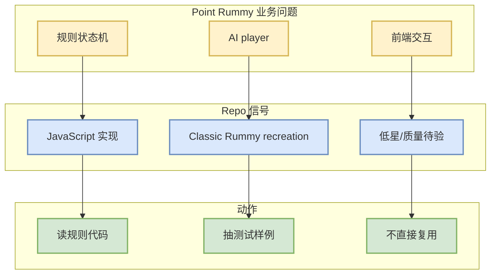

# SCFlanagan/Rummy

> 一句话结论：低星 Rummy 游戏实现，含 AI player 信号，可作为规则状态机与前端交互素材观察，不建议直接作为核心业务依赖。

## TL;DR

- 来源：GitHub Repository
- 来源类型：GitHub Search / Point Rummy 主题候选
- Repo：[SCFlanagan/Rummy](https://github.com/SCFlanagan/Rummy)
- stars / forks：4 / 6
- 语言：JavaScript
- updated_at：2025-07-25T21:17:08Z
- 原文：https://github.com/SCFlanagan/Rummy

## 信息压缩图示

## 影响矩阵

| 方向 | 判断 | 跟进 |
|---|---|---|
| 规则引擎 | 中 | 看 meld / discard / turn 逻辑 |
| Bot 策略 | 低/中 | 检查是否有可复用 policy 或 heuristic |
| 仿真评测 | 低 | 若无测试需自行补齐 |
| 生产可用 | 低 | 仅作素材 |

## 专业解读

该 repo 的价值在于提供 Rummy 游戏状态和 AI player 的实现线索。由于 star 很低且未做源码验证，只适合作为业务建模素材：提取规则、状态转移、UI 操作路径和测试 case，而不是直接进入生产代码。

## 相关链接

- 原文：https://github.com/SCFlanagan/Rummy
- 今日日报：[[Daily/2026-08-27]]

#ai-radar #point-rummy #github
