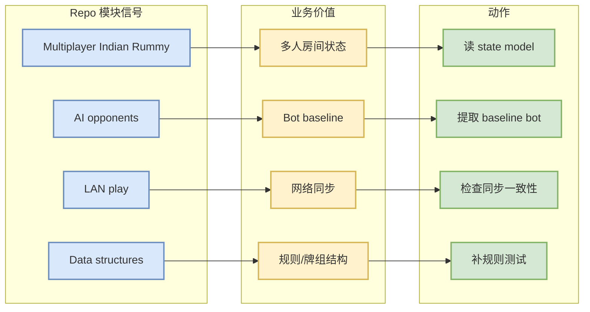

# abubakarmunir712/dsa-final-project

> 一句话结论：Python multiplayer Indian Rummy with AI opponents and LAN play，适合观察 AI opponent、多人状态和局域网同步，但仍需源码验证。

## TL;DR

- 来源：GitHub Repository
- 来源类型：GitHub Search / Point Rummy 主题候选
- Repo：[abubakarmunir712/dsa-final-project](https://github.com/abubakarmunir712/dsa-final-project)
- stars / forks：2 / 1
- 语言：Python
- updated_at：2026-06-27T06:34:26Z
- 原文：https://github.com/abubakarmunir712/dsa-final-project

## 信息压缩图示

## 影响矩阵

| 维度 | 判断 | 跟进 |
|---|---|---|
| AI opponent | 中 | 检查策略是否规则驱动或学习式 |
| 多人对局 | 中 | 抽象房间/玩家/回合 schema |
| LAN 同步 | 中/低 | 看是否有状态一致性处理 |
| 生产可用 | 低 | 只作业务建模参考 |

## 专业解读

这个项目的关键词覆盖 Indian Rummy、AI opponents、LAN play。对当前业务最有用的是对局状态和 bot baseline，而不是直接复用实现。后续应检查是否有测试、对局日志和清晰的 action/state/reward 表示。

## 相关链接

- 原文：https://github.com/abubakarmunir712/dsa-final-project
- 今日日报：[[Daily/2026-08-27]]

#ai-radar #point-rummy #github
