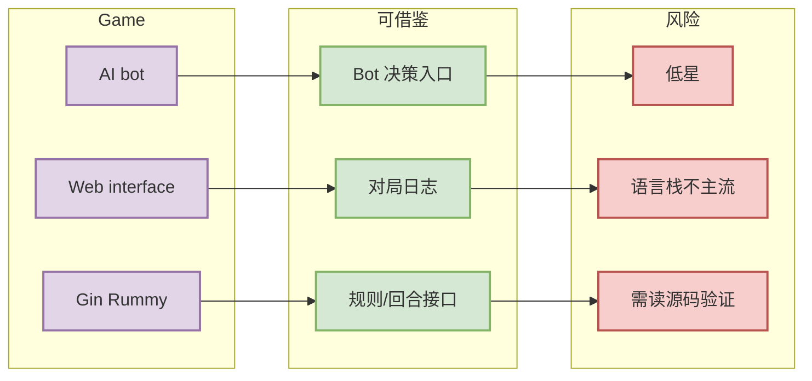

# mcartmell/gin-rummy-bot

> 一句话结论：Web-based Gin Rummy game and AI，适合观察 Web 游戏与 bot 接口如何组织，但低星项目需要谨慎验证。

## TL;DR

- 来源：GitHub Repository
- 来源类型：GitHub Search / Point Rummy 主题候选
- Repo：[mcartmell/gin-rummy-bot](https://github.com/mcartmell/gin-rummy-bot)
- stars / forks：4 / 2
- 语言：Perl
- updated_at：2024-10-30T20:06:17Z
- 原文：https://github.com/mcartmell/gin-rummy-bot

## 信息压缩图示

## 影响矩阵

| 维度 | 价值 | 下一步 |
|---|---|---|
| Bot 策略 | 中 | 看是否分离 policy 与环境 |
| Web 实现 | 中 | 观察对局状态同步方式 |
| 规则测试 | 未知 | 找测试或补测试 |
| 生产可用 | 低 | 只作为参考 |

## 专业解读

它对 Point Rummy 业务的直接价值在于 bot 接口和 Web 对局组织方式。若源码中将 rules、state、policy 清晰解耦，可借鉴 API 形态；否则只作为反例帮助定义自己的 gym-like environment。

## 相关链接

- 原文：https://github.com/mcartmell/gin-rummy-bot
- 今日日报：[[Daily/2026-08-27]]

#ai-radar #point-rummy #github
