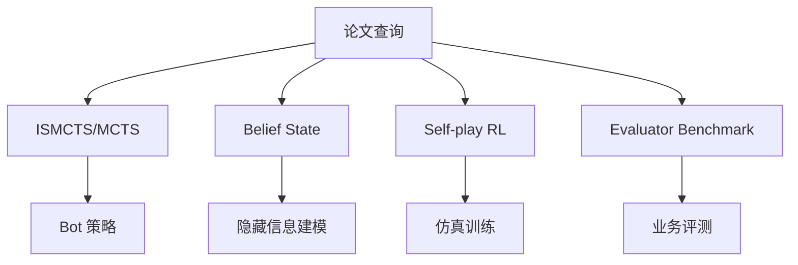

# Rummy / Imperfect-information Card Game 论文观察位 - 2026-09-06

> 类型：业务主题论文 watchlist
> 返回日报：[[Daily/2026-09-06]]
> 原文链接：https://arxiv.org/search/?query=rummy+imperfect+information+game+AI&searchtype=all

## 一句话结论
今日未确认到新的强相关 Rummy 论文；保留可追溯 watchlist，避免把低置信搜索结果写成事实。

## 重点查询
- Rummy imperfect information game AI
- Gin Rummy MCTS / ISMCTS
- Indian Rummy reinforcement learning
- self-play card game evaluator

## 下一步
1. 等 arXiv/Semantic Scholar rate limit 恢复后复查。
2. 优先找有代码的 Gin Rummy/Rummy AI 论文。
3. 将 state/action/reward/evaluator 映射到 Point Rummy 业务规则。

#ai-radar #point-rummy #paper-watchlist
