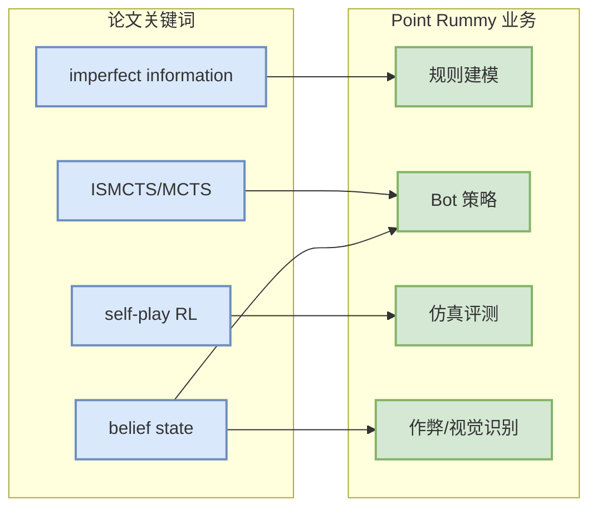

# Point Rummy / Indian Rummy 论文资料 Watchlist - 2026-09-08

> 一句话结论：今日 Rummy 业务主题的强信号仍主要来自 GitHub 原型；论文侧保留 imperfect-information card game / ISMCTS / self-play 检索入口。

## TL;DR
- 今日未确认新的高置信 Point Rummy/Indian Rummy 论文。
- 可复用方向：belief/state abstraction、ISMCTS/MCTS、self-play evaluator、规则引擎 benchmark。
- 原文入口：https://arxiv.org/search/?query=rummy+imperfect+information+game+AI&searchtype=all

## 业务映射图

## 下一步
- 建立 Point Rummy state/action/reward/evaluator checklist。
- 用 GitHub 原型先抽规则和测试集，再回头找论文补策略。

#ai-radar #point-rummy #paper
