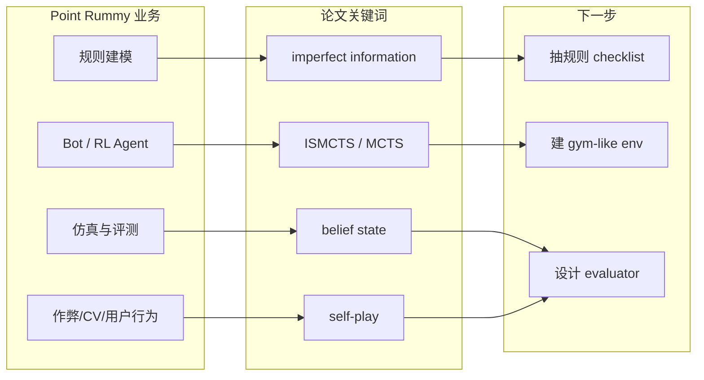

# Point Rummy / Indian Rummy 论文资料 watchlist - 2026-09-09

> 类型：业务主题论文/资料扫描
> 来源：arXiv / Semantic Scholar search fallback
> 来源类型：低置信索引
> 创建日期：2026-09-09
> 原文链接：https://arxiv.org/search/?query=rummy+imperfect+information+game+AI&searchtype=all
> 返回日报：[[Daily/2026-09-09]]

## 一句话结论
今日 Rummy 主题有 GitHub 工程原型信号，但论文 API 429；资料侧应继续围绕 imperfect-information card game、ISMCTS/MCTS、belief state、self-play 检索。

## 信息压缩图示

## 对 Point Rummy 业务有什么用
| 方向 | 可用性 | 下一步 |
|---|---|---|
| 规则建模 | 中 | 从 GitHub 原型抽状态机和计分边界 |
| Bot / RL Agent | 中低 | 先复现 ISMCTS/MCTS，再考虑 RL self-play |
| 仿真/评测 | 中 | 做 batch simulator 与策略评测指标 |

## 可信度与局限性
- 今日论文源低置信，不能当作已验证研究结论。
- 工程原型 star 普遍低，适合启发，不适合直接依赖。

#ai-radar #point-rummy #game-ai
