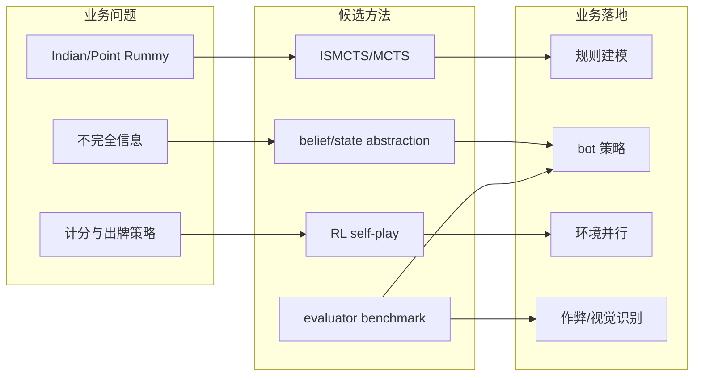

# Point Rummy / Indian Rummy 论文资料 Watchlist - 2026-09-10

> 来源：arXiv / Semantic Scholar / Web search 入口  
> 来源类型：低置信资料候选  
> 原文：https://arxiv.org/search/?query=rummy+imperfect+information+game+AI&searchtype=all

## 一句话结论
今日 Point Rummy 的 GitHub 原型信号强于论文信号；论文侧继续聚焦 ISMCTS、MCTS、belief state、self-play 与 rule/evaluator benchmark。

## 信息压缩图示

## 业务判断
| 方向 | 今日状态 | 用处 |
|---|---|---|
| 规则建模 | 低置信资料入口 | 抽象 meld/deadwood/sequence/set |
| Bot 策略 | 需复核 | 对照 ISMCTS 与 RL baseline |
| 评测环境 | 需自建 | 把 win-rate、expected points、latency 纳入 evaluator |

#ai-radar #point-rummy #game-ai
