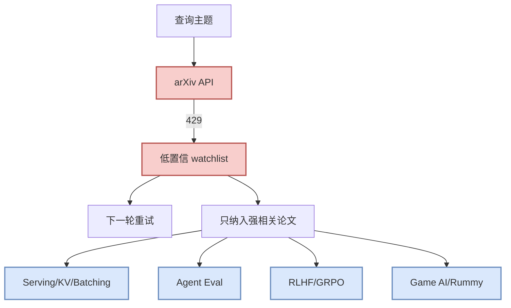

# Rummy imperfect-information / ISMCTS / RL watchlist - 2026-09-11

> 类型：论文低置信 watchlist  
> 论文来源：arXiv / Semantic Scholar 查询入口  
> 来源类型：预印本索引 / 查询失败 fallback  
> 原文链接：https://arxiv.org/search/?query=rummy+imperfect+information+game+AI&searchtype=all  
> 返回日报：[[Daily/2026-09-11]]

## 一句话结论

今日 arXiv API 返回 429，未把未验证论文写成事实；先保留可点击检索入口和筛选标准。

## 信息压缩图示

## 筛选标准

| 主题 | 保留条件 | 跳过条件 |
|---|---|---|
| LLM Serving | KV cache / batching / scheduler / inference optimization | 普通应用论文 |
| Agent Eval | tool use / benchmark / replay / reliability | 纯 prompt demo |
| RLHF/Post-training | PPO/DPO/GRPO/reward/model alignment | 与 LLM 无关的传统 RL |
| Rummy/Game AI | imperfect-information / ISMCTS / self-play / evaluator | 普通棋牌游戏 UI |

## 可信度与局限性

- 今日 API 状态：429；不生成具体论文摘要，避免幻觉。
- 后续动作：API 稳定后按主题重新筛选，并为强相关论文生成完整详情页。

## 相关链接

- 原文：https://arxiv.org/search/?query=rummy+imperfect+information+game+AI&searchtype=all
- 返回日报：[[Daily/2026-09-11]]

#ai-radar #paper-watchlist
