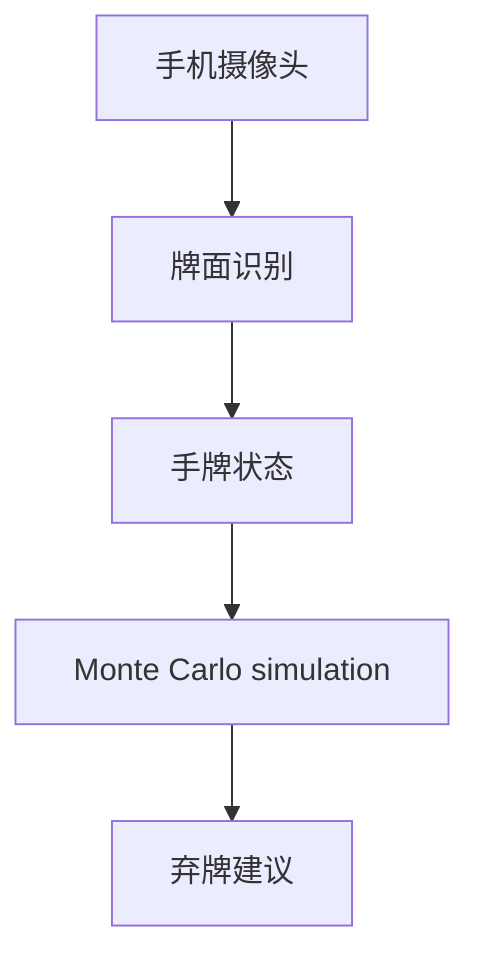
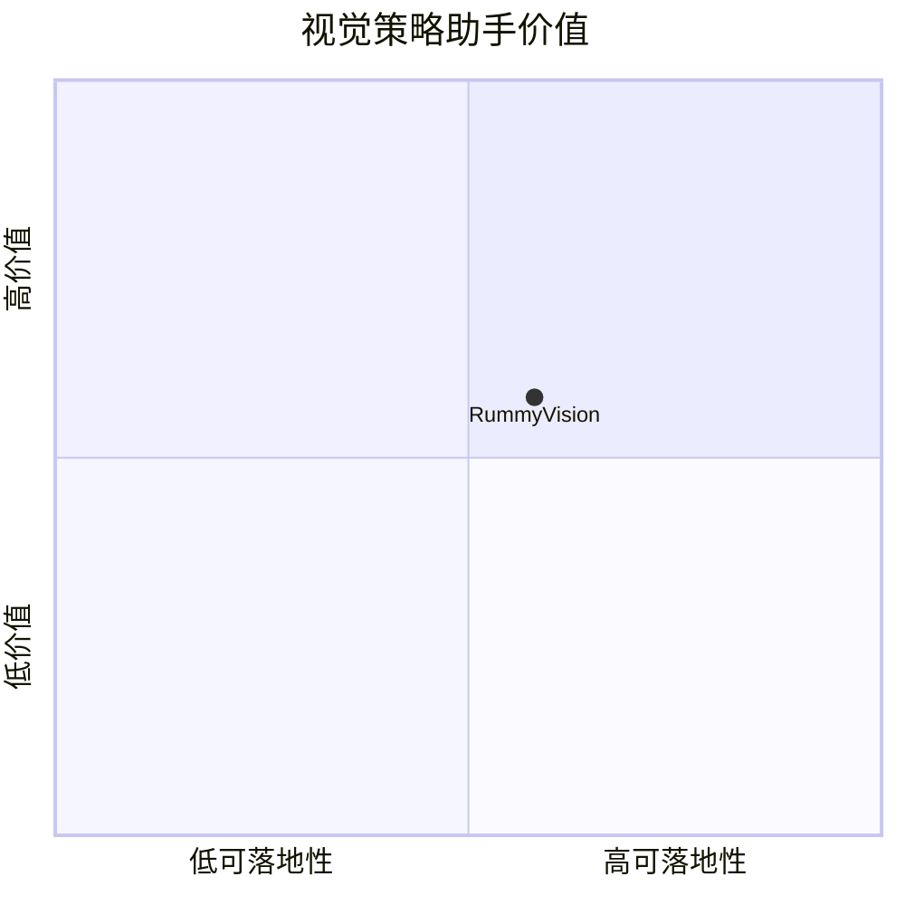

# alan-seb-rummyvision

> 类型：Point Rummy 详情页
> 创建日期：2026-09-17
> 原文链接：https://github.com/Alan-seb/RummyVision
> 返回日报：[[Daily/2026-09-17]]

## 一句话结论

RummyVision 结合 card recognition 和 Monte Carlo simulation，适合观察视觉助手和策略建议方向。

## 信息压缩图示

## 相关链接

- 原文：https://github.com/Alan-seb/RummyVision
