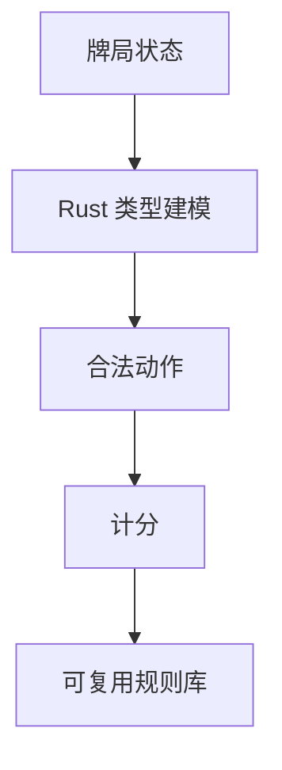
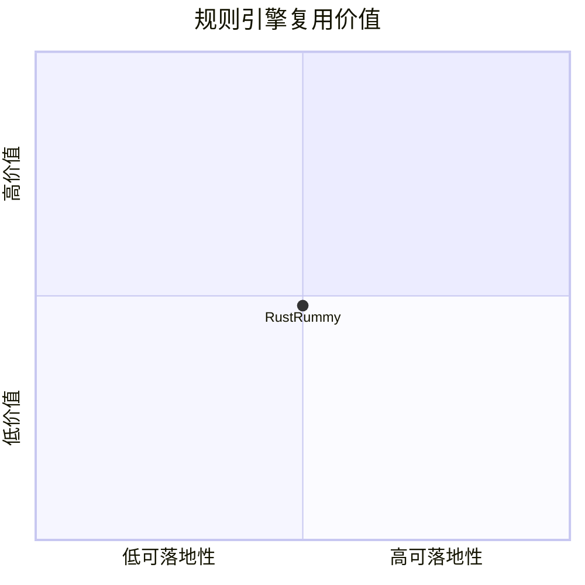

# atreyayelishetti-indian-rummy-game-rust

> 类型：Point Rummy 详情页
> 创建日期：2026-09-17
> 原文链接：https://github.com/atreyayelishetti/indian-rummy-game-rust
> 返回日报：[[Daily/2026-09-17]]

## 一句话结论

这是 Rust 版 Indian Rummy 候选，可用于检查规则表达和类型安全实现，但需要确认完整度。

## 信息压缩图示

## 相关链接

- 原文：https://github.com/atreyayelishetti/indian-rummy-game-rust
