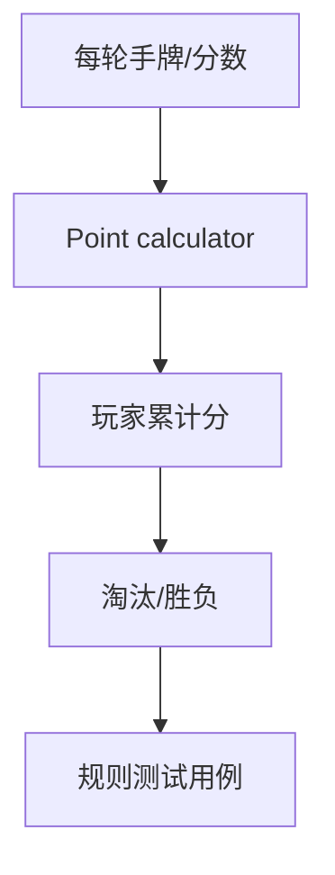
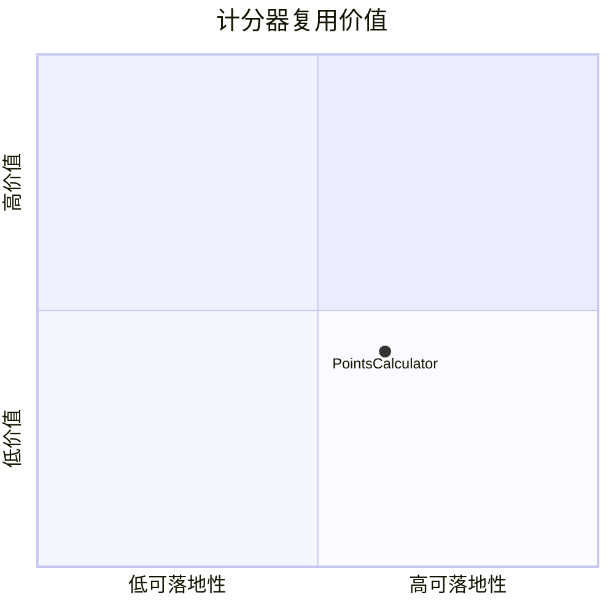

# codingmickey-rummy-points-calculator

> 类型：Point Rummy 详情页
> 创建日期：2026-09-17
> 原文链接：https://github.com/codingmickey/rummy-points-calculator
> 返回日报：[[Daily/2026-09-17]]

## 一句话结论

这是 C++ Rummy points calculator 候选，可用于抽取计分测试用例，但不是完整游戏环境。

## 信息压缩图示

## 相关链接

- 原文：https://github.com/codingmickey/rummy-points-calculator
