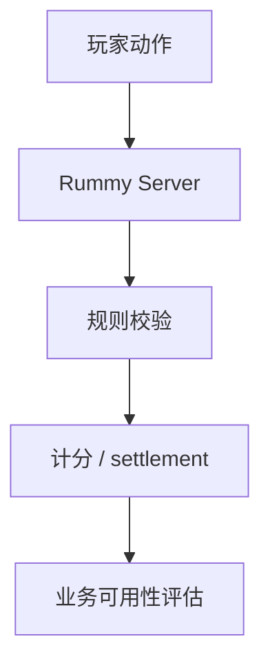
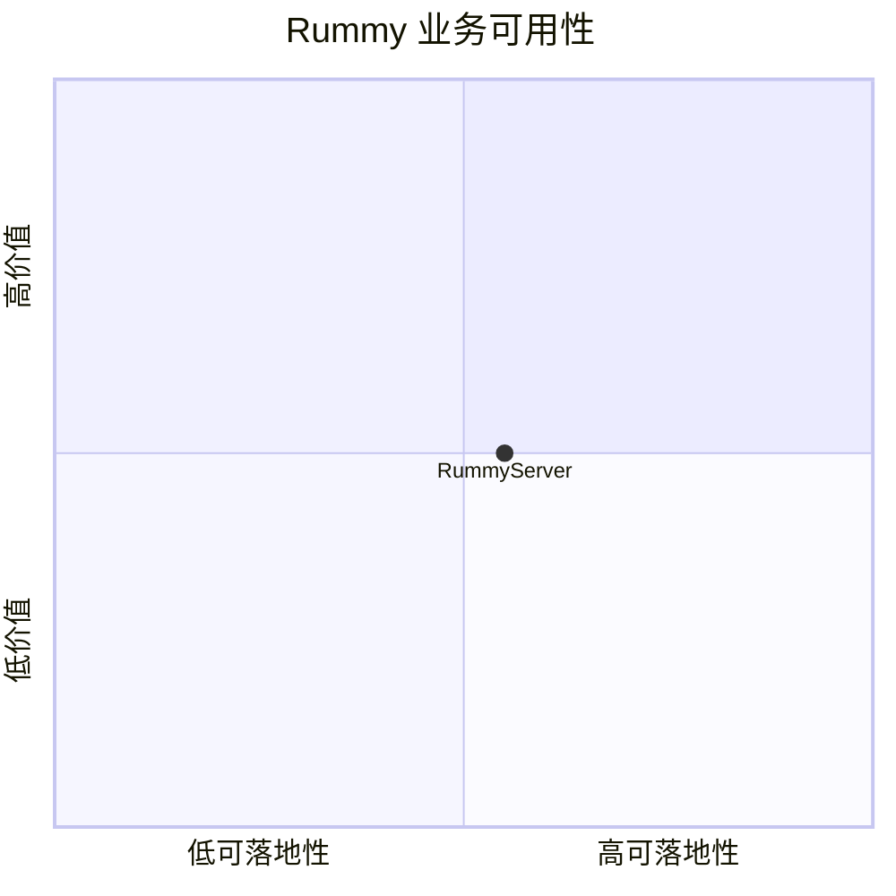

# mohitkumar-559-rummyserver

> 类型：Point Rummy 详情页
> 创建日期：2026-09-17
> 原文链接：https://github.com/Mohitkumar-559/RummyServer
> 返回日报：[[Daily/2026-09-17]]

## 一句话结论

RummyServer 是 Point / Deal Rummy server 候选，可用于参考后端房间、计分和状态同步，但 star 很低，需要代码审查。

## 信息压缩图示

## 相关链接

- 原文：https://github.com/Mohitkumar-559/RummyServer
