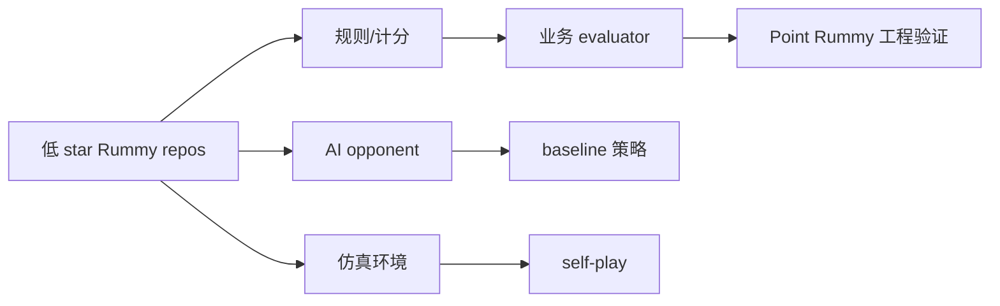

# Point Rummy / Indian Rummy 低置信观察池 - 2026-10-03

> 一句话结论：今日 GitHub Search 在 Rummy 主题上捕获到低 star 候选，但这些项目更适合规则/环境/bot baseline，不适合作为生产依赖。

## 业务可用性
| 方向 | 今日信号 | 可用性 | 下一步 |
|---|---|---|---|
| 规则引擎 / 计分 | Indian Rummy / Gin Rummy 小项目 | 中低 | 抽取 meld/sequence/set 判定并写测试 |
| Bot / RL Agent | ISMCTS/MCTS/RL 关键词零散 | 中低 | 复现单机 bot，再设计 self-play |
| 仿真 / 评测 | 缺少成熟高 star 环境 | 低 | 自建 Gymnasium-style env + evaluator |

## 关系图

#ai-radar #point-rummy
