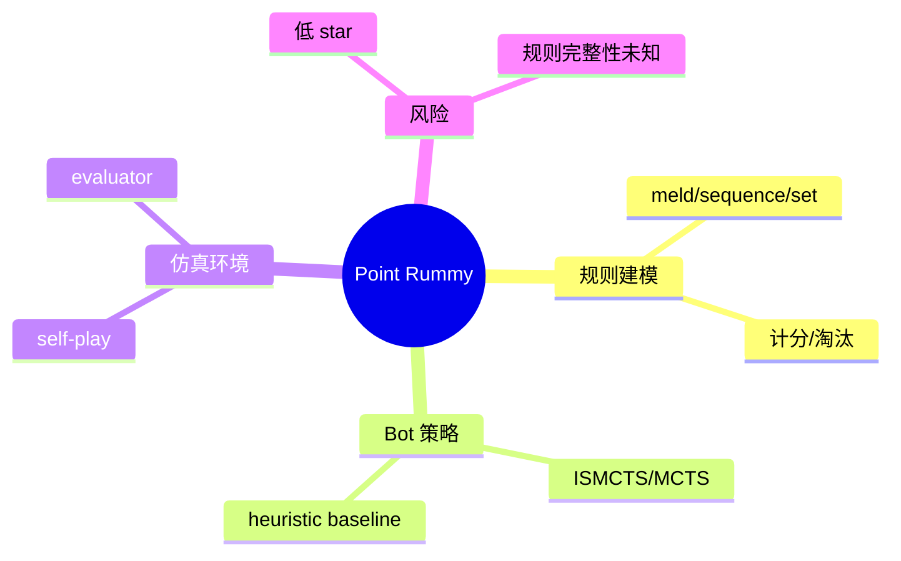

# Point Rummy 低置信 watchlist - 2026-10-05

> 今日 GitHub Search 在 Rummy 查询后出现 403，已有候选多为低 star 教学/个人项目。业务上只能作为规则建模、bot baseline、环境并行和 evaluator 参考。

## 跟进
- 优先看 `nakkekakke/rummy-ai` 的 ISMCTS 表达。
- 抽取 Indian Rummy 规则并补单元测试。
- 不直接依赖低 star repo 进入生产。

#AI-Radar #PointRummy
