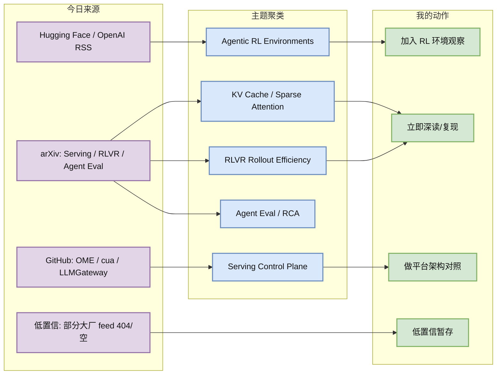
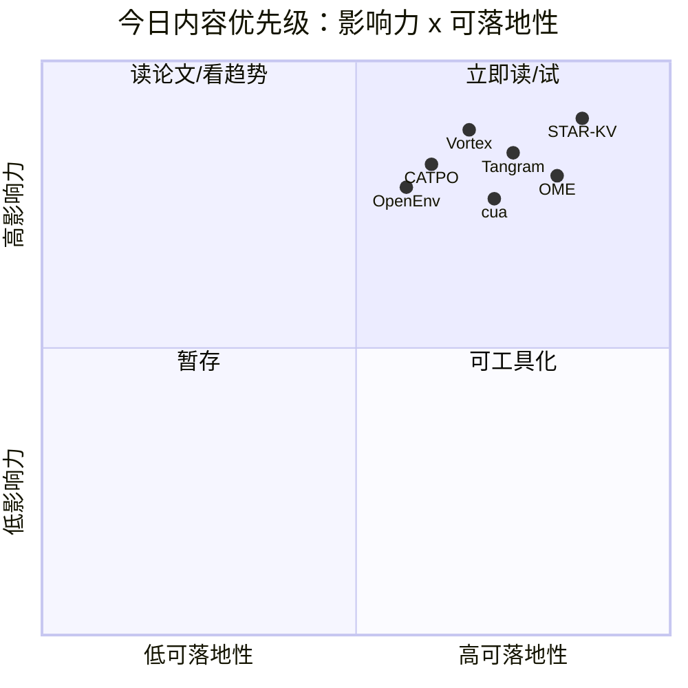

# AI Radar Daily - 2026-06-09

> 生成时间：2026-06-09 09:00 CST
> 范围：AI Infra / LLM / RL / Game AI / 大厂博客 / 论文 / GitHub / 行业资讯
> 说明：日报是总览导航页，不是全部正文。Obsidian 中点具体条目的 wikilink，Telegram/GitHub 中点“网页详情”。

## 0. 今日结论

- 今日最值得关注：Serving 方向连续出现 STAR-KV、Tangram、Vortex，说明长上下文/多轮 Agent 的瓶颈正在从“模型能否支持”转为“KV cache、sparse attention 和调度如何系统化落地”。
- 对 AI Infra 的直接影响：OME、LLMGateway、LMCache/vLLM/SGLang 生态共同指向一个趋势：LLM serving 需要 control plane、cache plane、gateway plane 分层治理。
- 对 LLM 训练 / 推理 / Agent 的影响：CATPO 和 ADWM 都在减少无效 rollout：前者提高 RLVR 树采样的信息密度，后者用 world model 降低 Agent 在线评估成本。
- 对 RL / 游戏模型训练的影响：OpenEnv 与 ADWM 显示“环境层 + 离线世界模型评估”会成为 Agentic RL 的基础设施重点。
- 建议今天深读：[[Papers/Serving/STAR-KV Low-Rank KV Cache Compression]]、[[Papers/Serving/Vortex Programmable Sparse Attention Serving for AI Agents]]、[[Papers/RLHF/CATPO Critique-Augmented Tree Policy Optimization]]、[[Industry/HuggingFace/OpenEnv Agentic RL Community Signal]]、[[GitHub/Infra/OME Kubernetes LLM Serving Operator]]。

## 1. 今日态势图

## 2. 必读卡片区

> [!important] STAR-KV / Tangram / Vortex：Serving 进入 KV cache + sparse attention 系统战
> - 大类：论文
> - 小类：Serving / KV Cache / Sparse Attention
> - 重点：三篇都不只是“压缩一点显存”，而是在处理长上下文、多轮和 Agent workload 下 cache 表示、调度、kernel、吞吐之间的系统耦合。
> - 为什么重要：你的 serving/eval/RL rollout 成本都会被 KV cache 和 attention backend 决定；STAR-KV 有公开代码，优先拉下来做同硬件 benchmark。
> - 详情：[[Papers/Serving/STAR-KV Low-Rank KV Cache Compression]] / [网页详情](https://github.com/dyt27666-oss/AI-news-report-obsidians/blob/main/Papers/Serving/STAR-KV%20Low-Rank%20KV%20Cache%20Compression.md) / [原文](https://arxiv.org/abs/2606.08382v1)

> [!tip] CATPO：RLVR 训练要优化 rollout 信息密度
> - 大类：论文
> - 小类：RLHF / RLVR / GRPO
> - 重点：用 tree informativeness score 过滤无效树，并用 critique healing 修复全失败分支。
> - 为什么重要：对推理模型 post-training 和稀疏奖励游戏 Agent 都说明一个事实：更多 rollout 不一定更好，关键是哪些 rollout 给梯度。
> - 详情：[[Papers/RLHF/CATPO Critique-Augmented Tree Policy Optimization]] / [网页详情](https://github.com/dyt27666-oss/AI-news-report-obsidians/blob/main/Papers/RLHF/CATPO%20Critique-Augmented%20Tree%20Policy%20Optimization.md) / [原文](https://arxiv.org/abs/2606.08346v1)

> [!tip] OpenEnv + ADWM：Agentic RL 的核心资产是环境和离线评估
> - 大类：博客 / 论文
> - 小类：Agentic RL / World Model
> - 重点：OpenEnv 指向可复用环境层，ADWM 指向不用在线执行也能评估新 Agent policy。
> - 为什么重要：这正是 RL 游戏模型训练关心的环境并行、reward/verifier、offline evaluation 和安全试错。
> - 详情：[[Industry/HuggingFace/OpenEnv Agentic RL Community Signal]]、[[Papers/Agents/ADWM Off-Policy Evaluation of LLM Agents]]

> [!important] OME：LLM serving control plane 上 K8s
> - 大类：GitHub
> - 小类：AI Infra / Serving Control Plane
> - 重点：OME 管 vLLM、SGLang、TensorRT-LLM、Triton、GPU scheduling 和模型生命周期。
> - 为什么重要：如果内部要做多后端推理平台，operator/control-plane 是绕不开的设计层。
> - 详情：[[GitHub/Infra/OME Kubernetes LLM Serving Operator]] / [网页详情](https://github.com/dyt27666-oss/AI-news-report-obsidians/blob/main/GitHub/Infra/OME%20Kubernetes%20LLM%20Serving%20Operator.md) / [原文](https://github.com/ome-projects/ome)

## 3. 优先级矩阵

## 4. 分类总清单

| 标签 | 大类 | 小类 | 标题 | 重点概括 | 为什么重要 | Obsidian 详情 | 网页详情 | 原文 |
|---|---|---|---|---|---|---|---|---|
| 必读 | 论文 | Serving / KV Cache | STAR-KV | 自适应低秩 + mixed precision 量化压缩 KV cache，报告端到端生成吞吐 3.1x。 | KV cache 是长上下文 serving 的核心成本；这篇有公开代码和 Triton kernel，适合做内部 serving 压测。 | [[Papers/Serving/STAR-KV Low-Rank KV Cache Compression]] | [网页详情](https://github.com/dyt27666-oss/AI-news-report-obsidians/blob/main/Papers/Serving/STAR-KV%20Low-Rank%20KV%20Cache%20Compression.md) | [原文](https://arxiv.org/abs/2606.08382v1) |
| 必读 | 论文 | Serving / Sparse Attention | Vortex | 可编程 sparse attention serving 系统，让 Agent 自动搜索长上下文注意力模式。 | 长 Agent rollout 和 deep research 任务会放大 attention 成本；Vortex 把算法探索连接到 serving stack。 | [[Papers/Serving/Vortex Programmable Sparse Attention Serving for AI Agents]] | [网页详情](https://github.com/dyt27666-oss/AI-news-report-obsidians/blob/main/Papers/Serving/Vortex%20Programmable%20Sparse%20Attention%20Serving%20for%20AI%20Agents.md) | [原文](https://arxiv.org/abs/2606.06453v1) |
| 必读 | 论文 | Serving / Multi-turn KV | Tangram | 面向多轮对话的非均匀 KV cache 系统，解决碎片、调度和 kernel 利用率问题。 | 多轮 memory/chat session 是生产 LLM 的真实 workload，比单轮 benchmark 更接近平台痛点。 | [[Papers/Serving/Tangram Non-Uniform KV Cache for Multi-turn LLM Serving]] | [网页详情](https://github.com/dyt27666-oss/AI-news-report-obsidians/blob/main/Papers/Serving/Tangram%20Non-Uniform%20KV%20Cache%20for%20Multi-turn%20LLM%20Serving.md) | [原文](https://arxiv.org/abs/2606.06302v1) |
| 必读 | 论文 | RLHF / RLVR | CATPO | 按 tree informativeness 选择和修复 rollout，减少 GRPO/TreeRPO 的无效采样。 | 后训练成本越来越由 rollout 质量决定；这对推理模型和游戏 RL 稀疏奖励都有迁移价值。 | [[Papers/RLHF/CATPO Critique-Augmented Tree Policy Optimization]] | [网页详情](https://github.com/dyt27666-oss/AI-news-report-obsidians/blob/main/Papers/RLHF/CATPO%20Critique-Augmented%20Tree%20Policy%20Optimization.md) | [原文](https://arxiv.org/abs/2606.08346v1) |
| 必读 | 论文 | Agent Eval / World Model | ADWM | 用 diffusion world model 做 LLM Agent 离线评估，避免昂贵/危险的在线交互。 | 如果 Agent/RL 训练依赖大量环境交互，离线 OPE 能显著降低成本并提升安全性。 | [[Papers/Agents/ADWM Off-Policy Evaluation of LLM Agents]] | [网页详情](https://github.com/dyt27666-oss/AI-news-report-obsidians/blob/main/Papers/Agents/ADWM%20Off-Policy%20Evaluation%20of%20LLM%20Agents.md) | [原文](https://arxiv.org/abs/2606.05558v1) |
| 可 skim | 论文 | AgentOps / Kubernetes | Auditable Graph-Guided RCA | Typed evidence graph + LangGraph traversal + 独立验证，用于 Kubernetes incident RCA Agent。 | RCA Agent 的关键不是单次回答，而是证据链和可审计性；适合内部 AgentOps eval 参考。 | [[Papers/Agents/Auditable Graph-Guided RCA for Kubernetes Incidents]] | [网页详情](https://github.com/dyt27666-oss/AI-news-report-obsidians/blob/main/Papers/Agents/Auditable%20Graph-Guided%20RCA%20for%20Kubernetes%20Incidents.md) | [原文](https://arxiv.org/abs/2606.08590v1) |
| 必读 | 博客 | Hugging Face / Agentic RL | OpenEnv Agentic RL | Hugging Face 社区推动 OpenEnv，环境层成为 Agentic RL 基础设施。 | 训练 Agent 和游戏模型都需要可复用、可验证、可并行环境；这是后训练平台的下一层。 | [[Industry/HuggingFace/OpenEnv Agentic RL Community Signal]] | [网页详情](https://github.com/dyt27666-oss/AI-news-report-obsidians/blob/main/Industry/HuggingFace/OpenEnv%20Agentic%20RL%20Community%20Signal.md) | [原文](https://huggingface.co/blog/openenv-agentic-rl) |
| 必读 | GitHub | Serving Control Plane | OME Kubernetes LLM Serving Operator | K8s operator 管 vLLM/SGLang/TensorRT-LLM/Triton、GPU scheduling 和模型生命周期。 | Serving 工程正在从单 runtime 走向 Kubernetes 控制面，适合对照内部平台。 | [[GitHub/Infra/OME Kubernetes LLM Serving Operator]] | [网页详情](https://github.com/dyt27666-oss/AI-news-report-obsidians/blob/main/GitHub/Infra/OME%20Kubernetes%20LLM%20Serving%20Operator.md) | [原文](https://github.com/ome-projects/ome) |
| 必读 | GitHub | Computer-Use Agent | trycua/cua | Computer-use Agent sandbox、SDK、benchmark，覆盖 macOS/Linux/Windows。 | GUI/desktop Agent 训练评测需要真实 sandbox；这和 MacArena、CLI-Anything 趋势呼应。 | [[GitHub/Agents/trycua Computer-Use Agent Infrastructure]] | [网页详情](https://github.com/dyt27666-oss/AI-news-report-obsidians/blob/main/GitHub/Agents/trycua%20Computer-Use%20Agent%20Infrastructure.md) | [原文](https://github.com/trycua/cua) |
| 可 skim | GitHub | LLM Gateway | LLMGateway | 统一多 provider LLM 请求路由、观测、限流和 guardrails。 | 在线 LLM 应用的控制面会影响成本、可靠性和 eval 数据采集。 | [[GitHub/Infra/LLMGateway Unified LLM Request Gateway]] | [网页详情](https://github.com/dyt27666-oss/AI-news-report-obsidians/blob/main/GitHub/Infra/LLMGateway%20Unified%20LLM%20Request%20Gateway.md) | [原文](https://github.com/theopenco/llmgateway) |

## 5. 论文

### 5.1 Serving / KV Cache / Sparse Attention

| 标签 | 论文来源 | 论文 | 作者/机构 | 重点概括 | 工程/研究价值 | Obsidian 详情 | 网页详情 | PDF/原文 |
|---|---|---|---|---|---|---|---|---|
| 必读 | arXiv / 预印本 | STAR-KV | Serving / KV Cache | 自适应低秩 + mixed precision 量化压缩 KV cache，报告端到端生成吞吐 3.1x。 | KV cache 是长上下文 serving 的核心成本；这篇有公开代码和 Triton kernel，适合做内部 serving 压测。 | [[Papers/Serving/STAR-KV Low-Rank KV Cache Compression]] | [网页详情](https://github.com/dyt27666-oss/AI-news-report-obsidians/blob/main/Papers/Serving/STAR-KV%20Low-Rank%20KV%20Cache%20Compression.md) | [PDF/原文](https://arxiv.org/abs/2606.08382v1) |
| 必读 | arXiv / 预印本 | Vortex | Serving / Sparse Attention | 可编程 sparse attention serving 系统，让 Agent 自动搜索长上下文注意力模式。 | 长 Agent rollout 和 deep research 任务会放大 attention 成本；Vortex 把算法探索连接到 serving stack。 | [[Papers/Serving/Vortex Programmable Sparse Attention Serving for AI Agents]] | [网页详情](https://github.com/dyt27666-oss/AI-news-report-obsidians/blob/main/Papers/Serving/Vortex%20Programmable%20Sparse%20Attention%20Serving%20for%20AI%20Agents.md) | [PDF/原文](https://arxiv.org/abs/2606.06453v1) |
| 必读 | arXiv / 预印本 | Tangram | Serving / Multi-turn KV | 面向多轮对话的非均匀 KV cache 系统，解决碎片、调度和 kernel 利用率问题。 | 多轮 memory/chat session 是生产 LLM 的真实 workload，比单轮 benchmark 更接近平台痛点。 | [[Papers/Serving/Tangram Non-Uniform KV Cache for Multi-turn LLM Serving]] | [网页详情](https://github.com/dyt27666-oss/AI-news-report-obsidians/blob/main/Papers/Serving/Tangram%20Non-Uniform%20KV%20Cache%20for%20Multi-turn%20LLM%20Serving.md) | [PDF/原文](https://arxiv.org/abs/2606.06302v1) |
| 必读 | arXiv / 预印本 | CATPO | RLHF / RLVR | 按 tree informativeness 选择和修复 rollout，减少 GRPO/TreeRPO 的无效采样。 | 后训练成本越来越由 rollout 质量决定；这对推理模型和游戏 RL 稀疏奖励都有迁移价值。 | [[Papers/RLHF/CATPO Critique-Augmented Tree Policy Optimization]] | [网页详情](https://github.com/dyt27666-oss/AI-news-report-obsidians/blob/main/Papers/RLHF/CATPO%20Critique-Augmented%20Tree%20Policy%20Optimization.md) | [PDF/原文](https://arxiv.org/abs/2606.08346v1) |
| 必读 | arXiv / 预印本 | ADWM | Agent Eval / World Model | 用 diffusion world model 做 LLM Agent 离线评估，避免昂贵/危险的在线交互。 | 如果 Agent/RL 训练依赖大量环境交互，离线 OPE 能显著降低成本并提升安全性。 | [[Papers/Agents/ADWM Off-Policy Evaluation of LLM Agents]] | [网页详情](https://github.com/dyt27666-oss/AI-news-report-obsidians/blob/main/Papers/Agents/ADWM%20Off-Policy%20Evaluation%20of%20LLM%20Agents.md) | [PDF/原文](https://arxiv.org/abs/2606.05558v1) |
| 可 skim | arXiv / 预印本 | Auditable Graph-Guided RCA | AgentOps / Kubernetes | Typed evidence graph + LangGraph traversal + 独立验证，用于 Kubernetes incident RCA Agent。 | RCA Agent 的关键不是单次回答，而是证据链和可审计性；适合内部 AgentOps eval 参考。 | [[Papers/Agents/Auditable Graph-Guided RCA for Kubernetes Incidents]] | [网页详情](https://github.com/dyt27666-oss/AI-news-report-obsidians/blob/main/Papers/Agents/Auditable%20Graph-Guided%20RCA%20for%20Kubernetes%20Incidents.md) | [PDF/原文](https://arxiv.org/abs/2606.08590v1) |

## 6. 博客

### 6.1 Hugging Face

| 标签 | 发布方/大厂 | 栏目/来源 | 标题 | 重点概括 | 工程/算法影响 | Obsidian 详情 | 网页详情 | 原文 |
|---|---|---|---|---|---|---|---|---|
| 必读 | Hugging Face | Blog / Community announcement | OpenEnv Agentic RL | Hugging Face 社区推动 OpenEnv，环境层成为 Agentic RL 基础设施。 | 训练 Agent 和游戏模型都需要可复用、可验证、可并行环境；这是后训练平台的下一层。 | [[Industry/HuggingFace/OpenEnv Agentic RL Community Signal]] | [网页详情](https://github.com/dyt27666-oss/AI-news-report-obsidians/blob/main/Industry/HuggingFace/OpenEnv%20Agentic%20RL%20Community%20Signal.md) | [原文](https://huggingface.co/blog/openenv-agentic-rl) |

## 7. 资讯 / GitHub 项目

### 7.1 AI Infra / Agent Infrastructure

| 标签 | 来源 | 标题 | 重点概括 | 对我有什么用 | Obsidian 详情 | 网页详情 | 原文 |
|---|---|---|---|---|---|---|---|
| 必读 | GitHub repo | OME Kubernetes LLM Serving Operator | K8s operator 管 vLLM/SGLang/TensorRT-LLM/Triton、GPU scheduling 和模型生命周期。 | Serving 工程正在从单 runtime 走向 Kubernetes 控制面，适合对照内部平台。 | [[GitHub/Infra/OME Kubernetes LLM Serving Operator]] | [网页详情](https://github.com/dyt27666-oss/AI-news-report-obsidians/blob/main/GitHub/Infra/OME%20Kubernetes%20LLM%20Serving%20Operator.md) | [原文](https://github.com/ome-projects/ome) |
| 必读 | GitHub repo | trycua/cua | Computer-use Agent sandbox、SDK、benchmark，覆盖 macOS/Linux/Windows。 | GUI/desktop Agent 训练评测需要真实 sandbox；这和 MacArena、CLI-Anything 趋势呼应。 | [[GitHub/Agents/trycua Computer-Use Agent Infrastructure]] | [网页详情](https://github.com/dyt27666-oss/AI-news-report-obsidians/blob/main/GitHub/Agents/trycua%20Computer-Use%20Agent%20Infrastructure.md) | [原文](https://github.com/trycua/cua) |
| 可 skim | GitHub repo | LLMGateway | 统一多 provider LLM 请求路由、观测、限流和 guardrails。 | 在线 LLM 应用的控制面会影响成本、可靠性和 eval 数据采集。 | [[GitHub/Infra/LLMGateway Unified LLM Request Gateway]] | [网页详情](https://github.com/dyt27666-oss/AI-news-report-obsidians/blob/main/GitHub/Infra/LLMGateway%20Unified%20LLM%20Request%20Gateway.md) | [原文](https://github.com/theopenco/llmgateway) |

## 6.1 今日补扫：大厂资讯 / 工程博客 / Research

> 补扫原因：今天 09:00 自动日报确实只收录了 Hugging Face 一条博客，大厂资讯/工程博客覆盖不足。这里补上固定公司扫描矩阵，并把这个要求写入自动化任务，之后每天必须出现。

### 6.1.1 公司来源扫描矩阵

| 公司/实验室 | 来源/栏目 | 今日状态 | 高相关条数 | 代表条目 | 备注 |
|---|---|---|---:|---|---|
| OpenAI | News / Research | 已补扫 | 0 | 无高相关工程新项 | 今日原日报提到政策/公司动态相关性弱；后续必须保留扫描状态。 |
| Anthropic | News / Research / Engineering | 已补扫但低置信 | 0 | 无高相关新项 | 原 cron 记录 feed 404；后续需尝试网页/RSS 双路径。 |
| Google DeepMind | Blog / Research | 已补扫 | 0 | 无今日核心技术项 | 原日报只在公司索引说明，现补入矩阵。 |
| Meta AI | Blog / Research | 已补扫但低置信 | 0 | 无高相关新项 | 原 cron 记录 RSS 404；后续需用网页 fallback。 |
| NVIDIA | Technical Blog / AI | 已补扫但低置信 | 0 | 无可解析新项 | 原 cron 记录 feed 可访问但未解析新条目。 |
| Microsoft | Research AI | 已补扫 | 0 | 无高相关新项 | 后续需独立列出 Microsoft Research AI 状态。 |
| Hugging Face | Blog / Papers / Releases | 已收录 | 1 | [[Industry/HuggingFace/OpenEnv Agentic RL Community Signal]] | 与 Agentic RL 环境层高度相关。 |
| 腾讯 | AI Lab / 技术博客 | 已补扫但低置信 | 0 | 无高相关新项 | 后续需加强中文站点/工程博客采集。 |
| 字节 | Seed / 技术博客 | 已补扫但低置信 | 0 | 无高相关新项 | 后续需加强 Seed/技术博客采集。 |
| SpaceAI | Blog / News | 已补扫但低置信 | 0 | 无高相关新项 | 需确认可靠来源 URL。 |

## 7.1 今日补扫：GitHub 高 star Top 10

> 补扫原因：今天原日报只有 3 个 GitHub 项目，没有单独给高 star Top 10。以下为补采集结果。

| 排名 | repo | stars | forks | language | updated_at | topics | 重点概括 | 是否值得试用 | Obsidian 详情 | 原文 |
|---:|---|---:|---:|---|---|---|---|---|---|---|
| 1 | affaan-m/ECC | 211310 | 32418 | JavaScript | 2026-06-09T09:34:16Z | ai-agents, anthropic, claude, claude-code | The agent harness performance optimization system. Skills, instincts, memory, security, and research-first dev...；topics: ai-agents, anthropic, claude, claude-code, developer-tools, llm | 值得试用/纳入观察，和 AI Infra、Agent 或 LLM 应用工程相关。 | [[GitHub/Watchlist/affaan-m ECC]] | [GitHub](https://github.com/affaan-m/ECC) |
| 2 | tensorflow/tensorflow | 195617 | 75182 | C++ | 2026-06-09T08:32:43Z | deep-learning, deep-neural-networks, distributed, machine-learning | An Open Source Machine Learning Framework for Everyone；topics: deep-learning, deep-neural-networks, distributed, machine-learning, ml, neural-network | 高生态权重，适合做基线或长期观察。 | [[GitHub/Watchlist/tensorflow tensorflow]] | [GitHub](https://github.com/tensorflow/tensorflow) |
| 3 | NousResearch/hermes-agent | 188075 | 32391 | Python | 2026-06-09T09:34:20Z | ai, ai-agent, ai-agents, anthropic | The agent that grows with you；topics: ai, ai-agent, ai-agents, anthropic, chatgpt, claude | 值得试用/纳入观察，和 AI Infra、Agent 或 LLM 应用工程相关。 | [[GitHub/Watchlist/NousResearch hermes-agent]] | [GitHub](https://github.com/NousResearch/hermes-agent) |
| 4 | Significant-Gravitas/AutoGPT | 184857 | 46170 | Python | 2026-06-09T09:14:35Z | agentic-ai, agents, ai, artificial-intelligence | AutoGPT is the vision of accessible AI for everyone, to use and to build on. Our mission is to provide the too...；topics: agentic-ai, agents, ai, artificial-intelligence, autonomous-agents, claude | 值得试用/纳入观察，和 AI Infra、Agent 或 LLM 应用工程相关。 | [[GitHub/Watchlist/Significant-Gravitas AutoGPT]] | [GitHub](https://github.com/Significant-Gravitas/AutoGPT) |
| 5 | ollama/ollama | 173661 | 16516 | Go | 2026-06-09T09:26:11Z | deepseek, gemma, gemma3, glm | Get up and running with Kimi-K2.6, GLM-5.1, MiniMax, DeepSeek, gpt-oss, Qwen, Gemma and other models.；topics: deepseek, gemma, gemma3, glm, go, golang | 值得试用/纳入观察，和 AI Infra、Agent 或 LLM 应用工程相关。 | [[GitHub/Watchlist/ollama ollama]] | [GitHub](https://github.com/ollama/ollama) |
| 6 | f/prompts.chat | 163454 | 21217 | HTML | 2026-06-09T08:40:16Z | ai, artificial-intelligence, awesome-list, chatgpt | f.k.a. Awesome ChatGPT Prompts. Share, discover, and collect prompts from the community. Free and open source ...；topics: ai, artificial-intelligence, awesome-list, chatgpt, chatgpt-prompts, claude | 值得试用/纳入观察，和 AI Infra、Agent 或 LLM 应用工程相关。 | [[GitHub/Watchlist/f prompts.chat]] | [GitHub](https://github.com/f/prompts.chat) |
| 7 | huggingface/transformers | 161436 | 33433 | Python | 2026-06-09T09:32:51Z | audio, deep-learning, deepseek, gemma | 🤗 Transformers: the model-definition framework for state-of-the-art machine learning models in text, vision, a...；topics: audio, deep-learning, deepseek, gemma, glm, hacktoberfest | 值得试用/纳入观察，和 AI Infra、Agent 或 LLM 应用工程相关。 | [[GitHub/Watchlist/huggingface transformers]] | [GitHub](https://github.com/huggingface/transformers) |
| 8 | langflow-ai/langflow | 149438 | 9219 | Python | 2026-06-09T09:17:24Z | agents, chatgpt, generative-ai, large-language-models | Langflow is a powerful tool for building and deploying AI-powered agents and workflows.；topics: agents, chatgpt, generative-ai, large-language-models, multiagent, react-flow | 值得试用/纳入观察，和 AI Infra、Agent 或 LLM 应用工程相关。 | [[GitHub/Watchlist/langflow-ai langflow]] | [GitHub](https://github.com/langflow-ai/langflow) |
| 9 | langgenius/dify | 144523 | 22744 | TypeScript | 2026-06-09T09:34:21Z | agent, agentic-ai, agentic-framework, agentic-workflow | Production-ready platform for agentic workflow development.；topics: agent, agentic-ai, agentic-framework, agentic-workflow, ai, automation | 值得试用/纳入观察，和 AI Infra、Agent 或 LLM 应用工程相关。 | [[GitHub/Watchlist/langgenius dify]] | [GitHub](https://github.com/langgenius/dify) |
| 10 | open-webui/open-webui | 140759 | 20197 | Python | 2026-06-09T09:34:40Z | ai, llm, llm-ui, llm-webui | User-friendly AI Interface (Supports Ollama, OpenAI API, ...)；topics: ai, llm, llm-ui, llm-webui, llms, mcp | 值得试用/纳入观察，和 AI Infra、Agent 或 LLM 应用工程相关。 | [[GitHub/Watchlist/open-webui open-webui]] | [GitHub](https://github.com/open-webui/open-webui) |

## 7.2 今日补扫：GitHub star 增长最快 Top 10

> 重要说明：今天是第一次保存 `Automation/state/github-stars-YYYY-MM-DD.json`，没有昨日 baseline，所以这里是“冷启动代理，非真实日增”。明天开始会用 snapshot 计算真实 `stars_delta`。

| 排名 | repo | stars_delta | stars | forks | language | updated_at | 增长依据 | 重点概括 | Obsidian 详情 | 原文 |
|---:|---|---:|---:|---:|---|---|---|---|---|---|
| 1 | open-webui/open-webui | 冷启动代理 | 140759 | 20197 | Python | 2026-06-09T09:34:40Z | 冷启动代理，非真实日增：按 updated_at + stars 排序；明天起使用 snapshot 计算真实 delta。 | User-friendly AI Interface (Supports Ollama, OpenAI API, ...)；topics: ai, llm, llm-ui, llm-webui, llms, mcp | [[GitHub/Watchlist/open-webui open-webui]] | [GitHub](https://github.com/open-webui/open-webui) |
| 2 | AstrBotDevs/AstrBot | 冷启动代理 | 34245 | 2348 | Python | 2026-06-09T09:34:32Z | 冷启动代理，非真实日增：按 updated_at + stars 排序；明天起使用 snapshot 计算真实 delta。 | AI Agent Assistant & development framework that integrates lots of IM platforms, LLMs, plugins and AI feature,...；topics: agent, ai, chatbot, chatgpt, discord, docker | [[GitHub/Watchlist/AstrBotDevs AstrBot]] | [GitHub](https://github.com/AstrBotDevs/AstrBot) |
| 3 | netdata/netdata | 冷启动代理 | 79094 | 6447 | C | 2026-06-09T09:34:22Z | 冷启动代理，非真实日增：按 updated_at + stars 排序；明天起使用 snapshot 计算真实 delta。 | The fastest path to AI-powered full stack observability, even for lean teams.；topics: ai, alerting, cncf, data-visualization, database, devops | [[GitHub/Watchlist/netdata netdata]] | [GitHub](https://github.com/netdata/netdata) |
| 4 | langgenius/dify | 冷启动代理 | 144523 | 22744 | TypeScript | 2026-06-09T09:34:21Z | 冷启动代理，非真实日增：按 updated_at + stars 排序；明天起使用 snapshot 计算真实 delta。 | Production-ready platform for agentic workflow development.；topics: agent, agentic-ai, agentic-framework, agentic-workflow, ai, automation | [[GitHub/Watchlist/langgenius dify]] | [GitHub](https://github.com/langgenius/dify) |
| 5 | NousResearch/hermes-agent | 冷启动代理 | 188075 | 32391 | Python | 2026-06-09T09:34:20Z | 冷启动代理，非真实日增：按 updated_at + stars 排序；明天起使用 snapshot 计算真实 delta。 | The agent that grows with you；topics: ai, ai-agent, ai-agents, anthropic, chatgpt, claude | [[GitHub/Watchlist/NousResearch hermes-agent]] | [GitHub](https://github.com/NousResearch/hermes-agent) |
| 6 | rohitg00/ai-engineering-from-scratch | 冷启动代理 | 30531 | 4971 | Python | 2026-06-09T09:34:17Z | 冷启动代理，非真实日增：按 updated_at + stars 排序；明天起使用 snapshot 计算真实 delta。 | Learn it. Build it. Ship it for others.；topics: agents, ai, ai-agents, ai-engineering, computer-vision, course | [[GitHub/Watchlist/rohitg00 ai-engineering-from-scratch]] | [GitHub](https://github.com/rohitg00/ai-engineering-from-scratch) |
| 7 | kornia/kornia | 冷启动代理 | 11234 | 1183 | Python | 2026-06-09T09:34:17Z | 冷启动代理，非真实日增：按 updated_at + stars 排序；明天起使用 snapshot 计算真实 delta。 | 🐍 Geometric Computer Vision Library for Spatial AI；topics: artificial-intelligence, computer-vision, deep-learning, hacktoberfest, image-processing, machine-learning | [[GitHub/Watchlist/kornia kornia]] | [GitHub](https://github.com/kornia/kornia) |
| 8 | affaan-m/ECC | 冷启动代理 | 211310 | 32418 | JavaScript | 2026-06-09T09:34:16Z | 冷启动代理，非真实日增：按 updated_at + stars 排序；明天起使用 snapshot 计算真实 delta。 | The agent harness performance optimization system. Skills, instincts, memory, security, and research-first dev...；topics: ai-agents, anthropic, claude, claude-code, developer-tools, llm | [[GitHub/Watchlist/affaan-m ECC]] | [GitHub](https://github.com/affaan-m/ECC) |
| 9 | frontman-ai/frontman | 冷启动代理 | 579 | 30 | ReScript | 2026-06-09T09:34:16Z | 冷启动代理，非真实日增：按 updated_at + stars 排序；明天起使用 snapshot 计算真实 delta。 | The AI agent that lives in your framework/browser；topics: agent, ai, ai-agent, ai-coding, artificial-intelligence, astro | [[GitHub/Watchlist/frontman-ai frontman]] | [GitHub](https://github.com/frontman-ai/frontman) |
| 10 | firecrawl/firecrawl | 冷启动代理 | 130498 | 7732 | TypeScript | 2026-06-09T09:34:15Z | 冷启动代理，非真实日增：按 updated_at + stars 排序；明天起使用 snapshot 计算真实 delta。 | The API to search, scrape, and interact with the web at scale. 🔥；topics: ai, ai-agents, ai-crawler, ai-scraping, ai-search, crawler | [[GitHub/Watchlist/firecrawl firecrawl]] | [GitHub](https://github.com/firecrawl/firecrawl) |

## 8. 按主题索引

### AI Infra / Serving / Training

- [[Papers/Serving/STAR-KV Low-Rank KV Cache Compression]] - KV cache 压缩 + Triton kernel，最适合今天复现。
- [[Papers/Serving/Vortex Programmable Sparse Attention Serving for AI Agents]] - sparse attention serving 的可编程系统。
- [[Papers/Serving/Tangram Non-Uniform KV Cache for Multi-turn LLM Serving]] - multi-turn serving 的非均匀 cache 管理。
- [[GitHub/Infra/OME Kubernetes LLM Serving Operator]] - Kubernetes 控制面管理多 serving backend。
- [[GitHub/Infra/LLMGateway Unified LLM Request Gateway]] - LLM 请求网关和 observability。

### LLM / Agent / RAG / Evaluation

- [[Papers/Agents/ADWM Off-Policy Evaluation of LLM Agents]] - LLM Agent 离线评估世界模型。
- [[Papers/Agents/Auditable Graph-Guided RCA for Kubernetes Incidents]] - AgentOps/RCA 的 evidence graph 和可审计评测。
- [[GitHub/Agents/trycua Computer-Use Agent Infrastructure]] - Computer-use Agent sandbox 和 benchmark。

### RL / Game AI / World Model

- [[Papers/RLHF/CATPO Critique-Augmented Tree Policy Optimization]] - 提高 RLVR tree rollout 的信息密度。
- [[Industry/HuggingFace/OpenEnv Agentic RL Community Signal]] - Agentic RL 环境层社区信号。
- [[Papers/Agents/ADWM Off-Policy Evaluation of LLM Agents]] - 离线世界模型评估可迁移到游戏 Agent。

### 公司 / 实验室

- Hugging Face: [[Industry/HuggingFace/OpenEnv Agentic RL Community Signal]]
- OpenAI: 今日 RSS 新增 S-1、benefit everyone plan、Economic Research Exchange，和核心 AI Infra/RL 相关性弱，未纳入详情。
- Google DeepMind: RSS 无今日新核心技术项。

## 9. 值得后续深挖

| 标签 | 大类 | 小类 | 标题 | 后续动作 | Obsidian 详情 | 原文 |
|---|---|---|---|---|---|---|
| 后续 | 论文 | Computer-Use Agent | MacArena | 和 trycua/cua、OSWorld、mobilegym 做 GUI Agent benchmark 横向表 | 暂未生成 | [arXiv](https://arxiv.org/abs/2606.06560v1) |
| 后续 | 论文 | Agent-native Interface | CLI-Anything | 和 Hugging Face hf CLI for agents 形成 agent-native interface checklist | 暂未生成 | [arXiv](https://arxiv.org/abs/2606.03854v1) |
| 后续 | GitHub | KV Cache | LMCache | 继续跟踪 dev branch 和 vLLM 集成；今日已有旧卡片可复用 | [[GitHub/Agents/LMCache-LMCache]] | [GitHub](https://github.com/LMCache/LMCache) |
| 低置信 | 博客 | OpenAI | Economic Research Exchange / S-1 / benefit plan | 偏政策/公司动态，和 AI Infra/RL 相关性弱，跳过详情 | 暂未生成 | [OpenAI News](https://openai.com/news/) |

## 10. 采集失败或低置信来源

- `blogwatcher-cli` 未安装；本次直接解析 RSS/Atom feed。
- Anthropic feed URL 返回 404，Meta AI RSS 返回 404；今日未纳入新重点。
- NVIDIA AI category feed 可访问但未返回可解析新条目。
- GitHub Search API 对后续 query 出现 rate limit，已用已获取 repo API 元数据完成筛选。
- arXiv 宽泛 query 噪声很高，已改用 title/abstract 精确 query 严格过滤。

## 11. 归档标签

#ai-radar #daily #ai-infra #llm #rl #serving #kv-cache #agentic-rl
