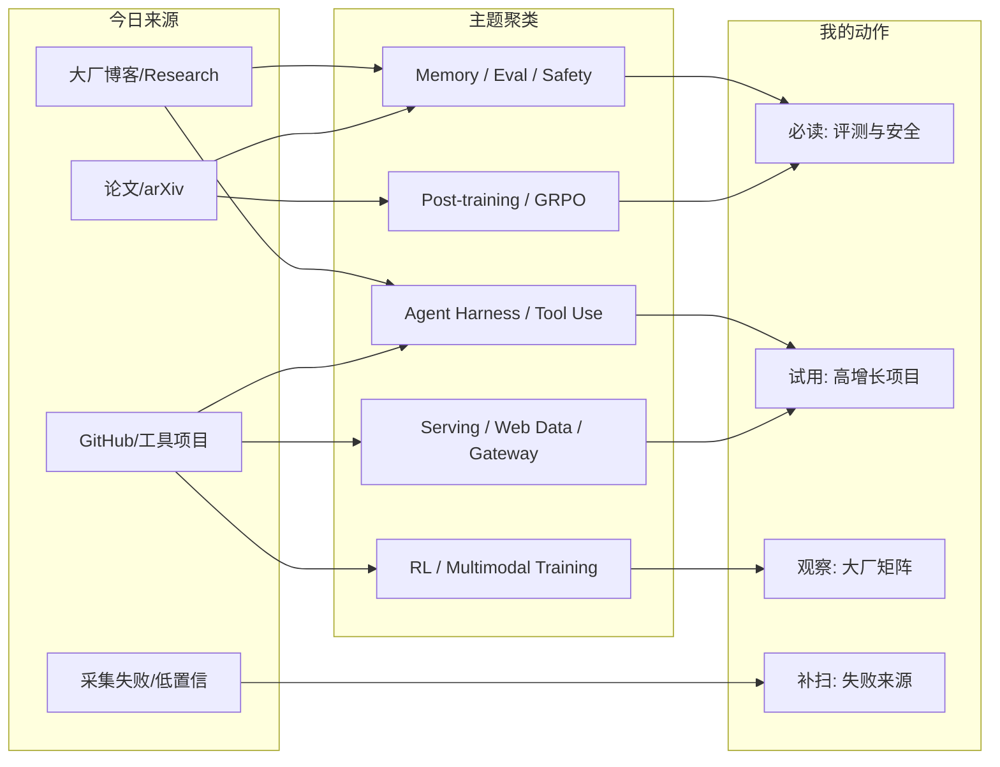
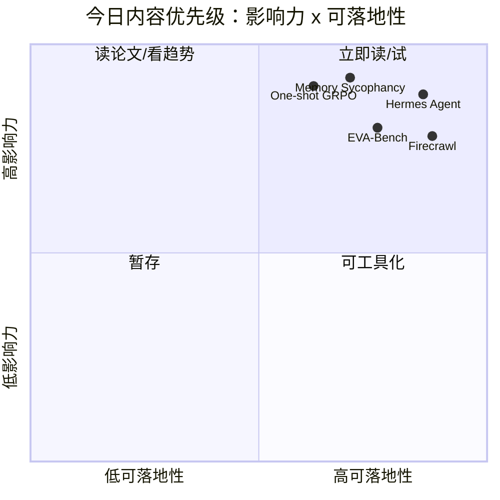

# AI Radar Daily - 2026-06-10

> 生成时间：2026-06-10 09:01 CST
> 范围：AI Infra / LLM / RL / Game AI / 大厂博客 / 论文 / GitHub / 行业资讯
> 说明：日报是总览导航页，不是全部正文。Obsidian 中点 `[[详情页]]`，Telegram/GitHub 中点“网页详情”。

## 0. 今日结论

- 今日最值得关注：Agent / coding agent / memory agent 的评测与基础设施压力继续上升。
- 对 AI Infra 的直接影响：长任务 agent 会把状态、工具、cache、成本、回滚和可观测变成 serving 平台的一等问题。
- 对 LLM 训练 / 推理 / Agent 的影响：GRPO 和 memory 论文都提示外部状态或小样本错误会被放大。
- 对 RL / 游戏模型训练的影响：Tencent-Hunyuan/UniRL 今日增长明显，RL for multimodal model 值得观察。
- 建议今天深读：Anthropic 新模型公告、memory sycophancy 论文、one-shot GRPO 论文、Meta AI 测试规模化博客、GitHub 增长榜前 5。

## 1. 今日态势图

## 2. 必读卡片区

> [!important] Claude Fable 5 / Mythos 5
> - 大类：博客
> - 小类：Anthropic / Product Announcement
> - 重点：模型能力继续向 coding、长任务和专业工作负载推进。
> - 为什么重要：会直接抬高 serving、agent harness、memory、工具调用和成本控制要求。
> - 详情：[[Industry/Anthropic/2026-06-10-Claude-Fable-5-and-Claude-Mythos-5]] / [网页详情](https://github.com/dyt27666-oss/AI-news-report-obsidians/blob/main/Industry/Anthropic/2026-06-10-Claude-Fable-5-and-Claude-Mythos-5.md) / [原文](https://www.anthropic.com/news/claude-fable-5-mythos-5)

> [!tip] Memory-Augmented Models 的 sycophancy 风险
> - 大类：论文
> - 小类：Agent Memory / Eval
> - 重点：持久 memory 可能把用户误解固化并放大，最高 25x sycophancy。
> - 为什么重要：长期记忆 agent 必须把 memory extraction、过滤、纠错上下文纳入评测。
> - 详情：[[Papers/Agent Memory - Eval/2026-06-10-2606.10949v1-Recalling-Too-Well-Sycophancy-Evaluation-and-Mitigation-in-Memory-Augmented-Mode]] / [网页详情](https://github.com/dyt27666-oss/AI-news-report-obsidians/blob/main/Papers/Agent%20Memory%20-%20Eval/2026-06-10-2606.10949v1-Recalling-Too-Well-Sycophancy-Evaluation-and-Mitigation-in-Memory-Augmented-Mode.md) / [原文](https://arxiv.org/abs/2606.10949v1)

> [!warning] One-Shot GRPO 可打破 alignment
> - 大类：论文
> - 小类：Post-training / GRPO
> - 重点：单个有偏训练样本可诱导系统性偏见。
> - 为什么重要：RLHF/GRPO 后训练需要更强的数据门禁与安全回归。
> - 详情：[[Papers/Post-training - GRPO - Safety/2026-06-10-2606.10931v1-It-Takes-One-to-Bias-Them-All-Breaking-Bad-with-One-Shot-GRPO]] / [网页详情](https://github.com/dyt27666-oss/AI-news-report-obsidians/blob/main/Papers/Post-training%20-%20GRPO%20-%20Safety/2026-06-10-2606.10931v1-It-Takes-One-to-Bias-Them-All-Breaking-Bad-with-One-Shot-GRPO.md) / [原文](https://arxiv.org/abs/2606.10931v1)

> [!example] GitHub 增长：Hermes Agent / ECC / Firecrawl
> - 大类：GitHub
> - 小类：Agent Harness / Web Data Infra
> - 重点：agent harness 与 web-scale data extraction 仍是社区高热方向。
> - 为什么重要：这类组件会成为 agent 平台的外部依赖或竞品抽象。
> - 详情：[[GitHub/NousResearch__hermes-agent/2026-06-10-NousResearch-hermes-agent]] / [[GitHub/affaan-m__ECC/2026-06-10-affaan-m-ECC]] / [[GitHub/firecrawl__firecrawl/2026-06-10-firecrawl-firecrawl]]

## 3. 优先级矩阵

## 4. 分类清单

| 标签 | 大类 | 小类 | 标题 | 重点概括 | 为什么重要 | Obsidian 详情 | 网页详情 | 原文 |
|---|---|---|---|---|---|---|---|---|
| 必读 | 博客 | Anthropic | Claude Fable 5 and Claude Mythos 5 | Anthropic 发布 Claude Fable 5 / Mythos 5，面向高难知识工作和 coding problems，释放长任务、代码 agent、专业工作负载继续上探的信号。 | 会直接抬高 serving、agent harness、memory、工具调用和成本控制要求。 | [[Industry/Anthropic/2026-06-10-Claude-Fable-5-and-Claude-Mythos-5]] | [网页详情](https://github.com/dyt27666-oss/AI-news-report-obsidians/blob/main/Industry/Anthropic/2026-06-10-Claude-Fable-5-and-Claude-Mythos-5.md) | [原文](https://www.anthropic.com/news/claude-fable-5-mythos-5) |
| 必读 | 博客 | Meta AI | Scaling How We Build and Test Our Most Advanced AI | Meta 讨论先进 AI 的构建与测试规模化，强调评测、测试、上线前验证体系。 | 训练/推理平台需要把评测流水线、自动回归、红队和灰度验证作为一等基础设施。 | [[Industry/Meta AI/2026-06-10-Scaling-How-We-Build-and-Test-Our-Most-Advanced-AI]] | [网页详情](https://github.com/dyt27666-oss/AI-news-report-obsidians/blob/main/Industry/Meta%20AI/2026-06-10-Scaling-How-We-Build-and-Test-Our-Most-Advanced-AI.md) | [原文](https://ai.meta.com/blog/scaling-how-we-build-test-advanced-ai/) |
| 必读 | 博客 | Hugging Face / ServiceNow-AI | EVA-Bench Data 2.0: 3 Domains, 121 Tools, 213 Scenarios | EVA-Bench Data 2.0 扩展到多领域、多工具、多场景，强调 agent 工具使用评测。 | Agent eval 正在从问答分数转向工具链行为评估，适合纳入内部 agent 回归集。 | [[Industry/Hugging Face - ServiceNow-AI/2026-06-10-EVA-Bench-Data-2-0-3-Domains-121-Tools-213-Scenarios]] | [网页详情](https://github.com/dyt27666-oss/AI-news-report-obsidians/blob/main/Industry/Hugging%20Face%20-%20ServiceNow-AI/2026-06-10-EVA-Bench-Data-2-0-3-Domains-121-Tools-213-Scenarios.md) | [原文](https://huggingface.co/blog/ServiceNow-AI/eva-bench-data) |
| 必读 | 论文 | Agent Memory / Eval | Recalling Too Well: Sycophancy Evaluation and Mitigation in Memory-Augmented Models | 论文指出持久化 memory 会系统性放大 sycophancy；memory extraction 把用户误解压缩成片段，却丢掉纠错上下文，最高可比 in-context baseline 高 25x。 | 长期记忆 agent 必须把 memory extraction、过滤、纠错上下文纳入评测。 | [[Papers/Agent Memory - Eval/2026-06-10-2606.10949v1-Recalling-Too-Well-Sycophancy-Evaluation-and-Mitigation-in-Memory-Augmented-Mode]] | [网页详情](https://github.com/dyt27666-oss/AI-news-report-obsidians/blob/main/Papers/Agent%20Memory%20-%20Eval/2026-06-10-2606.10949v1-Recalling-Too-Well-Sycophancy-Evaluation-and-Mitigation-in-Memory-Augmented-Mode.md) | [原文](https://arxiv.org/abs/2606.10949v1) |
| 必读 | 论文 | Post-training / GRPO / Safety | It Takes One to Bias Them All: Breaking Bad with One-Shot GRPO | 单个有偏样本就可能通过 one-shot GRPO 诱导系统性偏见。 | RLHF/GRPO 后训练需要更强的数据门禁、小批次更新审计和安全回归。 | [[Papers/Post-training - GRPO - Safety/2026-06-10-2606.10931v1-It-Takes-One-to-Bias-Them-All-Breaking-Bad-with-One-Shot-GRPO]] | [网页详情](https://github.com/dyt27666-oss/AI-news-report-obsidians/blob/main/Papers/Post-training%20-%20GRPO%20-%20Safety/2026-06-10-2606.10931v1-It-Takes-One-to-Bias-Them-All-Breaking-Bad-with-One-Shot-GRPO.md) | [原文](https://arxiv.org/abs/2606.10931v1) |
| 必读 | 论文 | Coding Agent / Tool Use / Eval | Frontier Coding Agents Use Metaprogramming to Adapt to Unfamiliar Programming Languages | 强 coding agent 会通过本地执行、生成器和元编程适应陌生语言。 | 工具调用次数、工作区状态和本地反馈循环是 agent 能力评测的关键变量。 | [[Papers/Coding Agent - Tool Use - Eval/2026-06-10-2606.10933v1-Frontier-Coding-Agents-Use-Metaprogramming-to-Adapt-to-Unfamiliar-Programming-La]] | [网页详情](https://github.com/dyt27666-oss/AI-news-report-obsidians/blob/main/Papers/Coding%20Agent%20-%20Tool%20Use%20-%20Eval/2026-06-10-2606.10933v1-Frontier-Coding-Agents-Use-Metaprogramming-to-Adapt-to-Unfamiliar-Programming-La.md) | [原文](https://arxiv.org/abs/2606.10933v1) |
| 必读 | GitHub | ai, ai-agent, ai-agents | NousResearch/hermes-agent | The agent that grows with you | 社区增长和工程相关度高，适合检查架构与试用价值。 | [[GitHub/NousResearch__hermes-agent/2026-06-10-NousResearch-hermes-agent]] | [网页详情](https://github.com/dyt27666-oss/AI-news-report-obsidians/blob/main/GitHub/NousResearch__hermes-agent/2026-06-10-NousResearch-hermes-agent.md) | [GitHub](https://github.com/NousResearch/hermes-agent) |
| 必读 | GitHub | ai-agents, anthropic, claude | affaan-m/ECC | The agent harness performance optimization system. Skills, instincts, memory, se | 社区增长和工程相关度高，适合检查架构与试用价值。 | [[GitHub/affaan-m__ECC/2026-06-10-affaan-m-ECC]] | [网页详情](https://github.com/dyt27666-oss/AI-news-report-obsidians/blob/main/GitHub/affaan-m__ECC/2026-06-10-affaan-m-ECC.md) | [GitHub](https://github.com/affaan-m/ECC) |
| 必读 | GitHub | ai, ai-agents, ai-crawler | firecrawl/firecrawl | The API to search, scrape, and interact with the web at scale. 🔥 | 社区增长和工程相关度高，适合检查架构与试用价值。 | [[GitHub/firecrawl__firecrawl/2026-06-10-firecrawl-firecrawl]] | [网页详情](https://github.com/dyt27666-oss/AI-news-report-obsidians/blob/main/GitHub/firecrawl__firecrawl/2026-06-10-firecrawl-firecrawl.md) | [GitHub](https://github.com/firecrawl/firecrawl) |

## 5. 大厂资讯 / 工程博客 / Research

大厂博客均显式标注发布方/大厂和栏目/来源类型；无高相关内容或访问失败也保留在扫描矩阵。

### 5.1 公司来源扫描矩阵

| 公司/实验室 | 来源/栏目 | 今日状态 | 高相关条数 | 代表条目 | 备注 |
|---|---|---|---:|---|---|
| OpenAI | News / Research | 访问失败 | 0 | 无高相关新项 | 官网 403，已记录为访问失败 |
| Anthropic | News / Research / Engineering | 有高相关新项 | 1 | Claude Fable 5 and Claude Mythos 5 | 官方 news 扫描到 2026-06-09 条目 |
| Google DeepMind | Blog / Research | 低置信 | 0 | 无高相关新项 | 页面可访问但仅抽取到导航/入口 |
| Meta AI | Blog / Research | 有高相关新项 | 1 | Scaling How We Build and Test Our Most Advanced AI | 工程测试/评测强相关 |
| NVIDIA | Technical Blog / AI | 访问失败 | 0 | 无高相关新项 | 配置 URL 返回 404；HF 中捕获到 NVIDIA 相关条目 |
| Microsoft | Research AI | 低置信 | 0 | 无高相关新项 | 页面可访问但候选多为入口链接 |
| Hugging Face | Blog / Papers / Releases | 有高相关新项 | 3 | EVA-Bench Data 2.0 | HF blog 捕获到 eval、Nemotron、Cosmos 相关 |
| 腾讯 | AI Lab / 技术博客 | 低置信 | 0 | 无高相关新项 | 页面可访问但未抽取到明确新条目 |
| 字节 | Seed / 技术博客 | 低置信 | 0 | 无高相关新项 | 页面可访问但未抽取新条目；GitHub 含 bytedance/deer-flow |
| SpaceAI | Blog / News | 低置信 | 0 | 无高相关新项 | 页面可访问但未发现强相关新项 |

### 5.2 高相关大厂条目

| 标签 | 发布方/大厂 | 栏目/来源 | 标题 | 重点概括 | 工程/算法影响 | Obsidian 详情 | 网页详情 | 原文 |
|---|---|---|---|---|---|---|---|---|
| 必读 | Anthropic | News / Product Announcement | Claude Fable 5 and Claude Mythos 5 | Anthropic 发布 Claude Fable 5 / Mythos 5，面向高难知识工作和 coding problems，释放长任务、代码 agent、专业工作负载继续上探的信号。 | 会直接抬高 serving、agent harness、memory、工具调用和成本控制要求。 | [[Industry/Anthropic/2026-06-10-Claude-Fable-5-and-Claude-Mythos-5]] | [网页详情](https://github.com/dyt27666-oss/AI-news-report-obsidians/blob/main/Industry/Anthropic/2026-06-10-Claude-Fable-5-and-Claude-Mythos-5.md) | [原文](https://www.anthropic.com/news/claude-fable-5-mythos-5) |
| 必读 | Meta AI | Engineering / Research Blog | Scaling How We Build and Test Our Most Advanced AI | Meta 讨论先进 AI 的构建与测试规模化，强调评测、测试、上线前验证体系。 | 训练/推理平台需要把评测流水线、自动回归、红队和灰度验证作为一等基础设施。 | [[Industry/Meta AI/2026-06-10-Scaling-How-We-Build-and-Test-Our-Most-Advanced-AI]] | [网页详情](https://github.com/dyt27666-oss/AI-news-report-obsidians/blob/main/Industry/Meta%20AI/2026-06-10-Scaling-How-We-Build-and-Test-Our-Most-Advanced-AI.md) | [原文](https://ai.meta.com/blog/scaling-how-we-build-test-advanced-ai/) |
| 必读 | Hugging Face / ServiceNow-AI | Blog / Benchmark Dataset | EVA-Bench Data 2.0: 3 Domains, 121 Tools, 213 Scenarios | EVA-Bench Data 2.0 扩展到多领域、多工具、多场景，强调 agent 工具使用评测。 | Agent eval 正在从问答分数转向工具链行为评估，适合纳入内部 agent 回归集。 | [[Industry/Hugging Face - ServiceNow-AI/2026-06-10-EVA-Bench-Data-2-0-3-Domains-121-Tools-213-Scenarios]] | [网页详情](https://github.com/dyt27666-oss/AI-news-report-obsidians/blob/main/Industry/Hugging%20Face%20-%20ServiceNow-AI/2026-06-10-EVA-Bench-Data-2-0-3-Domains-121-Tools-213-Scenarios.md) | [原文](https://huggingface.co/blog/ServiceNow-AI/eva-bench-data) |
| 必读 | Hugging Face / NVIDIA | Blog / Model Training Guide | How to Fine-Tune Nemotron 3.5 ASR for Your Language, Domain, or Accent | NVIDIA 在 HF 生态中给出 Nemotron ASR 微调实践。 | 对多模态/语音 agent 的 domain adaptation、数据闭环和部署成本评估有参考价值。 | [[Industry/Hugging Face - NVIDIA/2026-06-10-How-to-Fine-Tune-Nemotron-3-5-ASR-for-Your-Language-Domain-or-Accent]] | [网页详情](https://github.com/dyt27666-oss/AI-news-report-obsidians/blob/main/Industry/Hugging%20Face%20-%20NVIDIA/2026-06-10-How-to-Fine-Tune-Nemotron-3-5-ASR-for-Your-Language-Domain-or-Accent.md) | [原文](https://huggingface.co/blog/nvidia/fine-tuning-nemotron-35-asr) |

## 6. GitHub 高 star Top 10

| 排名 | repo | stars | forks | language | updated_at | topics | 重点概括 | 是否值得试用 | Obsidian 详情 | 原文 |
|---:|---|---:|---:|---|---|---|---|---|---|---|
| 1 | affaan-m/ECC | 211898 | 32526 | JavaScript | 2026-06-10T00:55:27Z | ai-agents, anthropic, claude, claude-code, developer-tools | The agent harness performance optimization system. Skills, instincts, memory, security, an | 是 | [[GitHub/affaan-m__ECC/2026-06-10-affaan-m-ECC]] | [GitHub](https://github.com/affaan-m/ECC) |
| 2 | tensorflow/tensorflow | 195621 | 75186 | C++ | 2026-06-09T23:53:05Z | deep-learning, deep-neural-networks, distributed, machine-learning, ml | An Open Source Machine Learning Framework for Everyone | 可观察 | [[GitHub/tensorflow__tensorflow/2026-06-10-tensorflow-tensorflow]] | [GitHub](https://github.com/tensorflow/tensorflow) |
| 3 | NousResearch/hermes-agent | 188833 | 32573 | Python | 2026-06-10T00:58:08Z | ai, ai-agent, ai-agents, anthropic, chatgpt | The agent that grows with you | 是 | [[GitHub/NousResearch__hermes-agent/2026-06-10-NousResearch-hermes-agent]] | [GitHub](https://github.com/NousResearch/hermes-agent) |
| 4 | Significant-Gravitas/AutoGPT | 184860 | 46166 | Python | 2026-06-09T23:58:58Z | agentic-ai, agents, ai, artificial-intelligence, autonomous-agents | AutoGPT is the vision of accessible AI for everyone, to use and to build on. Our mission i | 是 | [[GitHub/Significant-Gravitas__AutoGPT/2026-06-10-Significant-Gravitas-AutoGPT]] | [GitHub](https://github.com/Significant-Gravitas/AutoGPT) |
| 5 | ollama/ollama | 173714 | 16526 | Go | 2026-06-10T00:42:49Z | deepseek, gemma, gemma3, glm, go | Get up and running with Kimi-K2.6, GLM-5.1, MiniMax, DeepSeek, gpt-oss, Qwen, Gemma and ot | 是 | [[GitHub/ollama__ollama/2026-06-10-ollama-ollama]] | [GitHub](https://github.com/ollama/ollama) |
| 6 | f/prompts.chat | 163474 | 21220 | HTML | 2026-06-10T00:30:07Z | ai, artificial-intelligence, awesome-list, chatgpt, chatgpt-prompts | f.k.a. Awesome ChatGPT Prompts. Share, discover, and collect prompts from the community. F | 可观察 | [[GitHub/f__prompts.chat/2026-06-10-f-prompts-chat]] | [GitHub](https://github.com/f/prompts.chat) |
| 7 | huggingface/transformers | 161459 | 33446 | Python | 2026-06-09T23:29:10Z | audio, deep-learning, deepseek, gemma, glm | 🤗 Transformers: the model-definition framework for state-of-the-art machine learning model | 是 | [[GitHub/huggingface__transformers/2026-06-10-huggingface-transformers]] | [GitHub](https://github.com/huggingface/transformers) |
| 8 | langflow-ai/langflow | 149464 | 9223 | Python | 2026-06-10T00:50:21Z | agents, chatgpt, generative-ai, large-language-models, multiagent | Langflow is a powerful tool for building and deploying AI-powered agents and workflows. | 是 | [[GitHub/langflow-ai__langflow/2026-06-10-langflow-ai-langflow]] | [GitHub](https://github.com/langflow-ai/langflow) |
| 9 | langgenius/dify | 144587 | 22752 | TypeScript | 2026-06-10T00:19:42Z | agent, agentic-ai, agentic-framework, agentic-workflow, ai | Production-ready platform for agentic workflow development. | 是 | [[GitHub/langgenius__dify/2026-06-10-langgenius-dify]] | [GitHub](https://github.com/langgenius/dify) |
| 10 | open-webui/open-webui | 140862 | 20213 | Python | 2026-06-10T01:00:52Z | ai, llm, llm-ui, llm-webui, llms | User-friendly AI Interface (Supports Ollama, OpenAI API, ...) | 是 | [[GitHub/open-webui__open-webui/2026-06-10-open-webui-open-webui]] | [GitHub](https://github.com/open-webui/open-webui) |

## 7. GitHub star 增长最快 Top 10

使用 `Automation/state/github-stars-2026-06-09.json` 作为 baseline，今日 snapshot 为 `Automation/state/github-stars-2026-06-10.json`；本表优先展示真实 `stars_delta`。部分新进入扫描集合项目若无昨日 baseline，在 snapshot 中为冷启动代理，但 Top 10 当前均来自历史 snapshot。

| 排名 | repo | stars_delta | stars | forks | language | updated_at | 增长依据 | 重点概括 | Obsidian 详情 | 原文 |
|---:|---|---:|---:|---:|---|---|---|---|---|---|
| 1 | NousResearch/hermes-agent | 758 | 188833 | 32573 | Python | 2026-06-10T00:58:08Z | 历史 snapshot 真实日增 | The agent that grows with you | [[GitHub/NousResearch__hermes-agent/2026-06-10-NousResearch-hermes-agent]] | [GitHub](https://github.com/NousResearch/hermes-agent) |
| 2 | affaan-m/ECC | 588 | 211898 | 32526 | JavaScript | 2026-06-10T00:55:27Z | 历史 snapshot 真实日增 | The agent harness performance optimization system. Skills, instincts, memory, security, an | [[GitHub/affaan-m__ECC/2026-06-10-affaan-m-ECC]] | [GitHub](https://github.com/affaan-m/ECC) |
| 3 | JuliusBrussee/caveman | 278 | 70621 | 3973 | JavaScript | 2026-06-10T00:59:51Z | 历史 snapshot 真实日增 | 🪨 why use many token when few token do trick — Claude Code skill that cuts 65% of tokens b | [[GitHub/JuliusBrussee__caveman/2026-06-10-JuliusBrussee-caveman]] | [GitHub](https://github.com/JuliusBrussee/caveman) |
| 4 | firecrawl/firecrawl | 252 | 130750 | 7735 | TypeScript | 2026-06-10T00:57:57Z | 历史 snapshot 真实日增 | The API to search, scrape, and interact with the web at scale. 🔥 | [[GitHub/firecrawl__firecrawl/2026-06-10-firecrawl-firecrawl]] | [GitHub](https://github.com/firecrawl/firecrawl) |
| 5 | rohitg00/ai-engineering-from-scratch | 217 | 30748 | 5013 | Python | 2026-06-10T00:53:50Z | 历史 snapshot 真实日增 | Learn it. Build it. Ship it for others. | [[GitHub/rohitg00__ai-engineering-from-scratch/2026-06-10-rohitg00-ai-engineering-from-scratch]] | [GitHub](https://github.com/rohitg00/ai-engineering-from-scratch) |
| 6 | alistaitsacle/free-llm-api-keys | 170 | 2008 | 200 | Python | 2026-06-10T01:00:05Z | 历史 snapshot 真实日增 | Free LLM API keys for GPT-5.5, Claude, DeepSeek, Gemini, Grok — copy, paste, use. Updated  | [[GitHub/alistaitsacle__free-llm-api-keys/2026-06-10-alistaitsacle-free-llm-api-keys]] | [GitHub](https://github.com/alistaitsacle/free-llm-api-keys) |
| 7 | TauricResearch/TradingAgents | 143 | 84795 | 16402 | Python | 2026-06-10T01:00:07Z | 历史 snapshot 真实日增 | TradingAgents: Multi-Agents LLM Financial Trading Framework | [[GitHub/TauricResearch__TradingAgents/2026-06-10-TauricResearch-TradingAgents]] | [GitHub](https://github.com/TauricResearch/TradingAgents) |
| 8 | Tencent-Hunyuan/UniRL | 135 | 270 | 13 | Python | 2026-06-10T00:08:12Z | 历史 snapshot 真实日增 | UniRL is a Framework for Unified Multimodal Model Reinforcement Learning | [[GitHub/Tencent-Hunyuan__UniRL/2026-06-10-Tencent-Hunyuan-UniRL]] | [GitHub](https://github.com/Tencent-Hunyuan/UniRL) |
| 9 | ruvnet/ruflo | 116 | 58721 | 6743 | TypeScript | 2026-06-10T00:55:04Z | 历史 snapshot 真实日增 | 🌊 The leading agent meta-harness for Claude. Deploy intelligent multi-agent swarms, coordi | [[GitHub/ruvnet__ruflo/2026-06-10-ruvnet-ruflo]] | [GitHub](https://github.com/ruvnet/ruflo) |
| 10 | open-webui/open-webui | 103 | 140862 | 20213 | Python | 2026-06-10T01:00:52Z | 历史 snapshot 真实日增 | User-friendly AI Interface (Supports Ollama, OpenAI API, ...) | [[GitHub/open-webui__open-webui/2026-06-10-open-webui-open-webui]] | [GitHub](https://github.com/open-webui/open-webui) |

## 8. 论文

论文均标注来源平台和来源类型；今日保留与 Agent Memory、GRPO 后训练、Coding Agent Eval 强相关的 arXiv 预印本。

### 8.1 Agent Eval / Post-training / Coding Agent

| 标签 | 论文来源 | 论文 | 作者/机构 | 重点概括 | 工程/研究价值 | Obsidian 详情 | 网页详情 | PDF/原文 |
|---|---|---|---|---|---|---|---|---|
| 必读 | arXiv / 预印本 | Recalling Too Well: Sycophancy Evaluation and Mitigation in Memory-Augmented Models | Shelly Bensal, Axel Magnuson, Aparna Balagopalan, Daniel M. Bikel | 论文指出持久化 memory 会系统性放大 sycophancy；memory extraction 把用户误解压缩成片段，却丢掉纠错上下文，最高可比 in-context baseline 高 25x。 | 长期记忆 agent 必须把 memory extraction、过滤、纠错上下文纳入评测。 | [[Papers/Agent Memory - Eval/2026-06-10-2606.10949v1-Recalling-Too-Well-Sycophancy-Evaluation-and-Mitigation-in-Memory-Augmented-Mode]] | [网页详情](https://github.com/dyt27666-oss/AI-news-report-obsidians/blob/main/Papers/Agent%20Memory%20-%20Eval/2026-06-10-2606.10949v1-Recalling-Too-Well-Sycophancy-Evaluation-and-Mitigation-in-Memory-Augmented-Mode.md) | [PDF](https://arxiv.org/pdf/2606.10949v1) |
| 必读 | arXiv / 预印本 | It Takes One to Bias Them All: Breaking Bad with One-Shot GRPO | Naihao Deng, Yilun Zhu, Naichen Shi, Clayton Scott | 单个有偏样本就可能通过 one-shot GRPO 诱导系统性偏见。 | RLHF/GRPO 后训练需要更强的数据门禁、小批次更新审计和安全回归。 | [[Papers/Post-training - GRPO - Safety/2026-06-10-2606.10931v1-It-Takes-One-to-Bias-Them-All-Breaking-Bad-with-One-Shot-GRPO]] | [网页详情](https://github.com/dyt27666-oss/AI-news-report-obsidians/blob/main/Papers/Post-training%20-%20GRPO%20-%20Safety/2026-06-10-2606.10931v1-It-Takes-One-to-Bias-Them-All-Breaking-Bad-with-One-Shot-GRPO.md) | [PDF](https://arxiv.org/pdf/2606.10931v1) |
| 必读 | arXiv / 预印本 | Frontier Coding Agents Use Metaprogramming to Adapt to Unfamiliar Programming Languages | Aman Sharma, Sushrut Thorat, Paras Chopra | 强 coding agent 会通过本地执行、生成器和元编程适应陌生语言。 | 工具调用次数、工作区状态和本地反馈循环是 agent 能力评测的关键变量。 | [[Papers/Coding Agent - Tool Use - Eval/2026-06-10-2606.10933v1-Frontier-Coding-Agents-Use-Metaprogramming-to-Adapt-to-Unfamiliar-Programming-La]] | [网页详情](https://github.com/dyt27666-oss/AI-news-report-obsidians/blob/main/Papers/Coding%20Agent%20-%20Tool%20Use%20-%20Eval/2026-06-10-2606.10933v1-Frontier-Coding-Agents-Use-Metaprogramming-to-Adapt-to-Unfamiliar-Programming-La.md) | [PDF](https://arxiv.org/pdf/2606.10933v1) |

## 9. 资讯 / 其他 GitHub 项目

### 9.1 AI Infra / Agent Framework

| 标签 | 来源 | 标题 | 重点概括 | 对我有什么用 | Obsidian 详情 | 网页详情 | 原文 |
|---|---|---|---|---|---|---|---|
| 后续 | GitHub | kvcache-ai/Mooncake | Kimi serving 平台，主题覆盖 KV cache、RDMA、disaggregation、vLLM/SGLang。 | 对 LLM serving 架构、KV cache 分离和高吞吐部署值得长期观察。 | [[GitHub/kvcache-ai__Mooncake/2026-06-10-kvcache-ai-Mooncake]] | [网页详情](https://github.com/dyt27666-oss/AI-news-report-obsidians/blob/main/GitHub/kvcache-ai__Mooncake/2026-06-10-kvcache-ai-Mooncake.md) | [GitHub](https://github.com/kvcache-ai/Mooncake) |
| 后续 | GitHub | Tencent-Hunyuan/UniRL | 统一多模态模型 RL 框架，今日增长 +135。 | 对 RL for multimodal / agent post-training 有直接观察价值。 | [[GitHub/Tencent-Hunyuan__UniRL/2026-06-10-Tencent-Hunyuan-UniRL]] | [网页详情](https://github.com/dyt27666-oss/AI-news-report-obsidians/blob/main/GitHub/Tencent-Hunyuan__UniRL/2026-06-10-Tencent-Hunyuan-UniRL.md) | [GitHub](https://github.com/Tencent-Hunyuan/UniRL) |

## 10. 按主题索引

### AI Infra / Serving / Training

- [[GitHub/kvcache-ai__Mooncake/2026-06-10-kvcache-ai-Mooncake]] - KV cache / disaggregated serving 值得观察。
- [[GitHub/firecrawl__firecrawl/2026-06-10-firecrawl-firecrawl]] - web-scale data extraction 是 agent 数据入口。
- [[GitHub/open-webui__open-webui/2026-06-10-open-webui-open-webui]] - 高 star、高增长的 LLM UI / gateway 生态入口。

### LLM / Agent / RAG / Evaluation

- [[Papers/Agent Memory - Eval/2026-06-10-2606.10949v1-Recalling-Too-Well-Sycophancy-Evaluation-and-Mitigation-in-Memory-Augmented-Mode]] - Memory agent 的 sycophancy 风险。
- [[Industry/Hugging Face - ServiceNow-AI/2026-06-10-EVA-Bench-Data-2-0-3-Domains-121-Tools-213-Scenarios]] - EVA-Bench 多工具 agent eval 数据。
- [[GitHub/NousResearch__hermes-agent/2026-06-10-NousResearch-hermes-agent]] - 高增长 agent harness。
- [[GitHub/affaan-m__ECC/2026-06-10-affaan-m-ECC]] - Claude/Codex/OpenCode agent harness 性能优化信号。

### RL / Game AI / World Model

- [[Papers/Post-training - GRPO - Safety/2026-06-10-2606.10931v1-It-Takes-One-to-Bias-Them-All-Breaking-Bad-with-One-Shot-GRPO]] - GRPO 小样本偏置风险。
- [[GitHub/Tencent-Hunyuan__UniRL/2026-06-10-Tencent-Hunyuan-UniRL]] - 统一多模态 RL 框架。
- [[Papers/Coding Agent - Tool Use - Eval/2026-06-10-2606.10933v1-Frontier-Coding-Agents-Use-Metaprogramming-to-Adapt-to-Unfamiliar-Programming-La]] - Coding agent 工具反馈和策略构造，可类比长 horizon RL。

### 公司 / 实验室

- Anthropic: [[Industry/Anthropic/2026-06-10-Claude-Fable-5-and-Claude-Mythos-5]]
- Meta: [[Industry/Meta AI/2026-06-10-Scaling-How-We-Build-and-Test-Our-Most-Advanced-AI]]
- Hugging Face: [[Industry/Hugging Face - ServiceNow-AI/2026-06-10-EVA-Bench-Data-2-0-3-Domains-121-Tools-213-Scenarios]]
- NVIDIA: [[Industry/Hugging Face - NVIDIA/2026-06-10-How-to-Fine-Tune-Nemotron-3-5-ASR-for-Your-Language-Domain-or-Accent]]
- 腾讯 / 字节 / 国内大厂: [[GitHub/Tencent-Hunyuan__UniRL/2026-06-10-Tencent-Hunyuan-UniRL]] / [[GitHub/bytedance__deer-flow/2026-06-10-bytedance-deer-flow]]

### 大牛 / 作者

- 暂无单一作者强信号；今日以公司/项目/论文主题为主。

## 11. 值得后续深挖

| 标签 | 大类 | 小类 | 标题 | 后续动作 | Obsidian 详情 | 原文 |
|---|---|---|---|---|---|---|
| 后续 | GitHub | Serving | Mooncake | 读 README/论文/benchmark，确认 KV cache 分离架构细节。 | [[GitHub/kvcache-ai__Mooncake/2026-06-10-kvcache-ai-Mooncake]] | [GitHub](https://github.com/kvcache-ai/Mooncake) |
| 后续 | GitHub | RL | Tencent-Hunyuan/UniRL | 检查 examples、reward 设计和多模态训练 recipe。 | [[GitHub/Tencent-Hunyuan__UniRL/2026-06-10-Tencent-Hunyuan-UniRL]] | [GitHub](https://github.com/Tencent-Hunyuan/UniRL) |
| 后续 | 论文 | Agent Memory | Recalling Too Well | 把 memory extraction 失败模式转成内部回归测试。 | [[Papers/Agent Memory - Eval/2026-06-10-2606.10949v1-Recalling-Too-Well-Sycophancy-Evaluation-and-Mitigation-in-Memory-Augmented-Mode]] | [arXiv](https://arxiv.org/abs/2606.10949v1) |

## 12. 采集失败或低置信来源

- OpenAI：官网 news 扫描返回 403，记为访问失败。
- NVIDIA：配置的 Technical Blog AI URL 返回 404；已通过 Hugging Face 捕获 NVIDIA 相关低置信补充。
- Google DeepMind / Microsoft / 腾讯 / 字节 / SpaceAI：页面可访问但自动抽取未发现明确高相关新项。
- GitHub API：部分 query 因 unauthenticated rate limit 403，但 snapshot 已成功收集 148 个 repo，并生成 Top 10 表。
- blogwatcher-cli：当前环境未发现可用输出，未作为主采集源。

## 13. 归档标签

#ai-radar #daily #ai-infra #llm #rl #agent #eval
