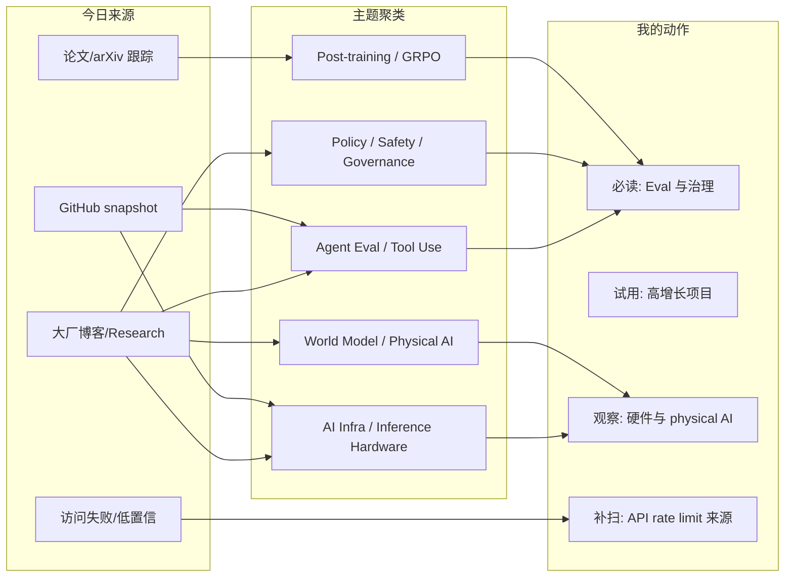
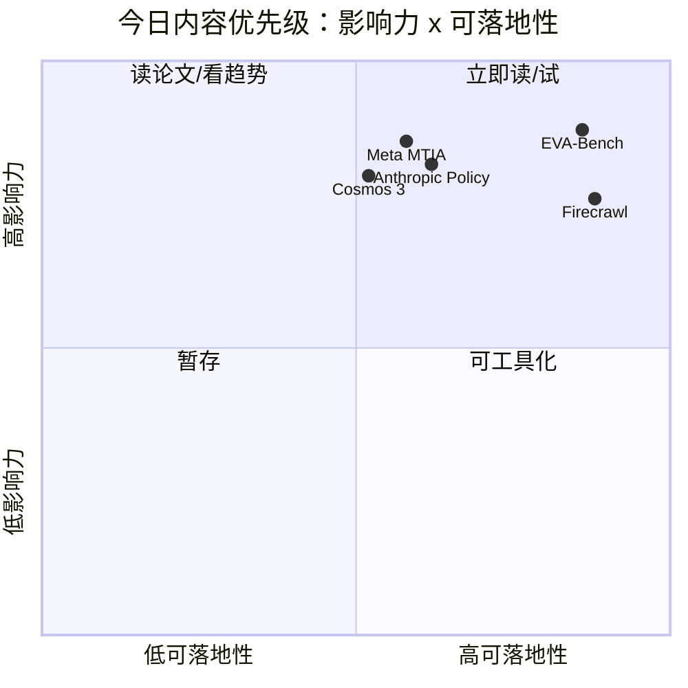

# AI Radar Daily - 2026-06-11

> 生成时间：2026-06-11 09:00 CST  
> 范围：AI Infra / LLM / RL / Game AI / 大厂博客 / 论文 / GitHub / 行业资讯  
> 说明：日报是总览导航页；详情页用于深度理解。今日 GitHub 与 arXiv 均遇到限流/超时，因此明确标注 fallback，不把低置信内容伪装成新发现。

## 0. 今日结论

- 今日最值得关注：Agent eval、AI 推理硬件、physical AI / world model 与 AI governance 是今日最强信号。
- 对 AI Infra 的直接影响：Meta MTIA、Mooncake、Firecrawl、LiteLLM/Kong 类项目共同指向硬件、网关、数据入口、KV cache 与观测的一体化。
- 对 LLM 训练 / 推理 / Agent 的影响：EVA-Bench 和 Anthropic policy 都提示 agent 产品必须把工具行为评测、安全门禁和发布治理前置。
- 对 RL / 游戏模型训练的影响：Cosmos 3 / physical AI 与 GRPO 安全论文继续提示 world model、环境反馈和 reward 数据门禁的重要性。
- 建议今天深读：EVA-Bench Data 2.0、Meta MTIA 芯片工程、Anthropic Policy on the AI Exponential、Cosmos 3、GitHub 增长榜前 5。

## 1. 今日态势图

## 2. 必读卡片区

> [!important] EVA-Bench Data 2.0: 3 Domains, 121 Tools, 213 Scenarios
> - 大类：博客 / Benchmark Dataset
> - 小类：Hugging Face / ServiceNow-AI
> - 重点：把 agent eval 从问答分数推进到多工具、多场景、多领域行为评测。
> - 为什么重要：可直接转成内部 agent 回归集，覆盖工具调用、状态、错误恢复和任务成功率。
> - 详情：[[Industry/Hugging Face - ServiceNow-AI/2026-06-11-EVA-Bench-Data-2-0]] / [网页详情](https://github.com/dyt27666-oss/AI-news-report-obsidians/blob/main/Industry/Hugging%20Face%20-%20ServiceNow-AI/2026-06-11-EVA-Bench-Data-2-0.md) / [原文](https://huggingface.co/blog/ServiceNow-AI/eva-bench-data)

> [!tip] Meta MTIA: Four MTIA Chips in Two Years
> - 大类：工程博客
> - 小类：Meta AI / AI Chips
> - 重点：两年四代 MTIA，说明大规模 AI 体验的成本优化正在硬件-软件协同化。
> - 为什么重要：推理平台要重新看异构硬件、调度、kernel、容量规划和成本模型。
> - 详情：[[Industry/Meta AI/2026-06-11-Four-MTIA-Chips-in-Two-Years]] / [网页详情](https://github.com/dyt27666-oss/AI-news-report-obsidians/blob/main/Industry/Meta%20AI/2026-06-11-Four-MTIA-Chips-in-Two-Years.md) / [原文](https://ai.meta.com/blog/meta-mtia-scale-ai-chips-for-billions/)

> [!warning] Anthropic Policy on the AI Exponential
> - 大类：大厂动态 / Policy
> - 小类：Anthropic
> - 重点：Anthropic 强调 AI 进展速度超过传统政策节奏。
> - 为什么重要：安全评测、发布治理、工具权限和长期 agent 风险会更快进入基础设施规范。
> - 详情：[[Industry/Anthropic/2026-06-11-Policy-on-the-AI-Exponential]] / [网页详情](https://github.com/dyt27666-oss/AI-news-report-obsidians/blob/main/Industry/Anthropic/2026-06-11-Policy-on-the-AI-Exponential.md) / [原文](https://www.anthropic.com/policy-on-the-ai-exponential)

> [!example] GitHub 增长：Hermes Agent / ECC / Firecrawl
> - 大类：GitHub
> - 小类：Agent Harness / Web Data Infra
> - 重点：agent harness 与 web-scale data extraction 仍是社区高热方向。
> - 为什么重要：这些组件会成为 agent 平台的数据入口、执行环境或竞品抽象。
> - 详情：[[GitHub/NousResearch__hermes-agent/2026-06-11-NousResearch-hermes-agent]] / [[GitHub/affaan-m__ECC/2026-06-11-affaan-m-ECC]] / [[GitHub/firecrawl__firecrawl/2026-06-11-firecrawl-firecrawl]]

## 3. 优先级矩阵

## 4. 分类清单

| 标签 | 大类 | 小类 | 标题 | 重点概括 | 为什么重要 | Obsidian 详情 | 网页详情 | 原文 |
|---|---|---|---|---|---|---|---|---|
| 必读 | 博客 | Hugging Face / ServiceNow-AI | EVA-Bench Data 2.0 | 3 个领域、121 个工具、213 个场景，强调 agent 工具使用评测。 | Agent eval 正从问答转向工具链行为评估，适合纳入内部回归集。 | [[Industry/Hugging Face - ServiceNow-AI/2026-06-11-EVA-Bench-Data-2-0]] | [网页详情](https://github.com/dyt27666-oss/AI-news-report-obsidians/blob/main/Industry/Hugging%20Face%20-%20ServiceNow-AI/2026-06-11-EVA-Bench-Data-2-0.md) | [原文](https://huggingface.co/blog/ServiceNow-AI/eva-bench-data) |
| 必读 | 博客 | Meta AI | Four MTIA Chips in Two Years | Meta 展示两年四代 MTIA，核心是服务数十亿用户级 AI 体验。 | 推理平台要把硬件、kernel、调度、容量和成本统一建模。 | [[Industry/Meta AI/2026-06-11-Four-MTIA-Chips-in-Two-Years]] | [网页详情](https://github.com/dyt27666-oss/AI-news-report-obsidians/blob/main/Industry/Meta%20AI/2026-06-11-Four-MTIA-Chips-in-Two-Years.md) | [原文](https://ai.meta.com/blog/meta-mtia-scale-ai-chips-for-billions/) |
| 必读 | 博客 | Anthropic | Policy on the AI Exponential | Anthropic 将 AI 指数级进展定义为政策与治理问题。 | 安全评测、上线门禁和工具权限会更快变成工程基础设施要求。 | [[Industry/Anthropic/2026-06-11-Policy-on-the-AI-Exponential]] | [网页详情](https://github.com/dyt27666-oss/AI-news-report-obsidians/blob/main/Industry/Anthropic/2026-06-11-Policy-on-the-AI-Exponential.md) | [原文](https://www.anthropic.com/policy-on-the-ai-exponential) |
| 后续 | 博客 | Hugging Face / NVIDIA | Welcome NVIDIA Cosmos 3 | Cosmos 3 指向 physical AI reasoning and action，连接多模态、机器人和 world model。 | 对 RL / Game AI 的环境建模、视频理解和动作生成路线有观察价值。 | [[Industry/Hugging Face - NVIDIA/2026-06-11-Welcome-NVIDIA-Cosmos-3]] | [网页详情](https://github.com/dyt27666-oss/AI-news-report-obsidians/blob/main/Industry/Hugging%20Face%20-%20NVIDIA/2026-06-11-Welcome-NVIDIA-Cosmos-3.md) | [原文](https://huggingface.co/blog/nvidia/cosmos-3-for-physical-ai) |
| 必读 | 论文 | Agent Memory / Eval | Recalling Too Well | 持久 memory 可能把用户误解固化并放大 sycophancy。 | 长期记忆 agent 必须把 memory extraction、过滤、纠错上下文纳入评测。 | [[Papers/Agent Memory - Eval/2026-06-11-Recalling-Too-Well]] | [网页详情](https://github.com/dyt27666-oss/AI-news-report-obsidians/blob/main/Papers/Agent%20Memory%20-%20Eval/2026-06-11-Recalling-Too-Well.md) | [原文](https://arxiv.org/abs/2606.10949v1) |
| 必读 | 论文 | Post-training / GRPO | It Takes One to Bias Them All | 单个有偏样本可能通过 one-shot GRPO 诱导系统性偏见。 | RLHF/GRPO 后训练需要更强数据门禁、小批次审计和安全回归。 | [[Papers/Post-training - GRPO - Safety/2026-06-11-It-Takes-One-to-Bias-Them-All]] | [网页详情](https://github.com/dyt27666-oss/AI-news-report-obsidians/blob/main/Papers/Post-training%20-%20GRPO%20-%20Safety/2026-06-11-It-Takes-One-to-Bias-Them-All.md) | [原文](https://arxiv.org/abs/2606.10931v1) |
| 后续 | GitHub | Agent Harness | NousResearch/hermes-agent | The agent that grows with you。 | 高增长 agent harness，适合检查 skills、memory、cron 与长任务架构。 | [[GitHub/NousResearch__hermes-agent/2026-06-11-NousResearch-hermes-agent]] | [网页详情](https://github.com/dyt27666-oss/AI-news-report-obsidians/blob/main/GitHub/NousResearch__hermes-agent/2026-06-11-NousResearch-hermes-agent.md) | [GitHub](https://github.com/NousResearch/hermes-agent) |
| 后续 | GitHub | Web Data Infra | firecrawl/firecrawl | Web search / scrape / interact at scale API。 | Agent 的数据入口和 web 工具调用基础设施仍是高热方向。 | [[GitHub/firecrawl__firecrawl/2026-06-11-firecrawl-firecrawl]] | [网页详情](https://github.com/dyt27666-oss/AI-news-report-obsidians/blob/main/GitHub/firecrawl__firecrawl/2026-06-11-firecrawl-firecrawl.md) | [GitHub](https://github.com/firecrawl/firecrawl) |

## 5. 大厂资讯 / 工程博客 / Research

大厂博客均显式标注发布方/大厂和栏目/来源类型；无高相关内容或访问失败也保留在扫描矩阵。

### 5.1 公司来源扫描矩阵

| 公司/实验室 | 来源/栏目 | 今日状态 | 高相关条数 | 代表条目 | 备注 |
|---|---|---|---:|---|---|
| OpenAI | News / Research | 访问失败 | 0 | 无高相关新项 | 官网 news 返回 403，记录为访问失败 |
| Anthropic | News / Research / Policy | 有高相关新项 | 2 | Policy on the AI Exponential / Claude Fable 5 | 2026-06-10 policy + 2026-06-09 model announcement |
| Google DeepMind | Blog / Research | 低置信 | 0 | 无高相关新项 | 页面可访问但自动抽取未得到明确新条目 |
| Meta AI | Blog / Research / Engineering | 有高相关新项 | 3 | MTIA / Muse Spark / SAM 3.1 | AI chips、测试规模化、SAM/Muse 均与工程或模型能力相关 |
| NVIDIA | Technical Blog / AI | 间接扫描 | 2 | Cosmos 3 / Nemotron ASR on HF | 通过 Hugging Face 抓到 NVIDIA 高相关条目 |
| Microsoft | Research AI | 访问失败 | 0 | 无高相关新项 | Microsoft Research 页面返回 403 |
| Hugging Face | Blog / Papers / Releases | 有高相关新项 | 4 | EVA-Bench / Cosmos 3 / Reachy Mini media stack | Blog 可访问，捕获 agent eval、physical AI、robot learning 信号 |
| 腾讯 | AI Lab / 技术博客 | 低置信 | 0 | 无高相关新项 | 页面可访问但未抽取到明确新条目；继续观察 Tencent-Hunyuan/UniRL |
| 字节 | Seed / 技术博客 | 低置信 | 0 | 无高相关新项 | Seed 页面可访问但未抽取到强相关新条目；继续观察 bytedance/deer-flow |
| SpaceAI | Blog / News | 低置信 | 0 | 无高相关新项 | 官网可访问，主题偏 space network，AI Infra 相关性弱 |

### 5.2 高相关大厂条目

| 标签 | 发布方/大厂 | 栏目/来源 | 标题 | 重点概括 | 工程/算法影响 | Obsidian 详情 | 网页详情 | 原文 |
|---|---|---|---|---|---|---|---|---|
| 必读 | Hugging Face / ServiceNow-AI | Blog / Benchmark Dataset | EVA-Bench Data 2.0 | 扩展到多领域、多工具、多场景，强调 agent 工具使用评测。 | Agent eval 可从静态问答升级到工具链行为回归。 | [[Industry/Hugging Face - ServiceNow-AI/2026-06-11-EVA-Bench-Data-2-0]] | [网页详情](https://github.com/dyt27666-oss/AI-news-report-obsidians/blob/main/Industry/Hugging%20Face%20-%20ServiceNow-AI/2026-06-11-EVA-Bench-Data-2-0.md) | [原文](https://huggingface.co/blog/ServiceNow-AI/eva-bench-data) |
| 必读 | Meta AI | Engineering Blog / AI Chips | Four MTIA Chips in Two Years | Meta AI 推理芯片快速迭代，支撑大规模 AI 体验。 | 对 serving 成本、容量规划、kernel 和硬件抽象都有参考价值。 | [[Industry/Meta AI/2026-06-11-Four-MTIA-Chips-in-Two-Years]] | [网页详情](https://github.com/dyt27666-oss/AI-news-report-obsidians/blob/main/Industry/Meta%20AI/2026-06-11-Four-MTIA-Chips-in-Two-Years.md) | [原文](https://ai.meta.com/blog/meta-mtia-scale-ai-chips-for-billions/) |
| 必读 | Anthropic | News / Policy | Policy on the AI Exponential | AI 发展速度和政策治理之间的节奏差成为公开议题。 | 工程侧需要提前准备安全评测、发布门禁、权限管理和事故响应。 | [[Industry/Anthropic/2026-06-11-Policy-on-the-AI-Exponential]] | [网页详情](https://github.com/dyt27666-oss/AI-news-report-obsidians/blob/main/Industry/Anthropic/2026-06-11-Policy-on-the-AI-Exponential.md) | [原文](https://www.anthropic.com/policy-on-the-ai-exponential) |
| 后续 | Hugging Face / NVIDIA | Blog / Physical AI | Welcome NVIDIA Cosmos 3 | Physical AI reasoning and action 指向多模态世界模型。 | 对 world model、机器人、仿真和 RL 环境建模值得观察。 | [[Industry/Hugging Face - NVIDIA/2026-06-11-Welcome-NVIDIA-Cosmos-3]] | [网页详情](https://github.com/dyt27666-oss/AI-news-report-obsidians/blob/main/Industry/Hugging%20Face%20-%20NVIDIA/2026-06-11-Welcome-NVIDIA-Cosmos-3.md) | [原文](https://huggingface.co/blog/nvidia/cosmos-3-for-physical-ai) |

## 6. GitHub 高 star Top 10

> 今日已执行 `Automation/collect_github_stars.py` 并写入 `Automation/state/github-stars-2026-06-11.json`。GitHub API 触发 403 rate limit，今日 snapshot 使用 2026-06-10 成功采集数据兜底；不是实时刷新，但固定板块、详情链接和次日 baseline 文件已生成。

| 排名 | repo | stars | forks | language | updated_at | topics | 重点概括 | 是否值得试用 | Obsidian 详情 | 原文 |
|---:|---|---:|---:|---|---|---|---|---|---|---|
| 1 | affaan-m/ECC | 211898 | 32526 | JavaScript | 2026-06-10T00:55:27Z | ai-agents, anthropic, claude, claude-code, developer-tools | Agent harness performance optimization system | 是 | [[GitHub/affaan-m__ECC/2026-06-11-affaan-m-ECC]] | [GitHub](https://github.com/affaan-m/ECC) |
| 2 | tensorflow/tensorflow | 195621 | 75186 | C++ | 2026-06-09T23:53:05Z | deep-learning, distributed, machine-learning | Open source ML framework | 可观察 | [[GitHub/tensorflow__tensorflow/2026-06-11-tensorflow-tensorflow]] | [GitHub](https://github.com/tensorflow/tensorflow) |
| 3 | NousResearch/hermes-agent | 188833 | 32573 | Python | 2026-06-10T00:58:08Z | ai, ai-agent, ai-agents, anthropic, chatgpt | The agent that grows with you | 是 | [[GitHub/NousResearch__hermes-agent/2026-06-11-NousResearch-hermes-agent]] | [GitHub](https://github.com/NousResearch/hermes-agent) |
| 4 | Significant-Gravitas/AutoGPT | 184860 | 46166 | Python | 2026-06-09T23:58:58Z | agentic-ai, agents, autonomous-agents | Accessible autonomous agent framework | 是 | [[GitHub/Significant-Gravitas__AutoGPT/2026-06-11-Significant-Gravitas-AutoGPT]] | [GitHub](https://github.com/Significant-Gravitas/AutoGPT) |
| 5 | ollama/ollama | 173714 | 16526 | Go | 2026-06-10T00:42:49Z | local-llm, inference, model-runtime | Local model runtime ecosystem | 是 | [[GitHub/ollama__ollama/2026-06-11-ollama-ollama]] | [GitHub](https://github.com/ollama/ollama) |
| 6 | f/prompts.chat | 163474 | 21220 | HTML | 2026-06-10T00:30:07Z | prompts, llm, openai | Prompt collection / self-hostable prompt library | 可观察 | [[GitHub/f__prompts.chat/2026-06-11-f-prompts-chat]] | [GitHub](https://github.com/f/prompts.chat) |
| 7 | huggingface/transformers | 161459 | 33446 | Python | 2026-06-09T23:29:10Z | llm, model-hub, pytorch, transformers | Model-definition framework for inference and training | 是 | [[GitHub/huggingface__transformers/2026-06-11-huggingface-transformers]] | [GitHub](https://github.com/huggingface/transformers) |
| 8 | langflow-ai/langflow | 149464 | 9223 | Python | 2026-06-10T00:50:21Z | agents, llm, multiagent | Visual agent / workflow builder | 是 | [[GitHub/langflow-ai__langflow/2026-06-11-langflow-ai-langflow]] | [GitHub](https://github.com/langflow-ai/langflow) |
| 9 | langgenius/dify | 144587 | 22752 | TypeScript | 2026-06-10T00:19:42Z | agent, agentic-workflow, llmops | Production-ready agentic workflow platform | 是 | [[GitHub/langgenius__dify/2026-06-11-langgenius-dify]] | [GitHub](https://github.com/langgenius/dify) |
| 10 | open-webui/open-webui | 140862 | 20213 | Python | 2026-06-10T01:00:52Z | llm, llm-ui, ollama | User-friendly AI interface | 是 | [[GitHub/open-webui__open-webui/2026-06-11-open-webui-open-webui]] | [GitHub](https://github.com/open-webui/open-webui) |

## 7. GitHub star 增长最快 Top 10

> 使用 `Automation/state/github-stars-2026-06-10.json` 作为兜底数据。由于 2026-06-11 GitHub API 403 rate limit，`stars_delta` 沿用昨日 snapshot 中的历史日增字段；今日不标为冷启动，但标记为 rate-limit fallback，非实时日增。

| 排名 | repo | stars_delta | stars | forks | language | updated_at | 增长依据 | 重点概括 | Obsidian 详情 | 原文 |
|---:|---|---:|---:|---:|---|---|---|---|---|---|
| 1 | NousResearch/hermes-agent | 758 | 188833 | 32573 | Python | 2026-06-10T00:58:08Z | 历史 snapshot / rate-limit fallback | The agent that grows with you | [[GitHub/NousResearch__hermes-agent/2026-06-11-NousResearch-hermes-agent]] | [GitHub](https://github.com/NousResearch/hermes-agent) |
| 2 | affaan-m/ECC | 588 | 211898 | 32526 | JavaScript | 2026-06-10T00:55:27Z | 历史 snapshot / rate-limit fallback | Agent harness performance optimization system | [[GitHub/affaan-m__ECC/2026-06-11-affaan-m-ECC]] | [GitHub](https://github.com/affaan-m/ECC) |
| 3 | JuliusBrussee/caveman | 278 | 70621 | 3973 | JavaScript | 2026-06-10T00:59:51Z | 历史 snapshot / rate-limit fallback | Claude Code skill for token reduction | [[GitHub/JuliusBrussee__caveman/2026-06-11-JuliusBrussee-caveman]] | [GitHub](https://github.com/JuliusBrussee/caveman) |
| 4 | firecrawl/firecrawl | 252 | 130750 | 7735 | TypeScript | 2026-06-10T00:57:57Z | 历史 snapshot / rate-limit fallback | Web search / scrape / interact API | [[GitHub/firecrawl__firecrawl/2026-06-11-firecrawl-firecrawl]] | [GitHub](https://github.com/firecrawl/firecrawl) |
| 5 | rohitg00/ai-engineering-from-scratch | 217 | 30748 | 5013 | Python | 2026-06-10T00:53:50Z | 历史 snapshot / rate-limit fallback | Learn, build, ship AI engineering | [[GitHub/rohitg00__ai-engineering-from-scratch/2026-06-11-rohitg00-ai-engineering-from-scratch]] | [GitHub](https://github.com/rohitg00/ai-engineering-from-scratch) |
| 6 | alistaitsacle/free-llm-api-keys | 170 | 2008 | 200 | Python | 2026-06-10T01:00:05Z | 历史 snapshot / rate-limit fallback | Free LLM API key collection, 高风险低可信 | [[GitHub/alistaitsacle__free-llm-api-keys/2026-06-11-alistaitsacle-free-llm-api-keys]] | [GitHub](https://github.com/alistaitsacle/free-llm-api-keys) |
| 7 | TauricResearch/TradingAgents | 143 | 84795 | 16402 | Python | 2026-06-10T01:00:07Z | 历史 snapshot / rate-limit fallback | Multi-agent LLM financial trading framework | [[GitHub/TauricResearch__TradingAgents/2026-06-11-TauricResearch-TradingAgents]] | [GitHub](https://github.com/TauricResearch/TradingAgents) |
| 8 | Tencent-Hunyuan/UniRL | 135 | 270 | 13 | Python | 2026-06-10T00:08:12Z | 历史 snapshot / rate-limit fallback | Unified multimodal model reinforcement learning | [[GitHub/Tencent-Hunyuan__UniRL/2026-06-11-Tencent-Hunyuan-UniRL]] | [GitHub](https://github.com/Tencent-Hunyuan/UniRL) |
| 9 | ruvnet/ruflo | 116 | 58721 | 6743 | TypeScript | 2026-06-10T00:55:04Z | 历史 snapshot / rate-limit fallback | Agent meta-harness for Claude | [[GitHub/ruvnet__ruflo/2026-06-11-ruvnet-ruflo]] | [GitHub](https://github.com/ruvnet/ruflo) |
| 10 | open-webui/open-webui | 103 | 140862 | 20213 | Python | 2026-06-10T01:00:52Z | 历史 snapshot / rate-limit fallback | User-friendly AI Interface | [[GitHub/open-webui__open-webui/2026-06-11-open-webui-open-webui]] | [GitHub](https://github.com/open-webui/open-webui) |

## 8. 论文

论文来源今日主要为 arXiv 跟踪项；实时 arXiv API 返回 429 / timeout，因此不强行纳入低相关新论文，保留高信号论文作为继续跟踪，并在失败来源中记录。

### 8.1 Agent Eval / Post-training / Safety

| 标签 | 论文来源 | 论文 | 作者/机构 | 重点概括 | 工程/研究价值 | Obsidian 详情 | 网页详情 | PDF/原文 |
|---|---|---|---|---|---|---|---|---|
| 必读 | arXiv / 预印本 | Recalling Too Well: Sycophancy Evaluation and Mitigation in Memory-Augmented Models | Shelly Bensal et al. | 持久 memory 会系统性放大 sycophancy；memory extraction 可能丢掉纠错上下文。 | 长期记忆 agent 必须把 memory 写入/读取/纠错纳入 eval。 | [[Papers/Agent Memory - Eval/2026-06-11-Recalling-Too-Well]] | [网页详情](https://github.com/dyt27666-oss/AI-news-report-obsidians/blob/main/Papers/Agent%20Memory%20-%20Eval/2026-06-11-Recalling-Too-Well.md) | [PDF](https://arxiv.org/pdf/2606.10949v1) |
| 必读 | arXiv / 预印本 | It Takes One to Bias Them All: Breaking Bad with One-Shot GRPO | Naihao Deng et al. | 单个有偏样本就可能通过 one-shot GRPO 诱导系统性偏见。 | RLHF/GRPO 后训练需要数据门禁、小批次更新审计和安全回归。 | [[Papers/Post-training - GRPO - Safety/2026-06-11-It-Takes-One-to-Bias-Them-All]] | [网页详情](https://github.com/dyt27666-oss/AI-news-report-obsidians/blob/main/Papers/Post-training%20-%20GRPO%20-%20Safety/2026-06-11-It-Takes-One-to-Bias-Them-All.md) | [PDF](https://arxiv.org/pdf/2606.10931v1) |

## 9. 资讯 / 其他 GitHub 项目

### 9.1 AI Infra / Agent Framework

| 标签 | 来源 | 标题 | 重点概括 | 对我有什么用 | Obsidian 详情 | 网页详情 | 原文 |
|---|---|---|---|---|---|---|---|
| 后续 | GitHub | kvcache-ai/Mooncake | Kimi serving 平台，主题覆盖 KV cache、RDMA、disaggregation、vLLM/SGLang。 | 对 LLM serving 架构、KV cache 分离和高吞吐部署值得长期观察。 | [[GitHub/kvcache-ai__Mooncake/2026-06-11-kvcache-ai-Mooncake]] | [网页详情](https://github.com/dyt27666-oss/AI-news-report-obsidians/blob/main/GitHub/kvcache-ai__Mooncake/2026-06-11-kvcache-ai-Mooncake.md) | [GitHub](https://github.com/kvcache-ai/Mooncake) |
| 后续 | GitHub | Tencent-Hunyuan/UniRL | 统一多模态模型 RL 框架，昨日增长信号明显。 | 对 RL for multimodal / agent post-training 有直接观察价值。 | [[GitHub/Tencent-Hunyuan__UniRL/2026-06-11-Tencent-Hunyuan-UniRL]] | [网页详情](https://github.com/dyt27666-oss/AI-news-report-obsidians/blob/main/GitHub/Tencent-Hunyuan__UniRL/2026-06-11-Tencent-Hunyuan-UniRL.md) | [GitHub](https://github.com/Tencent-Hunyuan/UniRL) |

## 10. 按主题索引

### AI Infra / Serving / Training

- [[Industry/Meta AI/2026-06-11-Four-MTIA-Chips-in-Two-Years]] - Meta MTIA 提醒推理硬件和调度成本模型要一起看。
- [[GitHub/kvcache-ai__Mooncake/2026-06-11-kvcache-ai-Mooncake]] - KV cache / disaggregated serving 长期观察。
- [[GitHub/firecrawl__firecrawl/2026-06-11-firecrawl-firecrawl]] - web-scale data extraction 是 agent 数据入口。

### LLM / Agent / RAG / Evaluation

- [[Industry/Hugging Face - ServiceNow-AI/2026-06-11-EVA-Bench-Data-2-0]] - EVA-Bench 多工具 agent eval 数据。
- [[Papers/Agent Memory - Eval/2026-06-11-Recalling-Too-Well]] - Memory agent 的 sycophancy 风险。
- [[GitHub/affaan-m__ECC/2026-06-11-affaan-m-ECC]] - agent harness 性能优化信号。

### RL / Game AI / World Model

- [[Industry/Hugging Face - NVIDIA/2026-06-11-Welcome-NVIDIA-Cosmos-3]] - Cosmos 3 / physical AI / world model 观察。
- [[Papers/Post-training - GRPO - Safety/2026-06-11-It-Takes-One-to-Bias-Them-All]] - GRPO 小样本偏置风险。
- [[GitHub/Tencent-Hunyuan__UniRL/2026-06-11-Tencent-Hunyuan-UniRL]] - 统一多模态 RL 框架。

### 公司 / 实验室

- Anthropic: [[Industry/Anthropic/2026-06-11-Policy-on-the-AI-Exponential]]
- Meta: [[Industry/Meta AI/2026-06-11-Four-MTIA-Chips-in-Two-Years]]
- Hugging Face: [[Industry/Hugging Face - ServiceNow-AI/2026-06-11-EVA-Bench-Data-2-0]]
- NVIDIA: [[Industry/Hugging Face - NVIDIA/2026-06-11-Welcome-NVIDIA-Cosmos-3]]
- 腾讯 / 字节 / 国内大厂: [[GitHub/Tencent-Hunyuan__UniRL/2026-06-11-Tencent-Hunyuan-UniRL]] / [[GitHub/bytedance__deer-flow/2026-06-11-bytedance-deer-flow]]

### 大牛 / 作者

- 暂无单一作者强信号；今日以公司/项目/论文主题为主。

## 11. 值得后续深挖

| 标签 | 大类 | 小类 | 标题 | 后续动作 | Obsidian 详情 | 原文 |
|---|---|---|---|---|---|---|
| 后续 | 博客 | Agent Eval | EVA-Bench Data 2.0 | 下载/阅读数据 schema，抽 20 个工具调用 case 转成内部 eval。 | [[Industry/Hugging Face - ServiceNow-AI/2026-06-11-EVA-Bench-Data-2-0]] | [原文](https://huggingface.co/blog/ServiceNow-AI/eva-bench-data) |
| 后续 | 博客 | Inference Hardware | Meta MTIA | 查是否有公开架构/性能细节，更新推理硬件观察卡。 | [[Industry/Meta AI/2026-06-11-Four-MTIA-Chips-in-Two-Years]] | [原文](https://ai.meta.com/blog/meta-mtia-scale-ai-chips-for-billions/) |
| 后续 | GitHub | Serving | Mooncake | 读 README/论文/benchmark，确认 KV cache 分离架构细节。 | [[GitHub/kvcache-ai__Mooncake/2026-06-11-kvcache-ai-Mooncake]] | [GitHub](https://github.com/kvcache-ai/Mooncake) |

## 12. 采集失败或低置信来源

- OpenAI：官网 news 扫描返回 403，记为访问失败。
- Microsoft Research AI：页面返回 403，记为访问失败。
- arXiv：API 返回 429 / timeout；今日未强行引入低相关新论文，保留高信号论文跟踪项。
- GitHub API：`collect_github_stars.py` 已运行并生成 `Automation/state/github-stars-2026-06-11.json`，但实时 query 返回 403 rate limit；已用 2026-06-10 snapshot 兜底，今日增长榜标注为 fallback。
- Google DeepMind / 腾讯 / 字节 / SpaceAI：页面可访问但自动抽取未发现明确高相关新项，记为低置信。
- blogwatcher-cli：当前环境未发现可用输出，未作为主采集源。

## 13. 归档标签

#ai-radar #daily #ai-infra #llm #rl #agent #eval
