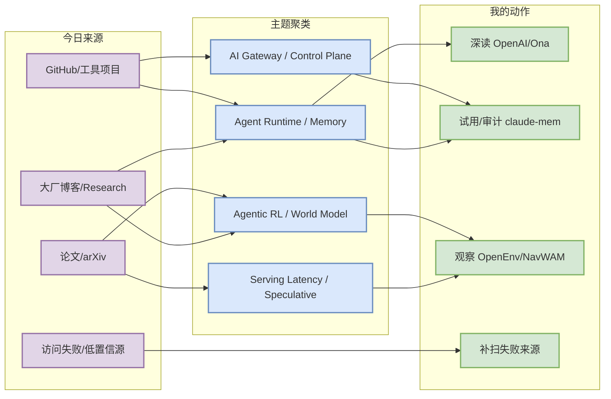
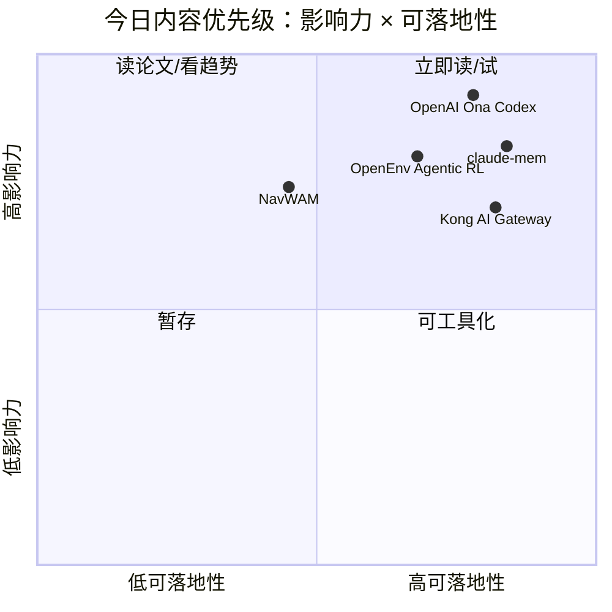

# AI Radar Daily - 2026-06-12

> 生成时间：2026-06-12 09:01 CST
> 范围：AI Infra / LLM / RL / Game AI / 大厂博客 / 论文 / GitHub / 行业资讯
> 说明：日报是总览导航页，不是全部正文。Obsidian 中点 `[[详情页]]`，Telegram/GitHub 中点“网页详情”。

## 0. 今日结论

- 今日最值得关注：OpenAI 收购 Ona 表明 coding agent 正从会话式工具走向持久云端 runtime。
- 对 AI Infra 的直接影响：agent/control plane、状态恢复、权限审计和长任务队列会成为基础设施重点。
- 对 LLM 训练 / 推理 / Agent 的影响：GitHub 增长榜集中在 agent memory、coding agent、轻量 LLM 训练和 AI gateway。
- 对 RL / 游戏模型训练的影响：OpenEnv 与 NavWAM 都指向“环境/世界模型/动作闭环”成为 agentic RL 的关键瓶颈。
- 建议今天深读：[[Industry/OpenAI/OpenAI_to_acquire_Ona_Codex_cloud_agents_2026_06_12]]、[[Industry/HuggingFace/HuggingFace_OpenEnv_agentic_RL_2026_06_12]]、[[Papers/WorldModel/NavWAM_navigation_world_action_model_2026_06_12]]、[[GitHub/thedotmack__claude_mem_2026_06_12]]。

## 1. 今日态势图

## 2. 必读卡片区

> [!important] OpenAI to acquire Ona: Codex 走向持久云端 Agent 环境
> - 大类：博客 / 大厂资讯
> - 小类：Agent Infra / Coding Agent
> - 重点：OpenAI 计划收购 Ona，把 Codex 扩展到安全、持久的云端开发环境，支持更长时间运行的企业级 AI agent 工作流。
> - 为什么重要：这不是单纯 IDE 功能，而是 agent runtime 从本地会话转向云端持久环境的信号，直接影响代码 agent 的沙箱、权限、状态恢复、审计和企业部署。
> - 详情：[[Industry/OpenAI/OpenAI_to_acquire_Ona_Codex_cloud_agents_2026_06_12]] / [网页详情](https://github.com/dyt27666-oss/AI-news-report-obsidians/blob/main/Industry/OpenAI/OpenAI_to_acquire_Ona_Codex_cloud_agents_2026_06_12.md) / [原文](https://openai.com/index/openai-to-acquire-ona)

> [!tip] Hugging Face OpenEnv for Agentic RL 获开源社区支持
> - 大类：博客 / 开源生态
> - 小类：Agentic RL / Environment Infra
> - 重点：Hugging Face 强调 OpenEnv 作为 agentic RL 环境生态，连接任务环境、评测、训练和社区贡献。
> - 为什么重要：Agentic RL 的瓶颈正在从算法实现转向环境标准化、并行 rollout、任务可复现和评测协议；这正好对应 RL 游戏模型训练与 agent post-training 的基础设施需求。
> - 详情：[[Industry/HuggingFace/HuggingFace_OpenEnv_agentic_RL_2026_06_12]] / [网页详情](https://github.com/dyt27666-oss/AI-news-report-obsidians/blob/main/Industry/HuggingFace/HuggingFace_OpenEnv_agentic_RL_2026_06_12.md) / [原文](https://huggingface.co/blog/openenv-agentic-rl)

> [!note] GitHub 增长第一：thedotmack/claude-mem
> - 大类：GitHub
> - 小类：Agent Memory
> - 重点：跨 Claude Code、Codex、Gemini 等 agent 的持久上下文注入，今日 snapshot 显示 +354 stars。
> - 为什么重要：长期 agent 的瓶颈是记忆压缩、检索注入和跨 session 状态治理。
> - 详情：[[GitHub/thedotmack__claude_mem_2026_06_12]] / [网页详情](https://github.com/dyt27666-oss/AI-news-report-obsidians/blob/main/GitHub/thedotmack__claude_mem_2026_06_12.md) / [原文](https://github.com/thedotmack/claude-mem)

> [!abstract] NavWAM: A Navigation World Action Model for Goal-Conditioned Visual Navigation
> - 大类：论文
> - 小类：World Model / Robot RL
> - 重点：把导航 world-model 预测、goal-progress value 与 action chunk 放到共享 latent 序列中，让视觉 foresight 直接转成闭环动作。
> - 为什么重要：对游戏/RL agent 很关键：world model 不只是预测器，而要和策略、价值、动作生成绑定，减少外部规划器和 CEM 搜索的在线开销。
> - 详情：[[Papers/WorldModel/NavWAM_navigation_world_action_model_2026_06_12]] / [网页详情](https://github.com/dyt27666-oss/AI-news-report-obsidians/blob/main/Papers/WorldModel/NavWAM_navigation_world_action_model_2026_06_12.md) / [原文](https://arxiv.org/abs/2606.13494v1)

## 3. 优先级矩阵

## 4. 分类清单

| 标签 | 大类 | 小类 | 标题 | 重点概括 | 为什么重要 | Obsidian 详情 | 网页详情 | 原文 |
|---|---|---|---|---|---|---|---|---|
| 必读 | 博客 | Agent Infra / Coding Agent | OpenAI to acquire Ona: Codex 走向持久云端 Agent 环境 | OpenAI 计划收购 Ona，把 Codex 扩展到安全、持久的云端开发环境，支持更长时间运行的企业级 AI agent 工作流。 | 这不是单纯 IDE 功能，而是 agent runtime 从本地会话转向云端持久环境的信号，直接影响代码 agent 的沙箱、权限、状态恢复、审计和企业部署。 | [[Industry/OpenAI/OpenAI_to_acquire_Ona_Codex_cloud_agents_2026_06_12]] | [网页详情](https://github.com/dyt27666-oss/AI-news-report-obsidians/blob/main/Industry/OpenAI/OpenAI_to_acquire_Ona_Codex_cloud_agents_2026_06_12.md) | [原文](https://openai.com/index/openai-to-acquire-ona) |
| 必读 | 博客 | Agentic RL / Environment Infra | Hugging Face OpenEnv for Agentic RL 获开源社区支持 | Hugging Face 强调 OpenEnv 作为 agentic RL 环境生态，连接任务环境、评测、训练和社区贡献。 | Agentic RL 的瓶颈正在从算法实现转向环境标准化、并行 rollout、任务可复现和评测协议；这正好对应 RL 游戏模型训练与 agent post-training 的基础设施需求。 | [[Industry/HuggingFace/HuggingFace_OpenEnv_agentic_RL_2026_06_12]] | [网页详情](https://github.com/dyt27666-oss/AI-news-report-obsidians/blob/main/Industry/HuggingFace/HuggingFace_OpenEnv_agentic_RL_2026_06_12.md) | [原文](https://huggingface.co/blog/openenv-agentic-rl) |
| 必读 | 论文 | World Model / Robot RL | NavWAM: A Navigation World Action Model for Goal-Conditioned Visual Navigation | 把导航 world-model 预测、goal-progress value 与 action chunk 放到共享 latent 序列中，让视觉 foresight 直接转成闭环动作。 | 对游戏/RL agent 很关键：world model 不只是预测器，而要和策略、价值、动作生成绑定，减少外部规划器和 CEM 搜索的在线开销。 | [[Papers/WorldModel/NavWAM_navigation_world_action_model_2026_06_12]] | [网页详情](https://github.com/dyt27666-oss/AI-news-report-obsidians/blob/main/Papers/WorldModel/NavWAM_navigation_world_action_model_2026_06_12.md) | [原文](https://arxiv.org/abs/2606.13494v1) |
| 可 skim | GitHub | Agent/Infra | thedotmack/claude-mem | Persistent Context Across Sessions for Every Agent –  Captures everything your a | star 增长或高 star 显示社区关注，适合进入工具/架构观察池。 | [[GitHub/thedotmack__claude_mem_2026_06_12]] | [网页详情](https://github.com/dyt27666-oss/AI-news-report-obsidians/blob/main/GitHub/thedotmack__claude_mem_2026_06_12.md) | [原文](https://github.com/thedotmack/claude-mem) |
| 可 skim | GitHub | Agent/Infra | OpenHands/OpenHands | 🙌 OpenHands: AI-Driven Development | star 增长或高 star 显示社区关注，适合进入工具/架构观察池。 | [[GitHub/OpenHands__OpenHands_2026_06_12]] | [网页详情](https://github.com/dyt27666-oss/AI-news-report-obsidians/blob/main/GitHub/OpenHands__OpenHands_2026_06_12.md) | [原文](https://github.com/OpenHands/OpenHands) |
| 可 skim | GitHub | Agent/Infra | Kong/kong | 🦍 The API and AI Gateway | star 增长或高 star 显示社区关注，适合进入工具/架构观察池。 | [[GitHub/Kong__kong_2026_06_12]] | [网页详情](https://github.com/dyt27666-oss/AI-news-report-obsidians/blob/main/GitHub/Kong__kong_2026_06_12.md) | [原文](https://github.com/Kong/kong) |

## 5. 大厂资讯 / 工程博客 / Research

### 5.1 公司来源扫描矩阵

| 公司/实验室 | 来源/栏目 | 今日状态 | 高相关条数 | 代表条目 | 备注 |
|---|---|---|---:|---|---|
| OpenAI | News / Research | 有高相关新项 | 1 | OpenAI to acquire Ona | Codex 持久云端 agent 环境 |
| Anthropic | News / Research / Engineering | 访问失败 | 0 | 无 | RSS 404；需后续用官网/备用源补扫 |
| Google DeepMind | Blog / Research | 有高相关新项 | 1 | Investing in multi-agent AI safety research | multi-agent safety/eval 信号 |
| Meta AI | Blog / Research | 访问失败 | 0 | 无 | RSS 404；矩阵保留，后续补备用源 |
| NVIDIA | Technical Blog / AI | 低置信 / 无高相关新项 | 0 | 无 | feed 返回空；未发现新高相关项 |
| Microsoft | Research AI | 有高相关候选 | 2 | MagenticLite / Data Formulator | agent 与 AI analytics 候选，部分非当天 |
| Hugging Face | Blog / Papers / Releases | 有高相关新项 | 2 | OpenEnv for Agentic RL | agentic RL 环境生态强相关 |
| 腾讯 | AI Lab / 技术博客 | 访问失败 | 0 | 无 | feed XML 解析失败；需备用源 |
| 字节 | Seed / 技术博客 | 访问失败 | 0 | 无 | feed 非 XML；需备用源 |
| SpaceAI | Blog / News | 访问失败 | 0 | 无 | feed 404；需确认官方源 |

### 5.2 高相关大厂条目

| 标签 | 发布方/大厂 | 栏目/来源 | 标题 | 重点概括 | 工程/算法影响 | Obsidian 详情 | 网页详情 | 原文 |
|---|---|---|---|---|---|---|---|---|
| 必读 | OpenAI | News / Product Announcement | OpenAI to acquire Ona: Codex 走向持久云端 Agent 环境 | OpenAI 计划收购 Ona，把 Codex 扩展到安全、持久的云端开发环境，支持更长时间运行的企业级 AI agent 工作流。 | 这不是单纯 IDE 功能，而是 agent runtime 从本地会话转向云端持久环境的信号，直接影响代码 agent 的沙箱、权限、状态恢复、审计和企业部署。 | [[Industry/OpenAI/OpenAI_to_acquire_Ona_Codex_cloud_agents_2026_06_12]] | [网页详情](https://github.com/dyt27666-oss/AI-news-report-obsidians/blob/main/Industry/OpenAI/OpenAI_to_acquire_Ona_Codex_cloud_agents_2026_06_12.md) | [原文](https://openai.com/index/openai-to-acquire-ona) |
| 必读 | Google DeepMind | Research Blog / Funding Call | Google DeepMind 投入 multi-agent AI safety research | DeepMind 与合作方发起 multi-agent safety 研究资助，重点关注多智能体互动、协调、失控和评估问题。 | 多 agent 系统的风险不是单模型能力问题，而是策略互动、工具调用、资源竞争和长期任务可靠性问题；这会反向推动 agent eval、sandbox 与监控基础设施。 | [[Industry/GoogleDeepMind/DeepMind_multi_agent_safety_research_2026_06_12]] | [网页详情](https://github.com/dyt27666-oss/AI-news-report-obsidians/blob/main/Industry/GoogleDeepMind/DeepMind_multi_agent_safety_research_2026_06_12.md) | [原文](https://deepmind.google/blog/investing-in-multi-agent-ai-safety-research/) |
| 必读 | Hugging Face | Blog / Open-source Ecosystem | Hugging Face OpenEnv for Agentic RL 获开源社区支持 | Hugging Face 强调 OpenEnv 作为 agentic RL 环境生态，连接任务环境、评测、训练和社区贡献。 | Agentic RL 的瓶颈正在从算法实现转向环境标准化、并行 rollout、任务可复现和评测协议；这正好对应 RL 游戏模型训练与 agent post-training 的基础设施需求。 | [[Industry/HuggingFace/HuggingFace_OpenEnv_agentic_RL_2026_06_12]] | [网页详情](https://github.com/dyt27666-oss/AI-news-report-obsidians/blob/main/Industry/HuggingFace/HuggingFace_OpenEnv_agentic_RL_2026_06_12.md) | [原文](https://huggingface.co/blog/openenv-agentic-rl) |
| 必读 | Microsoft | Research Blog | Microsoft MagenticLite: 小模型优化的 agentic experience | Microsoft 介绍面向小模型的 agentic 系统，跨浏览器和本地文件系统工作，通过专用模型与 orchestration 提升 everyday tasks 效率。 | 小模型 agent 如果成立，会改变 serving 成本结构：从单一大模型推理转向路由、专用模型组合、工具权限和本地/浏览器控制面。 | [[Industry/Microsoft/Microsoft_MagenticLite_small_model_agents_2026_06_12]] | [网页详情](https://github.com/dyt27666-oss/AI-news-report-obsidians/blob/main/Industry/Microsoft/Microsoft_MagenticLite_small_model_agents_2026_06_12.md) | [原文](https://www.microsoft.com/en-us/research/blog/magenticlite-magenticbrain-fara1-5-an-agentic-experience-optimized-for-small-models/) |

## 6. GitHub 高 star Top 10

| 排名 | repo | stars | forks | language | updated_at | topics | 重点概括 | 是否值得试用 | Obsidian 详情 | 原文 |
|---:|---|---:|---:|---|---|---|---|---|---|---|
| 1 | Significant-Gravitas/AutoGPT | 184890 | 46153 | Python | 2026-06-12T00:45:49Z | agentic-ai, agents, ai, artificial-intelligence, autonomous-agents, claude | AutoGPT is the vision of accessible AI for everyone, to use and to build on. Our mission i | 观察/skim | [[GitHub/Significant_Gravitas__AutoGPT_2026_06_12]] | [GitHub](https://github.com/Significant-Gravitas/AutoGPT) |
| 2 | f/prompts.chat | 163590 | 21224 | HTML | 2026-06-12T00:57:33Z | ai, artificial-intelligence, awesome-list, chatgpt, chatgpt-prompts, claude | f.k.a. Awesome ChatGPT Prompts. Share, discover, and collect prompts from the community. F | 观察/skim | [[GitHub/f__prompts.chat_2026_06_12]] | [GitHub](https://github.com/f/prompts.chat) |
| 3 | rasbt/LLMs-from-scratch | 96996 | 14839 | Jupyter Notebook | 2026-06-11T23:33:03Z | ai, artificial-intelligence, attention-mechanism, deep-learning, finetuning, from-scratch | Implement a ChatGPT-like LLM in PyTorch from scratch, step by step | 观察/skim | [[GitHub/rasbt__LLMs_from_scratch_2026_06_12]] | [GitHub](https://github.com/rasbt/LLMs-from-scratch) |
| 4 | hacksider/Deep-Live-Cam | 93736 | 13680 | Python | 2026-06-12T00:43:57Z | ai, ai-deep-fake, ai-face, ai-webcam, artificial-intelligence, deep-fake | real time face swap and one-click video deepfake with only a single image | 观察/skim | [[GitHub/hacksider__Deep_Live_Cam_2026_06_12]] | [GitHub](https://github.com/hacksider/Deep-Live-Cam) |
| 5 | thedotmack/claude-mem | 81839 | 7058 | JavaScript | 2026-06-12T00:56:45Z | ai, ai-agents, ai-memory, anthropic, artificial-intelligence, chromadb | Persistent Context Across Sessions for Every Agent –  Captures everything your agent does  | 观察/skim | [[GitHub/thedotmack__claude_mem_2026_06_12]] | [GitHub](https://github.com/thedotmack/claude-mem) |
| 6 | OpenHands/OpenHands | 76492 | 9721 | Python | 2026-06-12T00:47:20Z | agent, artificial-intelligence, chatgpt, claude-ai, cli, developer-tools | 🙌 OpenHands: AI-Driven Development | 快速试用 | [[GitHub/OpenHands__OpenHands_2026_06_12]] | [GitHub](https://github.com/OpenHands/OpenHands) |
| 7 | FlowiseAI/Flowise | 53490 | 24504 | TypeScript | 2026-06-12T00:27:51Z | agentic-ai, agentic-workflow, agents, artificial-intelligence, chatbot, chatgpt | Build AI Agents, Visually | 快速试用 | [[GitHub/FlowiseAI__Flowise_2026_06_12]] | [GitHub](https://github.com/FlowiseAI/Flowise) |
| 8 | jingyaogong/minimind | 51602 | 6628 | Python | 2026-06-12T00:53:33Z | artificial-intelligence, large-language-model | 🧠「大模型」2小时完全从0训练64M的小参数LLM！Train a 64M-parameter LLM from scratch in just 2h! | 观察/skim | [[GitHub/jingyaogong__minimind_2026_06_12]] | [GitHub](https://github.com/jingyaogong/minimind) |
| 9 | microsoft/AI-For-Beginners | 48076 | 9953 | Jupyter Notebook | 2026-06-11T23:05:04Z | ai, artificial-intelligence, cnn, computer-vision, deep-learning, gan | 12 Weeks, 24 Lessons, AI for All! | 观察/skim | [[GitHub/microsoft__AI_For_Beginners_2026_06_12]] | [GitHub](https://github.com/microsoft/AI-For-Beginners) |
| 10 | Kong/kong | 43565 | 5151 | Lua | 2026-06-11T21:51:00Z | ai, ai-gateway, api-gateway, api-management, apis, artificial-intelligence | 🦍 The API and AI Gateway | 快速试用 | [[GitHub/Kong__kong_2026_06_12]] | [GitHub](https://github.com/Kong/kong) |

## 7. GitHub star 增长最快 Top 10

基线：已读取历史 snapshot，`cold_start=false`，本表为真实 snapshot delta；部分新进入扫描集合的 repo 显示“无历史基线”。

| 排名 | repo | stars_delta | stars | forks | language | updated_at | 增长依据 | 重点概括 | Obsidian 详情 | 原文 |
|---:|---|---:|---:|---:|---|---|---|---|---|---|
| 1 | thedotmack/claude-mem | 354 | 81839 | 7058 | JavaScript | 2026-06-12T00:56:45Z | historical_snapshot | Persistent Context Across Sessions for Every Agent –  Captures everything your agent does  | [[GitHub/thedotmack__claude_mem_2026_06_12]] | [GitHub](https://github.com/thedotmack/claude-mem) |
| 2 | jingyaogong/minimind | 162 | 51602 | 6628 | Python | 2026-06-12T00:53:33Z | historical_snapshot | 🧠「大模型」2小时完全从0训练64M的小参数LLM！Train a 64M-parameter LLM from scratch in just 2h! | [[GitHub/jingyaogong__minimind_2026_06_12]] | [GitHub](https://github.com/jingyaogong/minimind) |
| 3 | OpenHands/OpenHands | 160 | 76492 | 9721 | Python | 2026-06-12T00:47:20Z | historical_snapshot | 🙌 OpenHands: AI-Driven Development | [[GitHub/OpenHands__OpenHands_2026_06_12]] | [GitHub](https://github.com/OpenHands/OpenHands) |
| 4 | f/prompts.chat | 116 | 163590 | 21224 | HTML | 2026-06-12T00:57:33Z | historical_snapshot | f.k.a. Awesome ChatGPT Prompts. Share, discover, and collect prompts from the community. F | [[GitHub/f__prompts.chat_2026_06_12]] | [GitHub](https://github.com/f/prompts.chat) |
| 5 | rasbt/LLMs-from-scratch | 74 | 96996 | 14839 | Jupyter Notebook | 2026-06-11T23:33:03Z | historical_snapshot | Implement a ChatGPT-like LLM in PyTorch from scratch, step by step | [[GitHub/rasbt__LLMs_from_scratch_2026_06_12]] | [GitHub](https://github.com/rasbt/LLMs-from-scratch) |
| 6 | ashishpatel26/500-AI-Machine-learning-Deep-learning-Computer-vision-NLP-Projects-with-code | 62 | 34422 | 7253 | Unknown | 2026-06-11T19:49:07Z | historical_snapshot | 500 AI Machine learning Deep learning Computer vision NLP Projects with code | [[GitHub/ashishpatel26__500_AI_Machine_learning_Deep_learning_Computer_vision_NLP_Projects_with_code_2026_06_12]] | [GitHub](https://github.com/ashishpatel26/500-AI-Machine-learning-Deep-learning-Computer-vision-NLP-Projects-with-code) |
| 7 | FlowiseAI/Flowise | 50 | 53490 | 24504 | TypeScript | 2026-06-12T00:27:51Z | historical_snapshot | Build AI Agents, Visually | [[GitHub/FlowiseAI__Flowise_2026_06_12]] | [GitHub](https://github.com/FlowiseAI/Flowise) |
| 8 | hacksider/Deep-Live-Cam | 49 | 93736 | 13680 | Python | 2026-06-12T00:43:57Z | historical_snapshot | real time face swap and one-click video deepfake with only a single image | [[GitHub/hacksider__Deep_Live_Cam_2026_06_12]] | [GitHub](https://github.com/hacksider/Deep-Live-Cam) |
| 9 | vercel/ai | 46 | 24806 | 4568 | TypeScript | 2026-06-12T01:00:50Z | historical_snapshot | The AI Toolkit for TypeScript. From the creators of Next.js, the AI SDK is a free open-sou | [[GitHub/vercel__ai_2026_06_12]] | [GitHub](https://github.com/vercel/ai) |
| 10 | microsoft/AI-For-Beginners | 38 | 48076 | 9953 | Jupyter Notebook | 2026-06-11T23:05:04Z | historical_snapshot | 12 Weeks, 24 Lessons, AI for All! | [[GitHub/microsoft__AI_For_Beginners_2026_06_12]] | [GitHub](https://github.com/microsoft/AI-For-Beginners) |

## 8. 论文

### 8.1 Serving / RAG / World Model

| 标签 | 论文来源 | 论文 | 作者/机构 | 重点概括 | 工程/研究价值 | Obsidian 详情 | 网页详情 | PDF/原文 |
|---|---|---|---|---|---|---|---|---|
| 可 skim | arXiv / 预印本 | NavWAM: A Navigation World Action Model for Goal-Conditioned Visual Navigation | Daichi Azuma 等 | 把导航 world-model 预测、goal-progress value 与 action chunk 放到共享 latent 序列中，让视觉 foresight 直接转成闭环动作。 | 对游戏/RL agent 很关键：world model 不只是预测器，而要和策略、价值、动作生成绑定，减少外部规划器和 CEM 搜索的在线开销。 | [[Papers/WorldModel/NavWAM_navigation_world_action_model_2026_06_12]] | [网页详情](https://github.com/dyt27666-oss/AI-news-report-obsidians/blob/main/Papers/WorldModel/NavWAM_navigation_world_action_model_2026_06_12.md) | [PDF](https://arxiv.org/pdf/2606.13494v1) |
| 可 skim | arXiv / 预印本 | CQC-RAG: Robust Retrieval-Augmented Generation via Cross-Query Consistency | Yanjia Sun, Sifan Liu, Jie Shao | 通过语义等价查询的跨查询一致性评估答案稳定性，用 shared document pool + rerank + evidence-grounded protocol 过滤噪声诱发幻觉。 | RAG 线上可靠性常被 query 改写与检索波动击穿；该方法把 eval 信号嵌入推理路径，适合 agent memory/RAG 的自检模块。 | [[Papers/RAG/CQC_RAG_cross_query_consistency_2026_06_12]] | [网页详情](https://github.com/dyt27666-oss/AI-news-report-obsidians/blob/main/Papers/RAG/CQC_RAG_cross_query_consistency_2026_06_12.md) | [PDF](https://arxiv.org/pdf/2606.13438v1) |
| 可 skim | arXiv / 预印本 | Endpoint Anticipation for Low-Latency Spoken Dialogue | Sathvik Udupa 等 | 从被动检测 turn completion 转向提前预测 endpoint，使 LLM/TTS pipeline 能在 partial context 上投机执行，平均降低 505ms 延迟。 | 语音 agent 的延迟优化不仅是模型推理速度，还包括跨 ASR-LLM-TTS pipeline 的 speculative execution 和冗余计算预算。 | [[Papers/Serving/Endpoint_Anticipation_low_latency_dialogue_2026_06_12]] | [网页详情](https://github.com/dyt27666-oss/AI-news-report-obsidians/blob/main/Papers/Serving/Endpoint_Anticipation_low_latency_dialogue_2026_06_12.md) | [PDF](https://arxiv.org/pdf/2606.13450v1) |

## 9. 资讯 / 其他 GitHub 项目

### 9.1 Agent / AI Infra 工具观察

| 标签 | 来源 | 标题 | 重点概括 | 对我有什么用 | Obsidian 详情 | 网页详情 | 原文 |
|---|---|---|---|---|---|---|---|
| 后续 | GitHub | kserve/kserve | Kubernetes 上的多框架推理平台，topics 含 llm-inference、model-serving、vllm。 | 可作为 LLM serving control plane/K8s 部署参考。 | [[GitHub/kserve__kserve_2026_06_12]] | [网页详情](https://github.com/dyt27666-oss/AI-news-report-obsidians/blob/main/GitHub/kserve__kserve_2026_06_12.md) | [GitHub](https://github.com/kserve/kserve) |
| 可 skim | GitHub | Kong/kong | API and AI Gateway，topics 含 llm-gateway、mcp-gateway、openai-proxy。 | 适合观察 AI gateway 如何接入企业 API 管理。 | [[GitHub/Kong__kong_2026_06_12]] | [网页详情](https://github.com/dyt27666-oss/AI-news-report-obsidians/blob/main/GitHub/Kong__kong_2026_06_12.md) | [GitHub](https://github.com/Kong/kong) |

## 10. 按主题索引

### AI Infra / Serving / Training

- [[GitHub/Kong__kong_2026_06_12]] - AI gateway/control plane 观察。
- [[GitHub/kserve__kserve_2026_06_12]] - Kubernetes LLM inference / model serving。
- [[Papers/Serving/Endpoint_Anticipation_low_latency_dialogue_2026_06_12]] - 语音 agent pipeline 的投机执行与低延迟。

### LLM / Agent / RAG / Evaluation

- [[Industry/OpenAI/OpenAI_to_acquire_Ona_Codex_cloud_agents_2026_06_12]] - Codex/Ona 持久云端 coding agent。
- [[GitHub/thedotmack__claude_mem_2026_06_12]] - agent memory 增长最快。
- [[Papers/RAG/CQC_RAG_cross_query_consistency_2026_06_12]] - RAG 跨查询一致性自检。

### RL / Game AI / World Model

- [[Industry/HuggingFace/HuggingFace_OpenEnv_agentic_RL_2026_06_12]] - OpenEnv for Agentic RL。
- [[Papers/WorldModel/NavWAM_navigation_world_action_model_2026_06_12]] - NavWAM 将 world model 预测转成动作闭环。
- [[Industry/GoogleDeepMind/DeepMind_multi_agent_safety_research_2026_06_12]] - multi-agent safety/eval 趋势。

### 公司 / 实验室

- OpenAI: [[Industry/OpenAI/OpenAI_to_acquire_Ona_Codex_cloud_agents_2026_06_12]]
- Google DeepMind: [[Industry/GoogleDeepMind/DeepMind_multi_agent_safety_research_2026_06_12]]
- Hugging Face: [[Industry/HuggingFace/HuggingFace_OpenEnv_agentic_RL_2026_06_12]]
- Microsoft: [[Industry/Microsoft/Microsoft_MagenticLite_small_model_agents_2026_06_12]]

## 11. 值得后续深挖

| 标签 | 大类 | 小类 | 标题 | 后续动作 | Obsidian 详情 | 原文 |
|---|---|---|---|---|---|---|
| 后续 | GitHub | Agent Memory | thedotmack/claude-mem | 审计 README、存储后端、注入策略和隐私边界。 | [[GitHub/thedotmack__claude_mem_2026_06_12]] | [GitHub](https://github.com/thedotmack/claude-mem) |
| 后续 | 博客 | Agentic RL | OpenEnv for Agentic RL | 检查环境 API、并行 rollout、reward logging 能否接入现有训练栈。 | [[Industry/HuggingFace/HuggingFace_OpenEnv_agentic_RL_2026_06_12]] | [原文](https://huggingface.co/blog/openenv-agentic-rl) |
| 后续 | 论文 | World Model | NavWAM | 阅读实验部分，判断是否可迁移到游戏环境闭环控制。 | [[Papers/WorldModel/NavWAM_navigation_world_action_model_2026_06_12]] | [abs](https://arxiv.org/abs/2606.13494v1) |

## 12. 采集失败或低置信来源

- GitHub API 未认证触发 rate limit，snapshot 已生成但扫描集合只有 37 个 repo；Top 10 表满足要求，但候选覆盖可能偏窄。
- Anthropic RSS 404、Meta AI RSS 404、Tencent XML 解析失败、ByteDance feed 非 XML、SpaceAI feed 404。
- NVIDIA AI feed 返回空；今日矩阵标注为低置信 / 无高相关新项。
- arXiv 官方 API 本轮只返回少量强相关项，已严格过滤掉天文、物流、纯数学等弱相关论文。

## 13. 归档标签

#ai-radar #daily #ai-infra #llm #rl #agent #serving
