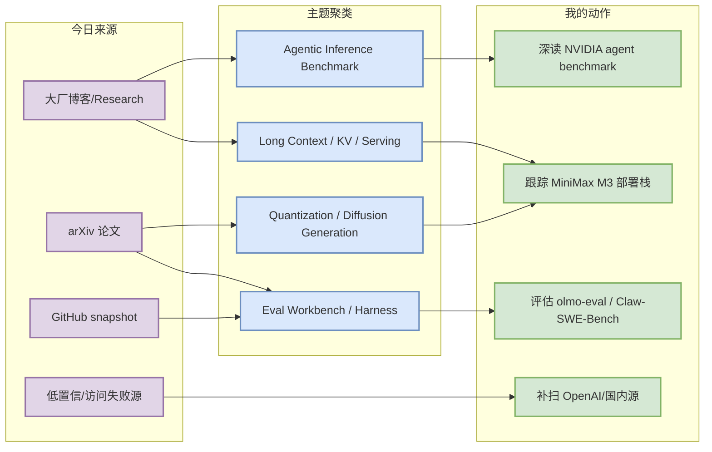
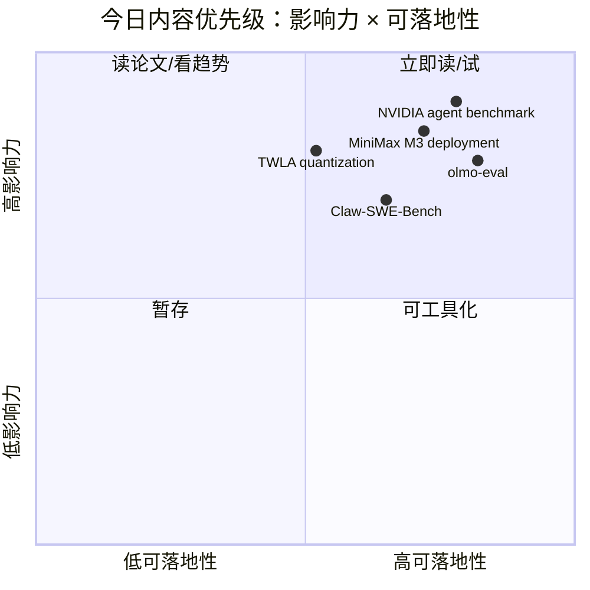

# AI Radar Daily - 2026-06-13

> 生成时间：2026-06-13 09:01 CST
> 范围：AI Infra / LLM / RL / Game AI / 大厂博客 / 论文 / GitHub / 行业资讯
> 说明：日报是总览导航页，不是全部正文。Obsidian 中点 `[[详情页]]`，Telegram/GitHub 中点“网页详情”。

## 0. 今日结论

- 今日最值得关注：NVIDIA 连续两篇文章把 agentic workload 推向“可 benchmark、可部署、可加速”的基础设施问题。
- 对 AI Infra 的直接影响：agent 性能不能只看 token/s，必须把长上下文、工具调用、sandbox、KV/cache、workflow latency 纳入端到端指标。
- 对 LLM 训练 / 推理 / Agent 的影响：DiffusionGemma 与 TWLA 分别从生成范式和低比特推理两端挑战传统自回归 serving 栈。
- 对 RL / 游戏模型训练的影响：agent eval 与 harness 论文继续强化“环境/协议/预算固定”比单模型分数更重要。
- 建议今天深读：[[Industry/NVIDIA/NVIDIA_agentic_coding_benchmark_2026_06_13]]、[[Industry/NVIDIA/NVIDIA_MiniMax_M3_long_context_agentic_workflows_2026_06_13]]、[[Industry/HuggingFace/HuggingFace_olmo_eval_model_development_loop_2026_06_13]]、[[Papers/Quantization/TWLA_ternary_lowbit_activations_LLM_2026_06_13]]。

## 1. 今日态势图

## 2. 必读卡片区

> [!important] NVIDIA：Agentic coding performance 进入正式 benchmark 叙事
> - 大类：博客 / 大厂资讯
> - 小类：Agentic Inference / Benchmark
> - 重点：NVIDIA 明确把 agent coding workload 当作复杂推理基准，而非普通 chat completion。
> - 为什么重要：这会改变 serving 指标设计：从 token/s 转向端到端任务成功率、工具调用延迟、长上下文缓存和 sandbox 成本。
> - 详情：[[Industry/NVIDIA/NVIDIA_agentic_coding_benchmark_2026_06_13]] / [网页详情](https://github.com/dyt27666-oss/AI-news-report-obsidians/blob/main/Industry/NVIDIA/NVIDIA_agentic_coding_benchmark_2026_06_13.md) / [原文](https://developer.nvidia.com/blog/nvidia-achieves-leading-agentic-coding-performance-on-first-agentic-ai-benchmark/)

> [!tip] NVIDIA MiniMax M3：长上下文 reasoning 与 agent workflow 的部署信号
> - 大类：博客 / 工程实践
> - 小类：Long-context Serving
> - 重点：MiniMax M3 的部署叙事把模型能力、accelerated infra、NIM 和 enterprise workflow 串起来。
> - 为什么重要：长上下文 agent 的成本中心是 prefill/KV cache/调度，而不是单模型榜单。
> - 详情：[[Industry/NVIDIA/NVIDIA_MiniMax_M3_long_context_agentic_workflows_2026_06_13]] / [网页详情](https://github.com/dyt27666-oss/AI-news-report-obsidians/blob/main/Industry/NVIDIA/NVIDIA_MiniMax_M3_long_context_agentic_workflows_2026_06_13.md) / [原文](https://developer.nvidia.com/blog/deploy-long-context-reasoning-and-agentic-workflows-with-minimax-m3-on-nvidia-accelerated-infrastructure/)

> [!note] Hugging Face / Ai2 olmo-eval：把评测做成模型开发循环
> - 大类：博客 / Eval
> - 小类：Evaluation Workbench
> - 重点：olmo-eval 将评测、回归、任务集合和可复现实验组织成 workbench。
> - 为什么重要：post-training 和模型迭代需要稳定 eval pipeline，否则 reward hacking 与 benchmark drift 难以及时发现。
> - 详情：[[Industry/HuggingFace/HuggingFace_olmo_eval_model_development_loop_2026_06_13]] / [网页详情](https://github.com/dyt27666-oss/AI-news-report-obsidians/blob/main/Industry/HuggingFace/HuggingFace_olmo_eval_model_development_loop_2026_06_13.md) / [原文](https://huggingface.co/blog/allenai/olmo-eval)

> [!abstract] TWLA：ternary weights + low-bit activations 的端到端量化方向
> - 大类：论文
> - 小类：Quantization / Inference
> - 重点：TWLA 尝试让 LLM 权重和激活都进入更低比特，目标是突破只量化权重带来的收益上限。
> - 为什么重要：如果成立，会影响 kernel、内存带宽、边缘部署和高吞吐 serving 成本模型。
> - 详情：[[Papers/Quantization/TWLA_ternary_lowbit_activations_LLM_2026_06_13]] / [网页详情](https://github.com/dyt27666-oss/AI-news-report-obsidians/blob/main/Papers/Quantization/TWLA_ternary_lowbit_activations_LLM_2026_06_13.md) / [原文](https://arxiv.org/abs/2606.13054v1)

## 3. 优先级矩阵

## 4. 分类清单

| 标签 | 大类 | 小类 | 标题 | 重点概括 | 为什么重要 | Obsidian 详情 | 网页详情 | 原文 |
|---|---|---|---|---|---|---|---|---|
| 必读 | 博客 | Agentic Inference / Benchmark | NVIDIA Achieves Leading Agentic Coding Performance on First Agentic AI Benchmark | NVIDIA 把 agentic coding workload 明确成新的推理基准问题：不只是单次 token/s，而是长上下文、多步工具调用、代码修改、测试和反馈循环的端到端性能。 | 对 AI Infra 的意义很直接：agent benchmark 会逼迫 serving 栈同时优化 prefill/decode、工具 I/O、sandbox 启动、长上下文缓存和多轮调度。 | [[Industry/NVIDIA/NVIDIA_agentic_coding_benchmark_2026_06_13]] | [网页详情](https://github.com/dyt27666-oss/AI-news-report-obsidians/blob/main/Industry/NVIDIA/NVIDIA_agentic_coding_benchmark_2026_06_13.md) | [原文](https://developer.nvidia.com/blog/nvidia-achieves-leading-agentic-coding-performance-on-first-agentic-ai-benchmark/) |
| 必读 | 博客 | Long-context Serving | Deploy Long-Context Reasoning and Agentic Workflows with MiniMax M3 on NVIDIA Accelerated Infrastructure | NVIDIA 展示 MiniMax M3 在加速基础设施上的长上下文 reasoning 与 agent workflow 部署路径，把模型、推理引擎、NIM/accelerated infra 和企业工作流连接起来。 | 长上下文 agent 的成本瓶颈在 KV cache、prefill、上下文复用和调度；这类部署文章比模型发布更能暴露生产约束。 | [[Industry/NVIDIA/NVIDIA_MiniMax_M3_long_context_agentic_workflows_2026_06_13]] | [网页详情](https://github.com/dyt27666-oss/AI-news-report-obsidians/blob/main/Industry/NVIDIA/NVIDIA_MiniMax_M3_long_context_agentic_workflows_2026_06_13.md) | [原文](https://developer.nvidia.com/blog/deploy-long-context-reasoning-and-agentic-workflows-with-minimax-m3-on-nvidia-accelerated-infrastructure/) |
| 必读 | 博客 | AI Code Review / Agent | Introducing Serge: GitHub-Native AI Code Review | Hugging Face 发布 Serge，把 AI code review 嵌入 GitHub 原生 workflow，核心是 PR 上下文、审查动作、评论反馈和开发者协作闭环。 | coding agent 的落地点不只在 IDE，而在 CI/PR 审查链路；这会影响 repo 索引、diff 压缩、权限边界和审查评测。 | [[Industry/HuggingFace/HuggingFace_Serge_GitHub_native_AI_code_review_2026_06_13]] | [网页详情](https://github.com/dyt27666-oss/AI-news-report-obsidians/blob/main/Industry/HuggingFace/HuggingFace_Serge_GitHub_native_AI_code_review_2026_06_13.md) | [原文](https://huggingface.co/blog/huggingface/serge) |
| 必读 | 博客 | Eval Workbench | olmo-eval: An evaluation workbench for the model development loop | Ai2 在 Hugging Face 介绍 olmo-eval，把模型开发循环中的评测、回归比较、任务集合和可复现实验组织为 workbench。 | 后训练和模型迭代最怕 benchmark 漂移与不可复现；工程上需要把 eval 当成 pipeline，而不是一次性脚本。 | [[Industry/HuggingFace/HuggingFace_olmo_eval_model_development_loop_2026_06_13]] | [网页详情](https://github.com/dyt27666-oss/AI-news-report-obsidians/blob/main/Industry/HuggingFace/HuggingFace_olmo_eval_model_development_loop_2026_06_13.md) | [原文](https://huggingface.co/blog/allenai/olmo-eval) |
| 必读 | 论文 | Post-training Quantization | TWLA: Achieving Ternary Weights and Low-Bit Activations for LLMs via Post-Training Quantization | TWLA 面向 LLM post-training quantization，把 ternary weights 与 low-bit activations 结合，试图解决 activation heavy-tail 导致端到端低比特推理难落地的问题。 | 如果激活也能低比特化，收益不只是模型大小，而是 kernel、带宽、吞吐和边缘/异构硬件部署。 | [[Papers/Quantization/TWLA_ternary_lowbit_activations_LLM_2026_06_13]] | [网页详情](https://github.com/dyt27666-oss/AI-news-report-obsidians/blob/main/Papers/Quantization/TWLA_ternary_lowbit_activations_LLM_2026_06_13.md) | [原文](https://arxiv.org/abs/2606.13054v1) |
| 可 skim | 论文 | Agent Eval | Claw-SWE-Bench: A Benchmark for Evaluating OpenClaw-style Agent Harnesses on Coding Tasks | Claw-SWE-Bench 为通用 agent harness 适配 SWE-bench 式评测，强调固定 prompt、runtime budget、workspace contract 和可比性。 | coding agent 的评测难点在 harness 约束而不只是模型能力；这对构建内部 agent eval pipeline 很有参考价值。 | [[Papers/AgentEval/Claw_SWE_Bench_agent_harness_eval_2026_06_13]] | [网页详情](https://github.com/dyt27666-oss/AI-news-report-obsidians/blob/main/Papers/AgentEval/Claw_SWE_Bench_agent_harness_eval_2026_06_13.md) | [原文](https://arxiv.org/abs/2606.12344v1) |
| 可 skim | GitHub | Agent Memory | thedotmack/claude-mem | 今日真实 star delta +166，持续说明跨 session agent memory 是社区焦点。 | 长期 coding/ops agent 需要记忆、检索注入和隐私边界。 | [[GitHub/thedotmack__claude_mem_2026_06_13]] | [网页详情](https://github.com/dyt27666-oss/AI-news-report-obsidians/blob/main/GitHub/thedotmack__claude_mem_2026_06_13.md) | [原文](https://github.com/thedotmack/claude-mem) |

## 5. 大厂资讯 / 工程博客 / Research

### 5.1 公司来源扫描矩阵

| 公司/实验室 | 来源/栏目 | 今日状态 | 高相关条数 | 代表条目 | 备注 |
|---|---|---|---:|---|---|
| OpenAI | News / Research | 访问失败 | 0 | 无 | 官网 403；今日未纳入高相关新项，需备用源补扫 |
| Anthropic | News / Research / Enterprise | 有高相关新项 | 2 | Claude Corps / DXC alliance | DXC 企业集成强相关，Claude Corps 偏生态 |
| Google DeepMind | Blog / Research / Google AI | 有高相关候选 | 1 | DiffusionGemma | Google AI 页面可访问，DeepMind 源未发现更强当天项 |
| Meta AI | Blog / AI Infra | 有高相关候选 | 1 | MTIA scale AI chips | 非当天新文，但 AI Infra 强相关，矩阵保留 |
| NVIDIA | Technical Blog / Agentic AI | 有高相关新项 | 2 | Agentic coding benchmark / MiniMax M3 | 旧 AI category 404，已用 generative-ai/blog 备用源 |
| Microsoft | Research AI | 无高相关新项 / 低置信 | 0 | 无 | 页面可访问，但今日未发现强相关新发布 |
| Hugging Face | Blog / Papers / Releases | 有高相关新项 | 2 | Serge / olmo-eval | code review agent 与 eval workbench 强相关 |
| 腾讯 | AI Lab / 技术博客 | 无高相关新项 / 低置信 | 0 | 无 | 首页可访问但未提取到明确新条目 |
| 字节 | Seed / 技术博客 | 无高相关新项 / 低置信 | 0 | 无 | Seed 首页可访问但未提取到明确新条目 |
| SpaceAI | Blog / News | 低置信 / 无高相关新项 | 0 | 无 | 页面偏 open space network，和 AI Infra/LLM/RL 弱相关 |

### 5.2 高相关大厂条目

| 标签 | 发布方/大厂 | 栏目/来源 | 标题 | 重点概括 | 工程/算法影响 | Obsidian 详情 | 网页详情 | 原文 |
|---|---|---|---|---|---|---|---|---|
| 必读 | NVIDIA | Technical Blog / Agentic AI / Benchmark | NVIDIA Achieves Leading Agentic Coding Performance on First Agentic AI Benchmark | NVIDIA 把 agentic coding workload 明确成新的推理基准问题：不只是单次 token/s，而是长上下文、多步工具调用、代码修改、测试和反馈循环的端到端性能。 | 对 AI Infra 的意义很直接：agent benchmark 会逼迫 serving 栈同时优化 prefill/decode、工具 I/O、sandbox 启动、长上下文缓存和多轮调度。 | [[Industry/NVIDIA/NVIDIA_agentic_coding_benchmark_2026_06_13]] | [网页详情](https://github.com/dyt27666-oss/AI-news-report-obsidians/blob/main/Industry/NVIDIA/NVIDIA_agentic_coding_benchmark_2026_06_13.md) | [原文](https://developer.nvidia.com/blog/nvidia-achieves-leading-agentic-coding-performance-on-first-agentic-ai-benchmark/) |
| 必读 | NVIDIA | Technical Blog / Deployment Guide | Deploy Long-Context Reasoning and Agentic Workflows with MiniMax M3 on NVIDIA Accelerated Infrastructure | NVIDIA 展示 MiniMax M3 在加速基础设施上的长上下文 reasoning 与 agent workflow 部署路径，把模型、推理引擎、NIM/accelerated infra 和企业工作流连接起来。 | 长上下文 agent 的成本瓶颈在 KV cache、prefill、上下文复用和调度；这类部署文章比模型发布更能暴露生产约束。 | [[Industry/NVIDIA/NVIDIA_MiniMax_M3_long_context_agentic_workflows_2026_06_13]] | [网页详情](https://github.com/dyt27666-oss/AI-news-report-obsidians/blob/main/Industry/NVIDIA/NVIDIA_MiniMax_M3_long_context_agentic_workflows_2026_06_13.md) | [原文](https://developer.nvidia.com/blog/deploy-long-context-reasoning-and-agentic-workflows-with-minimax-m3-on-nvidia-accelerated-infrastructure/) |
| 可 skim | Hugging Face | Blog / Developer Tooling | Introducing Serge: GitHub-Native AI Code Review | Hugging Face 发布 Serge，把 AI code review 嵌入 GitHub 原生 workflow，核心是 PR 上下文、审查动作、评论反馈和开发者协作闭环。 | coding agent 的落地点不只在 IDE，而在 CI/PR 审查链路；这会影响 repo 索引、diff 压缩、权限边界和审查评测。 | [[Industry/HuggingFace/HuggingFace_Serge_GitHub_native_AI_code_review_2026_06_13]] | [网页详情](https://github.com/dyt27666-oss/AI-news-report-obsidians/blob/main/Industry/HuggingFace/HuggingFace_Serge_GitHub_native_AI_code_review_2026_06_13.md) | [原文](https://huggingface.co/blog/huggingface/serge) |
| 必读 | Hugging Face / Ai2 | Blog / Evaluation Workbench | olmo-eval: An evaluation workbench for the model development loop | Ai2 在 Hugging Face 介绍 olmo-eval，把模型开发循环中的评测、回归比较、任务集合和可复现实验组织为 workbench。 | 后训练和模型迭代最怕 benchmark 漂移与不可复现；工程上需要把 eval 当成 pipeline，而不是一次性脚本。 | [[Industry/HuggingFace/HuggingFace_olmo_eval_model_development_loop_2026_06_13]] | [网页详情](https://github.com/dyt27666-oss/AI-news-report-obsidians/blob/main/Industry/HuggingFace/HuggingFace_olmo_eval_model_development_loop_2026_06_13.md) | [原文](https://huggingface.co/blog/allenai/olmo-eval) |
| 必读 | Google DeepMind / Google | Research / Model Release | Introducing DiffusionGemma | Google 发布 DiffusionGemma，强调 diffusion-style text generation 可获得最高约 4x 的生成速度，对传统自回归 decode 路径形成替代信号。 | 如果 diffusion LLM 在质量和可控性上继续逼近，serving 栈会从逐 token decode 转向块生成/并行 refinement，KV cache 和 scheduler 设计都会变化。 | [[Industry/GoogleDeepMind/Google_DiffusionGemma_fast_text_generation_2026_06_13]] | [网页详情](https://github.com/dyt27666-oss/AI-news-report-obsidians/blob/main/Industry/GoogleDeepMind/Google_DiffusionGemma_fast_text_generation_2026_06_13.md) | [原文](https://blog.google/innovation-and-ai/technology/developers-tools/diffusion-gemma-faster-text-generation/) |
| 可 skim | Anthropic | News / Enterprise Alliance | DXC will integrate Claude into regulated enterprise systems | Anthropic 与 DXC 建立多年全球联盟，将 Claude 集成到银行、航空等受监管行业依赖的企业系统中。 | 这类企业集成会把 agent/LLM 从 demo 推向权限、审计、数据边界、SLA、合规和 legacy system orchestration。 | [[Industry/Anthropic/Anthropic_DXC_Claude_regulated_enterprise_2026_06_13]] | [网页详情](https://github.com/dyt27666-oss/AI-news-report-obsidians/blob/main/Industry/Anthropic/Anthropic_DXC_Claude_regulated_enterprise_2026_06_13.md) | [原文](https://www.anthropic.com/news/dxc-anthropic-alliance) |
| 可 skim | Meta AI | Engineering Blog / AI Infrastructure | Four MTIA Chips in Two Years: Scaling AI Experiences for Billions | Meta 复盘两年四代 MTIA 芯片，核心主题是以低成本服务全球规模的 AI workload，并把模型、编译、硬件和产品体验协同优化。 | 虽非当天新文，但对 AI Infra 强相关：大规模 inference 成本下降越来越依赖自研 ASIC、compiler/runtime 和模型共同设计。 | [[Industry/MetaAI/Meta_MTIA_AI_infra_scale_2026_06_13]] | [网页详情](https://github.com/dyt27666-oss/AI-news-report-obsidians/blob/main/Industry/MetaAI/Meta_MTIA_AI_infra_scale_2026_06_13.md) | [原文](https://ai.meta.com/blog/meta-mtia-scale-ai-chips-for-billions/) |

## 6. GitHub 高 star Top 10

| 排名 | repo | stars | forks | language | updated_at | topics | 重点概括 | 是否值得试用 | Obsidian 详情 | 原文 |
|---:|---|---:|---:|---|---|---|---|---|---|---|
| 1 | affaan-m/ECC | 214318 | 32933 | JavaScript | 2026-06-13T00:58:55Z | ai-agents, anthropic, claude, claude-code, developer-tools, llm, mcp, productivity | The agent harness performance optimization system. Skills, instincts, memory, security, and research-first dev | 观察/skim | [[GitHub/affaan_m__ECC_2026_06_13]] | [GitHub](https://github.com/affaan-m/ECC) |
| 2 | tensorflow/tensorflow | 195624 | 75175 | C++ | 2026-06-13T01:01:29Z | deep-learning, deep-neural-networks, distributed, machine-learning, ml, neural-network, python, tensorflow | An Open Source Machine Learning Framework for Everyone | 观察/skim | [[GitHub/tensorflow__tensorflow_2026_06_13]] | [GitHub](https://github.com/tensorflow/tensorflow) |
| 3 | NousResearch/hermes-agent | 191990 | 33452 | Python | 2026-06-13T01:00:46Z | ai, ai-agent, ai-agents, anthropic, chatgpt, claude, claude-code, clawdbot | The agent that grows with you | 观察/skim | [[GitHub/NousResearch__hermes_agent_2026_06_13]] | [GitHub](https://github.com/NousResearch/hermes-agent) |
| 4 | Significant-Gravitas/AutoGPT | 184915 | 46149 | Python | 2026-06-13T00:16:25Z | agentic-ai, agents, ai, artificial-intelligence, autonomous-agents, claude, gpt, llama-api | AutoGPT is the vision of accessible AI for everyone, to use and to build on. Our mission is to provide the too | 观察/skim | [[GitHub/Significant_Gravitas__AutoGPT_2026_06_13]] | [GitHub](https://github.com/Significant-Gravitas/AutoGPT) |
| 5 | ollama/ollama | 173977 | 16582 | Go | 2026-06-13T00:59:24Z | deepseek, gemma, gemma3, glm, go, golang, gpt-oss, llama | Get up and running with Kimi-K2.6, GLM-5.1, MiniMax, DeepSeek, gpt-oss, Qwen, Gemma and other models. | 观察/skim | [[GitHub/ollama__ollama_2026_06_13]] | [GitHub](https://github.com/ollama/ollama) |
| 6 | f/prompts.chat | 163628 | 21224 | HTML | 2026-06-13T01:01:25Z | ai, artificial-intelligence, awesome-list, chatgpt, chatgpt-prompts, claude, gemini, gpt | f.k.a. Awesome ChatGPT Prompts. Share, discover, and collect prompts from the community. Free and open source  | 观察/skim | [[GitHub/f__prompts_chat_2026_06_13]] | [GitHub](https://github.com/f/prompts.chat) |
| 7 | huggingface/transformers | 161548 | 33495 | Python | 2026-06-12T23:48:58Z | audio, deep-learning, deepseek, gemma, glm, hacktoberfest, llm, machine-learning | 🤗 Transformers: the model-definition framework for state-of-the-art machine learning models in text, vision, a | 观察/skim | [[GitHub/huggingface__transformers_2026_06_13]] | [GitHub](https://github.com/huggingface/transformers) |
| 8 | langgenius/dify | 144997 | 22818 | TypeScript | 2026-06-13T00:54:35Z | agent, agentic-ai, agentic-framework, agentic-workflow, ai, automation, gemini, genai | Production-ready platform for agentic workflow development. | 快速试用 | [[GitHub/langgenius__dify_2026_06_13]] | [GitHub](https://github.com/langgenius/dify) |
| 9 | open-webui/open-webui | 141276 | 20283 | Python | 2026-06-13T01:01:01Z | ai, llm, llm-ui, llm-webui, llms, mcp, ollama, ollama-webui | User-friendly AI Interface (Supports Ollama, OpenAI API, ...) | 观察/skim | [[GitHub/open_webui__open_webui_2026_06_13]] | [GitHub](https://github.com/open-webui/open-webui) |
| 10 | langchain-ai/langchain | 139145 | 23068 | Python | 2026-06-13T00:39:00Z | agents, ai, ai-agents, anthropic, chatgpt, deepagents, enterprise, framework | The agent engineering platform. | 快速试用 | [[GitHub/langchain_ai__langchain_2026_06_13]] | [GitHub](https://github.com/langchain-ai/langchain) |

## 7. GitHub star 增长最快 Top 10

基线：已读取历史 snapshot，`cold_start=false`，本表为真实 snapshot delta；部分新进入扫描集合的 repo 显示“无历史基线”。

| 排名 | repo | stars_delta | stars | forks | language | updated_at | 增长依据 | 重点概括 | Obsidian 详情 | 原文 |
|---:|---|---:|---:|---:|---|---|---|---|---|---|
| 1 | thedotmack/claude-mem | 166 | 82005 | 7081 | JavaScript | 2026-06-13T00:41:08Z | historical_snapshot | Persistent Context Across Sessions for Every Agent –  Captures everything your agent does during sessions, com | [[GitHub/thedotmack__claude_mem_2026_06_13]] | [GitHub](https://github.com/thedotmack/claude-mem) |
| 2 | OpenHands/OpenHands | 166 | 76658 | 9748 | Python | 2026-06-13T00:50:27Z | historical_snapshot | 🙌 OpenHands: AI-Driven Development | [[GitHub/OpenHands__OpenHands_2026_06_13]] | [GitHub](https://github.com/OpenHands/OpenHands) |
| 3 | jingyaogong/minimind | 72 | 51674 | 6639 | Python | 2026-06-13T00:58:49Z | historical_snapshot | 🧠「大模型」2小时完全从0训练64M的小参数LLM！Train a 64M-parameter LLM from scratch in just 2h! | [[GitHub/jingyaogong__minimind_2026_06_13]] | [GitHub](https://github.com/jingyaogong/minimind) |
| 4 | rasbt/LLMs-from-scratch | 56 | 97052 | 14849 | Jupyter Notebook | 2026-06-12T23:49:00Z | historical_snapshot | Implement a ChatGPT-like LLM in PyTorch from scratch, step by step | [[GitHub/rasbt__LLMs_from_scratch_2026_06_13]] | [GitHub](https://github.com/rasbt/LLMs-from-scratch) |
| 5 | ashishpatel26/500-AI-Machine-learning-Deep-learning-Computer-vision-NLP-Projects-with-code | 47 | 34469 | 7261 | Unknown | 2026-06-12T21:47:02Z | historical_snapshot | 500 AI Machine learning Deep learning Computer vision NLP Projects with code | [[GitHub/ashishpatel26__500_AI_Machine_learning_Deep_learning_Computer_vision_NLP_Projects_with_code_2026_06_13]] | [GitHub](https://github.com/ashishpatel26/500-AI-Machine-learning-Deep-learning-Computer-vision-NLP-Projects-with-code) |
| 6 | f/prompts.chat | 38 | 163628 | 21224 | HTML | 2026-06-13T01:01:25Z | historical_snapshot | f.k.a. Awesome ChatGPT Prompts. Share, discover, and collect prompts from the community. Free and open source  | [[GitHub/f__prompts_chat_2026_06_13]] | [GitHub](https://github.com/f/prompts.chat) |
| 7 | FlowiseAI/Flowise | 36 | 53526 | 24503 | TypeScript | 2026-06-13T00:44:21Z | historical_snapshot | Build AI Agents, Visually | [[GitHub/FlowiseAI__Flowise_2026_06_13]] | [GitHub](https://github.com/FlowiseAI/Flowise) |
| 8 | yamadashy/repomix | 28 | 26221 | 1363 | TypeScript | 2026-06-12T23:58:23Z | historical_snapshot | 📦 Repomix is a powerful tool that packs your entire repository into a single, AI-friendly file. Perfect for wh | [[GitHub/yamadashy__repomix_2026_06_13]] | [GitHub](https://github.com/yamadashy/repomix) |
| 9 | ItzCrazyKns/Vane | 27 | 35280 | 3888 | TypeScript | 2026-06-12T23:19:51Z | historical_snapshot | Vane is an AI-powered answering engine. | [[GitHub/ItzCrazyKns__Vane_2026_06_13]] | [GitHub](https://github.com/ItzCrazyKns/Vane) |
| 10 | hacksider/Deep-Live-Cam | 26 | 93762 | 13685 | Python | 2026-06-12T22:59:07Z | historical_snapshot | real time face swap and one-click video deepfake with only a single image | [[GitHub/hacksider__Deep_Live_Cam_2026_06_13]] | [GitHub](https://github.com/hacksider/Deep-Live-Cam) |

## 8. 论文

### 8.1 Quantization / Agent Eval / Coding Agent

| 标签 | 论文来源 | 论文 | 作者/机构 | 重点概括 | 工程/研究价值 | Obsidian 详情 | 网页详情 | PDF/原文 |
|---|---|---|---|---|---|---|---|---|
| 可 skim | arXiv / 预印本 | TWLA: Achieving Ternary Weights and Low-Bit Activations for LLMs via Post-Training Quantization | Zhixiong Zhao, Zukang Xu, Zhixuan Chen, Xing Hu, Zhe Jiang | TWLA 面向 LLM post-training quantization，把 ternary weights 与 low-bit activations 结合，试图解决 activation heavy-tail 导致端到端低比特推理难落地的问题。 | 如果激活也能低比特化，收益不只是模型大小，而是 kernel、带宽、吞吐和边缘/异构硬件部署。 | [[Papers/Quantization/TWLA_ternary_lowbit_activations_LLM_2026_06_13]] | [网页详情](https://github.com/dyt27666-oss/AI-news-report-obsidians/blob/main/Papers/Quantization/TWLA_ternary_lowbit_activations_LLM_2026_06_13.md) | [PDF](https://arxiv.org/pdf/2606.13054v1) |
| 可 skim | arXiv / 预印本 | Claw-SWE-Bench: A Benchmark for Evaluating OpenClaw-style Agent Harnesses on Coding Tasks | Mengyu Zheng, Kai Han, Boxun Li, Haiyang Xu, Yuchuan Tian | Claw-SWE-Bench 为通用 agent harness 适配 SWE-bench 式评测，强调固定 prompt、runtime budget、workspace contract 和可比性。 | coding agent 的评测难点在 harness 约束而不只是模型能力；这对构建内部 agent eval pipeline 很有参考价值。 | [[Papers/AgentEval/Claw_SWE_Bench_agent_harness_eval_2026_06_13]] | [网页详情](https://github.com/dyt27666-oss/AI-news-report-obsidians/blob/main/Papers/AgentEval/Claw_SWE_Bench_agent_harness_eval_2026_06_13.md) | [PDF](https://arxiv.org/pdf/2606.12344v1) |
| 可 skim | arXiv / 预印本 | Exploration Structure in LLM Agents for Multi-File Change Localization | Akeela Darryl Fattha, Kia Ying Chua, Lingxiao Jiang, Laura Wynter | 论文比较线性顺序探索与 domain-scoped parallel agentic exploration，认为多文件修改定位需要非线性、子系统级的并行探索结构。 | 这直接对应大型代码仓库 agent 的搜索策略：上下文预算、子任务并行、repo map 和最终 patch 合并都需要系统设计。 | [[Papers/AgentSE/Exploration_structure_LLM_agents_multifile_change_2026_06_13]] | [网页详情](https://github.com/dyt27666-oss/AI-news-report-obsidians/blob/main/Papers/AgentSE/Exploration_structure_LLM_agents_multifile_change_2026_06_13.md) | [PDF](https://arxiv.org/pdf/2606.11976v1) |

## 9. 资讯 / 其他 GitHub 项目

### 9.1 Agent / AI Infra 工具观察

| 标签 | 来源 | 标题 | 重点概括 | 对我有什么用 | Obsidian 详情 | 网页详情 | 原文 |
|---|---|---|---|---|---|---|---|
| 后续 | GitHub | BerriAI/litellm | AI gateway/proxy，支持成本跟踪、guardrails、load balancing 和多 provider。 | 可作为企业 LLM gateway/control plane 参考。 | [[GitHub/BerriAI__litellm_2026_06_13]] | [网页详情](https://github.com/dyt27666-oss/AI-news-report-obsidians/blob/main/GitHub/BerriAI__litellm_2026_06_13.md) | [GitHub](https://github.com/BerriAI/litellm) |
| 后续 | GitHub | bytedance/deer-flow | 长任务 SuperAgent harness，包含 sandbox、memory、tool、skill、subagent 与 message gateway。 | 字节开源 agent harness 对 runtime/control plane 有参考价值。 | [[GitHub/bytedance__deer_flow_2026_06_13]] | [网页详情](https://github.com/dyt27666-oss/AI-news-report-obsidians/blob/main/GitHub/bytedance__deer_flow_2026_06_13.md) | [GitHub](https://github.com/bytedance/deer-flow) |
| 可 skim | GitHub | affaan-m/ECC | agent harness performance optimization system，覆盖 skills、instincts、memory、security、research-first development。 | 高 star 且主题强相关，但需审计真实性、docs 和 benchmark。 | [[GitHub/affaan_m__ECC_2026_06_13]] | [网页详情](https://github.com/dyt27666-oss/AI-news-report-obsidians/blob/main/GitHub/affaan_m__ECC_2026_06_13.md) | [GitHub](https://github.com/affaan-m/ECC) |

## 10. 按主题索引

### AI Infra / Serving / Training

- [[Industry/NVIDIA/NVIDIA_MiniMax_M3_long_context_agentic_workflows_2026_06_13]] - 长上下文 agent workflow 部署。
- [[Papers/Quantization/TWLA_ternary_lowbit_activations_LLM_2026_06_13]] - 低比特激活与权重量化。
- [[GitHub/BerriAI__litellm_2026_06_13]] - LLM gateway/control plane。

### LLM / Agent / RAG / Evaluation

- [[Industry/NVIDIA/NVIDIA_agentic_coding_benchmark_2026_06_13]] - agentic coding benchmark 与推理 workload。
- [[Industry/HuggingFace/HuggingFace_Serge_GitHub_native_AI_code_review_2026_06_13]] - GitHub-native AI code review。
- [[Industry/HuggingFace/HuggingFace_olmo_eval_model_development_loop_2026_06_13]] - model development loop eval workbench。
- [[Papers/AgentEval/Claw_SWE_Bench_agent_harness_eval_2026_06_13]] - agent harness coding benchmark。

### RL / Game AI / World Model

- [[Papers/AgentSE/Exploration_structure_LLM_agents_multifile_change_2026_06_13]] - 非线性并行探索对多文件修改定位的启发。
- [[Industry/MetaAI/Meta_MTIA_AI_infra_scale_2026_06_13]] - 大规模 AI inference 硬件/编译协同。

### 公司 / 实验室

- Anthropic: [[Industry/Anthropic/Anthropic_DXC_Claude_regulated_enterprise_2026_06_13]]
- Google DeepMind / Google: [[Industry/GoogleDeepMind/Google_DiffusionGemma_fast_text_generation_2026_06_13]]
- Meta AI: [[Industry/MetaAI/Meta_MTIA_AI_infra_scale_2026_06_13]]
- NVIDIA: [[Industry/NVIDIA/NVIDIA_agentic_coding_benchmark_2026_06_13]] / [[Industry/NVIDIA/NVIDIA_MiniMax_M3_long_context_agentic_workflows_2026_06_13]]
- Hugging Face: [[Industry/HuggingFace/HuggingFace_Serge_GitHub_native_AI_code_review_2026_06_13]] / [[Industry/HuggingFace/HuggingFace_olmo_eval_model_development_loop_2026_06_13]]

## 11. 值得后续深挖

| 标签 | 大类 | 小类 | 标题 | 后续动作 | Obsidian 详情 | 原文 |
|---|---|---|---|---|---|---|
| 必读 | 博客 | Agentic Benchmark | NVIDIA agentic coding benchmark | 找到 benchmark 名称、指标定义和是否可复现。 | [[Industry/NVIDIA/NVIDIA_agentic_coding_benchmark_2026_06_13]] | [原文](https://developer.nvidia.com/blog/nvidia-achieves-leading-agentic-coding-performance-on-first-agentic-ai-benchmark/) |
| 后续 | 博客 | Eval | olmo-eval | 检查能否接入内部 post-training eval pipeline。 | [[Industry/HuggingFace/HuggingFace_olmo_eval_model_development_loop_2026_06_13]] | [原文](https://huggingface.co/blog/allenai/olmo-eval) |
| 后续 | 论文 | Quantization | TWLA | 阅读实验表，确认激活低比特是否有真实 kernel 加速。 | [[Papers/Quantization/TWLA_ternary_lowbit_activations_LLM_2026_06_13]] | [abs](https://arxiv.org/abs/2606.13054v1) |
| 后续 | GitHub | Agent Memory | thedotmack/claude-mem | 审计存储后端、上下文注入策略和隐私边界。 | [[GitHub/thedotmack__claude_mem_2026_06_13]] | [GitHub](https://github.com/thedotmack/claude-mem) |

## 12. 采集失败或低置信来源

- OpenAI 官网 news 抓取返回 403，今日矩阵标注访问失败；需后续备用源或 RSS/搜索补扫。
- GitHub API 未认证触发 rate limit，snapshot 已生成且包含 115 个 repo；Top 10 表满足要求，但后半查询覆盖可能偏窄。
- Tencent / ByteDance 首页可访问但未提取到明确高相关新项；SpaceAI 内容与 AI Infra/LLM/RL 弱相关。
- Meta MTIA 为非当天文章，但在公司矩阵中作为 AI Infra 强相关候选保留；避免误判为“未扫描”。

## 13. 归档标签

#ai-radar #daily #ai-infra #llm #rl #agent #serving #eval
