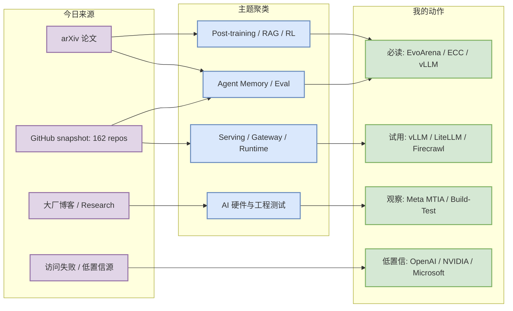
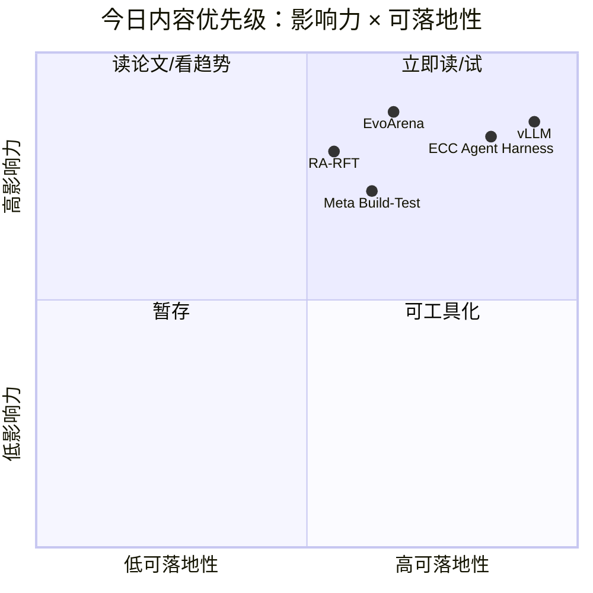

# AI Radar Daily - 2026-06-14

> 生成时间：2026-06-14 09:00:37 CST
> 范围：AI Infra / LLM / RL / Agent / Eval / Serving / Training / 大厂博客 / 论文 / GitHub
> 日报是导航页；详情页负责深度理解。

## 0. 今日结论

- Agent runtime / memory / eval 是今天最强主线：GitHub 增长榜由 Hermes Agent、ECC、Firecrawl、OpenHands、browser-use 等 agent 工程项目主导。
- Serving 仍是硬需求：vLLM 继续进入增长榜，LiteLLM、Dify、LangChain、Firecrawl 说明 gateway、web data、workflow control plane 仍在快速演进。
- 论文侧值得看 EvoArena 与 RA-RFT：前者把长期 agent 的动态环境记忆变成 benchmark，后者把 RAG 从语义相似推进到 reasoning-benefit retrieval。
- 大厂侧今天高置信内容不足，但 Meta AI 的 build/test scale 与 MTIA 芯片信号值得保留；Hugging Face 的 voice agent ASR benchmark 也与 agent eval 相关。
- 建议今天深读：[[Papers/Agent-Eval/EvoArena-memory-evolution-llm-agents]]、[[GitHub/Agents/ECC-agent-harness-performance-optimization]]、[[GitHub/Infra/vllm-serving-engine]]、[[Industry/Meta/Scaling-how-we-build-and-test-advanced-ai]]。

## 1. 今日态势图

## 2. 必读卡片区

> [!important] EvoArena: 动态环境中的 LLM Agent Memory Benchmark
> - 大类：论文
> - 小类：Agent Eval / Memory
> - 重点：现有 agent 在环境演化场景下平均准确率只有 39.6%，EvoMem 用 patch-based memory 追踪变化。
> - 为什么重要：长期 agent 的关键不是一次性回答，而是环境变化后的记忆更新与行为一致性。
> - 详情：[[Papers/Agent-Eval/EvoArena-memory-evolution-llm-agents]] / [网页详情](https://github.com/dyt27666-oss/AI-news-report-obsidians/blob/main/Papers/Agent-Eval/EvoArena-memory-evolution-llm-agents.md) / [原文](https://arxiv.org/abs/2606.13681v1)

> [!tip] ECC: Agent Harness 性能优化系统
> - 大类：GitHub
> - 小类：Agent Infra
> - 重点：围绕 skills、instincts、memory、安全和 research-first 开发流程优化 agent harness。
> - 为什么重要：它代表 coding agent 工程从 prompt 技巧转向运行时、记忆和流程约束。
> - 详情：[[GitHub/Agents/ECC-agent-harness-performance-optimization]] / [网页详情](https://github.com/dyt27666-oss/AI-news-report-obsidians/blob/main/GitHub/Agents/ECC-agent-harness-performance-optimization.md) / [原文](https://github.com/affaan-m/ECC)

> [!tip] vLLM: Serving 主线继续强势
> - 大类：GitHub
> - 小类：LLM Serving
> - 重点：高吞吐 LLM serving 引擎继续进入增长榜，说明推理效率依然是刚需。
> - 为什么重要：KV cache、batching、scheduler、吞吐/延迟权衡直接影响部署成本。
> - 详情：[[GitHub/Infra/vllm-serving-engine]] / [网页详情](https://github.com/dyt27666-oss/AI-news-report-obsidians/blob/main/GitHub/Infra/vllm-serving-engine.md) / [原文](https://github.com/vllm-project/vllm)

> [!note] Meta AI: 构建与测试先进 AI 的规模化
> - 大类：大厂博客
> - 小类：Engineering Blog
> - 重点：大厂把 AI build/test 流水线作为显式信号。
> - 为什么重要：评测门禁、自动化测试、发布质量会成为模型工程团队的核心生产力。
> - 详情：[[Industry/Meta/Scaling-how-we-build-and-test-advanced-ai]] / [网页详情](https://github.com/dyt27666-oss/AI-news-report-obsidians/blob/main/Industry/Meta/Scaling-how-we-build-and-test-advanced-ai.md) / [原文](https://ai.meta.com/blog/)

## 3. 优先级矩阵

## 4. 分类清单

| 标签 | 大类 | 小类 | 标题 | 重点概括 | 为什么重要 | Obsidian 详情 | 网页详情 | 原文 |
|---|---|---|---|---|---|---|---|---|
| 必读 | GitHub | Agent Infra | ECC | Agent harness 性能优化系统，增长极快 | 对 coding agent runtime、memory、skills 有直接参考 | [[GitHub/Agents/ECC-agent-harness-performance-optimization]] | [网页详情](https://github.com/dyt27666-oss/AI-news-report-obsidians/blob/main/GitHub/Agents/ECC-agent-harness-performance-optimization.md) | [原文](https://github.com/affaan-m/ECC) |
| 必读 | 论文 | Agent Eval | EvoArena | 动态环境下 agent memory evolution benchmark | 贴近长期 agent 与真实环境漂移 | [[Papers/Agent-Eval/EvoArena-memory-evolution-llm-agents]] | [网页详情](https://github.com/dyt27666-oss/AI-news-report-obsidians/blob/main/Papers/Agent-Eval/EvoArena-memory-evolution-llm-agents.md) | [原文](https://arxiv.org/abs/2606.13681v1) |
| 必读 | GitHub | LLM Serving | vLLM | 高吞吐 LLM serving 引擎持续增长 | 直接关系 KV cache、batching、推理成本 | [[GitHub/Infra/vllm-serving-engine]] | [网页详情](https://github.com/dyt27666-oss/AI-news-report-obsidians/blob/main/GitHub/Infra/vllm-serving-engine.md) | [原文](https://github.com/vllm-project/vllm) |
| 可 skim | 大厂博客 | Meta AI | Scaling AI Build/Test | 大厂研发测试流水线信号 | 可借鉴 eval gate 和发布质量管理 | [[Industry/Meta/Scaling-how-we-build-and-test-advanced-ai]] | [网页详情](https://github.com/dyt27666-oss/AI-news-report-obsidians/blob/main/Industry/Meta/Scaling-how-we-build-and-test-advanced-ai.md) | [原文](https://ai.meta.com/blog/) |

## 5. 大厂资讯 / 工程博客 / Research

### 5.1 公司来源扫描矩阵

| 公司/实验室 | 来源/栏目 | 今日状态 | 高相关条数 | 代表条目 | 备注 |
|---|---|---|---:|---|---|
| OpenAI | News / Research | 访问失败 | 0 | 无 | 主页 403，今日低置信；未纳入高相关项 |
| Anthropic | News / Research / Engineering | 已扫描 | 1 | Introducing Claude Corps / AI policy | 更偏政策与人才，模型工程相关性低；Opus 4.8 为近期背景项 |
| Google DeepMind | Blog / Research | 已扫描 | 0 | 无高相关新项 | 页面只抓到通用 Gemini 导航，低置信 |
| Meta AI | Blog / Research | 已扫描 | 2 | Scaling How We Build and Test Our Most Advanced AI | 工程测试与 MTIA 芯片信号强，已生成详情 |
| NVIDIA | Technical Blog / AI | 访问失败 | 0 | 无 | sources URL 返回 404，需后续修正源 |
| Microsoft | Research AI | 访问失败 | 0 | 无 | 403，今日未纳入 |
| Hugging Face | Blog / Papers / Releases | 已扫描 | 1 | Voice Agents bilingual ASR benchmark | 语音 agent 评测相关，已生成详情 |
| 腾讯 | AI Lab / 技术博客 | 已扫描低置信 | 0 | 无高相关新项 | 页面无可解析标题 |
| 字节 | Seed / 技术博客 | 已扫描低置信 | 0 | 无高相关新项 | 主页可访问但未抓到新标题；GitHub deer-flow 作为字节 OSS 信号 |
| SpaceAI | Blog / News | 已扫描低置信 | 0 | 无高相关新项 | 页面为 waitlist/网络产品，AI Infra 相关性弱 |

### 5.2 高相关大厂条目

| 标签 | 发布方/大厂 | 栏目/来源 | 标题 | 重点概括 | 工程/算法影响 | Obsidian 详情 | 网页详情 | 原文 |
|---|---|---|---|---|---|---|---|---|
| 必读 | Meta AI | Engineering Blog | Scaling How We Build and Test Our Most Advanced AI | 大厂把先进 AI 构建与测试流程规模化，指向 eval gate、自动化测试和发布质量 | 对训练/推理团队意味着工程流程本身成为壁垒 | [[Industry/Meta/Scaling-how-we-build-and-test-advanced-ai]] | [网页详情](https://github.com/dyt27666-oss/AI-news-report-obsidians/blob/main/Industry/Meta/Scaling-how-we-build-and-test-advanced-ai.md) | [原文](https://ai.meta.com/blog/) |
| 可 skim | Meta AI | AI Hardware / Infra | Four MTIA Chips in Two Years | 自研 AI 芯片迭代密集，说明大厂继续优化硬件/模型/serving 一体化 | 影响推理成本和 runtime 优化方向 | [[Industry/Meta/Four-MTIA-chips-in-two-years]] | [网页详情](https://github.com/dyt27666-oss/AI-news-report-obsidians/blob/main/Industry/Meta/Four-MTIA-chips-in-two-years.md) | [原文](https://ai.meta.com/blog/) |
| 可 skim | Hugging Face | Blog / Benchmark | Can Voice Agents Handle Bilingual Customers? | 关注混合语音客服场景下 ASR benchmark | 对 voice agent 端到端评测、延迟和鲁棒性有参考 | [[Industry/HuggingFace/Voice-agents-bilingual-asr-benchmark]] | [网页详情](https://github.com/dyt27666-oss/AI-news-report-obsidians/blob/main/Industry/HuggingFace/Voice-agents-bilingual-asr-benchmark.md) | [原文](https://huggingface.co/blog) |

## 6. GitHub 高 star Top 10

| 排名 | repo | stars | forks | language | updated_at | topics | 重点概括 | 是否值得试用 | Obsidian 详情 | 原文 |
|---:|---|---:|---:|---|---|---|---|---|---|---|
| 1 | affaan-m/ECC | 214911 | 33032 | JavaScript | 2026-06-14 | ai-agents, anthropic, claude, claude-code, developer-tools | Agent harness 性能优化系统；高热度且增长快 | 值得试用 | [[GitHub/Agents/ECC-agent-harness-performance-optimization]] | [GitHub](https://github.com/affaan-m/ECC) |
| 2 | NousResearch/hermes-agent | 192770 | 22970 | Python | 2026-06-14 | agents, ai, cli, llm, memory | 可持久化技能/记忆/工具体系的 agent | 值得试用 | [[GitHub/Agents/hermes-agent]] | [GitHub](https://github.com/NousResearch/hermes-agent) |
| 3 | Significant-Gravitas/AutoGPT | 184931 | 46589 | Python | 2026-06-13 | ai, artificial-intelligence, autonomous-agents | 老牌 autonomous agent 生态项目 | 可观察 | 后续补详情 | [GitHub](https://github.com/Significant-Gravitas/AutoGPT) |
| 4 | ollama/ollama | 174072 | 14519 | Go | 2026-06-14 | go, golang, llm, llama | 本地模型运行与分发入口 | 值得试用 | 后续补详情 | [GitHub](https://github.com/ollama/ollama) |
| 5 | huggingface/transformers | 161567 | 33496 | Python | 2026-06-14 | llm, model-hub, pytorch, transformer | 模型定义和训练/推理基础库 | 值得试用 | 后续补详情 | [GitHub](https://github.com/huggingface/transformers) |
| 6 | langflow-ai/langflow | 149629 | 21561 | Python | 2026-06-13 | agents, ai, langchain, low-code | 可视化 agent / workflow 构建 | 可观察 | 后续补详情 | [GitHub](https://github.com/langflow-ai/langflow) |
| 7 | langgenius/dify | 145088 | 22473 | TypeScript | 2026-06-14 | agent, llm, workflow, rag | 生产化 agentic workflow 平台 | 值得试用 | 后续补详情 | [GitHub](https://github.com/langgenius/dify) |
| 8 | langchain-ai/langchain | 139214 | 24084 | Python | 2026-06-13 | agents, llm, rag | Agent engineering platform | 值得试用 | 后续补详情 | [GitHub](https://github.com/langchain-ai/langchain) |
| 9 | firecrawl/firecrawl | 132391 | 7788 | TypeScript | 2026-06-14 | ai-agents, crawler, llm, scraper | Web data / scraping API，适合 agent 数据层 | 值得试用 | 后续补详情 | [GitHub](https://github.com/firecrawl/firecrawl) |
| 10 | vllm-project/vllm | 82777 | 14129 | Python | 2026-06-14 | llm, inference, serving | 高吞吐 LLM serving engine | 值得试用 | [[GitHub/Infra/vllm-serving-engine]] | [GitHub](https://github.com/vllm-project/vllm) |

## 7. GitHub star 增长最快 Top 10

> 增长依据：已读取历史 snapshot，今日不是冷启动；`stars_delta` 来自 `Automation/state/github-stars-2026-06-13.json` 与今日 snapshot 的对比。

| 排名 | repo | stars_delta | stars | forks | language | updated_at | 增长依据 | 重点概括 | Obsidian 详情 | 原文 |
|---:|---|---:|---:|---:|---|---|---|---|---|---|
| 1 | NousResearch/hermes-agent | 780 | 192770 | 22970 | Python | 2026-06-14 | historical_snapshot | Agent skills/memory/runtime 高增长 | [[GitHub/Agents/hermes-agent]] | [GitHub](https://github.com/NousResearch/hermes-agent) |
| 2 | affaan-m/ECC | 593 | 214911 | 33032 | JavaScript | 2026-06-14 | historical_snapshot | Agent harness 性能优化，高增长 | [[GitHub/Agents/ECC-agent-harness-performance-optimization]] | [GitHub](https://github.com/affaan-m/ECC) |
| 3 | firecrawl/firecrawl | 397 | 132391 | 7788 | TypeScript | 2026-06-14 | historical_snapshot | Web data API，是 agent 数据获取层热点 | 后续补详情 | [GitHub](https://github.com/firecrawl/firecrawl) |
| 4 | TauricResearch/TradingAgents | 365 | 85831 | 13621 | Python | 2026-06-13 | historical_snapshot | 多 agent 金融框架，作为 multi-agent workflow 观察项 | 后续补详情 | [GitHub](https://github.com/TauricResearch/TradingAgents) |
| 5 | rohitg00/ai-engineering-from-scratch | 267 | 31947 | 2594 | Python | 2026-06-14 | historical_snapshot | AI engineering 学习/构建资源，偏工程体系 | 后续补详情 | [GitHub](https://github.com/rohitg00/ai-engineering-from-scratch) |
| 6 | OpenHands/OpenHands | 238 | 76896 | 9368 | Python | 2026-06-14 | historical_snapshot | AI-driven development agent | 后续补详情 | [GitHub](https://github.com/OpenHands/OpenHands) |
| 7 | browser-use/browser-use | 173 | 98690 | 11011 | Python | 2026-06-14 | historical_snapshot | Browser automation agent，适合工具调用评测 | 后续补详情 | [GitHub](https://github.com/browser-use/browser-use) |
| 8 | thedotmack/claude-mem | 139 | 82144 | 6531 | Python | 2026-06-14 | historical_snapshot | 跨 session agent context / memory | 后续补详情 | [GitHub](https://github.com/thedotmack/claude-mem) |
| 9 | langgenius/dify | 91 | 145088 | 22473 | TypeScript | 2026-06-14 | historical_snapshot | Production-ready agentic workflow | 后续补详情 | [GitHub](https://github.com/langgenius/dify) |
| 10 | vllm-project/vllm | 55 | 82777 | 14129 | Python | 2026-06-14 | historical_snapshot | LLM serving engine，增长稳定 | [[GitHub/Infra/vllm-serving-engine]] | [GitHub](https://github.com/vllm-project/vllm) |

## 8. 论文

### 8.1 Agent Eval / Post-training / Multimodal Agent

| 标签 | 论文来源 | 论文 | 作者/机构 | 重点概括 | 工程/研究价值 | Obsidian 详情 | 网页详情 | PDF/原文 |
|---|---|---|---|---|---|---|---|---|
| 必读 | arXiv / 预印本 | EvoArena: Tracking Memory Evolution for Robust LLM Agents in Dynamic Environments | Jundong Xu et al. | 提出动态环境 benchmark EvoArena 和 patch-based memory 范式 EvoMem | 把 agent memory 从功能清单推进到可测 benchmark | [[Papers/Agent-Eval/EvoArena-memory-evolution-llm-agents]] | [网页详情](https://github.com/dyt27666-oss/AI-news-report-obsidians/blob/main/Papers/Agent-Eval/EvoArena-memory-evolution-llm-agents.md) | [PDF](https://arxiv.org/pdf/2606.13681v1) |
| 必读 | arXiv / 预印本 | Learning to Reason by Analogy via Retrieval-Augmented Reinforcement Fine-Tuning | Zilin Xiao et al. | RA-RFT 训练按 reasoning benefit 排序的 retriever，并用强化微调利用类比示例 | 适合复杂推理、代码和数学任务的 post-training 数据管线 | [[Papers/Post-training/RA-RFT-reasoning-by-analogy]] | [网页详情](https://github.com/dyt27666-oss/AI-news-report-obsidians/blob/main/Papers/Post-training/RA-RFT-reasoning-by-analogy.md) | [PDF](https://arxiv.org/pdf/2606.13680v1) |
| 可 skim | arXiv / 预印本 | InterleaveThinker: Reinforcing Agentic Interleaved Generation | Dian Zheng et al. | planner agent + critic agent 给图像生成器补上 interleaved generation 能力 | planner/critic/retry loop 可迁移到工具型 agent 和仿真任务 | [[Papers/Agent-Multimodal/InterleaveThinker-agentic-interleaved-generation]] | [网页详情](https://github.com/dyt27666-oss/AI-news-report-obsidians/blob/main/Papers/Agent-Multimodal/InterleaveThinker-agentic-interleaved-generation.md) | [PDF](https://arxiv.org/pdf/2606.13679v1) |

## 9. 资讯 / 其他 GitHub 项目

### 9.1 Agent / Serving 生态

| 标签 | 来源 | 标题 | 重点概括 | 对我有什么用 | Obsidian 详情 | 网页详情 | 原文 |
|---|---|---|---|---|---|---|---|
| 可 skim | GitHub | Firecrawl | web data / scraping API 增长强，适合 agent 数据获取层 | 可作为研究 agent 的抓取与 markdown 转换组件 | 后续补详情 | [网页详情](https://github.com/firecrawl/firecrawl) | [原文](https://github.com/firecrawl/firecrawl) |
| 可 skim | GitHub | LiteLLM | LLM gateway / proxy / cost tracking / guardrails | 多模型 serving gateway 值得用于统一 API 层 | 后续补详情 | [网页详情](https://github.com/BerriAI/litellm) | [原文](https://github.com/BerriAI/litellm) |
| 后续 | GitHub | ByteDance deer-flow | long-horizon SuperAgent harness | 字节开源 agent 工作流信号，可观察 memory/tools/subagents 设计 | 后续补详情 | [网页详情](https://github.com/bytedance/deer-flow) | [原文](https://github.com/bytedance/deer-flow) |

## 10. 按主题索引

### AI Infra / Serving / Training

- [[GitHub/Infra/vllm-serving-engine]] - LLM serving 主线项目，关注吞吐、KV cache、scheduler。
- [[Industry/Meta/Four-MTIA-chips-in-two-years]] - AI 硬件自研与 serving 成本曲线。

### LLM / Agent / RAG / Evaluation

- [[Papers/Agent-Eval/EvoArena-memory-evolution-llm-agents]] - 动态环境中的 agent memory benchmark。
- [[Papers/Post-training/RA-RFT-reasoning-by-analogy]] - reasoning-aware retrieval + reinforcement fine-tuning。
- [[GitHub/Agents/ECC-agent-harness-performance-optimization]] - agent harness、skills、memory、security。

### RL / Game AI / World Model

- [[Papers/Post-training/RA-RFT-reasoning-by-analogy]] - reward / retrieval / reasoning trace 的 post-training 管线。
- [[Papers/Agent-Multimodal/InterleaveThinker-agentic-interleaved-generation]] - planner/critic/retry loop 可迁移到仿真 agent。

### 公司 / 实验室

- Meta AI: [[Industry/Meta/Scaling-how-we-build-and-test-advanced-ai]]
- Hugging Face: [[Industry/HuggingFace/Voice-agents-bilingual-asr-benchmark]]
- 字节: GitHub `bytedance/deer-flow` 已进入观察列表。

## 11. 值得后续深挖

| 标签 | 大类 | 小类 | 标题 | 后续动作 | Obsidian 详情 | 原文 |
|---|---|---|---|---|---|---|
| 后续 | GitHub | LLM Gateway | BerriAI/litellm | 看 proxy、guardrails、load balancing 与 vLLM/NIM 适配 | 后续补详情 | [原文](https://github.com/BerriAI/litellm) |
| 后续 | GitHub | Training | unslothai/unsloth | 检查训练 UI 与开源模型 fine-tuning 支持 | 后续补详情 | [原文](https://github.com/unslothai/unsloth) |
| 后续 | 论文 | Agent Eval | EvoArena | 读 PDF，抽取动态环境 benchmark schema | [[Papers/Agent-Eval/EvoArena-memory-evolution-llm-agents]] | [原文](https://arxiv.org/abs/2606.13681v1) |

## 12. 采集失败或低置信来源

- OpenAI News/Research：403，今日只记录访问失败，不猜测新项。
- NVIDIA Technical Blog AI：sources URL 返回 404，需修正到可用分类或 RSS。
- Microsoft Research AI：403，今日未能抓取。
- Tencent AI Lab / ByteDance Seed / SpaceAI：页面可访问但标题/列表信号弱，标记低置信。
- GitHub API：后半部分查询遇到 rate limit，但 snapshot 已保存 162 个 repo；固定 Top 10 已生成。
- blogwatcher-cli：当前环境未产生可用输出，未作为主数据源。

## 13. 归档标签

#ai-radar #daily #ai-infra #llm #rl
