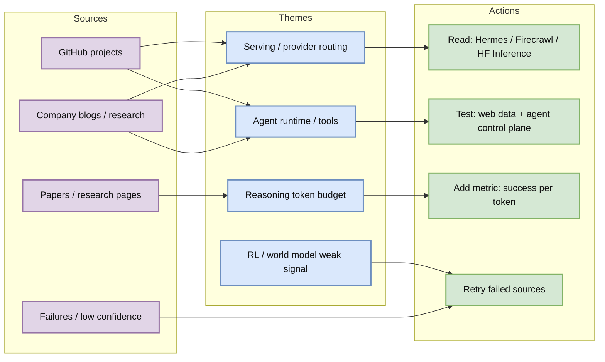
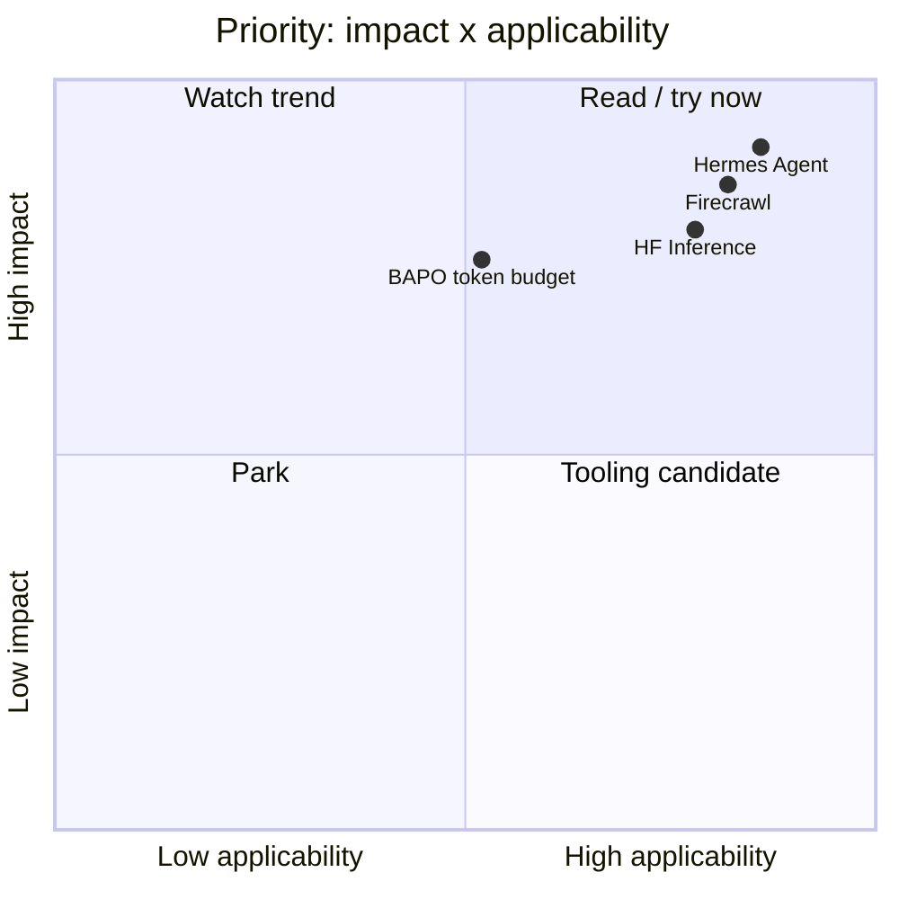

# AI Radar Daily - 2026-06-15

> Generated: 2026-06-15 09:00 BJT
> Scope: AI Infra / LLM / RL / Agent / Eval / Serving / Training / Post-training / World Model
> Dashboard-first note. Detail pages carry deeper interpretation.

## 0. 今日结论

- Agent engineering is the strongest signal today: Hermes Agent, ECC, Firecrawl, OpenHands and browser-use dominate the growth list.
- Serving is shifting toward provider routing and budgeted reasoning: watch Hugging Face Inference Providers and Microsoft CoT token complexity.
- RL/Game AI has no high-confidence fresh paper today; reusable signal is multi-step agent evaluation and cost-aware decision making.
- Must-read: [[GitHub/2026-06-15/NousResearch--hermes-agent]], [[GitHub/2026-06-15/firecrawl--firecrawl]], [[Industry/2026-06-15/Hugging-Face-Inference-Providers]], [[Papers/2026-06-15/Microsoft-Reasoning-about-Reasoning-BAPO]].

## 1. 今日态势图

## 2. 必读卡片区

> [!important] NousResearch/hermes-agent
> - Category: GitHub / Agent Infra
> - Key point: +764 stars from historical snapshot, strongest growth signal.
> - Why it matters: directly relevant to skills, plugins, gateway, tool permissions and agent orchestration.
> - Detail: [[GitHub/2026-06-15/NousResearch--hermes-agent]] / [web](https://github.com/dyt27666-oss/AI-news-report-obsidians/blob/main/GitHub/2026-06-15/NousResearch--hermes-agent.md) / [source](https://github.com/NousResearch/hermes-agent)

> [!important] firecrawl/firecrawl
> - Category: GitHub / Web data for agents
> - Key point: +383 stars; web search/scrape/interact at scale is core infrastructure for research agents.
> - Why it matters: retrieval quality controls the ceiling of RAG and automated research.
> - Detail: [[GitHub/2026-06-15/firecrawl--firecrawl]] / [web](https://github.com/dyt27666-oss/AI-news-report-obsidians/blob/main/GitHub/2026-06-15/firecrawl--firecrawl.md) / [source](https://github.com/firecrawl/firecrawl)

> [!tip] Hugging Face Inference Providers
> - Category: Industry / Serving
> - Key point: provider routing affects latency, cost, fallback and model compatibility.
> - Detail: [[Industry/2026-06-15/Hugging-Face-Inference-Providers]] / [source](https://huggingface.co/blog/inference/models)

## 3. 优先级矩阵

## 4. 分类清单

| Label | Category | Subcategory | Title | Summary | Why important | Obsidian detail | Web detail | Source |
|---|---|---|---|---|---|---|---|---|
| must-read | GitHub | Agent Infra | NousResearch/hermes-agent | Agent runtime/skills/gateway is rapidly gaining attention | Directly relevant to the user's AI automation stack | [[GitHub/2026-06-15/NousResearch--hermes-agent]] | [web](https://github.com/dyt27666-oss/AI-news-report-obsidians/blob/main/GitHub/2026-06-15/NousResearch--hermes-agent.md) | [source](https://github.com/NousResearch/hermes-agent) |
| must-read | GitHub | Web data | firecrawl/firecrawl | Web data extraction for agents is growing quickly | Research agents need reliable crawling and structured extraction | [[GitHub/2026-06-15/firecrawl--firecrawl]] | [web](https://github.com/dyt27666-oss/AI-news-report-obsidians/blob/main/GitHub/2026-06-15/firecrawl--firecrawl.md) | [source](https://github.com/firecrawl/firecrawl) |
| must-read | Blog | Serving | Hugging Face Inference Providers | Provider routing becomes a serving control-plane issue | Useful for fallback, cost and latency governance | [[Industry/2026-06-15/Hugging-Face-Inference-Providers]] | [web](https://github.com/dyt27666-oss/AI-news-report-obsidians/blob/main/Industry/2026-06-15/Hugging-Face-Inference-Providers.md) | [source](https://huggingface.co/blog/inference/models) |
| skim | Paper | Reasoning/Eval | Microsoft BAPO CoT Token Complexity | Reasoning token budget should be measured | Useful for success-per-token and latency-per-success eval | [[Papers/2026-06-15/Microsoft-Reasoning-about-Reasoning-BAPO]] | [web](https://github.com/dyt27666-oss/AI-news-report-obsidians/blob/main/Papers/2026-06-15/Microsoft-Reasoning-about-Reasoning-BAPO.md) | [source](https://www.microsoft.com/en-us/research/publication/reasoning-about-reasoning-bapo-bounds-on-chain-of-thought-token-complexity-in-llms/) |

## 5. 大厂资讯 / 工程博客 / Research

Company sources are explicitly marked by publisher and source type. Failed scans are kept in the matrix instead of being omitted.

### 5.1 公司来源扫描矩阵

| Company/Lab | Source/Column | Status | High-signal count | Representative item | Notes |
|---|---|---|---:|---|---|
| OpenAI | News / Research | access failed | 0 | none | 403 from website |
| Anthropic | News / Research | high-signal candidates | 4 | Claude Opus 4.8; agents in biology | details created |
| Google DeepMind | Blog / Research | low-confidence candidate | 1 | Google Antigravity | navigation-level scan |
| Meta AI | Blog / Research | low-confidence candidate | 1 | SAM 3.1 | weak LLM/RL relevance |
| NVIDIA | Technical Blog / AI | access failed | 0 | none | configured URL returned 404 |
| Microsoft | Research AI | high-signal candidates | 3 | Reasoning about Reasoning | detail created |
| Hugging Face | Blog / Papers / Releases | high-signal candidates | 3 | Inference Providers | detail created |
| Tencent | AI Lab / Tech Blog | no high-relevance new item / low confidence | 0 | none | page scan weak |
| ByteDance | Seed / Tech Blog | no high-relevance new item / low confidence | 0 | none | GitHub bytedance/deer-flow noted separately |
| SpaceAI | Blog / News | no high-relevance new item / low confidence | 0 | none | low AI infra relevance |

### 5.2 高相关大厂条目

| Label | Publisher | Source type | Title | Summary | Engineering impact | Obsidian detail | Web detail | Source |
|---|---|---|---|---|---|---|---|---|
| must-read | Anthropic | Product Announcement | Claude Opus 4.8 | Coding and agentic task signal | More pressure on sandbox, tool permissions and task eval | [[Industry/2026-06-15/Anthropic-Claude-Opus-4-8]] | [web](https://github.com/dyt27666-oss/AI-news-report-obsidians/blob/main/Industry/2026-06-15/Anthropic-Claude-Opus-4-8.md) | [source](https://www.anthropic.com/news/claude-opus-4-8) |
| skim | Anthropic | Research Blog | Agents in biology | Professional-domain agent eval signal | Useful for evidence tracing and expert validation | [[Industry/2026-06-15/Anthropic-Agents-in-Biology]] | [web](https://github.com/dyt27666-oss/AI-news-report-obsidians/blob/main/Industry/2026-06-15/Anthropic-Agents-in-Biology.md) | [source](https://www.anthropic.com/research/agents-in-biology) |
| must-read | Hugging Face | Product / Technical Blog | Inference Providers | Multi-provider inference routing | Directly affects serving fallback, SLA and tail latency | [[Industry/2026-06-15/Hugging-Face-Inference-Providers]] | [web](https://github.com/dyt27666-oss/AI-news-report-obsidians/blob/main/Industry/2026-06-15/Hugging-Face-Inference-Providers.md) | [source](https://huggingface.co/blog/inference/models) |
| skim | Microsoft | Research Publication | Reasoning about Reasoning | CoT token complexity and budget | Useful for serving cost control and post-training eval | [[Industry/2026-06-15/Microsoft-Reasoning-about-Reasoning-BAPO]] | [web](https://github.com/dyt27666-oss/AI-news-report-obsidians/blob/main/Industry/2026-06-15/Microsoft-Reasoning-about-Reasoning-BAPO.md) | [source](https://www.microsoft.com/en-us/research/publication/reasoning-about-reasoning-bapo-bounds-on-chain-of-thought-token-complexity-in-llms/) |

## 6. GitHub 高 star Top 10

| Rank | repo | stars | forks | language | updated_at | topics | Summary | Try? | Obsidian detail | Source |
|---:|---|---:|---:|---|---|---|---|---|---|---|
| 1 | affaan-m/ECC | 215515 | 33124 | JavaScript | 2026-06-15T01:00:05Z | ai-agents, anthropic, claude, claude-code, developer-tools | The agent harness performance optimization system. Skills, instincts, memory, security, an | yes | [[GitHub/2026-06-15/affaan-m--ECC]] | [GitHub](https://github.com/affaan-m/ECC) |
| 2 | NousResearch/hermes-agent | 193534 | 33853 | Python | 2026-06-15T01:01:17Z | ai, ai-agent, ai-agents, anthropic, chatgpt | The agent that grows with you | yes | [[GitHub/2026-06-15/NousResearch--hermes-agent]] | [GitHub](https://github.com/NousResearch/hermes-agent) |
| 3 | Significant-Gravitas/AutoGPT | 184940 | 46139 | Python | 2026-06-14T23:32:33Z | agentic-ai, agents, ai, artificial-intelligence, autonomous-agents | AutoGPT is the vision of accessible AI for everyone, to use and to build on. Our mission i | yes | not created | [GitHub](https://github.com/Significant-Gravitas/AutoGPT) |
| 4 | ollama/ollama | 174170 | 16617 | Go | 2026-06-15T00:53:59Z | deepseek, gemma, gemma3, glm, go | Get up and running with Kimi-K2.6, GLM-5.1, MiniMax, DeepSeek, gpt-oss, Qwen, Gemma and ot | watch | not created | [GitHub](https://github.com/ollama/ollama) |
| 5 | f/prompts.chat | 163729 | 21234 | HTML | 2026-06-15T00:40:53Z | ai, artificial-intelligence, awesome-list, chatgpt, chatgpt-prompts | f.k.a. Awesome ChatGPT Prompts. Share, discover, and collect prompts from the community. F | watch | not created | [GitHub](https://github.com/f/prompts.chat) |
| 6 | huggingface/transformers | 161587 | 33499 | Python | 2026-06-15T00:14:21Z | audio, deep-learning, deepseek, gemma, glm | 🤗 Transformers: the model-definition framework for state-of-the-art machine learning model | yes | not created | [GitHub](https://github.com/huggingface/transformers) |
| 7 | langflow-ai/langflow | 149666 | 9267 | Python | 2026-06-15T00:28:34Z | agents, chatgpt, generative-ai, large-language-models, multiagent | Langflow is a powerful tool for building and deploying AI-powered agents and workflows. | yes | not created | [GitHub](https://github.com/langflow-ai/langflow) |
| 8 | langgenius/dify | 145205 | 22845 | TypeScript | 2026-06-15T00:53:46Z | agent, agentic-ai, agentic-framework, agentic-workflow, ai | Production-ready platform for agentic workflow development. | yes | not created | [GitHub](https://github.com/langgenius/dify) |
| 9 | open-webui/open-webui | 141521 | 20336 | Python | 2026-06-15T00:51:39Z | ai, llm, llm-ui, llm-webui, llms | User-friendly AI Interface (Supports Ollama, OpenAI API, ...) | yes | not created | [GitHub](https://github.com/open-webui/open-webui) |
| 10 | langchain-ai/langchain | 139281 | 23087 | Python | 2026-06-15T00:02:43Z | agents, ai, ai-agents, anthropic, chatgpt | The agent engineering platform. | yes | not created | [GitHub](https://github.com/langchain-ai/langchain) |

## 7. GitHub star 增长最快 Top 10

Baseline available: Automation/state/github-stars-2026-06-14.json. This is real historical snapshot delta, not cold-start proxy.

| Rank | repo | stars_delta | stars | forks | language | updated_at | Basis | Summary | Obsidian detail | Source |
|---:|---|---:|---:|---:|---|---|---|---|---|---|
| 1 | NousResearch/hermes-agent | 764 | 193534 | 33853 | Python | 2026-06-15T01:01:17Z | historical_snapshot | The agent that grows with you | [[GitHub/2026-06-15/NousResearch--hermes-agent]] | [GitHub](https://github.com/NousResearch/hermes-agent) |
| 2 | affaan-m/ECC | 604 | 215515 | 33124 | JavaScript | 2026-06-15T01:00:05Z | historical_snapshot | The agent harness performance optimization system. Skills, instincts, memory, security, an | [[GitHub/2026-06-15/affaan-m--ECC]] | [GitHub](https://github.com/affaan-m/ECC) |
| 3 | rohitg00/ai-engineering-from-scratch | 489 | 32436 | 5320 | Python | 2026-06-15T00:56:43Z | historical_snapshot | Learn it. Build it. Ship it for others. | [[GitHub/2026-06-15/rohitg00--ai-engineering-from-scratch]] | [GitHub](https://github.com/rohitg00/ai-engineering-from-scratch) |
| 4 | firecrawl/firecrawl | 383 | 132774 | 7797 | TypeScript | 2026-06-15T00:57:55Z | historical_snapshot | The API to search, scrape, and interact with the web at scale. 🔥 | [[GitHub/2026-06-15/firecrawl--firecrawl]] | [GitHub](https://github.com/firecrawl/firecrawl) |
| 5 | JuliusBrussee/caveman | 335 | 72513 | 4089 | JavaScript | 2026-06-15T00:53:55Z | historical_snapshot | 🪨 why use many token when few token do trick — Claude Code skill that cuts 65% of tokens b | [[GitHub/2026-06-15/JuliusBrussee--caveman]] | [GitHub](https://github.com/JuliusBrussee/caveman) |
| 6 | TauricResearch/TradingAgents | 321 | 86152 | 16642 | Python | 2026-06-15T01:00:01Z | historical_snapshot | TradingAgents: Multi-Agents LLM Financial Trading Framework | [[GitHub/2026-06-15/TauricResearch--TradingAgents]] | [GitHub](https://github.com/TauricResearch/TradingAgents) |
| 7 | asgeirtj/system_prompts_leaks | 201 | 42191 | 7008 | JavaScript | 2026-06-15T00:58:58Z | historical_snapshot | Extracted system prompts from Anthropic - Claude Fable 5, Opus 4.8, Claude Code, Claude De | not created | [GitHub](https://github.com/asgeirtj/system_prompts_leaks) |
| 8 | OpenHands/OpenHands | 169 | 77065 | 9794 | Python | 2026-06-15T00:42:33Z | historical_snapshot | 🙌 OpenHands: AI-Driven Development | not created | [GitHub](https://github.com/OpenHands/OpenHands) |
| 9 | ruvnet/ruflo | 162 | 59482 | 6878 | TypeScript | 2026-06-15T00:42:59Z | historical_snapshot | 🌊 The leading agent meta-harness for Claude. Deploy intelligent multi-agent swarms, coordi | not created | [GitHub](https://github.com/ruvnet/ruflo) |
| 10 | browser-use/browser-use | 134 | 98824 | 11030 | Python | 2026-06-15T00:57:10Z | historical_snapshot | 🌐 Make websites accessible for AI agents. Automate tasks online with ease. | not created | [GitHub](https://github.com/browser-use/browser-use) |

## 8. 论文

arXiv and Semantic Scholar both returned timeout/429 today, so only a company research-page paper candidate is included. Source and source type are explicit.

### 8.1 Reasoning / Eval / Serving Cost

| Label | Paper source | Paper | Authors/org | Summary | Value | Obsidian detail | Web detail | PDF/Source |
|---|---|---|---|---|---|---|---|---|
| skim | Microsoft Research / company research page | Reasoning about Reasoning: BAPO Bounds on Chain-of-Thought Token Complexity in LLMs | Microsoft Research | CoT token complexity and budgeted reasoning | Add success-per-token and budgeted reasoning metrics | [[Papers/2026-06-15/Microsoft-Reasoning-about-Reasoning-BAPO]] | [web](https://github.com/dyt27666-oss/AI-news-report-obsidians/blob/main/Papers/2026-06-15/Microsoft-Reasoning-about-Reasoning-BAPO.md) | [source](https://www.microsoft.com/en-us/research/publication/reasoning-about-reasoning-bapo-bounds-on-chain-of-thought-token-complexity-in-llms/) |

## 9. 资讯 / 其他 GitHub 项目

| Label | Source | Title | Summary | Use | Obsidian detail | Web detail | Original |
|---|---|---|---|---|---|---|---|
| skim | GitHub | OpenHands/OpenHands | Coding agent keeps growing | Sandbox and coding-agent eval reference | [[GitHub/2026-06-15/OpenHands--OpenHands]] | [web](https://github.com/dyt27666-oss/AI-news-report-obsidians/blob/main/GitHub/2026-06-15/OpenHands--OpenHands.md) | [source](https://github.com/OpenHands/OpenHands) |
| skim | GitHub | browser-use/browser-use | Browser automation agent | Web-task benchmark and failure taxonomy | [[GitHub/2026-06-15/browser-use--browser-use]] | [web](https://github.com/dyt27666-oss/AI-news-report-obsidians/blob/main/GitHub/2026-06-15/browser-use--browser-use.md) | [source](https://github.com/browser-use/browser-use) |

## 10. 按主题索引

### AI Infra / Serving / Training

- [[Industry/2026-06-15/Hugging-Face-Inference-Providers]] - provider routing and serving governance.
- [[Papers/2026-06-15/Microsoft-Reasoning-about-Reasoning-BAPO]] - reasoning token budget.

### LLM / Agent / RAG / Evaluation

- [[GitHub/2026-06-15/NousResearch--hermes-agent]] - agent runtime and skills.
- [[GitHub/2026-06-15/firecrawl--firecrawl]] - web data ingestion for agents.

### RL / Game AI / World Model

- No high-confidence new RL paper today; reuse budgeted multi-step eval ideas from the Microsoft reasoning item.

## 11. 值得后续深挖

| Label | Category | Subcategory | Title | Follow-up | Detail | Source |
|---|---|---|---|---|---|---|
| follow-up | Paper | Reasoning eval | Microsoft BAPO | Retry PDF/Semantic Scholar later | [[Papers/2026-06-15/Microsoft-Reasoning-about-Reasoning-BAPO]] | [source](https://www.microsoft.com/en-us/research/publication/reasoning-about-reasoning-bapo-bounds-on-chain-of-thought-token-complexity-in-llms/) |
| follow-up | Source fix | NVIDIA | Technical blog URL 404 | Switch to RSS/site search next run | not created | [source](https://developer.nvidia.com/blog/category/artificial-intelligence/) |
| follow-up | Source fix | OpenAI | Website 403 | Try RSS/sitemap/mirror next run | not created | [source](https://openai.com/news/) |

## 12. 采集失败或低置信来源

- GitHub API: later queries hit 403 rate limit, but 164 repos were collected and snapshot was saved.
- arXiv: timeout/429, no high-confidence arXiv paper included.
- Semantic Scholar: 429, no citation data today.
- OpenAI: 403.
- NVIDIA: configured URL returned 404.
- Google DeepMind / Meta AI / Tencent / ByteDance / SpaceAI: scanned but no strong high-confidence item.

## 13. Tags

#ai-radar #daily #ai-infra #llm #rl #agent #serving
