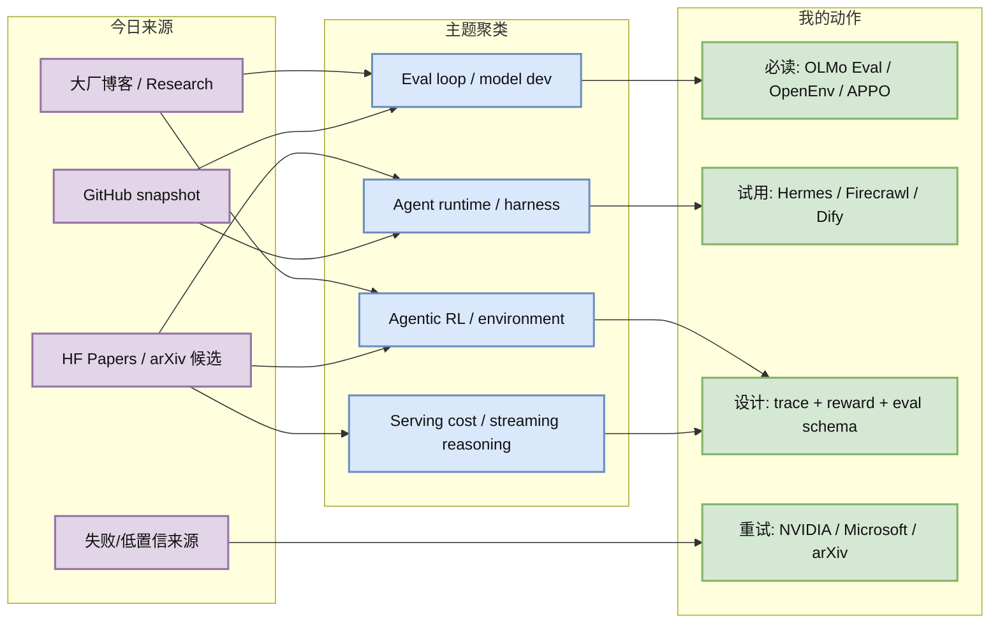
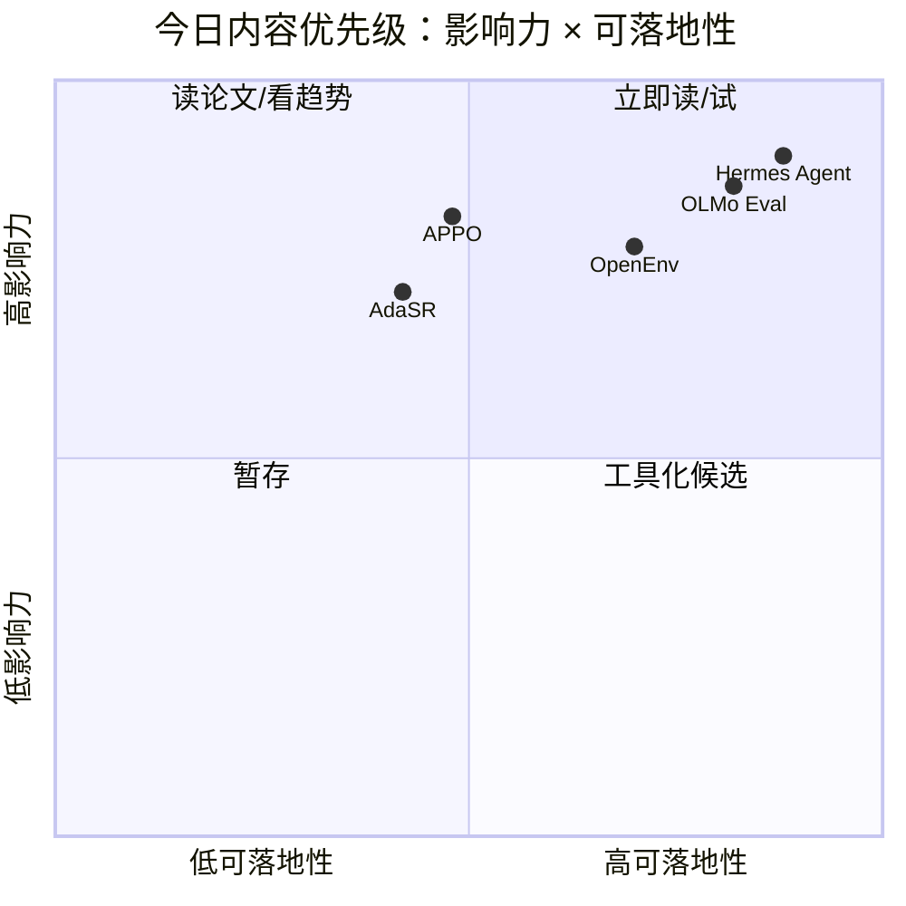

# AI Radar Daily - 2026-06-16

> 生成时间：2026-06-16 09:00 BJT
> 范围：AI Infra / LLM / RL / Agent / Eval / Serving / Training / Post-training / World Model
> 说明：日报是导航页；详情页负责深度理解。GitHub snapshot: `Automation/state/github-stars-2026-06-16.json`。

## 0. 今日结论

- 今日最强信号是 **Agent 工程与 agentic RL**：Hermes Agent、ECC、caveman、OpenHands 继续增长，论文侧出现 APPO、HarnessX、Graph Memory、AdaSR 等 agent/runtime/eval 候选。
- 对 AI Infra 的直接影响：需要把 agent harness、trace、memory、eval、权限和 web data ingestion 当成平台组件，而不是脚本 glue code。
- 对 LLM 训练 / 推理 / Agent 的影响：eval 正在从榜单变成持续开发回路；streaming reasoning 和过程级 RL 会把 success-per-token、latency-per-success 纳入核心指标。
- 对 RL / 游戏模型训练的影响：OpenEnv 和 APPO 的组合提示“环境标准化 + 过程级策略优化”会影响未来 agentic RL 与游戏环境并行训练。
- 建议今天深读：[[Industry/2026-06-16/HF-OLMo-Eval]]、[[Industry/2026-06-16/HF-OpenEnv-Agentic-RL]]、[[Papers/2026-06-16/APPO-Agentic-Procedural-Policy-Optimization]]、[[GitHub/2026-06-16/NousResearch--hermes-agent]]。

## 1. 今日态势图

## 2. 必读卡片区

> [!important] olmo-eval: evaluation workbench
> - 大类：博客 / 工程工具
> - 小类：Hugging Face / Allen AI / Eval
> - 重点：把评测放进模型开发循环，不再把 eval 当作发布前一次性跑分。
> - 为什么重要：post-training/RL 每轮数据、奖励、SFT/RL 变更都需要可追踪 eval，否则无法判断训练是否真的进步。
> - 详情：[[Industry/2026-06-16/HF-OLMo-Eval]] / [网页详情](https://github.com/dyt27666-oss/AI-news-report-obsidians/blob/main/Industry/2026-06-16/HF-OLMo-Eval.md) / [原文](https://huggingface.co/blog/allenai/olmo-eval)

> [!important] APPO: Agentic Procedural Policy Optimization
> - 大类：论文
> - 小类：Agentic RL / Post-training
> - 重点：把优化对象从答案扩展到 agent 的 procedure / 多步行为。
> - 为什么重要：这与工具调用、游戏环境、web agent、long-horizon task 的失败归因强相关。
> - 详情：[[Papers/2026-06-16/APPO-Agentic-Procedural-Policy-Optimization]] / [网页详情](https://github.com/dyt27666-oss/AI-news-report-obsidians/blob/main/Papers/2026-06-16/APPO-Agentic-Procedural-Policy-Optimization.md) / [原文](https://arxiv.org/abs/2606.12384)

> [!tip] NousResearch/hermes-agent
> - 大类：GitHub
> - 小类：Agent Infra
> - 重点：真实历史 snapshot 日增 +924，说明 skills/plugins/gateway/tool 权限这类 agent runtime 需求继续放大。
> - 为什么重要：它直接对应用户的自动化工作流和 Obsidian-first agent 知识库。
> - 详情：[[GitHub/2026-06-16/NousResearch--hermes-agent]] / [网页详情](https://github.com/dyt27666-oss/AI-news-report-obsidians/blob/main/GitHub/2026-06-16/NousResearch--hermes-agent.md) / [原文](https://github.com/NousResearch/hermes-agent)

> [!tip] OpenEnv for Agentic RL
> - 大类：博客 / 社区
> - 小类：Agentic RL environment
> - 重点：环境标准化与开源社区支持正在成为 agentic RL 的基础层。
> - 为什么重要：对 RL 游戏模型训练工程师而言，环境接口、rollout 并行、奖励定义和 benchmark 可复现性就是训练效率。
> - 详情：[[Industry/2026-06-16/HF-OpenEnv-Agentic-RL]] / [网页详情](https://github.com/dyt27666-oss/AI-news-report-obsidians/blob/main/Industry/2026-06-16/HF-OpenEnv-Agentic-RL.md) / [原文](https://huggingface.co/blog/openenv-agentic-rl)

## 3. 优先级矩阵

## 4. 分类清单

| 标签 | 大类 | 小类 | 标题 | 重点概括 | 为什么重要 | Obsidian 详情 | 网页详情 | 原文 |
|---|---|---|---|---|---|---|---|---|
| 必读 | 博客 | Hugging Face / Eval | olmo-eval | 把 eval 变成模型开发循环的一等公民 | 对 post-training、RL 和模型迭代闭环最直接 | [[Industry/2026-06-16/HF-OLMo-Eval]] | [网页详情](https://github.com/dyt27666-oss/AI-news-report-obsidians/blob/main/Industry/2026-06-16/HF-OLMo-Eval.md) | [原文](https://huggingface.co/blog/allenai/olmo-eval) |
| 必读 | GitHub | Agent Infra | NousResearch/hermes-agent | 真实日增 +924，agent runtime/skills/gateway 继续吸引注意力 | 与用户当前自动化、工具权限、技能系统高度相关 | [[GitHub/2026-06-16/NousResearch--hermes-agent]] | [网页详情](https://github.com/dyt27666-oss/AI-news-report-obsidians/blob/main/GitHub/2026-06-16/NousResearch--hermes-agent.md) | [原文](https://github.com/NousResearch/hermes-agent) |
| 必读 | 论文 | Agentic RL | APPO | 过程级 agent policy optimization 信号 | 可能影响多步工具调用和环境交互训练范式 | [[Papers/2026-06-16/APPO-Agentic-Procedural-Policy-Optimization]] | [网页详情](https://github.com/dyt27666-oss/AI-news-report-obsidians/blob/main/Papers/2026-06-16/APPO-Agentic-Procedural-Policy-Optimization.md) | [原文](https://arxiv.org/abs/2606.12384) |
| 可 skim | 博客 | Hugging Face / Agentic RL | OpenEnv for Agentic RL | 开源社区推动 agentic RL 环境标准化 | 环境接口会决定 rollout、奖励和 benchmark 可复现性 | [[Industry/2026-06-16/HF-OpenEnv-Agentic-RL]] | [网页详情](https://github.com/dyt27666-oss/AI-news-report-obsidians/blob/main/Industry/2026-06-16/HF-OpenEnv-Agentic-RL.md) | [原文](https://huggingface.co/blog/openenv-agentic-rl) |
| 可 skim | GitHub | Web data / Agent | firecrawl/firecrawl | 真实日增 +436，web 数据基础设施继续增长 | research agent/RAG 的上限高度依赖抓取与结构化质量 | [[GitHub/2026-06-16/firecrawl--firecrawl]] | [网页详情](https://github.com/dyt27666-oss/AI-news-report-obsidians/blob/main/GitHub/2026-06-16/firecrawl--firecrawl.md) | [原文](https://github.com/firecrawl/firecrawl) |

## 5. 大厂资讯 / 工程博客 / Research

大厂博客已显式标注发布方/大厂和栏目/来源类型；没有高相关新项的公司仍保留在扫描矩阵中。

### 5.1 公司来源扫描矩阵

| 公司/实验室 | 来源/栏目 | 今日状态 | 高相关条数 | 代表条目 | 备注 |
|---|---|---|---:|---|---|
| OpenAI | News / Partner Network | 高相关新项 | 1 | Introducing the OpenAI Partner Network | 企业 AI 部署生态信号；需要关注代理、权限、审计和集成伙伴。 |
| Anthropic | News / Policy | 高相关新项 | 2 | Policy on the AI Exponential；Claude Corps | 政策与人才供给信号强，但工程细节较少。 |
| Google DeepMind | Blog / Research | 无高相关新项 / 低置信 | 0 | 无 | 页面可访问但今日抓取未发现强相关 AI Infra/RL/Serving 新项。 |
| Meta AI | Blog / Research | 高相关候选 | 1 | Scaling How We Build and Test Our Most Advanced AI | 偏模型开发与测试流程，对大规模评测工程有参考价值。 |
| NVIDIA | Technical Blog / AI | 访问失败 | 0 | 无 | 配置 URL 404 / feed 空返回；需后续切换到 NVIDIA blog RSS 或站内搜索。 |
| Microsoft | Research AI | 访问失败 / 低置信 | 0 | 无 | 研究页 403；未纳入新项，保留为失败来源。 |
| Hugging Face | Blog / Papers / Releases | 高相关新项 | 3 | olmo-eval；OpenEnv for Agentic RL；PyTorch fused MLP | eval、agentic RL、kernel/profiling 信号都与用户画像相关。 |
| 腾讯 | AI Lab / 技术博客 | 无高相关新项 / 低置信 | 0 | 无 | 页面可访问但抓取未发现强相关新项。 |
| 字节 | Seed / 技术博客 | 无高相关新项 / 低置信 | 0 | 无 | Seed 页面可访问但未发现今日强相关新项。 |
| SpaceAI | Blog / News | 无高相关新项 / 低置信 | 0 | 无 | 内容偏去中心化算力叙事，AI Infra 相关性不足。 |

### 5.2 高相关大厂条目

| 标签 | 发布方/大厂 | 栏目/来源 | 标题 | 重点概括 | 工程/算法影响 | Obsidian 详情 | 网页详情 | 原文 |
|---|---|---|---|---|---|---|---|---|
| 可 skim | OpenAI | News / Partner Network | Introducing the OpenAI Partner Network | OpenAI 用伙伴网络和 1.5 亿美元投入推动企业 AI 落地，重点不是新模型，而是部署、集成、转型和规模化采用。 | 对 AI Infra 的意义在于企业 Agent 进入存量系统后，权限、审计、数据边界、成本治理会成为部署主战场。 | [[Industry/2026-06-16/OpenAI-Partner-Network]] | [网页详情](https://github.com/dyt27666-oss/AI-news-report-obsidians/blob/main/Industry/2026-06-16/OpenAI-Partner-Network.md) | [原文](https://openai.com/index/introducing-openai-partner-network) |
| 可 skim | Anthropic | Policy / Company Research Signal | Policy on the AI Exponential | Anthropic 继续强调 AI 能力指数级增长与治理滞后之间的张力，释放出安全评估、能力监控和政策接口的重要性。 | 对 Agent/Eval 工程有直接信号：高能力模型上线前后的 capability eval、cyber eval、监控和可追溯性会变成平台能力。 | [[Industry/2026-06-16/Anthropic-AI-Exponential-Policy]] | [网页详情](https://github.com/dyt27666-oss/AI-news-report-obsidians/blob/main/Industry/2026-06-16/Anthropic-AI-Exponential-Policy.md) | [原文](https://www.anthropic.com/policy-on-the-ai-exponential) |
| 可 skim | Meta AI | Engineering / Research Blog | Scaling How We Build and Test Our Most Advanced AI | Meta 将“构建与测试先进 AI”作为规模化工程问题，核心看点是测试流水线、评估覆盖和迭代速度，而不是单个模型指标。 | 对大模型工程师有价值：当模型/agent 复杂度上升，离线 benchmark、自动化红队、线上回归与发布门禁会决定迭代速度。 | [[Industry/2026-06-16/Meta-Scaling-Advanced-AI-Test]] | [网页详情](https://github.com/dyt27666-oss/AI-news-report-obsidians/blob/main/Industry/2026-06-16/Meta-Scaling-Advanced-AI-Test.md) | [原文](https://ai.meta.com/blog/scaling-how-we-build-test-advanced-ai/) |
| 必读 | Hugging Face / Allen AI | Engineering Blog / Evaluation Tooling | olmo-eval: An evaluation workbench for the model development loop | olmo-eval 把评测工作台嵌入模型开发循环，重点是把 eval 从一次性榜单变成持续迭代工具。 | 对训练和 post-training 很关键：每轮数据、奖励、SFT/RL 变更都需要可追踪 eval，否则无法做可靠 ablation。 | [[Industry/2026-06-16/HF-OLMo-Eval]] | [网页详情](https://github.com/dyt27666-oss/AI-news-report-obsidians/blob/main/Industry/2026-06-16/HF-OLMo-Eval.md) | [原文](https://huggingface.co/blog/allenai/olmo-eval) |
| 必读 | Hugging Face | Community / Agentic RL | The Open Source Community is backing OpenEnv for Agentic RL | OpenEnv 聚焦 agentic RL 环境生态，强调可复现环境、任务接口和社区共享。 | 对 RL 游戏模型训练和 Agent RL 都有价值：环境标准化会直接影响 rollout 吞吐、奖励定义、失败归因和 benchmark 可比性。 | [[Industry/2026-06-16/HF-OpenEnv-Agentic-RL]] | [网页详情](https://github.com/dyt27666-oss/AI-news-report-obsidians/blob/main/Industry/2026-06-16/HF-OpenEnv-Agentic-RL.md) | [原文](https://huggingface.co/blog/openenv-agentic-rl) |

## 6. GitHub 高 star Top 10

| 排名 | repo | stars | forks | language | updated_at | topics | 重点概括 | 是否值得试用 | Obsidian 详情 | 原文 |
|---:|---|---:|---:|---|---|---|---|---|---|---|
| 1 | affaan-m/ECC | 216166 | 33220 | JavaScript | 2026-06-16T00:59:41Z | ai-agents, anthropic, claude, claude-code, developer-tools,… | The agent harness performance optimization system. Skills, instincts, memo… | 是 | [[GitHub/2026-06-16/affaan-m--ECC]] | [GitHub](https://github.com/affaan-m/ECC) |
| 2 | tensorflow/tensorflow | 195677 | 75185 | C++ | 2026-06-16T01:00:20Z | deep-learning, deep-neural-networks, distributed, machine-l… | An Open Source Machine Learning Framework for Everyone | 是 | 未创建 | [GitHub](https://github.com/tensorflow/tensorflow) |
| 3 | NousResearch/hermes-agent | 194458 | 34097 | Python | 2026-06-16T01:01:03Z | ai, ai-agent, ai-agents, anthropic, chatgpt, claude, claude… | The agent that grows with you | 是 | [[GitHub/2026-06-16/NousResearch--hermes-agent]] | [GitHub](https://github.com/NousResearch/hermes-agent) |
| 4 | Significant-Gravitas/AutoGPT | 184960 | 46139 | Python | 2026-06-15T23:18:23Z | agentic-ai, agents, ai, artificial-intelligence, autonomous… | AutoGPT is the vision of accessible AI for everyone, to use and to build o… | 是 | 未创建 | [GitHub](https://github.com/Significant-Gravitas/AutoGPT) |
| 5 | ollama/ollama | 174260 | 16635 | Go | 2026-06-16T00:50:30Z | deepseek, gemma, gemma3, glm, go, golang, gpt-oss, llama, l… | Get up and running with Kimi-K2.6, GLM-5.1, MiniMax, DeepSeek, gpt-oss, Qw… | 是 | [[GitHub/2026-06-16/ollama--ollama]] | [GitHub](https://github.com/ollama/ollama) |
| 6 | f/prompts.chat | 163780 | 21239 | HTML | 2026-06-16T00:56:35Z | ai, artificial-intelligence, awesome-list, chatgpt, chatgpt… | f.k.a. Awesome ChatGPT Prompts. Share, discover, and collect prompts from … | 是 | 未创建 | [GitHub](https://github.com/f/prompts.chat) |
| 7 | huggingface/transformers | 161612 | 33515 | Python | 2026-06-16T00:51:34Z | audio, deep-learning, deepseek, gemma, glm, hacktoberfest, … | 🤗 Transformers: the model-definition framework for state-of-the-art machin… | 是 | [[GitHub/2026-06-16/huggingface--transformers]] | [GitHub](https://github.com/huggingface/transformers) |
| 8 | langflow-ai/langflow | 149716 | 9276 | Python | 2026-06-16T00:12:31Z | agents, chatgpt, generative-ai, large-language-models, mult… | Langflow is a powerful tool for building and deploying AI-powered agents a… | 是 | 未创建 | [GitHub](https://github.com/langflow-ai/langflow) |
| 9 | langgenius/dify | 145351 | 22861 | TypeScript | 2026-06-16T00:47:13Z | agent, agentic-ai, agentic-framework, agentic-workflow, ai,… | Production-ready platform for agentic workflow development. | 观察 | [[GitHub/2026-06-16/langgenius--dify]] | [GitHub](https://github.com/langgenius/dify) |
| 10 | open-webui/open-webui | 141668 | 20360 | Python | 2026-06-16T00:58:38Z | ai, llm, llm-ui, llm-webui, llms, mcp, ollama, ollama-webui… | User-friendly AI Interface (Supports Ollama, OpenAI API, ...) | 观察 | 未创建 | [GitHub](https://github.com/open-webui/open-webui) |

## 7. GitHub star 增长最快 Top 10

Baseline available: `Automation/state/github-stars-2026-06-15.json`。以下为真实 historical snapshot delta，不是冷启动代理。

| 排名 | repo | stars_delta | stars | forks | language | updated_at | 增长依据 | 重点概括 | Obsidian 详情 | 原文 |
|---:|---|---:|---:|---:|---|---|---|---|---|---|
| 1 | elder-plinius/CL4R1T4S | 2681 | 39740 | 7723 | Unknown | 2026-06-16T01:00:15Z | historical_snapshot | LEAKED SYSTEM PROMPTS FOR CHATGPT, CLAUDE, GEMINI, GROK, PERPLEXITY, CURSO… | [[GitHub/2026-06-16/elder-plinius--CL4R1T4S]] | [GitHub](https://github.com/elder-plinius/CL4R1T4S) |
| 2 | NousResearch/hermes-agent | 924 | 194458 | 34097 | Python | 2026-06-16T01:01:03Z | historical_snapshot | The agent that grows with you | [[GitHub/2026-06-16/NousResearch--hermes-agent]] | [GitHub](https://github.com/NousResearch/hermes-agent) |
| 3 | affaan-m/ECC | 651 | 216166 | 33220 | JavaScript | 2026-06-16T00:59:41Z | historical_snapshot | The agent harness performance optimization system. Skills, instincts, memo… | [[GitHub/2026-06-16/affaan-m--ECC]] | [GitHub](https://github.com/affaan-m/ECC) |
| 4 | rohitg00/ai-engineering-from-scratch | 644 | 33080 | 5411 | Python | 2026-06-16T01:00:45Z | historical_snapshot | Learn it. Build it. Ship it for others. | [[GitHub/2026-06-16/rohitg00--ai-engineering-from-scratch]] | [GitHub](https://github.com/rohitg00/ai-engineering-from-scratch) |
| 5 | JuliusBrussee/caveman | 523 | 73036 | 4123 | JavaScript | 2026-06-16T01:00:17Z | historical_snapshot | 🪨 why use many token when few token do trick — Claude Code skill that cuts… | [[GitHub/2026-06-16/JuliusBrussee--caveman]] | [GitHub](https://github.com/JuliusBrussee/caveman) |
| 6 | firecrawl/firecrawl | 436 | 133210 | 7808 | TypeScript | 2026-06-16T01:00:44Z | historical_snapshot | The API to search, scrape, and interact with the web at scale. 🔥 | [[GitHub/2026-06-16/firecrawl--firecrawl]] | [GitHub](https://github.com/firecrawl/firecrawl) |
| 7 | TauricResearch/TradingAgents | 296 | 86448 | 16689 | Python | 2026-06-16T00:54:37Z | historical_snapshot | TradingAgents: Multi-Agents LLM Financial Trading Framework | 未创建 | [GitHub](https://github.com/TauricResearch/TradingAgents) |
| 8 | thedotmack/claude-mem | 284 | 82553 | 7142 | JavaScript | 2026-06-16T01:00:58Z | historical_snapshot | Persistent Context Across Sessions for Every Agent –  Captures everything … | 未创建 | [GitHub](https://github.com/thedotmack/claude-mem) |
| 9 | asgeirtj/system_prompts_leaks | 263 | 42454 | 7061 | JavaScript | 2026-06-16T00:58:24Z | historical_snapshot | Extracted system prompts from Anthropic - Claude Fable 5, Opus 4.8, Claude… | 未创建 | [GitHub](https://github.com/asgeirtj/system_prompts_leaks) |
| 10 | OpenHands/OpenHands | 168 | 77233 | 9813 | Python | 2026-06-16T00:46:11Z | historical_snapshot | 🙌 OpenHands: AI-Driven Development | 未创建 | [GitHub](https://github.com/OpenHands/OpenHands) |

## 8. 论文

今日 arXiv API 多次返回 429，因此论文候选主要来自 Hugging Face Papers 页面索引；每条均标注论文来源和来源类型，后续需要补读 PDF。

### 8.1 Agentic RL / Agent Memory / Streaming Reasoning

| 标签 | 论文来源 | 论文 | 作者/机构 | 重点概括 | 工程/研究价值 | Obsidian 详情 | 网页详情 | PDF/原文 |
|---|---|---|---|---|---|---|---|---|
| 可 skim | Hugging Face Papers / arXiv / 论文索引 / 预印本 | APPO: Agentic Procedural Policy Optimization | Hugging Face Papers listed authors | APPO 关注 agentic procedure 层面的 policy optimization，不只是答案级 RL，而是把多步过程、工具调用和程序化决策纳入优化对象。 | 适合跟踪 agent RL 从“结果奖励”走向“过程奖励/过程策略”的趋势。 | [[Papers/2026-06-16/APPO-Agentic-Procedural-Policy-Optimization]] | [网页详情](https://github.com/dyt27666-oss/AI-news-report-obsidians/blob/main/Papers/2026-06-16/APPO-Agentic-Procedural-Policy-Optimization.md) | [abs](https://arxiv.org/abs/2606.12384) / [pdf](https://arxiv.org/pdf/2606.12384) |
| 可 skim | Hugging Face Papers / arXiv / 论文索引 / 预印本 | Memory is Reconstructed, Not Retrieved: Graph Memory for LLM Agents | Hugging Face Papers listed authors | 把 agent memory 看成可重构图结构，而不是简单向量检索，强调关系、事件和上下文的动态重组。 | 对长期 agent、research agent 和任务恢复有直接价值：记忆系统要能解释、压缩和更新，而不是只做 top-k retrieval。 | [[Papers/2026-06-16/Graph-Memory-for-LLM-Agents]] | [网页详情](https://github.com/dyt27666-oss/AI-news-report-obsidians/blob/main/Papers/2026-06-16/Graph-Memory-for-LLM-Agents.md) | [abs](https://arxiv.org/abs/2606.06036) / [pdf](https://arxiv.org/pdf/2606.06036) |
| 可 skim | Hugging Face Papers / arXiv / 论文索引 / 预印本 | HarnessX: A Composable, Adaptive, and Evolvable Agent Harness Foundry | Hugging Face Papers listed authors | HarnessX 将 agent harness 作为可组合、可演化的基础设施，关注工具、环境、评测、记忆和控制面的组合。 | 与 AI Infra 强相关：agent 系统越来越像运行时，harness 设计会影响可靠性、权限隔离和可观测性。 | [[Papers/2026-06-16/HarnessX-Agent-Harness-Foundry]] | [网页详情](https://github.com/dyt27666-oss/AI-news-report-obsidians/blob/main/Papers/2026-06-16/HarnessX-Agent-Harness-Foundry.md) | [abs](https://arxiv.org/abs/2606.14249) / [pdf](https://arxiv.org/pdf/2606.14249) |
| 可 skim | Hugging Face Papers / arXiv / 论文索引 / 预印本 | AdaSR: Adaptive Streaming Reasoning with Hierarchical Relative Policy Optimization | Hugging Face Papers listed authors | AdaSR 关注流式推理中的自适应 reasoning，并用层级相对策略优化控制推理过程。 | 对 serving 很有用：流式推理如果能动态调节 token budget，可以降低尾延迟和无效 CoT 成本。 | [[Papers/2026-06-16/AdaSR-Adaptive-Streaming-Reasoning]] | [网页详情](https://github.com/dyt27666-oss/AI-news-report-obsidians/blob/main/Papers/2026-06-16/AdaSR-Adaptive-Streaming-Reasoning.md) | [abs](https://arxiv.org/abs/2606.14694) / [pdf](https://arxiv.org/pdf/2606.14694) |

## 9. 资讯 / 其他 GitHub 项目

| 标签 | 来源 | 标题 | 重点概括 | 对我有什么用 | Obsidian 详情 | 网页详情 | 原文 |
|---|---|---|---|---|---|---|---|
| 后续 | GitHub | OpenHands/OpenHands | 增长 +168，coding agent 基建持续活跃 | 可作为 sandbox、任务执行、代码代理评测参考 | [[GitHub/2026-06-16/OpenHands--OpenHands]] | [网页详情](https://github.com/dyt27666-oss/AI-news-report-obsidians/blob/main/GitHub/2026-06-16/OpenHands--OpenHands.md) | [原文](https://github.com/OpenHands/OpenHands) |
| 低置信 | GitHub | elder-plinius/CL4R1T4S | 增长 +2681，但主要是 system prompt leak，不是 AI Infra | 只作为安全/红队观察，不纳入工程试用 | 未创建 | 未创建 | [原文](https://github.com/elder-plinius/CL4R1T4S) |
| 后续 | GitHub | firecrawl/firecrawl | 增长 +436，web data API 对 research agent/RAG 重要 | 可试用抓取质量和结构化输出 | [[GitHub/2026-06-16/firecrawl--firecrawl]] | [网页详情](https://github.com/dyt27666-oss/AI-news-report-obsidians/blob/main/GitHub/2026-06-16/firecrawl--firecrawl.md) | [原文](https://github.com/firecrawl/firecrawl) |

## 10. 按主题索引

### AI Infra / Serving / Training

- [[Industry/2026-06-16/HF-OLMo-Eval]] - eval workbench 嵌入模型开发循环。
- [[Papers/2026-06-16/AdaSR-Adaptive-Streaming-Reasoning]] - streaming reasoning 与 token budget 控制。
- [[GitHub/2026-06-16/huggingface--transformers]] - 高 star 模型定义与工程生态。

### LLM / Agent / RAG / Evaluation

- [[GitHub/2026-06-16/NousResearch--hermes-agent]] - agent runtime / skills / gateway。
- [[GitHub/2026-06-16/affaan-m--ECC]] - agent harness performance optimization。
- [[Papers/2026-06-16/Graph-Memory-for-LLM-Agents]] - graph memory for LLM agents。
- [[Papers/2026-06-16/HarnessX-Agent-Harness-Foundry]] - composable agent harness。

### RL / Game AI / World Model

- [[Industry/2026-06-16/HF-OpenEnv-Agentic-RL]] - agentic RL 环境生态。
- [[Papers/2026-06-16/APPO-Agentic-Procedural-Policy-Optimization]] - procedure-level policy optimization。

### 公司 / 实验室

- OpenAI: [[Industry/2026-06-16/OpenAI-Partner-Network]]
- Anthropic: [[Industry/2026-06-16/Anthropic-AI-Exponential-Policy]]
- Meta AI: [[Industry/2026-06-16/Meta-Scaling-Advanced-AI-Test]]
- Hugging Face: [[Industry/2026-06-16/HF-OLMo-Eval]]、[[Industry/2026-06-16/HF-OpenEnv-Agentic-RL]]
- NVIDIA / Microsoft / 腾讯 / 字节 / SpaceAI: 今日无高置信详情页，见扫描矩阵。

## 11. 值得后续深挖

| 标签 | 大类 | 小类 | 标题 | 后续动作 | Obsidian 详情 | 原文 |
|---|---|---|---|---|---|---|
| 后续 | 论文 | Agentic RL | APPO | 读取 PDF，确认 reward/rollout/benchmark 设置 | [[Papers/2026-06-16/APPO-Agentic-Procedural-Policy-Optimization]] | [原文](https://arxiv.org/abs/2606.12384) |
| 后续 | 论文 | Serving cost | AdaSR | 看是否支持动态 token budget / streaming control | [[Papers/2026-06-16/AdaSR-Adaptive-Streaming-Reasoning]] | [原文](https://arxiv.org/abs/2606.14694) |
| 后续 | 来源修复 | NVIDIA | Technical Blog RSS | 修正 feed URL 或换站内搜索 | 未创建 | [原文](https://developer.nvidia.com/blog/category/artificial-intelligence/) |
| 后续 | 来源修复 | Microsoft | Research AI | 403 后尝试 RSS/Graph/search endpoint | 未创建 | [原文](https://www.microsoft.com/en-us/research/research-area/artificial-intelligence/) |

## 12. 采集失败或低置信来源

- GitHub API：成功保存 165 个 repo 的 snapshot；后续部分 query 触发 403 rate limit，但固定 Top 10 板块已生成。
- arXiv API：多次 429；今日论文使用 Hugging Face Papers 索引作为来源，详情页已标注“需补读 PDF”。
- Semantic Scholar：SSL/429 问题，未稳定获取 citation。
- NVIDIA：配置 URL 返回 404 或 feed 空结果。
- Microsoft Research：页面 403。
- Google DeepMind / 腾讯 / 字节 / SpaceAI：已扫但无强相关新项或低置信。

## 13. 归档标签

#ai-radar #daily #ai-infra #llm #rl #agent #eval #serving
