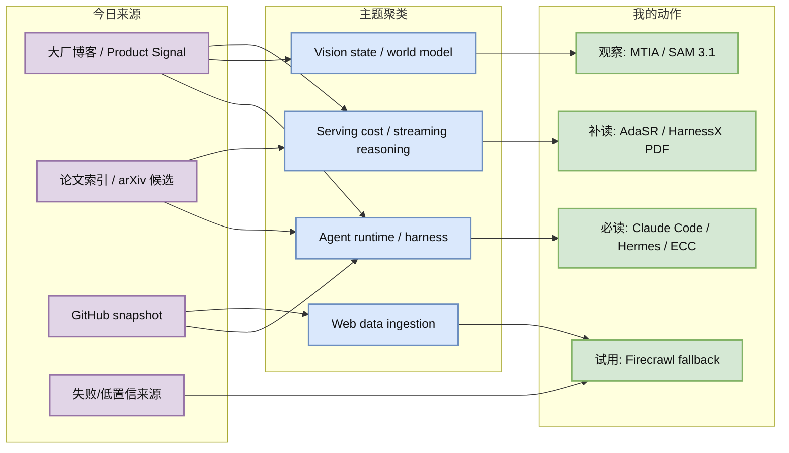
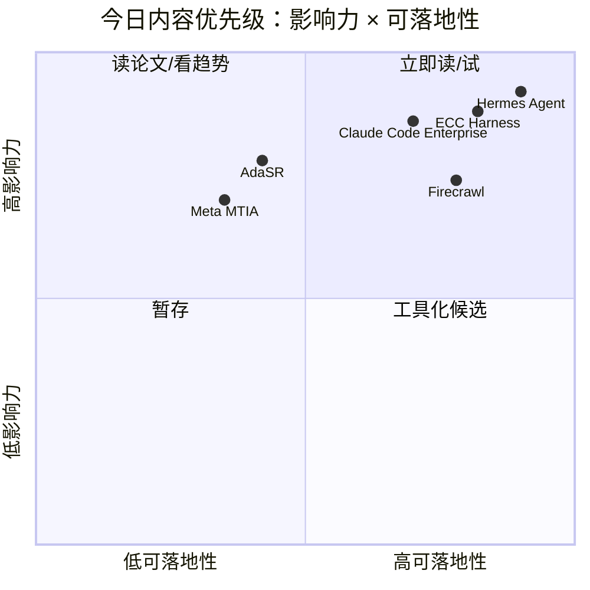

# AI Radar Daily - 2026-06-17

> 生成时间：2026-06-17 09:00 BJT
> 范围：AI Infra / LLM / RL / Agent / Eval / Serving / Training / Post-training / World Model
> 说明：日报是导航页；详情页负责深度理解。GitHub snapshot: `Automation/state/github-stars-2026-06-17.json`。

## 0. 今日结论

- 今日最强信号仍是 **Agent Runtime / Harness 工程化**：Hermes Agent、ECC、Claude Code Enterprise、claude-mem、OpenWebUI 的增长共同指向权限、记忆、技能、trace 和企业接入。
- 对 AI Infra 的直接影响：数据入口、agent harness、权限审计和 serving 成本会从“外围脚本”变成平台基础层。
- 对 LLM 训练 / 推理 / Agent 的影响：AdaSR 类 streaming reasoning 论文把 post-training reward 与 success-per-token / latency-per-success 连接起来，值得补读。
- 对 RL / 游戏模型训练的影响：SAM 3.1 的实时视觉检测/跟踪信号可迁移到对象级环境状态抽取和 world model 输入压缩。
- 建议今天深读：[[Industry/2026-06-17/Anthropic-Claude-Code-Enterprise-Signal]]、[[GitHub/2026-06-17/NousResearch--hermes-agent]]、[[GitHub/2026-06-17/affaan-m--ECC]]、[[Papers/2026-06-17/AdaSR-Adaptive-Streaming-Reasoning]]。

## 1. 今日态势图

## 2. 必读卡片区

> [!important] Claude Code / Enterprise Agent 工程信号
> - 大类：博客 / 资讯
> - 小类：Anthropic / Coding Agent / Enterprise Agent
> - 重点：Claude Code、Enterprise、Security、Chrome 等产品入口说明 coding agent 正从个人 CLI 转向企业权限、审计和安全工作流。
> - 为什么重要：这正对应 agent runtime 的核心工程问题：凭据、权限、trace、CI、浏览器操作和回滚。
> - 详情：[[Industry/2026-06-17/Anthropic-Claude-Code-Enterprise-Signal]] / [网页详情](https://github.com/dyt27666-oss/AI-news-report-obsidians/blob/main/Industry/2026-06-17/Anthropic-Claude-Code-Enterprise-Signal.md) / [原文](https://claude.com/product/claude-code)

> [!important] NousResearch/hermes-agent
> - 大类：GitHub
> - 小类：Agent Infra
> - 重点：真实 snapshot 日增 +903，skills/plugins/gateway/cron/Obsidian-first workflow 继续高热。
> - 为什么重要：用户当前日报系统本身就是 Hermes cron + Obsidian + GitHub push 的 dogfood，方向完全贴合。
> - 详情：[[GitHub/2026-06-17/NousResearch--hermes-agent]] / [网页详情](https://github.com/dyt27666-oss/AI-news-report-obsidians/blob/main/GitHub/2026-06-17/NousResearch--hermes-agent.md) / [原文](https://github.com/NousResearch/hermes-agent)

> [!tip] affaan-m/ECC
> - 大类：GitHub
> - 小类：Agent Harness
> - 重点：高 star 榜首且日增 +570，说明 agent harness 性能、记忆、安全和 token 优化是独立赛道。
> - 为什么重要：长任务 agent 的瓶颈常在外层 harness，而不是单个模型能力。
> - 详情：[[GitHub/2026-06-17/affaan-m--ECC]] / [网页详情](https://github.com/dyt27666-oss/AI-news-report-obsidians/blob/main/GitHub/2026-06-17/affaan-m--ECC.md) / [原文](https://github.com/affaan-m/ECC)

> [!tip] Firecrawl as Research Agent Ingestion
> - 大类：GitHub
> - 小类：Web Data / Agent Retrieval Infra
> - 重点：日增 +436，说明 web data extraction 仍是 RAG、research agent、自动日报的瓶颈。
> - 为什么重要：今天 OpenAI 403、NVIDIA 404、arXiv/S2 429 再次说明采集层可靠性会决定研究 agent 质量。
> - 详情：[[GitHub/2026-06-17/firecrawl--firecrawl]] / [网页详情](https://github.com/dyt27666-oss/AI-news-report-obsidians/blob/main/GitHub/2026-06-17/firecrawl--firecrawl.md) / [原文](https://github.com/firecrawl/firecrawl)

## 3. 优先级矩阵

## 4. 分类清单

| 标签 | 大类 | 小类 | 标题 | 重点概括 | 为什么重要 | Obsidian 详情 | 网页详情 | 原文 |
|---|---|---|---|---|---|---|---|---|
| 必读 | 资讯 | Anthropic / Agent | Claude Code Enterprise Signal | Coding agent 正转向企业权限、审计、安全和浏览器工作流 | 对 agent runtime/control plane 设计最直接 | [[Industry/2026-06-17/Anthropic-Claude-Code-Enterprise-Signal]] | [网页详情](https://github.com/dyt27666-oss/AI-news-report-obsidians/blob/main/Industry/2026-06-17/Anthropic-Claude-Code-Enterprise-Signal.md) | [原文](https://claude.com/product/claude-code) |
| 必读 | GitHub | Agent Infra | NousResearch/hermes-agent | 日增 +903，skills/plugins/gateway/cron 持续高热 | 与 Obsidian-first 自动研究工作流完全重合 | [[GitHub/2026-06-17/NousResearch--hermes-agent]] | [网页详情](https://github.com/dyt27666-oss/AI-news-report-obsidians/blob/main/GitHub/2026-06-17/NousResearch--hermes-agent.md) | [原文](https://github.com/NousResearch/hermes-agent) |
| 必读 | GitHub | Agent Harness | affaan-m/ECC | 高 star 榜首且增长 +570，agent harness 成为独立基础设施 | 长任务成功率依赖 harness、memory、security 和 token 优化 | [[GitHub/2026-06-17/affaan-m--ECC]] | [网页详情](https://github.com/dyt27666-oss/AI-news-report-obsidians/blob/main/GitHub/2026-06-17/affaan-m--ECC.md) | [原文](https://github.com/affaan-m/ECC) |
| 可 skim | GitHub | Web Data | firecrawl/firecrawl | 日增 +436，web extraction 对 research agent/RAG 重要 | 可作为大厂博客抓取失败 fallback | [[GitHub/2026-06-17/firecrawl--firecrawl]] | [网页详情](https://github.com/dyt27666-oss/AI-news-report-obsidians/blob/main/GitHub/2026-06-17/firecrawl--firecrawl.md) | [原文](https://github.com/firecrawl/firecrawl) |
| 可 skim | 论文 | Serving / Post-training | AdaSR | 自适应 streaming reasoning 连接 token budget 与 policy optimization | 可能直接影响 reasoning serving 成本模型 | [[Papers/2026-06-17/AdaSR-Adaptive-Streaming-Reasoning]] | [网页详情](https://github.com/dyt27666-oss/AI-news-report-obsidians/blob/main/Papers/2026-06-17/AdaSR-Adaptive-Streaming-Reasoning.md) | [原文](https://arxiv.org/abs/2606.14694) |
| 可 skim | 博客 | Meta AI / Hardware | MTIA Chips | Meta 自研 AI 芯片节奏体现硬件-模型-serving 协同优化 | 对大规模推理成本和硬件感知调度有趋势价值 | [[Industry/2026-06-17/Meta-MTIA-Scaling-AI-Chips]] | [网页详情](https://github.com/dyt27666-oss/AI-news-report-obsidians/blob/main/Industry/2026-06-17/Meta-MTIA-Scaling-AI-Chips.md) | [原文](https://ai.meta.com/blog/meta-mtia-scale-ai-chips-for-billions/) |

## 5. 大厂资讯 / 工程博客 / Research

大厂博客已显式标注发布方/大厂和栏目/来源类型；没有高相关新项的公司仍保留在扫描矩阵中。

### 5.1 公司来源扫描矩阵

| 公司/实验室 | 来源/栏目 | 今日状态 | 高相关条数 | 代表条目 | 备注 |
|---|---|---|---:|---|---|
| OpenAI | News / Research | 访问失败 | 0 | 无 | `openai.com/news` 返回 403；未抓到高相关新项，建议后续用 RSS/Firecrawl fallback。 |
| Anthropic | News / Product | 高相关产品信号 | 1 | Claude Code / Enterprise / Security | 页面可访问；产品入口强烈指向企业 coding agent 工程化。 |
| Google DeepMind | Blog / Research | 无高相关新项 / 低置信 | 0 | Gemini for Science 导航 | 页面可访问，但抓取片段偏导航/科学产品，无强 AI Infra/RL 新项。 |
| Meta AI | Blog / Research / Engineering | 高相关新项 | 3 | SAM 3.1；MTIA chips；Scaling AI testing | 视觉、硬件和测试流程均有工程信号；今日生成 2 个详情页。 |
| NVIDIA | Technical Blog / AI | 访问失败 | 0 | 无 | 配置 URL 返回 404；需要切换 NVIDIA Blog RSS 或站内搜索。 |
| Microsoft | Research AI / Blog | 低置信 | 0 | AI Frontiers 导航 | 页面可访问但抓取多为导航/研究院入口，未发现今日强相关新项。 |
| Hugging Face | Blog / Papers / Releases | 低置信 / 未发现强新项 | 0 | 无 | 页面可访问但本次正则提取未稳定获取条目；GitHub/论文侧补足。 |
| 腾讯 | AI Lab / 技术博客 | 无高相关新项 / 低置信 | 0 | 无 | 页面可访问但抓取未发现强相关 AI Infra/RL/Serving 新项。 |
| 字节 | Seed / 技术博客 | 无高相关新项 / 低置信 | 0 | 无 | Seed 页面可访问但未发现今日强相关新项。 |
| SpaceAI | Blog / News | 无高相关新项 / 低置信 | 0 | 无 | 内容偏去中心化算力/空间网络叙事，AI Infra 相关性不足。 |

### 5.2 高相关大厂条目

| 标签 | 发布方/大厂 | 栏目/来源 | 标题 | 重点概括 | 工程/算法影响 | Obsidian 详情 | 网页详情 | 原文 |
|---|---|---|---|---|---|---|---|---|
| 必读 | Anthropic | Product / Enterprise Agent Signal | Claude Code / Enterprise Agent 工程信号 | Claude Code、Enterprise、Security、Chrome 等产品入口说明 agent 正进入企业工程系统。 | 需要权限、凭据、审计、trace、浏览器动作、CI/安全门禁等 control plane 能力。 | [[Industry/2026-06-17/Anthropic-Claude-Code-Enterprise-Signal]] | [网页详情](https://github.com/dyt27666-oss/AI-news-report-obsidians/blob/main/Industry/2026-06-17/Anthropic-Claude-Code-Enterprise-Signal.md) | [原文](https://claude.com/product/claude-code) |
| 可 skim | Meta AI | AI Research / Product Blog | SAM 3.1: Faster and More Accessible Real-Time Video Detection and Tracking | SAM 3.1 强化实时视频检测和跟踪，信号是视觉状态抽取向实时可部署 primitive 演进。 | 对 world model、游戏/RL 环境 wrapper、多模态 agent 的对象级状态压缩有参考价值。 | [[Industry/2026-06-17/Meta-SAM-31-Video-Detection]] | [网页详情](https://github.com/dyt27666-oss/AI-news-report-obsidians/blob/main/Industry/2026-06-17/Meta-SAM-31-Video-Detection.md) | [原文](https://ai.meta.com/blog/segment-anything-model-3/) |
| 可 skim | Meta AI | Engineering Blog / AI Hardware | Four MTIA Chips in Two Years | Meta 继续推进自研 AI 芯片，强调面向十亿级 AI 体验的硬件和软件栈协同。 | Serving 成本会越来越受硬件、compiler、runtime、batching 和在线 workload 共同决定。 | [[Industry/2026-06-17/Meta-MTIA-Scaling-AI-Chips]] | [网页详情](https://github.com/dyt27666-oss/AI-news-report-obsidians/blob/main/Industry/2026-06-17/Meta-MTIA-Scaling-AI-Chips.md) | [原文](https://ai.meta.com/blog/meta-mtia-scale-ai-chips-for-billions/) |
| 可 skim | Meta AI | Engineering / Research Blog | Scaling How We Build and Test Our Most Advanced AI | 延续昨日信号：Meta 将先进 AI 的构建和测试视作规模化工程问题。 | 对 eval pipeline、自动红队、发布门禁和模型迭代速度有参考价值。 | [[Industry/2026-06-16/Meta-Scaling-Advanced-AI-Test]] | [网页详情](https://github.com/dyt27666-oss/AI-news-report-obsidians/blob/main/Industry/2026-06-16/Meta-Scaling-Advanced-AI-Test.md) | [原文](https://ai.meta.com/blog/scaling-how-we-build-test-advanced-ai/) |

## 6. GitHub 高 star Top 10

| 排名 | repo | stars | forks | language | updated_at | topics | 重点概括 | 是否值得试用 | Obsidian 详情 | 原文 |
|---:|---|---:|---:|---|---|---|---|---|---|---|
| 1 | affaan-m/ECC | 216736 | 33286 | JavaScript | 2026-06-17T01:00:16Z | ai-agents, anthropic, claude, claude-code, developer-tools, llm | agent harness 性能优化系统，覆盖 skills、memory、security、token 优化。 | 是 | [[GitHub/2026-06-17/affaan-m--ECC]] | [GitHub](https://github.com/affaan-m/ECC) |
| 2 | tensorflow/tensorflow | 195714 | 75189 | C++ | 2026-06-17T00:25:48Z | deep-learning, distributed, machine-learning, ml, neural-network | 经典 ML 框架，高 star 但今日新增信号弱。 | 观察 | 未创建 | [GitHub](https://github.com/tensorflow/tensorflow) |
| 3 | NousResearch/hermes-agent | 195361 | 34307 | Python | 2026-06-17T01:00:19Z | ai, ai-agent, ai-agents, anthropic, chatgpt, claude | 可成长 agent runtime，skills/plugins/gateway/cron 与 Obsidian 工作流高度相关。 | 是 | [[GitHub/2026-06-17/NousResearch--hermes-agent]] | [GitHub](https://github.com/NousResearch/hermes-agent) |
| 4 | Significant-Gravitas/AutoGPT | 184982 | 46139 | Python | 2026-06-17T00:34:01Z | agentic-ai, agents, ai, artificial-intelligence, autonomous-agents, claude | 老牌 autonomous agent 项目，适合观察 agent 平台化演进。 | 观察 | 未创建 | [GitHub](https://github.com/Significant-Gravitas/AutoGPT) |
| 5 | ollama/ollama | 174337 | 16654 | Go | 2026-06-17T00:45:17Z | deepseek, gemma, glm, go, gpt-oss, llama | 本地模型运行入口，仍是开发者侧 LLM serving 的事实基础设施。 | 是 | 未创建 | [GitHub](https://github.com/ollama/ollama) |
| 6 | f/prompts.chat | 163818 | 21249 | HTML | 2026-06-17T00:10:54Z | ai, awesome-list, chatgpt, claude, prompt-engineering | Prompt 资源库，工程深度有限但反映社区需求。 | 观察 | 未创建 | [GitHub](https://github.com/f/prompts.chat) |
| 7 | huggingface/transformers | 161644 | 33524 | Python | 2026-06-16T23:30:52Z | audio, deep-learning, llm, model-hub, pytorch, transformer | 模型定义和训练/推理生态核心库，基础设施价值稳定。 | 是 | 未创建 | [GitHub](https://github.com/huggingface/transformers) |
| 8 | langflow-ai/langflow | 149761 | 9280 | Python | 2026-06-17T00:29:47Z | agents, chatgpt, generative-ai, large-language-models, multiagent | 可视化 agent/workflow 构建平台，适合看低代码 agent 编排。 | 观察 | 未创建 | [GitHub](https://github.com/langflow-ai/langflow) |
| 9 | langgenius/dify | 145505 | 22889 | TypeScript | 2026-06-17T00:50:39Z | agent, agentic-ai, automation, chatgpt, llmops | 生产化 agentic workflow 平台，适合观察 LLMOps/应用编排。 | 观察 | 未创建 | [GitHub](https://github.com/langgenius/dify) |
| 10 | open-webui/open-webui | 141874 | 20391 | Python | 2026-06-17T00:40:52Z | ai, llm, llm-ui, llm-webui, llms, mcp | 本地/私有 LLM UI 与 MCP 接入，日增 +206，仍有生态热度。 | 是 | 未创建 | [GitHub](https://github.com/open-webui/open-webui) |

## 7. GitHub star 增长最快 Top 10

Baseline available: `Automation/state/github-stars-2026-06-16.json`。以下为真实 historical snapshot delta，不是冷启动代理。

| 排名 | repo | stars_delta | stars | forks | language | updated_at | 增长依据 | 重点概括 | Obsidian 详情 | 原文 |
|---:|---|---:|---:|---:|---|---|---|---|---|---|
| 1 | elder-plinius/CL4R1T4S | 1034 | 40774 | 8022 | Unknown | 2026-06-17T01:00:24Z | historical_snapshot | system prompt leak 项目，增长最高但更偏红队/安全观察，非 AI Infra 主线。 | 未创建 | [GitHub](https://github.com/elder-plinius/CL4R1T4S) |
| 2 | NousResearch/hermes-agent | 903 | 195361 | 34307 | Python | 2026-06-17T01:00:19Z | historical_snapshot | agent runtime/skills/gateway/cron 高热，与本日报系统直接相关。 | [[GitHub/2026-06-17/NousResearch--hermes-agent]] | [GitHub](https://github.com/NousResearch/hermes-agent) |
| 3 | rohitg00/ai-engineering-from-scratch | 610 | 33690 | 5492 | Python | 2026-06-17T00:54:46Z | historical_snapshot | AI engineering 课程/项目集合，说明工程化学习路径仍有需求。 | 未创建 | [GitHub](https://github.com/rohitg00/ai-engineering-from-scratch) |
| 4 | affaan-m/ECC | 570 | 216736 | 33286 | JavaScript | 2026-06-17T01:00:16Z | historical_snapshot | agent harness performance optimization，强相关。 | [[GitHub/2026-06-17/affaan-m--ECC]] | [GitHub](https://github.com/affaan-m/ECC) |
| 5 | JuliusBrussee/caveman | 564 | 73600 | 4151 | JavaScript | 2026-06-17T00:53:00Z | historical_snapshot | Claude Code token 压缩 skill，提示 agent 成本优化仍是热点。 | 未创建 | [GitHub](https://github.com/JuliusBrussee/caveman) |
| 6 | firecrawl/firecrawl | 436 | 133646 | 7827 | TypeScript | 2026-06-17T00:59:38Z | historical_snapshot | web data extraction/API，对 research agent 与 RAG 数据入口关键。 | [[GitHub/2026-06-17/firecrawl--firecrawl]] | [GitHub](https://github.com/firecrawl/firecrawl) |
| 7 | asgeirtj/system_prompts_leaks | 357 | 42811 | 7103 | JavaScript | 2026-06-17T01:00:41Z | historical_snapshot | prompt leak/安全观察，非工程试用主线。 | 未创建 | [GitHub](https://github.com/asgeirtj/system_prompts_leaks) |
| 8 | TauricResearch/TradingAgents | 273 | 86721 | 16750 | Python | 2026-06-17T00:54:34Z | historical_snapshot | 多 agent 金融交易框架，可作为 multi-agent workflow 观察。 | 未创建 | [GitHub](https://github.com/TauricResearch/TradingAgents) |
| 9 | thedotmack/claude-mem | 231 | 82784 | 7172 | JavaScript | 2026-06-17T00:59:48Z | historical_snapshot | agent persistent memory 项目，和长期上下文/trace 强相关。 | 未创建 | [GitHub](https://github.com/thedotmack/claude-mem) |
| 10 | open-webui/open-webui | 206 | 141874 | 20391 | Python | 2026-06-17T00:40:52Z | historical_snapshot | LLM UI/MCP/Ollama 生态入口，适合观察本地 agent 接入。 | 未创建 | [GitHub](https://github.com/open-webui/open-webui) |

## 8. 论文

今日 arXiv 与 Semantic Scholar 多次 429/timeout，因此论文候选主要沿用近期 arXiv/HF Papers 索引信号；每条均标注来源和来源类型，后续需要补读 PDF。

### 8.1 Agent Harness / Streaming Reasoning

| 标签 | 论文来源 | 论文 | 作者/机构 | 重点概括 | 工程/研究价值 | Obsidian 详情 | 网页详情 | PDF/原文 |
|---|---|---|---|---|---|---|---|---|
| 可 skim | arXiv / 预印本 / 论文索引 | HarnessX: A Composable, Adaptive, and Evolvable Agent Harness Foundry | 本次未稳定获取，需补读 arXiv | 把 agent harness 作为可组合、可适配、可演化的基础设施对象。 | 对 Hermes/ECC/OpenHands 这类 runtime 设计有直接参考价值。 | [[Papers/2026-06-17/HarnessX-Agent-Harness-Foundry]] | [网页详情](https://github.com/dyt27666-oss/AI-news-report-obsidians/blob/main/Papers/2026-06-17/HarnessX-Agent-Harness-Foundry.md) | [abs](https://arxiv.org/abs/2606.14249) / [pdf](https://arxiv.org/pdf/2606.14249) |
| 可 skim | arXiv / 预印本 / 论文索引 | AdaSR: Adaptive Streaming Reasoning with Hierarchical Relative Policy Optimization | 本次未稳定获取，需补读 arXiv | 自适应控制 streaming reasoning 的推理预算和策略。 | 对 serving 成本、success-per-token、latency-per-success 指标很有启发。 | [[Papers/2026-06-17/AdaSR-Adaptive-Streaming-Reasoning]] | [网页详情](https://github.com/dyt27666-oss/AI-news-report-obsidians/blob/main/Papers/2026-06-17/AdaSR-Adaptive-Streaming-Reasoning.md) | [abs](https://arxiv.org/abs/2606.14694) / [pdf](https://arxiv.org/pdf/2606.14694) |
| 后续 | arXiv / 预印本 / 论文索引 | APPO: Agentic Procedural Policy Optimization | 见昨日条目 | 将优化对象从答案扩展到 agent procedure / 多步行为。 | 过程级 reward 与 agentic RL/game environment 高相关。 | [[Papers/2026-06-16/APPO-Agentic-Procedural-Policy-Optimization]] | [网页详情](https://github.com/dyt27666-oss/AI-news-report-obsidians/blob/main/Papers/2026-06-16/APPO-Agentic-Procedural-Policy-Optimization.md) | [abs](https://arxiv.org/abs/2606.12384) / [pdf](https://arxiv.org/pdf/2606.12384) |

## 9. 资讯 / 其他 GitHub 项目

| 标签 | 来源 | 标题 | 重点概括 | 对我有什么用 | Obsidian 详情 | 网页详情 | 原文 |
|---|---|---|---|---|---|---|---|
| 后续 | GitHub | thedotmack/claude-mem | 日增 +231，persistent context for agent 继续受关注 | 可作为长期记忆设计和隐私边界参考 | 未创建 | 未创建 | [原文](https://github.com/thedotmack/claude-mem) |
| 低置信 | GitHub | elder-plinius/CL4R1T4S | 日增 +1034，但主要是 system prompt leak | 仅作安全/红队信号，不进入工程试用主线 | 未创建 | 未创建 | [原文](https://github.com/elder-plinius/CL4R1T4S) |
| 后续 | GitHub | JuliusBrussee/caveman | 日增 +564，Claude Code token 压缩 skill | 可观察 agent 成本优化和 prompt compression | 未创建 | 未创建 | [原文](https://github.com/JuliusBrussee/caveman) |

## 10. 按主题索引

### AI Infra / Serving / Training

- [[Industry/2026-06-17/Meta-MTIA-Scaling-AI-Chips]] - 大厂自研 AI 芯片与 serving 成本趋势。
- [[Papers/2026-06-17/AdaSR-Adaptive-Streaming-Reasoning]] - streaming reasoning 与 token budget 控制。
- [[GitHub/2026-06-17/firecrawl--firecrawl]] - research agent 数据入口基础设施。

### LLM / Agent / RAG / Evaluation

- [[Industry/2026-06-17/Anthropic-Claude-Code-Enterprise-Signal]] - coding agent 企业权限和安全信号。
- [[GitHub/2026-06-17/NousResearch--hermes-agent]] - agent runtime / skills / gateway / cron。
- [[GitHub/2026-06-17/affaan-m--ECC]] - agent harness performance optimization。
- [[Papers/2026-06-17/HarnessX-Agent-Harness-Foundry]] - composable/evolvable agent harness 论文候选。

### RL / Game AI / World Model

- [[Industry/2026-06-17/Meta-SAM-31-Video-Detection]] - 实时视频检测/跟踪可用于对象级环境状态抽取。
- [[Papers/2026-06-16/APPO-Agentic-Procedural-Policy-Optimization]] - procedure-level policy optimization。

### 公司 / 实验室

- Anthropic: [[Industry/2026-06-17/Anthropic-Claude-Code-Enterprise-Signal]]
- Meta AI: [[Industry/2026-06-17/Meta-SAM-31-Video-Detection]]、[[Industry/2026-06-17/Meta-MTIA-Scaling-AI-Chips]]
- OpenAI / NVIDIA / Microsoft / Google DeepMind / 腾讯 / 字节 / SpaceAI: 今日无高置信详情页，见扫描矩阵。

## 11. 值得后续深挖

| 标签 | 大类 | 小类 | 标题 | 后续动作 | Obsidian 详情 | 原文 |
|---|---|---|---|---|---|---|
| 后续 | 采集工程 | Web Data | Firecrawl fallback | 用 OpenAI/NVIDIA/Microsoft 页面做抓取 A/B 测试 | [[GitHub/2026-06-17/firecrawl--firecrawl]] | [原文](https://github.com/firecrawl/firecrawl) |
| 后续 | 论文 | Serving / RLHF | AdaSR | 补读 PDF，确认 reward、停止策略和 latency 指标 | [[Papers/2026-06-17/AdaSR-Adaptive-Streaming-Reasoning]] | [原文](https://arxiv.org/abs/2606.14694) |
| 后续 | 论文 | Agent Infra | HarnessX | 补读 PDF，确认组件抽象、benchmark 和代码 | [[Papers/2026-06-17/HarnessX-Agent-Harness-Foundry]] | [原文](https://arxiv.org/abs/2606.14249) |
| 后续 | 来源修复 | NVIDIA | Technical Blog RSS | 修正 404 URL，改用 RSS 或站内搜索 | 未创建 | [原文](https://developer.nvidia.com/blog/category/artificial-intelligence/) |

## 12. 采集失败或低置信来源

- GitHub API：成功保存 162 个 repo 的 snapshot；后续部分 query 触发 403 rate limit，但固定 Top 10 板块已生成。
- arXiv API：多次 429/timeout；今日论文使用近期索引候选并明确标注“需补读 PDF”。
- Semantic Scholar：多次 429；未稳定获取 citation。
- OpenAI：`openai.com/news` 返回 403。
- NVIDIA：配置 URL 返回 404。
- Google DeepMind / Microsoft / Hugging Face / 腾讯 / 字节 / SpaceAI：页面可访问但未稳定发现强相关新项或仅低置信。

## 13. 归档标签

#ai-radar #daily #ai-infra #llm #rl #agent #eval #serving
