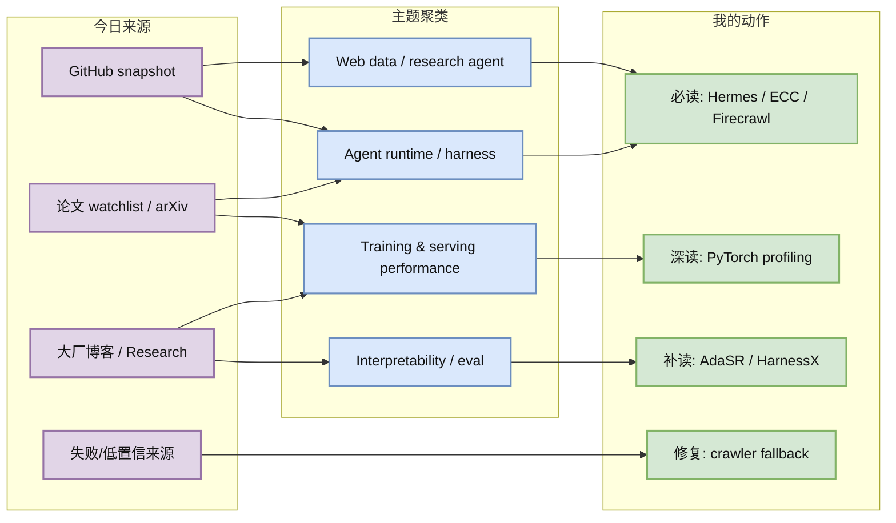
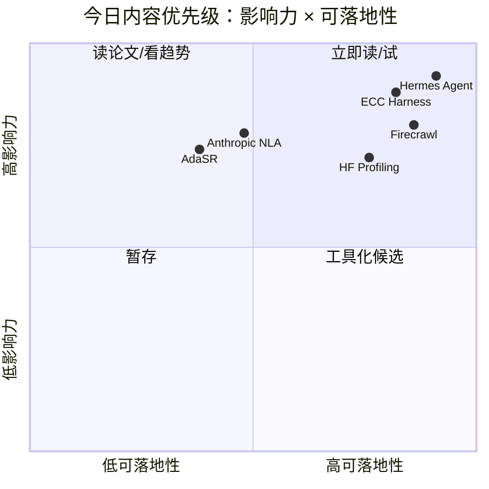

# AI Radar Daily - 2026-06-18

> 生成时间：2026-06-18 09:00 BJT
> 范围：AI Infra / LLM / RL / Agent / Eval / Serving / Training / Post-training / World Model
> 说明：日报是导航页；详情页负责深度理解。GitHub snapshot: `Automation/state/github-stars-2026-06-18.json`。

## 0. 今日结论

- 今日最强信号是 **Agent 外层基础设施继续分化**：Hermes Agent、ECC、Firecrawl、Dify、OpenWebUI 同时出现在高 star/增长榜，说明 memory、skills、web data、MCP、workflow 和 control plane 正在成为模型外的核心资产。
- 对 AI Infra 的直接影响：采集层可靠性仍是瓶颈，OpenAI 403、NVIDIA 404、arXiv 429 再次说明 research agent 需要 fallback crawler、缓存和来源状态矩阵。
- 对 LLM 训练 / 推理 / Agent 的影响：Hugging Face 的 PyTorch profiling/fused MLP 信号值得深读，可沉淀为 training/serving 性能排查 checklist。
- 对 RL / 游戏模型训练的影响：AdaSR/HarnessX 这类 watchlist 论文把 rollout、reasoning budget、agent harness 和 policy optimization 连接起来，适合后续补读。
- 建议今天深读：[[Industry/2026-06-18/Anthropic-Natural-Language-Autoencoders]]、[[Industry/2026-06-18/HuggingFace-PyTorch-Fused-MLP-Profiling]]、[[GitHub/2026-06-18/NousResearch--hermes-agent]]、[[GitHub/2026-06-18/firecrawl--firecrawl]]、[[Papers/2026-06-18/AdaSR-Adaptive-Streaming-Reasoning]]。

## 1. 今日态势图

## 2. 必读卡片区

> [!important] Agent runtime / harness 高热仍在持续
> - 大类：GitHub
> - 小类：Agent Infra
> - 重点：Hermes Agent +843、ECC +567，说明 agent 的 skills、memory、security、trace 和 gateway 正在成为独立 infra 层。
> - 为什么重要：当前日报系统就是 Hermes cron + Obsidian + GitHub push 的 dogfood，能直接反哺自动研究工作流。
> - 详情：[[GitHub/2026-06-18/NousResearch--hermes-agent]] / [网页详情](https://github.com/dyt27666-oss/AI-news-report-obsidians/blob/main/GitHub/2026-06-18/NousResearch--hermes-agent.md) / [原文](https://github.com/NousResearch/hermes-agent)

> [!important] Firecrawl / Web data extraction 是 research agent 的可靠性底座
> - 大类：GitHub
> - 小类：Web Data / Agent Retrieval Infra
> - 重点：Firecrawl +496；今天多个官方源和论文源出现 403/404/429，验证了 fallback crawler 与缓存的必要性。
> - 为什么重要：自动研究质量由“能否稳定拿到原文”决定，数据入口不稳会直接污染筛选和总结。
> - 详情：[[GitHub/2026-06-18/firecrawl--firecrawl]] / [网页详情](https://github.com/dyt27666-oss/AI-news-report-obsidians/blob/main/GitHub/2026-06-18/firecrawl--firecrawl.md) / [原文](https://github.com/firecrawl/firecrawl)

> [!tip] Hugging Face PyTorch profiling / Fused MLP
> - 大类：博客
> - 小类：Training / Serving Performance
> - 重点：HF Blog 首页出现从 nn.Linear 到 fused MLP 的 profiling 文章，适合沉淀性能排查方法。
> - 为什么重要：LLM serving/training 的很多收益来自 profiling、kernel fusion、hot path 定位，而不是只换模型。
> - 详情：[[Industry/2026-06-18/HuggingFace-PyTorch-Fused-MLP-Profiling]] / [网页详情](https://github.com/dyt27666-oss/AI-news-report-obsidians/blob/main/Industry/2026-06-18/HuggingFace-PyTorch-Fused-MLP-Profiling.md) / [原文](https://huggingface.co/blog)

> [!tip] Anthropic Natural Language Autoencoders
> - 大类：博客 / Research
> - 小类：Interpretability / Eval
> - 重点：Anthropic Research 首页显示 Turning Claude thoughts into text，是把内部表征转成可读解释的信号。
> - 为什么重要：若可迁移到 rollout trace 和 policy audit，会影响 agent eval、reward hacking 诊断和企业审计。
> - 详情：[[Industry/2026-06-18/Anthropic-Natural-Language-Autoencoders]] / [网页详情](https://github.com/dyt27666-oss/AI-news-report-obsidians/blob/main/Industry/2026-06-18/Anthropic-Natural-Language-Autoencoders.md) / [原文](https://www.anthropic.com/research)

## 3. 优先级矩阵

## 4. 分类清单

| 标签 | 大类 | 小类 | 标题 | 重点概括 | 为什么重要 | Obsidian 详情 | 网页详情 | 原文 |
|---|---|---|---|---|---|---|---|---|
| 必读 | GitHub | Agent Infra | NousResearch/hermes-agent | 日增 +843，skills/plugins/gateway/cron 持续高热 | 与 Obsidian-first 自动研究工作流完全重合 | [[GitHub/2026-06-18/NousResearch--hermes-agent]] | [网页详情](https://github.com/dyt27666-oss/AI-news-report-obsidians/blob/main/GitHub/2026-06-18/NousResearch--hermes-agent.md) | [原文](https://github.com/NousResearch/hermes-agent) |
| 必读 | GitHub | Agent Harness | affaan-m/ECC | 高 star 榜首且日增 +567，agent harness 成为独立基础设施 | 长任务成功率依赖 harness、memory、security 和 token 优化 | [[GitHub/2026-06-18/affaan-m--ECC]] | [网页详情](https://github.com/dyt27666-oss/AI-news-report-obsidians/blob/main/GitHub/2026-06-18/affaan-m--ECC.md) | [原文](https://github.com/affaan-m/ECC) |
| 必读 | GitHub | Web Data | firecrawl/firecrawl | 日增 +496，web extraction 是 research agent/RAG 的数据入口 | 今天多个来源失败，说明 crawler fallback 是生产必需 | [[GitHub/2026-06-18/firecrawl--firecrawl]] | [网页详情](https://github.com/dyt27666-oss/AI-news-report-obsidians/blob/main/GitHub/2026-06-18/firecrawl--firecrawl.md) | [原文](https://github.com/firecrawl/firecrawl) |
| 可 skim | 博客 | HF / Training Performance | Profiling in PyTorch: Fused MLP | profiling 到 fused MLP 的工程文章，适合沉淀性能排查 checklist | 对训练/推理 hot path 定位直接有用 | [[Industry/2026-06-18/HuggingFace-PyTorch-Fused-MLP-Profiling]] | [网页详情](https://github.com/dyt27666-oss/AI-news-report-obsidians/blob/main/Industry/2026-06-18/HuggingFace-PyTorch-Fused-MLP-Profiling.md) | [原文](https://huggingface.co/blog) |
| 可 skim | Research | Anthropic / Interpretability | Natural Language Autoencoders | 把 Claude thoughts 转成自然语言的可解释性信号 | 可能影响 agent eval、policy audit、reward hacking 诊断 | [[Industry/2026-06-18/Anthropic-Natural-Language-Autoencoders]] | [网页详情](https://github.com/dyt27666-oss/AI-news-report-obsidians/blob/main/Industry/2026-06-18/Anthropic-Natural-Language-Autoencoders.md) | [原文](https://www.anthropic.com/research) |
| 后续 | 论文 | Serving / Post-training | AdaSR | 自适应 streaming reasoning 候选，需补读 PDF | 可能连接 success-per-token 与 latency-per-success | [[Papers/2026-06-18/AdaSR-Adaptive-Streaming-Reasoning]] | [网页详情](https://github.com/dyt27666-oss/AI-news-report-obsidians/blob/main/Papers/2026-06-18/AdaSR-Adaptive-Streaming-Reasoning.md) | [原文](https://arxiv.org/abs/2606.14694) |

## 5. 大厂资讯 / 工程博客 / Research

大厂博客已显式标注发布方/大厂和栏目/来源类型；没有高相关新项的公司仍保留在扫描矩阵中。

### 5.1 公司来源扫描矩阵

| 公司/实验室 | 来源/栏目 | 今日状态 | 高相关条数 | 代表条目 | 备注 |
|---|---|---|---:|---|---|
| OpenAI | News / Research | 访问失败 | 0 | 无 | openai.com/news 与 research 抓取返回 403；未抓到高相关新项，建议使用 RSS/Firecrawl fallback。 |
| Anthropic | News / Research | 高相关 Research 信号 | 1 | Natural Language Autoencoders | Research 页面可访问；与 interpretability/eval 强相关。 |
| Google DeepMind | Blog / Research | 无高相关新项 / 低置信 | 0 | Unlocking discovery 导航 | 页面可访问但抓取片段偏导航/科学产品，无强 AI Infra/RL 新项。 |
| Meta AI | Blog / Research | 无高相关新项 / 低置信 | 0 | Blog Posts | 页面可访问但本次只稳定抓到栏目标题，未发现新强相关条目。 |
| NVIDIA | Technical Blog / AI | 访问失败 | 0 | 无 | 配置 URL 返回 404；需要切换 NVIDIA Blog RSS 或站内搜索。 |
| Microsoft | Research AI | 访问失败 | 0 | 无 | 页面返回 403；未抓到高相关新项。 |
| Hugging Face | Blog / Engineering / Agent | 高相关工程博客 | 3 | Agentic Resource Discovery；PyTorch Profiling；LeRobot | 页面可访问，出现 agent/tooling 与 PyTorch profiling 等强相关条目。 |
| 腾讯 | AI Lab / 技术博客 | 无高相关新项 / 低置信 | 0 | 无 | 页面可访问但抓取未发现强相关 AI Infra/RL/Serving 新项。 |
| 字节 | Seed / 技术博客 | 无高相关新项 / 低置信 | 0 | 无 | Seed 页面可访问但未发现今日强相关新项；GitHub 侧 deer-flow 仍在观察。 |
| SpaceAI | Blog / News | 无高相关新项 / 低置信 | 0 | 无 | 内容偏去中心化算力/空间网络叙事，AI Infra 相关性不足。 |

### 5.2 高相关大厂条目

| 标签 | 发布方/大厂 | 栏目/来源 | 标题 | 重点概括 | 工程/算法影响 | Obsidian 详情 | 网页详情 | 原文 |
|---|---|---|---|---|---|---|---|---|
| 可 skim | Anthropic | Research / Interpretability | Natural Language Autoencoders: Turning Claude thoughts into text | 研究 Claude 内部表征到自然语言的可解释化。 | 对 agent trace 解释、policy audit、reward hacking 诊断有潜在价值。 | [[Industry/2026-06-18/Anthropic-Natural-Language-Autoencoders]] | [网页详情](https://github.com/dyt27666-oss/AI-news-report-obsidians/blob/main/Industry/2026-06-18/Anthropic-Natural-Language-Autoencoders.md) | [原文](https://www.anthropic.com/research) |
| 可 skim | Hugging Face | Blog / Agent Tooling | Agentic Resource Discovery: Let agents search | 让 agent 主动发现资源，指向资源检索和工具路由。 | 对 research agent/RAG 的资源发现模块有直接参考。 | [[Industry/2026-06-18/HuggingFace-Agentic-Resource-Discovery]] | [网页详情](https://github.com/dyt27666-oss/AI-news-report-obsidians/blob/main/Industry/2026-06-18/HuggingFace-Agentic-Resource-Discovery.md) | [原文](https://huggingface.co/blog) |
| 必读 | Hugging Face | Engineering Blog / PyTorch Profiling | Profiling in PyTorch Part 2: From nn.Linear to a Fused MLP | 从 profiler 到 fused MLP 的性能工程路径。 | 可沉淀为 training/serving hot path 定位与 kernel fusion checklist。 | [[Industry/2026-06-18/HuggingFace-PyTorch-Fused-MLP-Profiling]] | [网页详情](https://github.com/dyt27666-oss/AI-news-report-obsidians/blob/main/Industry/2026-06-18/HuggingFace-PyTorch-Fused-MLP-Profiling.md) | [原文](https://huggingface.co/blog) |

## 6. GitHub 高 star Top 10

| 排名 | repo | stars | forks | language | updated_at | topics | 重点概括 | 是否值得试用 | Obsidian 详情 | 原文 |
|---:|---|---:|---:|---|---|---|---|---|---|---|
| 1 | affaan-m/ECC | 217303 | 33355 | JavaScript | 2026-06-18T01:00:37Z | ai-agents, anthropic, claude, claude-code, developer-tools, llm | The agent harness performance optimization system. Skills, instincts, memory, security | 是 | [[GitHub/2026-06-18/affaan-m--ECC]] | [GitHub](https://github.com/affaan-m/ECC) |
| 2 | NousResearch/hermes-agent | 196204 | 34532 | Python | 2026-06-18T00:56:12Z | ai, ai-agent, ai-agents, anthropic, chatgpt, claude | The agent that grows with you | 是 | [[GitHub/2026-06-18/NousResearch--hermes-agent]] | [GitHub](https://github.com/NousResearch/hermes-agent) |
| 3 | tensorflow/tensorflow | 195718 | 75194 | C++ | 2026-06-18T00:58:30Z | deep-learning, deep-neural-networks, distributed, machine-learning, ml, neural-network | An Open Source Machine Learning Framework for Everyone | 观察 | 未创建 | [GitHub](https://github.com/tensorflow/tensorflow) |
| 4 | Significant-Gravitas/AutoGPT | 185002 | 46134 | Python | 2026-06-18T00:32:06Z | agentic-ai, agents, ai, artificial-intelligence, autonomous-agents, claude | AutoGPT is the vision of accessible AI for everyone, to use and to build on. Our missi | 观察 | 未创建 | [GitHub](https://github.com/Significant-Gravitas/AutoGPT) |
| 5 | ollama/ollama | 174405 | 16664 | Go | 2026-06-18T00:31:45Z | deepseek, gemma, gemma3, glm, go, golang | Get up and running with Kimi-K2.6, GLM-5.1, MiniMax, DeepSeek, gpt-oss, Qwen, Gemma an | 是 | 未创建 | [GitHub](https://github.com/ollama/ollama) |
| 6 | f/prompts.chat | 163857 | 21249 | HTML | 2026-06-18T00:30:59Z | ai, artificial-intelligence, awesome-list, chatgpt, chatgpt-prompts, claude | f.k.a. Awesome ChatGPT Prompts. Share, discover, and collect prompts from the communit | 观察 | 未创建 | [GitHub](https://github.com/f/prompts.chat) |
| 7 | huggingface/transformers | 161676 | 33537 | Python | 2026-06-18T00:12:39Z | audio, deep-learning, deepseek, gemma, glm, hacktoberfest | 🤗 Transformers: the model-definition framework for state-of-the-art machine learning m | 是 | 未创建 | [GitHub](https://github.com/huggingface/transformers) |
| 8 | langflow-ai/langflow | 149802 | 9289 | Python | 2026-06-18T00:44:00Z | agents, chatgpt, generative-ai, large-language-models, multiagent, react-flow | Langflow is a powerful tool for building and deploying AI-powered agents and workflows | 观察 | 未创建 | [GitHub](https://github.com/langflow-ai/langflow) |
| 9 | langgenius/dify | 145631 | 22906 | TypeScript | 2026-06-18T00:33:16Z | agent, agentic-ai, agentic-framework, agentic-workflow, ai, automation | Production-ready platform for agentic workflow development. | 是 | [[GitHub/2026-06-18/langgenius--dify]] | [GitHub](https://github.com/langgenius/dify) |
| 10 | open-webui/open-webui | 142041 | 20413 | Python | 2026-06-18T00:41:34Z | ai, llm, llm-ui, llm-webui, llms, mcp | User-friendly AI Interface (Supports Ollama, OpenAI API, ...) | 是 | [[GitHub/2026-06-18/open-webui--open-webui]] | [GitHub](https://github.com/open-webui/open-webui) |

## 7. GitHub star 增长最快 Top 10

Baseline available: `Automation/state/github-stars-2026-06-17.json`。以下为真实 historical snapshot delta，不是冷启动代理。GitHub API 后续 query 触发 rate limit，但 snapshot 已保存 144 个 repo。

| 排名 | repo | stars_delta | stars | forks | language | updated_at | 增长依据 | 重点概括 | Obsidian 详情 | 原文 |
|---:|---|---:|---:|---:|---|---|---|---|---|---|
| 1 | elder-plinius/CL4R1T4S | 1050 | 41824 | 8335 | Unknown | 2026-06-18T01:00:46Z | historical_snapshot | LEAKED SYSTEM PROMPTS FOR CHATGPT, CLAUDE, GEMINI, GROK, PERPLEXITY, CURSOR, LOVABLE,  | 未创建 | [GitHub](https://github.com/elder-plinius/CL4R1T4S) |
| 2 | NousResearch/hermes-agent | 843 | 196204 | 34532 | Python | 2026-06-18T00:56:12Z | historical_snapshot | The agent that grows with you | [[GitHub/2026-06-18/NousResearch--hermes-agent]] | [GitHub](https://github.com/NousResearch/hermes-agent) |
| 3 | affaan-m/ECC | 567 | 217303 | 33355 | JavaScript | 2026-06-18T01:00:37Z | historical_snapshot | The agent harness performance optimization system. Skills, instincts, memory, security | [[GitHub/2026-06-18/affaan-m--ECC]] | [GitHub](https://github.com/affaan-m/ECC) |
| 4 | firecrawl/firecrawl | 496 | 134142 | 7844 | TypeScript | 2026-06-18T01:00:17Z | historical_snapshot | The API to search, scrape, and interact with the web at scale. 🔥 | [[GitHub/2026-06-18/firecrawl--firecrawl]] | [GitHub](https://github.com/firecrawl/firecrawl) |
| 5 | JuliusBrussee/caveman | 491 | 74091 | 4173 | JavaScript | 2026-06-18T01:00:38Z | historical_snapshot | 🪨 why use many token when few token do trick — Claude Code skill that cuts 65% of toke | 未创建 | [GitHub](https://github.com/JuliusBrussee/caveman) |
| 6 | rohitg00/ai-engineering-from-scratch | 399 | 34089 | 5550 | Python | 2026-06-18T00:59:16Z | historical_snapshot | Learn it. Build it. Ship it for others. | 未创建 | [GitHub](https://github.com/rohitg00/ai-engineering-from-scratch) |
| 7 | asgeirtj/system_prompts_leaks | 311 | 43122 | 7143 | JavaScript | 2026-06-18T00:58:11Z | historical_snapshot | Extracted system prompts from Anthropic - Claude Fable 5, Opus 4.8, Claude Code, Claud | 未创建 | [GitHub](https://github.com/asgeirtj/system_prompts_leaks) |
| 8 | TauricResearch/TradingAgents | 245 | 86966 | 16810 | Python | 2026-06-18T00:56:52Z | historical_snapshot | TradingAgents: Multi-Agents LLM Financial Trading Framework | 未创建 | [GitHub](https://github.com/TauricResearch/TradingAgents) |
| 9 | thedotmack/claude-mem | 212 | 82996 | 7188 | JavaScript | 2026-06-18T00:57:43Z | historical_snapshot | Persistent Context Across Sessions for Every Agent –  Captures everything your agent d | 未创建 | [GitHub](https://github.com/thedotmack/claude-mem) |
| 10 | nautechsystems/nautilus_trader | 210 | 23809 | 3017 | Rust | 2026-06-18T00:58:42Z | historical_snapshot | Production-grade Rust-native trading engine with deterministic event-driven architectu | 未创建 | [GitHub](https://github.com/nautechsystems/nautilus_trader) |

## 8. 论文

今日 arXiv API 多次 429/timeout，因此论文候选以近期 arXiv watchlist 为主；每条均标注来源和来源类型，且明确需要补读 PDF。

### 8.1 Agent Harness / Streaming Reasoning

| 标签 | 论文来源 | 论文 | 作者/机构 | 重点概括 | 工程/研究价值 | Obsidian 详情 | 网页详情 | PDF/原文 |
|---|---|---|---|---|---|---|---|---|
| 后续 | arXiv / 预印本 / 论文索引 | HarnessX: A Composable, Adaptive, and Evolvable Agent Harness Foundry | API 未稳定获取，需补读 arXiv | 把 agent harness 作为可组合、可适配、可演化的基础设施对象。 | 对 Hermes/ECC/OpenHands 这类 runtime 设计有直接参考价值。 | [[Papers/2026-06-18/HarnessX-Agent-Harness-Foundry]] | [网页详情](https://github.com/dyt27666-oss/AI-news-report-obsidians/blob/main/Papers/2026-06-18/HarnessX-Agent-Harness-Foundry.md) | [abs](https://arxiv.org/abs/2606.14249) / [pdf](https://arxiv.org/pdf/2606.14249) |
| 后续 | arXiv / 预印本 / 论文索引 | AdaSR: Adaptive Streaming Reasoning with Hierarchical Relative Policy Optimization | API 未稳定获取，需补读 arXiv | 自适应控制 streaming reasoning 的推理预算和策略。 | 对 serving 成本、success-per-token、latency-per-success 指标很有启发。 | [[Papers/2026-06-18/AdaSR-Adaptive-Streaming-Reasoning]] | [网页详情](https://github.com/dyt27666-oss/AI-news-report-obsidians/blob/main/Papers/2026-06-18/AdaSR-Adaptive-Streaming-Reasoning.md) | [abs](https://arxiv.org/abs/2606.14694) / [pdf](https://arxiv.org/pdf/2606.14694) |

## 9. 资讯 / 其他 GitHub 项目

| 标签 | 来源 | 标题 | 重点概括 | 对我有什么用 | Obsidian 详情 | 网页详情 | 原文 |
|---|---|---|---|---|---|---|---|
| 低置信 | GitHub | elder-plinius/CL4R1T4S | 日增 +1050，但主要是 system prompt leak | 仅作安全/红队信号，不进入工程试用主线 | 未创建 | 未创建 | [原文](https://github.com/elder-plinius/CL4R1T4S) |
| 后续 | GitHub | JuliusBrussee/caveman | 日增 +491，Claude Code token 压缩 skill | 可观察 agent 成本优化和 prompt compression | 未创建 | 未创建 | [原文](https://github.com/JuliusBrussee/caveman) |
| 后续 | GitHub | thedotmack/claude-mem | 日增 +212，persistent context for agent 继续受关注 | 可作为长期记忆设计和隐私边界参考 | 未创建 | 未创建 | [原文](https://github.com/thedotmack/claude-mem) |

## 10. 按主题索引

### AI Infra / Serving / Training

- [[Industry/2026-06-18/HuggingFace-PyTorch-Fused-MLP-Profiling]] - training/serving 性能排查和 kernel fusion。
- [[GitHub/2026-06-18/firecrawl--firecrawl]] - research agent 数据入口基础设施。
- [[GitHub/2026-06-18/open-webui--open-webui]] - 本地/私有 LLM UI 与 MCP 接入。

### LLM / Agent / RAG / Evaluation

- [[Industry/2026-06-18/Anthropic-Natural-Language-Autoencoders]] - interpretability 与 eval/policy audit。
- [[Industry/2026-06-18/HuggingFace-Agentic-Resource-Discovery]] - agentic resource discovery。
- [[GitHub/2026-06-18/NousResearch--hermes-agent]] - agent runtime / skills / gateway / cron。
- [[GitHub/2026-06-18/affaan-m--ECC]] - agent harness performance optimization。
- [[GitHub/2026-06-18/langgenius--dify]] - production agentic workflow。

### RL / Game AI / World Model

- [[Papers/2026-06-18/AdaSR-Adaptive-Streaming-Reasoning]] - reasoning budget 与 policy optimization watchlist。
- [[Papers/2026-06-18/HarnessX-Agent-Harness-Foundry]] - agent harness 抽象，间接关联 rollout/eval。

### 公司 / 实验室

- Anthropic: [[Industry/2026-06-18/Anthropic-Natural-Language-Autoencoders]]
- Hugging Face: [[Industry/2026-06-18/HuggingFace-Agentic-Resource-Discovery]]、[[Industry/2026-06-18/HuggingFace-PyTorch-Fused-MLP-Profiling]]
- OpenAI / NVIDIA / Microsoft / Google DeepMind / Meta AI / 腾讯 / 字节 / SpaceAI: 今日无高置信详情页，见扫描矩阵。

## 11. 值得后续深挖

| 标签 | 大类 | 小类 | 标题 | 后续动作 | Obsidian 详情 | 原文 |
|---|---|---|---|---|---|---|
| 后续 | 采集工程 | Web Data | Firecrawl fallback | 用 OpenAI/NVIDIA/Microsoft/arXiv 页面做抓取 A/B 测试 | [[GitHub/2026-06-18/firecrawl--firecrawl]] | [原文](https://github.com/firecrawl/firecrawl) |
| 后续 | 论文 | Serving / RLHF | AdaSR | 补读 PDF，确认 reward、停止策略和 latency 指标 | [[Papers/2026-06-18/AdaSR-Adaptive-Streaming-Reasoning]] | [原文](https://arxiv.org/abs/2606.14694) |
| 后续 | 论文 | Agent Infra | HarnessX | 补读 PDF，确认组件抽象、benchmark 和代码 | [[Papers/2026-06-18/HarnessX-Agent-Harness-Foundry]] | [原文](https://arxiv.org/abs/2606.14249) |
| 后续 | 来源修复 | NVIDIA | Technical Blog RSS | 修正 404 URL，改用 RSS 或站内搜索 | 未创建 | [原文](https://developer.nvidia.com/blog/category/artificial-intelligence/) |

## 12. 采集失败或低置信来源

- GitHub API：成功保存 144 个 repo 的 snapshot；后续部分 query 触发 403 rate limit，但固定 Top 10 板块已生成。
- arXiv API：多次 429/timeout；今日论文使用近期索引候选并明确标注“需补读 PDF”。
- OpenAI：openai.com/news 和 research 返回 403。
- NVIDIA：配置 URL 返回 404。
- Microsoft：Research AI 页面返回 403。
- Google DeepMind / Meta AI / 腾讯 / 字节 / SpaceAI：页面可访问但未稳定发现强相关新项或仅低置信。

## 13. 归档标签

#ai-radar #daily #ai-infra #llm #rl #agent #eval #serving
