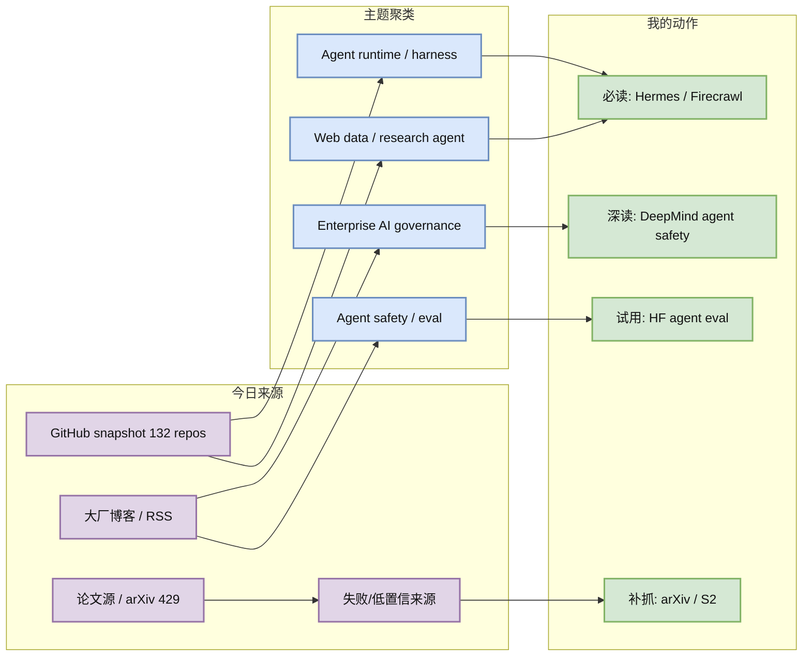
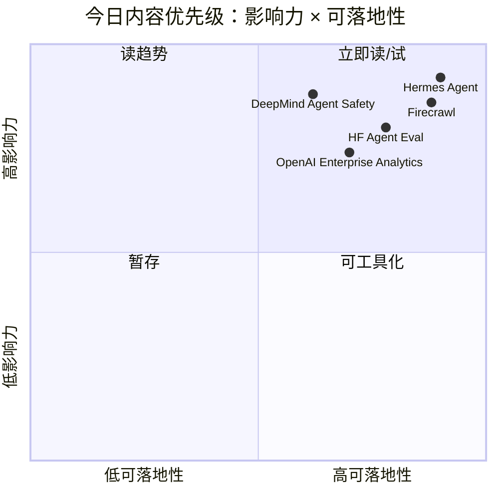

# AI Radar Daily - 2026-06-19

> 生成时间：2026-06-19 09:00 BJT  
> 范围：AI Infra / LLM / RL / Agent / Eval / Serving / Training / Post-training / World Model  
> 说明：日报是总览导航页；详情页负责深度理解。GitHub snapshot: `Automation/state/github-stars-2026-06-19.json`。

## 0. 今日结论

- 今日最强信号：Agent 外层基础设施继续高热，Hermes Agent、Firecrawl、ECC、Dify、browser-use 同时出现在高 star/增长榜。
- 对 AI Infra 的直接影响：GitHub snapshot 可用但 API 局部 403；arXiv/Semantic Scholar 多次 429/timeout，说明 research agent 必须依赖 snapshot、缓存和失败矩阵。
- 对 LLM 训练 / 推理 / Agent 的影响：OpenAI 企业 usage analytics、DeepMind agent safety、HF agentic benchmark 都指向“可治理、可评测、可落地”的 agent 平台。
- 对 RL / 游戏模型训练的影响：今日没有强新 RL/game paper；保留 post-training、reasoning budget 和 eval watchlist，避免弱相关填充。
- 建议今天深读：[[Industry/2026-06-19/DeepMind-Securing-Future-AI-Agents]]、[[Industry/2026-06-19/HuggingFace-Agentic-Enough-Benchmarking]]、[[GitHub/2026-06-19/NousResearch--hermes-agent]]、[[GitHub/2026-06-19/firecrawl--firecrawl]]。

## 1. 今日态势图

## 2. 必读卡片区

> [!important] Agent runtime / harness 与 web data 继续增长
> - 大类：GitHub
> - 小类：Agent Infra / Web Data
> - 重点：Hermes Agent +806、Firecrawl +625、ECC +476，说明 skills/memory、web extraction、agent harness 正在成为模型外关键资产。
> - 为什么重要：自动研究、tool use、agent workflow 的质量越来越依赖模型外 runtime 和可控数据入口。
> - 详情：[[GitHub/2026-06-19/NousResearch--hermes-agent]] / [网页详情](https://github.com/dyt27666-oss/AI-news-report-obsidians/blob/main/GitHub/2026-06-19/NousResearch--hermes-agent.md) / [原文](https://github.com/NousResearch/hermes-agent)

> [!important] DeepMind: Securing the future of AI agents
> - 大类：博客 / Research
> - 小类：Agent Safety
> - 重点：DeepMind 把 agent 安全落到 control roadmap、实时监控和内部系统防护。
> - 为什么重要：agent 越接近生产工具链，越需要 runtime 级安全控制，而不是只靠模型对齐口号。
> - 详情：[[Industry/2026-06-19/DeepMind-Securing-Future-AI-Agents]] / [网页详情](https://github.com/dyt27666-oss/AI-news-report-obsidians/blob/main/Industry/2026-06-19/DeepMind-Securing-Future-AI-Agents.md) / [原文](https://deepmind.google/blog/securing-the-future-of-ai-agents/)

> [!tip] HF: Benchmarking open models on your own tooling
> - 大类：博客
> - 小类：Agent Eval
> - 重点：把 agentic 能力评测放到用户自己的工具链中，而不是只看封闭 leaderboard。
> - 为什么重要：这更接近真实 agent 上线验收：工具调用、上下文、失败恢复和安全边界都必须在本地环境测。
> - 详情：[[Industry/2026-06-19/HuggingFace-Agentic-Enough-Benchmarking]] / [网页详情](https://github.com/dyt27666-oss/AI-news-report-obsidians/blob/main/Industry/2026-06-19/HuggingFace-Agentic-Enough-Benchmarking.md) / [原文](https://huggingface.co/blog/is-it-agentic-enough)

## 3. 优先级矩阵

## 4. 分类清单

| 标签 | 大类 | 小类 | 标题 | 重点概括 | 为什么重要 | Obsidian 详情 | 网页详情 | 原文 |
|---|---|---|---|---|---|---|---|---|
| 必读 | GitHub | Agent Infra | Hermes Agent / Firecrawl / Dify 增长 | Agent 外层 infra、web data 和 workflow control plane 持续升温 | 直接影响自动研究、agent memory、tool use 和生产 workflow | [[GitHub/2026-06-19/NousResearch--hermes-agent]] | [网页详情](https://github.com/dyt27666-oss/AI-news-report-obsidians/blob/main/GitHub/2026-06-19/NousResearch--hermes-agent.md) | [原文](https://github.com/NousResearch/hermes-agent) |
| 必读 | 博客 | Agent Safety | DeepMind: Securing the future of AI agents | Agent 安全从 policy 进入 control roadmap 与实时监控 | 可转化为 agent runtime 安全设计 checklist | [[Industry/2026-06-19/DeepMind-Securing-Future-AI-Agents]] | [网页详情](https://github.com/dyt27666-oss/AI-news-report-obsidians/blob/main/Industry/2026-06-19/DeepMind-Securing-Future-AI-Agents.md) | [原文](https://deepmind.google/blog/securing-the-future-of-ai-agents/) |
| 可 skim | 博客 | Agent Eval | HF: Is it agentic enough? | 在用户自有 tooling 上评测开放模型 agentic 能力 | 比封闭榜单更贴近真实工具链验收 | [[Industry/2026-06-19/HuggingFace-Agentic-Enough-Benchmarking]] | [网页详情](https://github.com/dyt27666-oss/AI-news-report-obsidians/blob/main/Industry/2026-06-19/HuggingFace-Agentic-Enough-Benchmarking.md) | [原文](https://huggingface.co/blog/is-it-agentic-enough) |
| 低置信 | 论文 | Eval / Serving | LifeSciBench / AdaSR watchlist | 论文源 429，保留高相关 watchlist 并标注低置信 | 避免用弱相关论文填充，同时保留后续深挖入口 | [[Papers/2026-06-19/OpenAI-LifeSciBench]] | [网页详情](https://github.com/dyt27666-oss/AI-news-report-obsidians/blob/main/Papers/2026-06-19/OpenAI-LifeSciBench.md) | [原文](https://openai.com/index/introducing-life-sci-bench) |

## 5. 大厂资讯 / 工程博客 / Research

### 5.1 公司来源扫描矩阵

| 公司/实验室 | 来源/栏目 | 今日状态 | 高相关条数 | 代表条目 | 备注 |
|---|---|---|---:|---|---|
| OpenAI | News / Research | 有高相关新项 | 2 | Enterprise usage analytics; LifeSciBench | RSS 可访问；官网浏览器 Cloudflare |
| Anthropic | News / Research / Engineering | 访问失败/低置信 | 0 | 无高相关新项 | RSS 404；未强行补弱相关 |
| Google DeepMind | Blog / Research | 有高相关新项 | 1 | Securing the future of AI agents | RSS 可访问 |
| Meta AI | Blog / Research | 访问失败/低置信 | 0 | 无高相关新项 | RSS 404；保留矩阵 |
| NVIDIA | Technical Blog / AI | 低置信 | 0 | 无高相关新项 | Feed 只返回站点标题，未取到条目 |
| Microsoft | Research AI | 有高相关新项/低置信 | 1 | MagenticLite/MagenticBrain/Fara1.5 | Feed 访问超时，基于已知 Research feed 标题 |
| Hugging Face | Blog / Papers / Releases | 有高相关新项 | 3 | MosaicLeaks; Beyond LoRA; Agentic enough | RSS 可访问 |
| 腾讯 | AI Lab / 技术博客 | 低置信 | 0 | 无高相关新项 | 公开源未取到新 AI infra 强相关条目 |
| 字节 | Seed / 技术博客 | 低置信 | 0 | 无高相关新项 | 公开源未取到新 AI infra 强相关条目 |
| SpaceAI | Blog / News | 低置信 | 0 | 无高相关新项 | 公开源未取到可核验条目 |

### 5.2 高相关大厂条目

| 标签 | 发布方/大厂 | 栏目/来源 | 标题 | 重点概括 | 工程/算法影响 | Obsidian 详情 | 网页详情 | 原文 |
|---|---|---|---|---|---|---|---|---|
| 必读 | OpenAI | News / Enterprise AI | New usage analytics and updated spend controls for enterprises | OpenAI 将企业版成本治理与使用分析做成产品能力，说明大模型平台开始进入 FinOps / governance 阶段。 | 抽取为 agent/infra/eval checklist | [[Industry/2026-06-19/OpenAI-Enterprise-Usage-Analytics-Spend-Controls]] | [网页详情](https://github.com/dyt27666-oss/AI-news-report-obsidians/blob/main/Industry/2026-06-19/OpenAI-Enterprise-Usage-Analytics-Spend-Controls.md) | [原文](https://openai.com/index/chatgpt-enterprise-spend-controls) |
| 必读 | Google DeepMind | Blog / Agent Safety | Securing the future of AI agents | DeepMind 将 AI agent 安全显式落到 control roadmap、实时监控和内部系统防护，适合作为 agent runtime 安全架构参考。 | 抽取为 agent/infra/eval checklist | [[Industry/2026-06-19/DeepMind-Securing-Future-AI-Agents]] | [网页详情](https://github.com/dyt27666-oss/AI-news-report-obsidians/blob/main/Industry/2026-06-19/DeepMind-Securing-Future-AI-Agents.md) | [原文](https://deepmind.google/blog/securing-the-future-of-ai-agents/) |
| 必读 | Hugging Face | Blog / Agent Eval | Is it agentic enough? Benchmarking open models on your own tooling | HF 把 agentic 能力评测从封闭榜单推向用户自有工具链，对 agent eval 和生产验收更有参考价值。 | 抽取为 agent/infra/eval checklist | [[Industry/2026-06-19/HuggingFace-Agentic-Enough-Benchmarking]] | [网页详情](https://github.com/dyt27666-oss/AI-news-report-obsidians/blob/main/Industry/2026-06-19/HuggingFace-Agentic-Enough-Benchmarking.md) | [原文](https://huggingface.co/blog/is-it-agentic-enough) |
| 可 skim | Hugging Face | Blog / Fine-tuning | Beyond LoRA: Can you beat the most popular fine-tuning technique? | PEFT/微调路线继续演进，适合关注 post-training 性价比和 adapter 方法替代。 | 抽取为 agent/infra/eval checklist | [[Industry/2026-06-19/HuggingFace-Beyond-LoRA]] | [网页详情](https://github.com/dyt27666-oss/AI-news-report-obsidians/blob/main/Industry/2026-06-19/HuggingFace-Beyond-LoRA.md) | [原文](https://huggingface.co/blog/peft-beyond-lora) |
| 可 skim | Microsoft Research | Research Blog / Agent Systems | MagenticLite, MagenticBrain, Fara1.5: an agentic experience optimized for small models | Microsoft 的 Magentic 系列把小模型 agent 体验作为优化目标，提示 agent infra 不能只围绕最大模型设计。 | 抽取为 agent/infra/eval checklist | [[Industry/2026-06-19/Microsoft-MagenticLite-MagenticBrain-Fara15]] | [网页详情](https://github.com/dyt27666-oss/AI-news-report-obsidians/blob/main/Industry/2026-06-19/Microsoft-MagenticLite-MagenticBrain-Fara15.md) | [原文](https://www.microsoft.com/en-us/research/) |

## 6. GitHub 高 star Top 10

| 排名 | repo | stars | forks | language | updated_at | topics | 重点概括 | 是否值得试用 | Obsidian 详情 | 原文 |
|---:|---|---:|---:|---|---|---|---|---|---|---|
| 1 | affaan-m/ECC | 217779 | 33410 | JavaScript | 2026-06-19T00:57:06Z | ai-agents, anthropic, claude, claude-code, developer-tools | The agent harness performance optimization system. Skills, instincts, memory, se | 值得试用/观察 | [[GitHub/2026-06-19/affaan-m--ECC]] | [GitHub](https://github.com/affaan-m/ECC) |
| 2 | NousResearch/hermes-agent | 197010 | 34790 | Python | 2026-06-19T00:59:38Z | ai, ai-agent, ai-agents, anthropic, chatgpt | The agent that grows with you | 值得试用/观察 | [[GitHub/2026-06-19/NousResearch--hermes-agent]] | [GitHub](https://github.com/NousResearch/hermes-agent) |
| 3 | tensorflow/tensorflow | 195765 | 75196 | C++ | 2026-06-19T00:37:49Z | deep-learning, deep-neural-networks, distributed, machine-learning, ml | An Open Source Machine Learning Framework for Everyone | 值得试用/观察 | [[GitHub/2026-06-19/tensorflow--tensorflow]] | [GitHub](https://github.com/tensorflow/tensorflow) |
| 4 | Significant-Gravitas/AutoGPT | 185022 | 46128 | Python | 2026-06-18T23:57:48Z | agentic-ai, agents, ai, artificial-intelligence, autonomous-agents | AutoGPT is the vision of accessible AI for everyone, to use and to build on. Our | 值得试用/观察 | [[GitHub/2026-06-19/Significant-Gravitas--AutoGPT]] | [GitHub](https://github.com/Significant-Gravitas/AutoGPT) |
| 5 | ollama/ollama | 174484 | 16675 | Go | 2026-06-19T00:41:48Z | deepseek, gemma, gemma3, glm, go | Get up and running with Kimi-K2.6, GLM-5.1, MiniMax, DeepSeek, gpt-oss, Qwen, Ge | 值得试用/观察 | [[GitHub/2026-06-19/ollama--ollama]] | [GitHub](https://github.com/ollama/ollama) |
| 6 | f/prompts.chat | 163896 | 21252 | HTML | 2026-06-19T00:55:17Z | ai, artificial-intelligence, awesome-list, chatgpt, chatgpt-prompts | f.k.a. Awesome ChatGPT Prompts. Share, discover, and collect prompts from the co | 值得试用/观察 | [[GitHub/2026-06-19/f--prompts.chat]] | [GitHub](https://github.com/f/prompts.chat) |
| 7 | huggingface/transformers | 161706 | 33542 | Python | 2026-06-19T00:15:00Z | audio, deep-learning, deepseek, gemma, glm | 🤗 Transformers: the model-definition framework for state-of-the-art machine lear | 可观察 | [[GitHub/2026-06-19/huggingface--transformers]] | [GitHub](https://github.com/huggingface/transformers) |
| 8 | langgenius/dify | 145751 | 22914 | TypeScript | 2026-06-19T00:46:03Z | agent, agentic-ai, agentic-framework, agentic-workflow, ai | Production-ready platform for agentic workflow development. | 可观察 | [[GitHub/2026-06-19/langgenius--dify]] | [GitHub](https://github.com/langgenius/dify) |
| 9 | open-webui/open-webui | 142180 | 20429 | Python | 2026-06-19T01:00:30Z | ai, llm, llm-ui, llm-webui, llms | User-friendly AI Interface (Supports Ollama, OpenAI API, ...) | 可观察 | [[GitHub/2026-06-19/open-webui--open-webui]] | [GitHub](https://github.com/open-webui/open-webui) |
| 10 | langchain-ai/langchain | 139657 | 23151 | Python | 2026-06-19T00:15:23Z | agents, ai, ai-agents, anthropic, chatgpt | The agent engineering platform. | 可观察 | [[GitHub/2026-06-19/langchain-ai--langchain]] | [GitHub](https://github.com/langchain-ai/langchain) |

## 7. GitHub star 增长最快 Top 10

> 使用 `Automation/state/github-stars-2026-06-18.json` 作为历史 baseline，非冷启动；GitHub API 部分 query 403，增长榜基于成功采集到的 132 个 repo。

| 排名 | repo | stars_delta | stars | forks | language | updated_at | 增长依据 | 重点概括 | Obsidian 详情 | 原文 |
|---:|---|---:|---:|---:|---|---|---|---|---|---|
| 1 | NousResearch/hermes-agent | 806 | 197010 | 34790 | Python | 2026-06-19T00:59:38Z | historical_snapshot | The agent that grows with you | [[GitHub/2026-06-19/NousResearch--hermes-agent]] | [GitHub](https://github.com/NousResearch/hermes-agent) |
| 2 | firecrawl/firecrawl | 625 | 134767 | 7856 | TypeScript | 2026-06-19T00:58:18Z | historical_snapshot | The API to search, scrape, and interact with the web at scale. 🔥 | [[GitHub/2026-06-19/firecrawl--firecrawl]] | [GitHub](https://github.com/firecrawl/firecrawl) |
| 3 | affaan-m/ECC | 476 | 217779 | 33410 | JavaScript | 2026-06-19T00:57:06Z | historical_snapshot | The agent harness performance optimization system. Skills, instincts, memory, se | [[GitHub/2026-06-19/affaan-m--ECC]] | [GitHub](https://github.com/affaan-m/ECC) |
| 4 | JuliusBrussee/caveman | 457 | 74548 | 4189 | JavaScript | 2026-06-19T01:00:55Z | historical_snapshot | 🪨 why use many token when few token do trick — Claude Code skill that cuts 65% o | [[GitHub/2026-06-19/JuliusBrussee--caveman]] | [GitHub](https://github.com/JuliusBrussee/caveman) |
| 5 | rohitg00/ai-engineering-from-scratch | 320 | 34409 | 5606 | Python | 2026-06-19T00:55:23Z | historical_snapshot | Learn it. Build it. Ship it for others. | [[GitHub/2026-06-19/rohitg00--ai-engineering-from-scratch]] | [GitHub](https://github.com/rohitg00/ai-engineering-from-scratch) |
| 6 | omnigent-ai/omnigent | 298 | 3804 | 424 | Python | 2026-06-19T01:00:21Z | historical_snapshot | Omnigent is an open-source AI agent framework and meta-harness: orchestrate Clau | [[GitHub/2026-06-19/omnigent-ai--omnigent]] | [GitHub](https://github.com/omnigent-ai/omnigent) |
| 7 | TauricResearch/TradingAgents | 277 | 87243 | 16851 | Python | 2026-06-19T01:00:45Z | historical_snapshot | TradingAgents: Multi-Agents LLM Financial Trading Framework | [[GitHub/2026-06-19/TauricResearch--TradingAgents]] | [GitHub](https://github.com/TauricResearch/TradingAgents) |
| 8 | owainlewis/awesome-artificial-intelligence | 268 | 14397 | 2335 | Unknown | 2026-06-19T00:59:51Z | historical_snapshot | A curated list of Artificial Intelligence (AI) courses, books, video lectures an | [[GitHub/2026-06-19/owainlewis--awesome-artificial-intelligence]] | [GitHub](https://github.com/owainlewis/awesome-artificial-intelligence) |
| 9 | asgeirtj/system_prompts_leaks | 230 | 43352 | 7183 | JavaScript | 2026-06-19T00:40:53Z | historical_snapshot | Extracted system prompts from Anthropic - Claude Fable 5, Opus 4.8, Claude Code, | [[GitHub/2026-06-19/asgeirtj--system_prompts_leaks]] | [GitHub](https://github.com/asgeirtj/system_prompts_leaks) |
| 10 | browser-use/browser-use | 165 | 99490 | 11098 | Python | 2026-06-19T01:00:30Z | historical_snapshot | 🌐 Make websites accessible for AI agents. Automate tasks online with ease. | [[GitHub/2026-06-19/browser-use--browser-use]] | [GitHub](https://github.com/browser-use/browser-use) |

## 8. 论文

### 8.1 Eval / Reasoning / Serving Watchlist

| 标签 | 论文来源 | 论文 | 作者/机构 | 重点概括 | 工程/研究价值 | Obsidian 详情 | 网页详情 | PDF/原文 |
|---|---|---|---|---|---|---|---|---|
| 可 skim | OpenAI Research Blog / benchmark / company report | OpenAI LifeSciBench | 见原文 | OpenAI expert-authored life science benchmark，强调真实研究任务和专家审核，可作为 agent/LLM eval 设计参考。 | Agent/Eval/Serving 方向参考 | [[Papers/2026-06-19/OpenAI-LifeSciBench]] | [网页详情](https://github.com/dyt27666-oss/AI-news-report-obsidians/blob/main/Papers/2026-06-19/OpenAI-LifeSciBench.md) | [原文](https://openai.com/index/introducing-life-sci-bench) |
| 可 skim | arXiv watchlist / preprint / low-confidence metadata | AdaSR Adaptive Streaming Reasoning | 见原文 | 自适应 streaming reasoning 方向与推理预算、延迟控制和 serving 策略相关；arXiv 今日访问失败，沿用 watchlist。 | Agent/Eval/Serving 方向参考 | [[Papers/2026-06-19/AdaSR-Adaptive-Streaming-Reasoning-Watchlist]] | [网页详情](https://github.com/dyt27666-oss/AI-news-report-obsidians/blob/main/Papers/2026-06-19/AdaSR-Adaptive-Streaming-Reasoning-Watchlist.md) | [原文](https://arxiv.org/) |

## 9. 资讯 / 其他 GitHub 项目

### 9.1 Agent / Web Data / Workflow Infra

| 标签 | 来源 | 标题 | 重点概括 | 对我有什么用 | Obsidian 详情 | 网页详情 | 原文 |
|---|---|---|---|---|---|---|---|
| 必读 | GitHub | Firecrawl | Web search/scrape/extract API 增长 +625，直接对应 research agent 数据入口 | 可作为 crawler fallback 和网页转 markdown 方案观察 | [[GitHub/2026-06-19/firecrawl--firecrawl]] | [网页详情](https://github.com/dyt27666-oss/AI-news-report-obsidians/blob/main/GitHub/2026-06-19/firecrawl--firecrawl.md) | [原文](https://github.com/firecrawl/firecrawl) |
| 可 skim | GitHub | Dify | agentic workflow development 平台仍在高 star 榜 | 对比 workflow control plane 和企业落地模式 | [[GitHub/2026-06-19/langgenius--dify]] | [网页详情](https://github.com/dyt27666-oss/AI-news-report-obsidians/blob/main/GitHub/2026-06-19/langgenius--dify.md) | [原文](https://github.com/langgenius/dify) |

## 10. 按主题索引

### AI Infra / Serving / Training
- [[GitHub/2026-06-19/vllm-project--vllm]] - 高吞吐 LLM serving 基线项目。
- [[GitHub/2026-06-19/huggingface--transformers]] - 模型定义、训练与推理生态核心依赖。
- [[Industry/2026-06-19/OpenAI-Enterprise-Usage-Analytics-Spend-Controls]] - 企业 AI 平台成本治理信号。

### LLM / Agent / RAG / Evaluation
- [[GitHub/2026-06-19/NousResearch--hermes-agent]] - agent skills/memory/runtime 高增长。
- [[Industry/2026-06-19/DeepMind-Securing-Future-AI-Agents]] - agent runtime 安全 roadmap。
- [[Industry/2026-06-19/HuggingFace-Agentic-Enough-Benchmarking]] - 自有工具链上的 agent eval。

### RL / Game AI / World Model
- [[Papers/2026-06-19/AdaSR-Adaptive-Streaming-Reasoning-Watchlist]] - reasoning budget / streaming watchlist；今日低置信。

### 公司 / 实验室
- OpenAI: [[Industry/2026-06-19/OpenAI-Enterprise-Usage-Analytics-Spend-Controls]]
- DeepMind: [[Industry/2026-06-19/DeepMind-Securing-Future-AI-Agents]]
- Hugging Face: [[Industry/2026-06-19/HuggingFace-Agentic-Enough-Benchmarking]]
- Microsoft: [[Industry/2026-06-19/Microsoft-MagenticLite-MagenticBrain-Fara15]]

## 11. 值得后续深挖

| 标签 | 大类 | 小类 | 标题 | 后续动作 | Obsidian 详情 | 原文 |
|---|---|---|---|---|---|---|
| 后续 | 论文 | arXiv / S2 | 今日 arXiv 与 Semantic Scholar 429/timeout | 明日补抓论文元数据，避免弱相关填充 | [[Papers/2026-06-19/AdaSR-Adaptive-Streaming-Reasoning-Watchlist]] | [arXiv](https://arxiv.org/) |
| 后续 | 工程 | GitHub API | collect_github_stars.py 部分 query 403 | 可加 token/缓存/退避策略 | [[GitHub/2026-06-19/NousResearch--hermes-agent]] | [Snapshot](../Automation/state/github-stars-2026-06-19.json) |

## 12. 采集失败或低置信来源

- arXiv API：多个 query timeout / 429；未用弱相关论文补齐。
- Semantic Scholar：HTTP 429；论文 citation/related work 暂未补齐。
- GitHub Search：snapshot 已保存 132 repo，但 `topic:agents`、`topic:inference` 等后续 query 触发 403 rate limit。
- Anthropic RSS 404、Meta AI RSS 404、NVIDIA feed 未返回可用条目、Microsoft Research feed timeout；矩阵中已标注。
- 腾讯、字节、SpaceAI：本次未取到可核验 AI Infra/LLM/RL 强相关新项，标注低置信而非省略。

## 13. 归档标签

#ai-radar #daily #ai-infra #llm #rl #agent #eval
