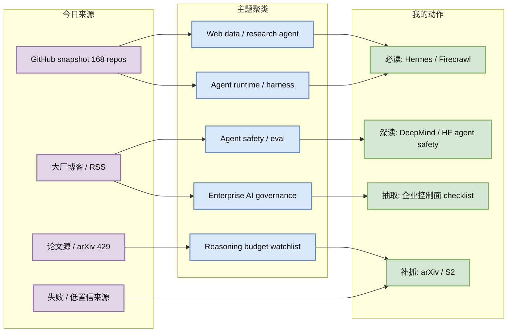
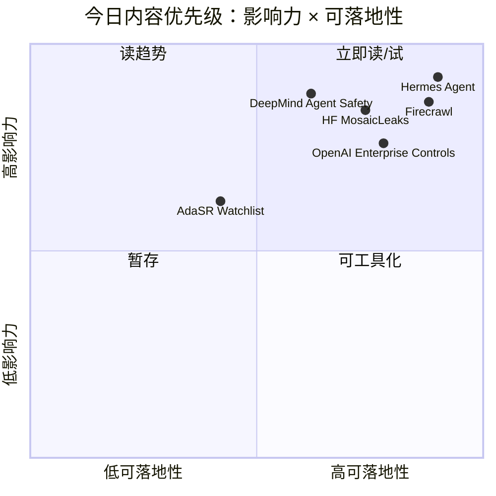

# AI Radar Daily - 2026-06-20

> 生成时间：2026-06-20 09:00 BJT  
> 范围：AI Infra / LLM / RL / Agent / Eval / Serving / Training / Post-training / World Model  
> 说明：日报是总览导航页；详情页负责深度理解。GitHub snapshot: `Automation/state/github-stars-2026-06-20.json`。

## 0. 今日结论

- 今日最强信号：agent runtime、web research data 和企业级治理继续高热；Hermes Agent、Firecrawl、ECC、Dify、Open WebUI 均在榜单中。
- 对 AI Infra 的直接影响：GitHub snapshot 成功保存 168 个 repo，但后半段 query 触发 403；日报继续采用“snapshot + 失败透明记录”的可靠模式。
- 对 LLM 训练 / 推理 / Agent 的影响：OpenAI 企业成本治理、DeepMind agent safety、HF agent secrecy/eval 都指向模型外控制面：usage telemetry、tool sandbox、eval harness。
- 对 RL / 游戏模型训练的影响：今日没有强新 RL/game paper；保留 reasoning budget / eval watchlist，避免弱相关论文填充。
- 建议今天深读：[[Industry/2026-06-20/DeepMind-Securing-Future-AI-Agents]]、[[Industry/2026-06-20/HuggingFace-MosaicLeaks-Research-Agent-Secrets]]、[[Industry/2026-06-20/HuggingFace-Agentic-Enough-Benchmarking]]、[[GitHub/2026-06-20/NousResearch--hermes-agent]]、[[GitHub/2026-06-20/firecrawl--firecrawl]]。

## 1. 今日态势图

## 2. 必读卡片区

> [!important] Agent runtime / web data 继续增长
> - 大类：GitHub
> - 小类：Agent Infra / Web Data
> - 重点：Hermes Agent +645、Firecrawl +554、ECC +508，agent harness、web extraction、skills/memory 仍是模型外关键资产。
> - 为什么重要：自动研究、tool use、agent workflow 的质量越来越依赖 runtime 和可控数据入口，而非单一模型能力。
> - 详情：[[GitHub/2026-06-20/NousResearch--hermes-agent]] / [网页详情](https://github.com/dyt27666-oss/AI-news-report-obsidians/blob/main/GitHub/2026-06-20/NousResearch--hermes-agent.md) / [原文](https://github.com/NousResearch/hermes-agent)

> [!important] DeepMind: Securing the future of AI agents
> - 大类：博客 / Research
> - 小类：Agent Safety
> - 重点：DeepMind 把 agent 安全落到 control roadmap、实时监控和内部系统防护。
> - 为什么重要：agent 越接近生产工具链，越需要 runtime 级安全控制，而不是只靠模型对齐口号。
> - 详情：[[Industry/2026-06-20/DeepMind-Securing-Future-AI-Agents]] / [网页详情](https://github.com/dyt27666-oss/AI-news-report-obsidians/blob/main/Industry/2026-06-20/DeepMind-Securing-Future-AI-Agents.md) / [原文](https://deepmind.google/blog/securing-the-future-of-ai-agents/)

> [!tip] HF: Research agent secret leakage + 自有工具链评测
> - 大类：博客
> - 小类：Agent Security / Agent Eval
> - 重点：MosaicLeaks 和 agentic enough 都把 agent 的真实风险放在“工具链 + 上下文 + 本地评测”里。
> - 为什么重要：这正对应自动研究员、browser agent、tool sandbox 的上线验收问题。
> - 详情：[[Industry/2026-06-20/HuggingFace-MosaicLeaks-Research-Agent-Secrets]] / [网页详情](https://github.com/dyt27666-oss/AI-news-report-obsidians/blob/main/Industry/2026-06-20/HuggingFace-MosaicLeaks-Research-Agent-Secrets.md) / [原文](https://huggingface.co/blog)

## 3. 优先级矩阵

## 4. 分类清单

| 标签 | 大类 | 小类 | 标题 | 重点概括 | 为什么重要 | Obsidian 详情 | 网页详情 | 原文 |
|---|---|---|---|---|---|---|---|---|
| 必读 | 博客 | Google DeepMind / Blog / Research / Agent Safety | Securing the future of AI agents | DeepMind 将 agent 安全落到 control roadmap、实时监控和内部系统防护，不只是抽象安全原则。 | 对 agent runtime、tool permission、monitoring、rollback、eval gate 都有直接架构启发。 | [[Industry/2026-06-20/DeepMind-Securing-Future-AI-Agents]] | [网页详情](https://github.com/dyt27666-oss/AI-news-report-obsidians/blob/main/Industry/2026-06-20/DeepMind-Securing-Future-AI-Agents.md) | [原文](https://deepmind.google/blog/securing-the-future-of-ai-agents/) |
| 必读 | 博客 | Hugging Face / Blog / Agent Security | MosaicLeaks: Can your research agent keep a secret? | HF 关注 research agent 是否会泄露秘密，核心是 agent 工具链、上下文和外部网页交互中的数据外泄风险。 | 对自动研究员很直接：需要把 secret handling、tool sandbox、prompt injection 和日志脱敏放进 agent runtime。 | [[Industry/2026-06-20/HuggingFace-MosaicLeaks-Research-Agent-Secrets]] | [网页详情](https://github.com/dyt27666-oss/AI-news-report-obsidians/blob/main/Industry/2026-06-20/HuggingFace-MosaicLeaks-Research-Agent-Secrets.md) | [原文](https://huggingface.co/blog) |
| 必读 | 博客 | Hugging Face / Blog / Agent Eval | Is it agentic enough? Benchmarking open models on your own tooling | 把 agentic 能力评测放到用户自己的工具链中，而不是只看封闭 leaderboard。 | 更贴近生产验收：工具调用、上下文管理、失败恢复和安全边界都应在本地环境测。 | [[Industry/2026-06-20/HuggingFace-Agentic-Enough-Benchmarking]] | [网页详情](https://github.com/dyt27666-oss/AI-news-report-obsidians/blob/main/Industry/2026-06-20/HuggingFace-Agentic-Enough-Benchmarking.md) | [原文](https://huggingface.co/blog/is-it-agentic-enough) |
| 必读 | GitHub | Agent / AI Infra | NousResearch/hermes-agent | The agent that grows with you | 今日 delta 645，显示 agent/data 工程生态持续高热。 | [[GitHub/2026-06-20/NousResearch--hermes-agent]] | [网页详情](https://github.com/dyt27666-oss/AI-news-report-obsidians/blob/main/GitHub/2026-06-20/NousResearch--hermes-agent.md) | [原文](https://github.com/NousResearch/hermes-agent) |
| 必读 | GitHub | Agent / AI Infra | firecrawl/firecrawl | The API to search, scrape, and interact with the web at scale. 🔥 | 今日 delta 554，显示 agent/data 工程生态持续高热。 | [[GitHub/2026-06-20/firecrawl--firecrawl]] | [网页详情](https://github.com/dyt27666-oss/AI-news-report-obsidians/blob/main/GitHub/2026-06-20/firecrawl--firecrawl.md) | [原文](https://github.com/firecrawl/firecrawl) |
| 必读 | GitHub | Agent / AI Infra | rohitg00/ai-engineering-from-scratch | Learn it. Build it. Ship it for others. | 今日 delta 334，显示 agent/data 工程生态持续高热。 | [[GitHub/2026-06-20/rohitg00--ai-engineering-from-scratch]] | [网页详情](https://github.com/dyt27666-oss/AI-news-report-obsidians/blob/main/GitHub/2026-06-20/rohitg00--ai-engineering-from-scratch.md) | [原文](https://github.com/rohitg00/ai-engineering-from-scratch) |
| 可 skim | 论文 | Agent Eval / Domain Benchmark | OpenAI LifeSciBench | 专家编写的生命科学 benchmark，强调真实研究任务和专家审核，可作为 agent/LLM eval 设计参考。 | 把“专家任务、评测协议、失败分析”转成 LLM/agent eval 资产；领域偏生命科学但方法可迁移。 | [[Papers/2026-06-20/OpenAI-LifeSciBench]] | [网页详情](https://github.com/dyt27666-oss/AI-news-report-obsidians/blob/main/Papers/2026-06-20/OpenAI-LifeSciBench.md) | [原文](https://openai.com/index/introducing-life-sci-bench) |
| 低置信 | 论文 | Serving / Reasoning Budget | AdaSR Adaptive Streaming Reasoning Watchlist | 自适应 streaming reasoning 方向与推理预算、延迟控制和 serving 策略相关；今日 arXiv/S2 429，保留 watchlist。 | 如果后续确认论文和结果，可能影响长链 reasoning 的 token budget、streaming latency 与质量控制。 | [[Papers/2026-06-20/AdaSR-Adaptive-Streaming-Reasoning-Watchlist]] | [网页详情](https://github.com/dyt27666-oss/AI-news-report-obsidians/blob/main/Papers/2026-06-20/AdaSR-Adaptive-Streaming-Reasoning-Watchlist.md) | [原文](https://arxiv.org/) |

## 5. 大厂资讯 / 工程博客 / Research

### 5.1 公司来源扫描矩阵

| 公司/实验室 | 来源/栏目 | 今日状态 | 高相关条数 | 代表条目 | 备注 |
|---|---|---|---:|---|---|
| OpenAI | News / Research | 有高相关新项 | 2 | Enterprise usage analytics; Improving health intelligence | RSS 可访问；企业治理和领域 eval 强相关 |
| Anthropic | News / Research / Engineering | 访问失败/低置信 | 0 | 无高相关新项 | 公开 RSS 404；未强行补弱相关 |
| Google DeepMind | Blog / Research | 有高相关新项 | 2 | Securing future AI agents; DiffusionGemma | RSS 可访问 |
| Meta AI | Blog / Research | 访问失败/低置信 | 0 | 无高相关新项 | RSS 404；保留矩阵 |
| NVIDIA | Technical Blog / AI | 低置信 | 0 | 无高相关新项 | Feed 只返回站点标题，未取到条目 |
| Microsoft | Research AI | 有高相关新项 | 2 | Data Formulator 0.7; MagenticLite/MagenticBrain/Fara1.5 | Research feed 可访问 |
| Hugging Face | Blog / Papers / Releases | 有高相关新项 | 3 | MosaicLeaks; Beyond LoRA; Agentic enough | RSS 可访问 |
| 腾讯 | AI Lab / 技术博客 | 低置信 | 0 | 无高相关新项 | 公开源未取到可核验 AI infra 强相关条目 |
| 字节 | Seed / 技术博客 | 低置信 | 0 | 无高相关新项 | 公开源未取到可核验 AI infra 强相关条目 |
| SpaceAI | Blog / News | 低置信 | 0 | 无高相关新项 | 公开源未取到可核验条目 |

### 5.2 高相关大厂条目

| 标签 | 发布方/大厂 | 栏目/来源 | 标题 | 重点概括 | 工程/算法影响 | Obsidian 详情 | 网页详情 | 原文 |
|---|---|---|---|---|---|---|---|---|
| 必读 | OpenAI | News / Product / Enterprise AI | New usage analytics and updated spend controls for enterprises | OpenAI 把企业使用分析、成本控制和组织级治理做成平台能力，说明 LLM 平台正在从“模型接入”进入 FinOps / Governance 阶段。 | 对 AI Infra 是直接需求输入：usage telemetry、quota、预算、project/account 粒度审计会成为 agent/LLM 平台默认控制面。 | [[Industry/2026-06-20/OpenAI-Enterprise-Usage-Analytics-Spend-Controls]] | [网页详情](https://github.com/dyt27666-oss/AI-news-report-obsidians/blob/main/Industry/2026-06-20/OpenAI-Enterprise-Usage-Analytics-Spend-Controls.md) | [原文](https://openai.com/index/chatgpt-enterprise-spend-controls) |
| 可 skim | OpenAI | News / Product Evaluation | Improving health intelligence in ChatGPT | OpenAI 强调 GPT-5.5 Instant 在健康问答上的 reasoning、上下文和医生参与评估，信号点是领域化 eval 与安全边界。 | 可借鉴其“专家参与 + 场景评测 + 输出沟通质量”的 eval 设计，但行业垂直性强，作为评测方法参考即可。 | [[Industry/2026-06-20/OpenAI-Health-Intelligence-ChatGPT]] | [网页详情](https://github.com/dyt27666-oss/AI-news-report-obsidians/blob/main/Industry/2026-06-20/OpenAI-Health-Intelligence-ChatGPT.md) | [原文](https://openai.com/index/improving-health-intelligence-in-chatgpt) |
| 必读 | Google DeepMind | Blog / Research / Agent Safety | Securing the future of AI agents | DeepMind 将 agent 安全落到 control roadmap、实时监控和内部系统防护，不只是抽象安全原则。 | 对 agent runtime、tool permission、monitoring、rollback、eval gate 都有直接架构启发。 | [[Industry/2026-06-20/DeepMind-Securing-Future-AI-Agents]] | [网页详情](https://github.com/dyt27666-oss/AI-news-report-obsidians/blob/main/Industry/2026-06-20/DeepMind-Securing-Future-AI-Agents.md) | [原文](https://deepmind.google/blog/securing-the-future-of-ai-agents/) |
| 可 skim | Google DeepMind | Blog / Research / Model Architecture | DiffusionGemma: 4x faster text generation | Diffusion-based text generation 主打更快生成，提示非自回归/扩散语言模型路线在 serving 延迟上仍值得观察。 | 短期未必替代主流 LLM serving，但对 batch scheduling、latency/cost tradeoff 和 speculative-like 解码路线有参考价值。 | [[Industry/2026-06-20/DeepMind-DiffusionGemma]] | [网页详情](https://github.com/dyt27666-oss/AI-news-report-obsidians/blob/main/Industry/2026-06-20/DeepMind-DiffusionGemma.md) | [原文](https://deepmind.google/blog/) |
| 必读 | Hugging Face | Blog / Agent Security | MosaicLeaks: Can your research agent keep a secret? | HF 关注 research agent 是否会泄露秘密，核心是 agent 工具链、上下文和外部网页交互中的数据外泄风险。 | 对自动研究员很直接：需要把 secret handling、tool sandbox、prompt injection 和日志脱敏放进 agent runtime。 | [[Industry/2026-06-20/HuggingFace-MosaicLeaks-Research-Agent-Secrets]] | [网页详情](https://github.com/dyt27666-oss/AI-news-report-obsidians/blob/main/Industry/2026-06-20/HuggingFace-MosaicLeaks-Research-Agent-Secrets.md) | [原文](https://huggingface.co/blog) |
| 必读 | Hugging Face | Blog / Agent Eval | Is it agentic enough? Benchmarking open models on your own tooling | 把 agentic 能力评测放到用户自己的工具链中，而不是只看封闭 leaderboard。 | 更贴近生产验收：工具调用、上下文管理、失败恢复和安全边界都应在本地环境测。 | [[Industry/2026-06-20/HuggingFace-Agentic-Enough-Benchmarking]] | [网页详情](https://github.com/dyt27666-oss/AI-news-report-obsidians/blob/main/Industry/2026-06-20/HuggingFace-Agentic-Enough-Benchmarking.md) | [原文](https://huggingface.co/blog/is-it-agentic-enough) |
| 可 skim | Hugging Face | Blog / Fine-tuning / PEFT | Beyond LoRA: Can you beat the most popular fine-tuning technique? | 围绕 LoRA 替代/扩展的 PEFT 方法比较，继续说明 post-training 成本效率仍是工程热点。 | 对小规模 RLHF/DPO/GRPO 实验的 adapter 选择有参考价值，但需等代码和 benchmark 细节核验。 | [[Industry/2026-06-20/HuggingFace-Beyond-LoRA]] | [网页详情](https://github.com/dyt27666-oss/AI-news-report-obsidians/blob/main/Industry/2026-06-20/HuggingFace-Beyond-LoRA.md) | [原文](https://huggingface.co/blog/peft-beyond-lora) |
| 可 skim | Microsoft | Research Blog / AI Data Analytics | Data Formulator 0.7: AI-powered data analytics for enterprise data | Microsoft 将 AI 辅助数据分析推进到企业数据场景，重点是自然语言到数据变换/可视化的工作流。 | 可作为 agentic data analysis 的产品信号，和内部 evaluation、observability 分析链路有关。 | [[Industry/2026-06-20/Microsoft-Data-Formulator-07]] | [网页详情](https://github.com/dyt27666-oss/AI-news-report-obsidians/blob/main/Industry/2026-06-20/Microsoft-Data-Formulator-07.md) | [原文](https://www.microsoft.com/en-us/research/) |
| 可 skim | Microsoft | Research Blog / Agent Systems | MagenticLite, MagenticBrain, Fara1.5: An agentic experience optimized for small models | Microsoft 把小模型 agent 体验作为优化目标，提示 agent infra 不能只围绕最大模型设计。 | 对低成本 agent runtime、local/small model routing、eval 分层有直接参考。 | [[Industry/2026-06-20/Microsoft-MagenticLite-MagenticBrain-Fara15]] | [网页详情](https://github.com/dyt27666-oss/AI-news-report-obsidians/blob/main/Industry/2026-06-20/Microsoft-MagenticLite-MagenticBrain-Fara15.md) | [原文](https://www.microsoft.com/en-us/research/) |

## 6. GitHub 高 star Top 10

| 排名 | repo | stars | forks | language | updated_at | topics | 重点概括 | 是否值得试用 | Obsidian 详情 | 原文 |
|---:|---|---:|---:|---|---|---|---|---|---|---|
| 1 | affaan-m/ECC | 218287 | 33484 | JavaScript | 2026-06-20T00:55:25Z | ai-agents, anthropic, claude, claude-code, developer-tools | The agent harness performance optimization system. Skills, instincts, memory, security,  | 值得试用/观察 | [[GitHub/2026-06-20/affaan-m--ECC]] | [GitHub](https://github.com/affaan-m/ECC) |
| 2 | NousResearch/hermes-agent | 197655 | 34990 | Python | 2026-06-20T00:54:25Z | ai, ai-agent, ai-agents, anthropic, chatgpt | The agent that grows with you | 值得试用/观察 | [[GitHub/2026-06-20/NousResearch--hermes-agent]] | [GitHub](https://github.com/NousResearch/hermes-agent) |
| 3 | tensorflow/tensorflow | 195774 | 75196 | C++ | 2026-06-20T01:00:04Z | deep-learning, deep-neural-networks, distributed, machine-learning, ml | An Open Source Machine Learning Framework for Everyone | 值得试用/观察 | [[GitHub/2026-06-20/tensorflow--tensorflow]] | [GitHub](https://github.com/tensorflow/tensorflow) |
| 4 | Significant-Gravitas/AutoGPT | 185040 | 46129 | Python | 2026-06-20T00:37:57Z | agentic-ai, agents, ai, artificial-intelligence, autonomous-agents | AutoGPT is the vision of accessible AI for everyone, to use and to build on. Our mission | 值得试用/观察 | [[GitHub/2026-06-20/Significant-Gravitas--AutoGPT]] | [GitHub](https://github.com/Significant-Gravitas/AutoGPT) |
| 5 | ollama/ollama | 174560 | 16684 | Go | 2026-06-20T00:49:38Z | deepseek, gemma, gemma3, glm, go | Get up and running with Kimi-K2.6, GLM-5.1, MiniMax, DeepSeek, gpt-oss, Qwen, Gemma and  | 值得试用/观察 | [[GitHub/2026-06-20/ollama--ollama]] | [GitHub](https://github.com/ollama/ollama) |
| 6 | f/prompts.chat | 163952 | 21255 | HTML | 2026-06-20T00:27:37Z | ai, artificial-intelligence, awesome-list, chatgpt, chatgpt-prompts | f.k.a. Awesome ChatGPT Prompts. Share, discover, and collect prompts from the community. | 值得试用/观察 | [[GitHub/2026-06-20/f--prompts.chat]] | [GitHub](https://github.com/f/prompts.chat) |
| 7 | huggingface/transformers | 161731 | 33552 | Python | 2026-06-19T23:33:24Z | audio, deep-learning, deepseek, gemma, glm | 🤗 Transformers: the model-definition framework for state-of-the-art machine learning mod | 可观察 | [[GitHub/2026-06-20/huggingface--transformers]] | [GitHub](https://github.com/huggingface/transformers) |
| 8 | langflow-ai/langflow | 149854 | 9298 | Python | 2026-06-19T22:04:10Z | agents, chatgpt, generative-ai, large-language-models, multiagent | Langflow is a powerful tool for building and deploying AI-powered agents and workflows. | 可观察 | [[GitHub/2026-06-20/langflow-ai--langflow]] | [GitHub](https://github.com/langflow-ai/langflow) |
| 9 | langgenius/dify | 145852 | 22934 | TypeScript | 2026-06-20T00:56:57Z | agent, agentic-ai, agentic-framework, agentic-workflow, ai | Production-ready platform for agentic workflow development. | 可观察 | [[GitHub/2026-06-20/langgenius--dify]] | [GitHub](https://github.com/langgenius/dify) |
| 10 | open-webui/open-webui | 142291 | 20454 | Python | 2026-06-20T00:22:12Z | ai, llm, llm-ui, llm-webui, llms | User-friendly AI Interface (Supports Ollama, OpenAI API, ...) | 可观察 | [[GitHub/2026-06-20/open-webui--open-webui]] | [GitHub](https://github.com/open-webui/open-webui) |

## 7. GitHub star 增长最快 Top 10

> 使用 `Automation/state/github-stars-2026-06-19.json` 作为历史 baseline，非冷启动；GitHub API 部分 query 403，增长榜基于成功采集到的 168 个 repo。

| 排名 | repo | stars_delta | stars | forks | language | updated_at | 增长依据 | 重点概括 | Obsidian 详情 | 原文 |
|---:|---|---:|---:|---:|---|---|---|---|---|---|
| 1 | NousResearch/hermes-agent | 645 | 197655 | 34990 | Python | 2026-06-20T00:54:25Z | historical_snapshot | The agent that grows with you | [[GitHub/2026-06-20/NousResearch--hermes-agent]] | [GitHub](https://github.com/NousResearch/hermes-agent) |
| 2 | firecrawl/firecrawl | 554 | 135321 | 7873 | TypeScript | 2026-06-20T00:59:14Z | historical_snapshot | The API to search, scrape, and interact with the web at scale. 🔥 | [[GitHub/2026-06-20/firecrawl--firecrawl]] | [GitHub](https://github.com/firecrawl/firecrawl) |
| 3 | affaan-m/ECC | 508 | 218287 | 33484 | JavaScript | 2026-06-20T00:55:25Z | historical_snapshot | The agent harness performance optimization system. Skills, instincts, memory, security,  | [[GitHub/2026-06-20/affaan-m--ECC]] | [GitHub](https://github.com/affaan-m/ECC) |
| 4 | JuliusBrussee/caveman | 348 | 74896 | 4226 | JavaScript | 2026-06-20T00:58:59Z | historical_snapshot | 🪨 why use many token when few token do trick — Claude Code skill that cuts 65% of tokens | [[GitHub/2026-06-20/JuliusBrussee--caveman]] | [GitHub](https://github.com/JuliusBrussee/caveman) |
| 5 | rohitg00/ai-engineering-from-scratch | 334 | 34743 | 5662 | Python | 2026-06-20T01:01:07Z | historical_snapshot | Learn it. Build it. Ship it for others. | [[GitHub/2026-06-20/rohitg00--ai-engineering-from-scratch]] | [GitHub](https://github.com/rohitg00/ai-engineering-from-scratch) |
| 6 | omnigent-ai/omnigent | 248 | 4052 | 456 | Python | 2026-06-20T00:44:09Z | historical_snapshot | Omnigent is an open-source AI agent framework and meta-harness: orchestrate Claude Code, | [[GitHub/2026-06-20/omnigent-ai--omnigent]] | [GitHub](https://github.com/omnigent-ai/omnigent) |
| 7 | asgeirtj/system_prompts_leaks | 227 | 43579 | 7219 | JavaScript | 2026-06-20T00:59:02Z | historical_snapshot | Extracted system prompts from Anthropic - Claude Fable 5, Opus 4.8, Claude Code, Claude  | [[GitHub/2026-06-20/asgeirtj--system_prompts_leaks]] | [GitHub](https://github.com/asgeirtj/system_prompts_leaks) |
| 8 | TauricResearch/TradingAgents | 220 | 87463 | 16893 | Python | 2026-06-20T00:57:37Z | historical_snapshot | TradingAgents: Multi-Agents LLM Financial Trading Framework | [[GitHub/2026-06-20/TauricResearch--TradingAgents]] | [GitHub](https://github.com/TauricResearch/TradingAgents) |
| 9 | owainlewis/awesome-artificial-intelligence | 206 | 14603 | 2345 | Unknown | 2026-06-19T23:28:32Z | historical_snapshot | A curated list of Artificial Intelligence (AI) courses, books, video lectures and papers | [[GitHub/2026-06-20/owainlewis--awesome-artificial-intelligence]] | [GitHub](https://github.com/owainlewis/awesome-artificial-intelligence) |
| 10 | bytedance/deer-flow | 146 | 71692 | 9732 | Python | 2026-06-20T00:59:30Z | historical_snapshot | An open-source long-horizon SuperAgent harness that researches, codes, and creates. With | [[GitHub/2026-06-20/bytedance--deer-flow]] | [GitHub](https://github.com/bytedance/deer-flow) |

## 8. 论文

### 8.1 Eval / Reasoning / Serving Watchlist

| 标签 | 论文来源 | 论文 | 作者/机构 | 重点概括 | 工程/研究价值 | Obsidian 详情 | 网页详情 | PDF/原文 |
|---|---|---|---|---|---|---|---|---|
| 可 skim | OpenAI Research Blog / benchmark / company report | OpenAI LifeSciBench | OpenAI / 见原文 | 专家编写的生命科学 benchmark，强调真实研究任务和专家审核，可作为 agent/LLM eval 设计参考。 | 把“专家任务、评测协议、失败分析”转成 LLM/agent eval 资产；领域偏生命科学但方法可迁移。 | [[Papers/2026-06-20/OpenAI-LifeSciBench]] | [网页详情](https://github.com/dyt27666-oss/AI-news-report-obsidians/blob/main/Papers/2026-06-20/OpenAI-LifeSciBench.md) | [PDF/原文](https://openai.com/index/introducing-life-sci-bench) |
| 低置信 | arXiv watchlist / 预印本元数据待核验 / low-confidence | AdaSR Adaptive Streaming Reasoning Watchlist | 待核验 | 自适应 streaming reasoning 方向与推理预算、延迟控制和 serving 策略相关；今日 arXiv/S2 429，保留 watchlist。 | 如果后续确认论文和结果，可能影响长链 reasoning 的 token budget、streaming latency 与质量控制。 | [[Papers/2026-06-20/AdaSR-Adaptive-Streaming-Reasoning-Watchlist]] | [网页详情](https://github.com/dyt27666-oss/AI-news-report-obsidians/blob/main/Papers/2026-06-20/AdaSR-Adaptive-Streaming-Reasoning-Watchlist.md) | [PDF/原文](https://arxiv.org/) |

## 9. 资讯 / 其他 GitHub 项目

### 9.1 Agent / Web Data / Workflow Infra

| 标签 | 来源 | 标题 | 重点概括 | 对我有什么用 | Obsidian 详情 | 网页详情 | 原文 |
|---|---|---|---|---|---|---|---|
| 必读 | GitHub | Firecrawl | Web search/scrape/extract API 增长 +554，直接对应 research agent 数据入口 | 可作为 crawler fallback 和网页转 markdown 方案观察 | [[GitHub/2026-06-20/firecrawl--firecrawl]] | [网页详情](https://github.com/dyt27666-oss/AI-news-report-obsidians/blob/main/GitHub/2026-06-20/firecrawl--firecrawl.md) | [原文](https://github.com/firecrawl/firecrawl) |
| 可 skim | GitHub | Dify | agentic workflow development 平台仍在高 star 榜 | 对比 workflow control plane 和企业落地模式 | [[GitHub/2026-06-20/langgenius--dify]] | [网页详情](https://github.com/dyt27666-oss/AI-news-report-obsidians/blob/main/GitHub/2026-06-20/langgenius--dify.md) | [原文](https://github.com/langgenius/dify) |
| 可 skim | GitHub | vLLM | 高吞吐 serving 基线项目，今日未进入 Top10 但仍是 AI Infra 核心观察项 | 作为 serving scheduler/KV cache/batching 的基线 | [[GitHub/2026-06-20/vllm-project--vllm]] | [网页详情](https://github.com/dyt27666-oss/AI-news-report-obsidians/blob/main/GitHub/2026-06-20/vllm-project--vllm.md) | [原文](https://github.com/vllm-project/vllm) |

## 10. 按主题索引

### AI Infra / Serving / Training
- [[GitHub/2026-06-20/vllm-project--vllm]] - 高吞吐 LLM serving 基线项目。
- [[GitHub/2026-06-20/huggingface--transformers]] - 模型定义、训练与推理生态核心依赖。
- [[Industry/2026-06-20/OpenAI-Enterprise-Usage-Analytics-Spend-Controls]] - 企业 AI 平台成本治理信号。
- [[Industry/2026-06-20/HuggingFace-Beyond-LoRA]] - PEFT/post-training 成本效率观察。

### LLM / Agent / RAG / Evaluation
- [[GitHub/2026-06-20/NousResearch--hermes-agent]] - agent skills/memory/runtime 高增长。
- [[Industry/2026-06-20/DeepMind-Securing-Future-AI-Agents]] - agent runtime 安全 roadmap。
- [[Industry/2026-06-20/HuggingFace-MosaicLeaks-Research-Agent-Secrets]] - research agent secret leakage 风险。
- [[Industry/2026-06-20/HuggingFace-Agentic-Enough-Benchmarking]] - 自有工具链上的 agent eval。

### RL / Game AI / World Model
- [[Papers/2026-06-20/AdaSR-Adaptive-Streaming-Reasoning-Watchlist]] - reasoning budget / streaming watchlist；今日低置信。
- [[GitHub/2026-06-20/TauricResearch--TradingAgents]] - 多 agent RL/决策类框架，作为 agent coordination 观察项。

### 公司 / 实验室
- OpenAI: [[Industry/2026-06-20/OpenAI-Enterprise-Usage-Analytics-Spend-Controls]]
- DeepMind: [[Industry/2026-06-20/DeepMind-Securing-Future-AI-Agents]]
- Hugging Face: [[Industry/2026-06-20/HuggingFace-Agentic-Enough-Benchmarking]]
- Microsoft: [[Industry/2026-06-20/Microsoft-MagenticLite-MagenticBrain-Fara15]]

## 11. 值得后续深挖

| 标签 | 大类 | 小类 | 标题 | 后续动作 | Obsidian 详情 | 原文 |
|---|---|---|---|---|---|---|
| 后续 | 论文 | arXiv / S2 | 今日 arXiv 与 Semantic Scholar 429/timeout | 明日补抓论文元数据，避免弱相关填充 | [[Papers/2026-06-20/AdaSR-Adaptive-Streaming-Reasoning-Watchlist]] | [arXiv](https://arxiv.org/) |
| 后续 | 工程 | GitHub API | collect_github_stars.py 部分 query 403 | 可加 token/缓存/退避策略，减少后半段 topic 丢失 | [[GitHub/2026-06-20/NousResearch--hermes-agent]] | [Snapshot](../Automation/state/github-stars-2026-06-20.json) |
| 后续 | Agent Security | HF MosaicLeaks | 抽取 research agent secret-handling checklist | [[Industry/2026-06-20/HuggingFace-MosaicLeaks-Research-Agent-Secrets]] | [HF Blog](https://huggingface.co/blog) |

## 12. 采集失败或低置信来源

- GitHub Search：topic:inference stars:>100 / stars -> HTTP Error 403: rate limit exceeded
- GitHub Search：topic:inference stars:>100 / updated -> HTTP Error 403: rate limit exceeded
- GitHub Search：topic:cuda stars:>100 / stars -> HTTP Error 403: rate limit exceeded
- GitHub Search：topic:cuda stars:>100 / updated -> HTTP Error 403: rate limit exceeded
- GitHub Search：topic:triton stars:>50 / stars -> HTTP Error 403: rate limit exceeded
- GitHub Search：topic:triton stars:>50 / updated -> HTTP Error 403: rate limit exceeded
- GitHub Search：vllm OR sglang OR tensorrt-llm / stars -> HTTP Error 403: rate limit exceeded
- GitHub Search：vllm OR sglang OR tensorrt-llm / updated -> HTTP Error 403: rate limit exceeded
- GitHub snapshot 已保存 168 个 repo，但共有 10 个 query/sort 触发 403 rate limit。
- arXiv API：今日多次 timeout / 429；论文区只保留高相关 watchlist 和公司 benchmark，不用弱相关论文填充。
- Semantic Scholar：HTTP 429；citation/related work 暂未补齐。
- Anthropic RSS、Meta AI RSS 公开 feed 404；NVIDIA feed 只返回站点标题；腾讯、字节、SpaceAI 未取到可核验高相关新项。

## 13. 归档标签

#ai-radar #daily #ai-infra #llm #rl #agent #eval
