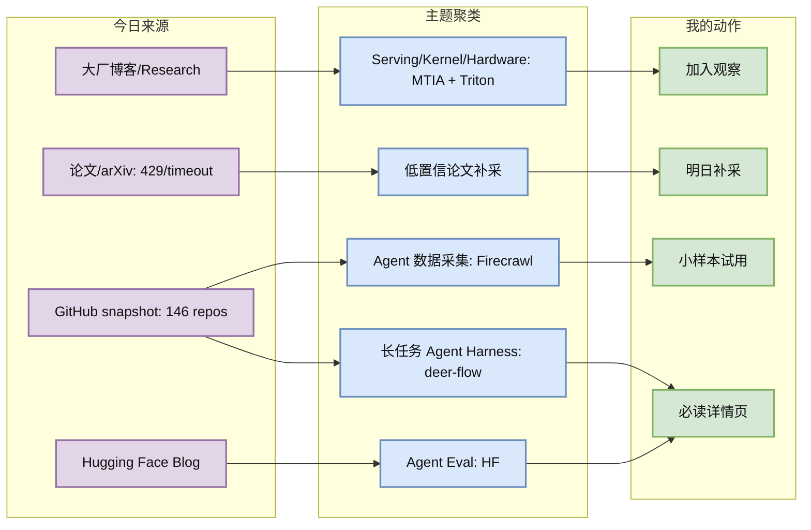
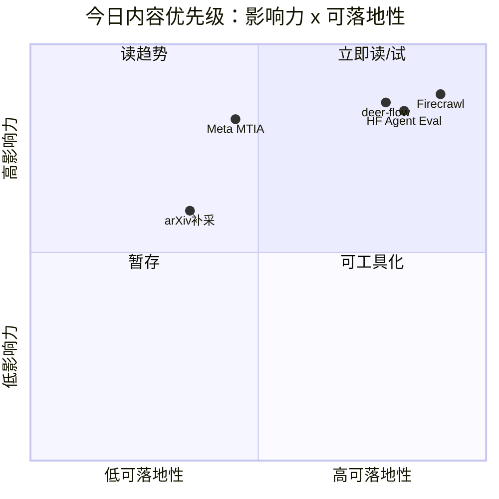

# AI Radar Daily - 2026-06-21

> 生成时间：2026-06-21 09:00:33 CST
> 范围：AI Infra / LLM / RL / Game AI / 大厂博客 / 论文 / GitHub / 行业资讯
> 说明：日报是总览导航页，详情页负责深度理解。GitHub snapshot：`Automation/state/github-stars-2026-06-21.json`。

## 0. 今日结论

- 今日最值得关注：Agent 基础设施继续从框架走向长任务执行、数据采集、评测闭环，Firecrawl、deer-flow、HF agent eval 是今天最强组合信号。
- 对 AI Infra 的直接影响：web extraction、LLM gateway、agent harness、kernel optimization 正在变成可拼装的生产基础设施。
- 对 LLM 训练 / 推理 / Agent 的影响：长任务模型、agentic eval、Triton kernel skill 说明模型能力与工程验证正在更紧密耦合。
- 对 RL / 游戏模型训练的影响：今天没有高置信新论文；RL/agent eval 查询被保留为 watchlist，避免因 arXiv 限流漏报。
- 建议今天深读：Firecrawl、deer-flow、HF Is it agentic enough、Meta MTIA。

## 1. 今日态势图

## 2. 必读卡片区

> [!important] Firecrawl: agent/RAG 数据采集层高增长
> - 大类：GitHub
> - 小类：Agent 数据采集 / Web extraction
> - 重点：今日真实增长 +486 stars，web-scale scrape/search/API 正在成为 research agent 的基础组件。
> - 为什么重要：Agent 系统的可靠性常卡在网页读取、证据链和反爬失败；Firecrawl 这类工具直接影响 RAG ingestion 和评测数据采集。
> - 详情：[[GitHub/2026-06-21/firecrawl-web-scale-search-scrape-api-keeps-accelerating]] / [网页详情](https://github.com/dyt27666-oss/AI-news-report-obsidians/blob/main/GitHub/2026-06-21/firecrawl-web-scale-search-scrape-api-keeps-accelerating.md) / [原文](https://github.com/firecrawl/firecrawl)

> [!important] deer-flow: 字节长任务 SuperAgent harness
> - 大类：GitHub
> - 小类：Long-horizon Agent
> - 重点：今日真实增长 +320 stars，强调 sandbox、memory、tools、skills、subagents、message gateway。
> - 为什么重要：这正是生产级 agent 从 demo 走向可执行长任务时需要的系统骨架。
> - 详情：[[GitHub/2026-06-21/bytedance-deer-flow-long-horizon-superagent-harness]] / [网页详情](https://github.com/dyt27666-oss/AI-news-report-obsidians/blob/main/GitHub/2026-06-21/bytedance-deer-flow-long-horizon-superagent-harness.md) / [原文](https://github.com/bytedance/deer-flow)

> [!tip] HF: Is it agentic enough?
> - 大类：博客
> - 小类：Agent Eval
> - 重点：开放模型是否足够 agentic 要在自有工具链上 benchmark，而不是只看通用榜单。
> - 为什么重要：可直接启发内部 agent eval harness，把工具调用、失败模式和任务闭环纳入评测。
> - 详情：[[Industry/2026-06-21/hugging-face-is-it-agentic-enough]] / [网页详情](https://github.com/dyt27666-oss/AI-news-report-obsidians/blob/main/Industry/2026-06-21/hugging-face-is-it-agentic-enough.md) / [原文](https://huggingface.co/blog/is-it-agentic-enough)

> [!note] Meta MTIA: 自研 AI 芯片规模化信号
> - 大类：博客
> - 小类：Serving / Hardware
> - 重点：四颗 MTIA 两年迭代，说明硬件-编译器-模型协同会持续影响 inference 成本曲线。
> - 为什么重要：AI Infra 需要关注硬件路线对 batching、memory bandwidth、kernel 和部署策略的约束。
> - 详情：[[Industry/2026-06-21/meta-mtia-four-ai-chips-in-two-years]] / [网页详情](https://github.com/dyt27666-oss/AI-news-report-obsidians/blob/main/Industry/2026-06-21/meta-mtia-four-ai-chips-in-two-years.md) / [原文](https://ai.meta.com/blog/meta-mtia-scale-ai-chips-for-billions/)

## 3. 优先级矩阵

## 4. 分类清单

| 标签 | 大类 | 小类 | 标题 | 重点概括 | 为什么重要 | Obsidian 详情 | 网页详情 | 原文 |
|---|---|---|---|---|---|---|---|---|
| 必读 | GitHub | Agent 数据采集 | Firecrawl | Agent/RAG 网页采集基础设施继续高速增长。 | 真实增长 +486，说明 web extraction 已成为 agent infra 的核心依赖。 | [[GitHub/2026-06-21/firecrawl-web-scale-search-scrape-api-keeps-accelerating]] | [网页详情](https://github.com/dyt27666-oss/AI-news-report-obsidians/blob/main/GitHub/2026-06-21/firecrawl-web-scale-search-scrape-api-keeps-accelerating.md) | [原文](https://github.com/firecrawl/firecrawl) |
| 必读 | GitHub | Long-horizon Agent | deer-flow | 字节 long-horizon SuperAgent harness 强增长。 | 长任务 agent 的 sandbox/memory/tool/subagent 架构值得拆解。 | [[GitHub/2026-06-21/bytedance-deer-flow-long-horizon-superagent-harness]] | [网页详情](https://github.com/dyt27666-oss/AI-news-report-obsidians/blob/main/GitHub/2026-06-21/bytedance-deer-flow-long-horizon-superagent-harness.md) | [原文](https://github.com/bytedance/deer-flow) |
| 必读 | 博客 | Agent Eval | Is it agentic enough? | HF 聚焦开放模型在自有工具链上的 agentic 评测。 | 可转化为内部 agent eval 设计。 | [[Industry/2026-06-21/hugging-face-is-it-agentic-enough]] | [网页详情](https://github.com/dyt27666-oss/AI-news-report-obsidians/blob/main/Industry/2026-06-21/hugging-face-is-it-agentic-enough.md) | [原文](https://huggingface.co/blog/is-it-agentic-enough) |
| 必读 | 博客 | AI 芯片/Serving | Meta MTIA | Meta 继续公开自研 AI 芯片规模化。 | 硬件路线会影响推理成本、batching 和部署策略。 | [[Industry/2026-06-21/meta-mtia-four-ai-chips-in-two-years]] | [网页详情](https://github.com/dyt27666-oss/AI-news-report-obsidians/blob/main/Industry/2026-06-21/meta-mtia-four-ai-chips-in-two-years.md) | [原文](https://ai.meta.com/blog/meta-mtia-scale-ai-chips-for-billions/) |
| 低置信 | 论文 | arXiv | 论文源访问失败 | arXiv 今天出现 429/timeout/503。 | 保留论文板块但不编造未核验论文。 | [[Papers/2026-06-21/arxiv-watchlist-llm-serving-kv-cache-speculative-decoding]] | [网页详情](https://github.com/dyt27666-oss/AI-news-report-obsidians/blob/main/Papers/2026-06-21/arxiv-watchlist-llm-serving-kv-cache-speculative-decoding.md) | [原文](https://export.arxiv.org/api/query) |

## 5. 大厂资讯 / 工程博客 / Research

### 5.1 公司来源扫描矩阵

| 公司/实验室 | 来源/栏目 | 今日状态 | 高相关条数 | 代表条目 | 备注 |
|---|---|---|---:|---|---|
| OpenAI | News / Research | 访问失败 | 0 | 无高相关新项 | 官网 403；已记录失败，不用未核验信息填充 |
| Anthropic | News / Research / Engineering | 有候选但偏产品/政策 | 3 | Claude Corps / Opus 4.8 / AI cyber threats | 无明显 AI Infra 深技术新项，列入低优先 |
| Google DeepMind | Blog / Research | 低置信 | 0 | 无高相关新项 | 首页可访问但列表抽取不足，未发现强相关新项 |
| Meta AI | Blog / Research | 有高相关新项 | 2 | MTIA / SAM 3.1 | 芯片和视觉实时检测均与 infra/serving 相关 |
| NVIDIA | Technical Blog / AI | 访问失败 | 0 | 无高相关新项 | 配置 URL 返回 404；HF 上有 NVIDIA Cosmos/Nemotron 相关文章作为间接信号 |
| Microsoft | Research AI | 访问失败/低置信 | 0 | 无高相关新项 | Research 页面 403 或动态加载，未纳入必读 |
| Hugging Face | Blog / Papers / Releases | 有高相关新项 | 6 | Agentic enough / Intel XPU Kernel / GLM-5.2 | Agent eval、Triton kernel、long-horizon model 信号强 |
| 腾讯 | AI Lab / 技术博客 | 低置信 | 0 | 无高相关新项 | 页面可访问但未抽取到当天高相关工程项 |
| 字节 | Seed / 技术博客 | 有 GitHub 高相关项 | 1 | deer-flow | 官网未抽取到新博客，但 GitHub 项目强相关 |
| SpaceAI | Blog / News | 低置信 | 1 | Open Space Network architecture | 基础设施相关但 AI 相关性弱 |

### 5.2 高相关大厂条目

| 标签 | 发布方/大厂 | 栏目/来源 | 标题 | 重点概括 | 工程/算法影响 | Obsidian 详情 | 网页详情 | 原文 |
|---|---|---|---|---|---|---|---|---|
| 可 skim | Anthropic | Announcements / Policy | Claude Corps / Opus 4.8 / AI cyber threat posts | 更多是生态和政策信号，技术细节有限。 | 关注 Claude 进入 regulated industries 对企业 agent 部署的合规压力。 | [[Daily/2026-06-21]] | [网页详情](https://github.com/dyt27666-oss/AI-news-report-obsidians/blob/main/Daily/2026-06-21.md) | [原文](https://www.anthropic.com/news/claude-corps) |
| 必读 | Meta AI | Engineering Blog | Four MTIA chips in two years | 自研 AI accelerator 进入规模化叙事。 | 对 serving 成本、硬件抽象和模型部署策略有长期影响。 | [[Industry/2026-06-21/meta-mtia-four-ai-chips-in-two-years]] | [网页详情](https://github.com/dyt27666-oss/AI-news-report-obsidians/blob/main/Industry/2026-06-21/meta-mtia-four-ai-chips-in-two-years.md) | [原文](https://ai.meta.com/blog/meta-mtia-scale-ai-chips-for-billions/) |
| 必读 | Hugging Face | Blog / Evaluation | Is it agentic enough? | 把 agent 评测落到自有工具链，而非只看通用 benchmark。 | 可抽取为内部 agent eval harness 的设计参考。 | [[Industry/2026-06-21/hugging-face-is-it-agentic-enough]] | [网页详情](https://github.com/dyt27666-oss/AI-news-report-obsidians/blob/main/Industry/2026-06-21/hugging-face-is-it-agentic-enough.md) | [原文](https://huggingface.co/blog/is-it-agentic-enough) |
| 可 skim | Hugging Face | Blog / Kernel Hub | Intel XPU Kernel Skill | LLM 辅助 Triton kernel optimization 的工程信号。 | 推理优化可能从人工 kernel 专家转向模型辅助搜索。 | [[Industry/2026-06-21/hugging-face-intel-xpu-kernel-skill-for-triton-optimization]] | [网页详情](https://github.com/dyt27666-oss/AI-news-report-obsidians/blob/main/Industry/2026-06-21/hugging-face-intel-xpu-kernel-skill-for-triton-optimization.md) | [原文](https://huggingface.co/blog/danf/intel-xpu-kernels-skill) |
| 可 skim | Hugging Face / ZAI | Model Blog | GLM-5.2 for Long-Horizon Tasks | 长任务模型发布继续推高 agent 编排上限。 | 需要同步关注长任务 eval、memory 和可观测。 | [[Industry/2026-06-21/hugging-face-glm-5-2-built-for-long-horizon-tasks]] | [网页详情](https://github.com/dyt27666-oss/AI-news-report-obsidians/blob/main/Industry/2026-06-21/hugging-face-glm-5-2-built-for-long-horizon-tasks.md) | [原文](https://huggingface.co/blog/zai-org/glm-52-blog) |
| 后续 | SpaceAI | Blog / Medium | Open Space Network architecture | 偏 open infra/network，AI 相关性暂弱。 | 仅作为分布式资源/边缘 AI 观察点。 | [[Industry/2026-06-21/spaceai-open-space-network-architecture]] | [网页详情](https://github.com/dyt27666-oss/AI-news-report-obsidians/blob/main/Industry/2026-06-21/spaceai-open-space-network-architecture.md) | [原文](https://medium.com/@SpaceAI/architecting-the-open-space-network-for-a-multi-planetary-economic-paradigm-819212b85cd8) |

## 6. GitHub 高 star Top 10

| 排名 | repo | stars | forks | language | updated_at | topics | 重点概括 | 是否值得试用 | Obsidian 详情 | 原文 |
|---:|---|---:|---:|---|---|---|---|---|---|---|
| 1 | [affaan-m/ECC](https://github.com/affaan-m/ECC) | 218861 | 33557 | JavaScript | 2026-06-21 | ai-agents, anthropic, claude, claude-code, developer-tools | The agent harness performance optimization system. Skills, instincts, memory, security, an | 值得小样本试用 | [[GitHub/2026-06-21/affaan-m-ecc]] | [原文](https://github.com/affaan-m/ECC) |
| 2 | [NousResearch/hermes-agent](https://github.com/NousResearch/hermes-agent) | 198315 | 35175 | Python | 2026-06-21 | ai, ai-agent, ai-agents, anthropic, chatgpt | The agent that grows with you | 值得小样本试用 | [[GitHub/2026-06-21/nousresearch-hermes-agent]] | [原文](https://github.com/NousResearch/hermes-agent) |
| 3 | [Significant-Gravitas/AutoGPT](https://github.com/Significant-Gravitas/AutoGPT) | 185048 | 46127 | Python | 2026-06-21 | agentic-ai, agents, ai, artificial-intelligence, autonomous-agents | AutoGPT is the vision of accessible AI for everyone, to use and to build on. Our mission i | 值得小样本试用 | [[GitHub/2026-06-21/significant-gravitas-autogpt]] | [原文](https://github.com/Significant-Gravitas/AutoGPT) |
| 4 | [huggingface/transformers](https://github.com/huggingface/transformers) | 161754 | 33562 | Python | 2026-06-20 | audio, deep-learning, deepseek, gemma, glm | 🤗 Transformers: the model-definition framework for state-of-the-art machine learning model | 值得小样本试用 | [[GitHub/2026-06-21/huggingface-transformers]] | [原文](https://github.com/huggingface/transformers) |
| 5 | [langflow-ai/langflow](https://github.com/langflow-ai/langflow) | 149882 | 9307 | Python | 2026-06-21 | agents, chatgpt, generative-ai, large-language-models, multiagent | Langflow is a powerful tool for building and deploying AI-powered agents and workflows. | 值得小样本试用 | [[GitHub/2026-06-21/langflow-ai-langflow]] | [原文](https://github.com/langflow-ai/langflow) |
| 6 | [langgenius/dify](https://github.com/langgenius/dify) | 145969 | 22954 | TypeScript | 2026-06-21 | agent, agentic-ai, agentic-framework, agentic-workflow, ai | Production-ready platform for agentic workflow development. | 值得小样本试用 | [[GitHub/2026-06-21/langgenius-dify]] | [原文](https://github.com/langgenius/dify) |
| 7 | [open-webui/open-webui](https://github.com/open-webui/open-webui) | 142422 | 20476 | Python | 2026-06-21 | ai, llm, llm-ui, llm-webui, llms | User-friendly AI Interface (Supports Ollama, OpenAI API, ...) | 值得小样本试用 | [[GitHub/2026-06-21/open-webui-open-webui]] | [原文](https://github.com/open-webui/open-webui) |
| 8 | [langchain-ai/langchain](https://github.com/langchain-ai/langchain) | 139774 | 23179 | Python | 2026-06-21 | agents, ai, ai-agents, anthropic, chatgpt | The agent engineering platform. | 值得小样本试用 | [[GitHub/2026-06-21/langchain-ai-langchain]] | [原文](https://github.com/langchain-ai/langchain) |
| 9 | [firecrawl/firecrawl](https://github.com/firecrawl/firecrawl) | 135807 | 7885 | TypeScript | 2026-06-21 | ai, ai-agents, ai-crawler, ai-scraping, ai-search | The API to search, scrape, and interact with the web at scale. 🔥 | 值得小样本试用 | [[GitHub/2026-06-21/firecrawl-firecrawl]] | [原文](https://github.com/firecrawl/firecrawl) |
| 10 | [Shubhamsaboo/awesome-llm-apps](https://github.com/Shubhamsaboo/awesome-llm-apps) | 115163 | 17102 | Python | 2026-06-21 | agents, llms, python, rag | 100+ AI Agent & RAG apps you can actually run — clone, customize, ship. | 值得小样本试用 | [[GitHub/2026-06-21/shubhamsaboo-awesome-llm-apps]] | [原文](https://github.com/Shubhamsaboo/awesome-llm-apps) |

## 7. GitHub star 增长最快 Top 10

> 增长依据：已读取历史 snapshot，今天为真实 `historical_snapshot` 增长，不是冷启动代理。GitHub API 部分 query 触发 403 rate limit，但 snapshot 已保存并包含 146 个 repo。

| 排名 | repo | stars_delta | stars | forks | language | updated_at | 增长依据 | 重点概括 | Obsidian 详情 | 原文 |
|---:|---|---:|---:|---:|---|---|---|---|---|---|
| 1 | [NousResearch/hermes-agent](https://github.com/NousResearch/hermes-agent) | 660 | 198315 | 35175 | Python | 2026-06-21 | historical_snapshot | The agent that grows with you | [[GitHub/2026-06-21/nousresearch-hermes-agent]] | [原文](https://github.com/NousResearch/hermes-agent) |
| 2 | [affaan-m/ECC](https://github.com/affaan-m/ECC) | 574 | 218861 | 33557 | JavaScript | 2026-06-21 | historical_snapshot | The agent harness performance optimization system. Skills, instincts, memory, security, an | [[GitHub/2026-06-21/affaan-m-ecc]] | [原文](https://github.com/affaan-m/ECC) |
| 3 | [firecrawl/firecrawl](https://github.com/firecrawl/firecrawl) | 486 | 135807 | 7885 | TypeScript | 2026-06-21 | historical_snapshot | The API to search, scrape, and interact with the web at scale. 🔥 | [[GitHub/2026-06-21/firecrawl-firecrawl]] | [原文](https://github.com/firecrawl/firecrawl) |
| 4 | [rohitg00/ai-engineering-from-scratch](https://github.com/rohitg00/ai-engineering-from-scratch) | 341 | 35084 | 5724 | Python | 2026-06-21 | historical_snapshot | Learn it. Build it. Ship it for others. | [[GitHub/2026-06-21/rohitg00-ai-engineering-from-scratch]] | [原文](https://github.com/rohitg00/ai-engineering-from-scratch) |
| 5 | [bytedance/deer-flow](https://github.com/bytedance/deer-flow) | 320 | 72012 | 9771 | Python | 2026-06-21 | historical_snapshot | An open-source long-horizon SuperAgent harness that researches, codes, and creates. With t | [[GitHub/2026-06-21/bytedance-deer-flow]] | [原文](https://github.com/bytedance/deer-flow) |
| 6 | [TauricResearch/TradingAgents](https://github.com/TauricResearch/TradingAgents) | 175 | 87638 | 16923 | Python | 2026-06-21 | historical_snapshot | TradingAgents: Multi-Agents LLM Financial Trading Framework | [[GitHub/2026-06-21/tauricresearch-tradingagents]] | [原文](https://github.com/TauricResearch/TradingAgents) |
| 7 | [ruvnet/ruflo](https://github.com/ruvnet/ruflo) | 168 | 60550 | 7039 | TypeScript | 2026-06-21 | historical_snapshot | 🌊 The leading agent meta-harness for Claude. Deploy intelligent multi-agent swarms, coordi | [[GitHub/2026-06-21/ruvnet-ruflo]] | [原文](https://github.com/ruvnet/ruflo) |
| 8 | [sgl-project/sglang](https://github.com/sgl-project/sglang) | 134 | 29451 | 6626 | Python | 2026-06-21 | historical_snapshot | SGLang is a high-performance serving framework for large language models and multimodal mo | [[GitHub/2026-06-21/sgl-project-sglang]] | [原文](https://github.com/sgl-project/sglang) |
| 9 | [browser-use/browser-use](https://github.com/browser-use/browser-use) | 132 | 99745 | 11119 | Python | 2026-06-21 | historical_snapshot | 🌐 Make websites accessible for AI agents. Automate tasks online with ease. | [[GitHub/2026-06-21/browser-use-browser-use]] | [原文](https://github.com/browser-use/browser-use) |
| 10 | [thedotmack/claude-mem](https://github.com/thedotmack/claude-mem) | 132 | 83401 | 7220 | JavaScript | 2026-06-21 | historical_snapshot | Persistent Context Across Sessions for Every Agent –  Captures everything your agent does  | [[GitHub/2026-06-21/thedotmack-claude-mem]] | [原文](https://github.com/thedotmack/claude-mem) |

## 8. 论文

### 8.1 低置信论文补采队列

| 标签 | 论文来源 | 论文 | 作者/机构 | 重点概括 | 工程/研究价值 | Obsidian 详情 | 网页详情 | PDF/原文 |
|---|---|---|---|---|---|---|---|---|
| 低置信 | arXiv | arXiv Watchlist: LLM serving / KV cache / speculative decoding | 未核验 | arXiv API 429/timeout，今日不编造论文元数据。 | 明天优先补采 serving/inference/KV cache 论文。 | [[Papers/2026-06-21/arxiv-watchlist-llm-serving-kv-cache-speculative-decoding]] | [网页详情](https://github.com/dyt27666-oss/AI-news-report-obsidians/blob/main/Papers/2026-06-21/arxiv-watchlist-llm-serving-kv-cache-speculative-decoding.md) | [arXiv API](https://export.arxiv.org/api/query) |
| 低置信 | arXiv | arXiv Watchlist: RL post-training / GRPO / agent evaluation | 未核验 | arXiv API 429/timeout/503，今日不编造论文元数据。 | 保留 RLHF/GRPO/Agent Eval 查询，避免漏掉强相关研究。 | [[Papers/2026-06-21/arxiv-watchlist-rl-post-training-grpo-agent-evaluation]] | [网页详情](https://github.com/dyt27666-oss/AI-news-report-obsidians/blob/main/Papers/2026-06-21/arxiv-watchlist-rl-post-training-grpo-agent-evaluation.md) | [arXiv API](https://export.arxiv.org/api/query) |

## 9. 资讯 / 其他 GitHub 项目

### 9.1 Agent / Web / Gateway

| 标签 | 来源 | 标题 | 重点概括 | 对我有什么用 | Obsidian 详情 | 网页详情 | 原文 |
|---|---|---|---|---|---|---|---|
| 可 skim | GitHub | LiteLLM / Kong / kvcache-ai Mooncake | 模型网关、AI Gateway、KV cache serving 平台继续是高相关工程方向。 | 后续可按网关-缓存-运行时拆成组件评估。 | [[GitHub/2026-06-21/berriai-litellm]] | [网页详情](https://github.com/dyt27666-oss/AI-news-report-obsidians/blob/main/GitHub/2026-06-21/berriai-litellm.md) | [LiteLLM](https://github.com/BerriAI/litellm) |
| 后续 | SpaceAI | Open Space Network | 分布式开放网络/资源叙事，AI 相关性暂弱。 | 仅作为 decentralized infra 观察点。 | [[Industry/2026-06-21/spaceai-open-space-network-architecture]] | [网页详情](https://github.com/dyt27666-oss/AI-news-report-obsidians/blob/main/Industry/2026-06-21/spaceai-open-space-network-architecture.md) | [原文](https://medium.com/@SpaceAI/architecting-the-open-space-network-for-a-multi-planetary-economic-paradigm-819212b85cd8) |

## 10. 按主题索引

### AI Infra / Serving / Training

- [[Industry/2026-06-21/meta-mtia-four-ai-chips-in-two-years]] - 自研 AI 加速器规模化信号。
- [[Industry/2026-06-21/hugging-face-intel-xpu-kernel-skill-for-triton-optimization]] - LLM 辅助 kernel optimization。
- [[GitHub/2026-06-21/berriai-litellm]] - LLM gateway / proxy 观察。
- [[GitHub/2026-06-21/kvcache-ai-mooncake]] - KV cache / serving 平台观察。

### LLM / Agent / RAG / Evaluation

- [[GitHub/2026-06-21/firecrawl-web-scale-search-scrape-api-keeps-accelerating]] - agent/RAG 数据采集。
- [[GitHub/2026-06-21/bytedance-deer-flow-long-horizon-superagent-harness]] - 长任务 agent harness。
- [[Industry/2026-06-21/hugging-face-is-it-agentic-enough]] - agent eval。
- [[Industry/2026-06-21/hugging-face-glm-5-2-built-for-long-horizon-tasks]] - long-horizon model。

### RL / Game AI / World Model

- [[Papers/2026-06-21/arxiv-watchlist-rl-post-training-grpo-agent-evaluation]] - arXiv 限流导致的 RL/agent eval 补采队列。

### 公司 / 实验室

- OpenAI: 今日官网 403，未纳入高置信条目。
- Anthropic: Claude Corps / Opus 4.8 / AI cyber threats 为低优先生态信号。
- DeepMind: 今日低置信，未发现高相关新项。
- Meta: [[Industry/2026-06-21/meta-mtia-four-ai-chips-in-two-years]]
- NVIDIA: 官网配置 URL 404；HF 上有 NVIDIA 相关模型博客。
- Hugging Face: [[Industry/2026-06-21/hugging-face-is-it-agentic-enough]] / [[Industry/2026-06-21/hugging-face-intel-xpu-kernel-skill-for-triton-optimization]]
- 腾讯 / 字节 / 国内大厂: [[GitHub/2026-06-21/bytedance-deer-flow-long-horizon-superagent-harness]]

## 11. 值得后续深挖

| 标签 | 大类 | 小类 | 标题 | 后续动作 | Obsidian 详情 | 原文 |
|---|---|---|---|---|---|---|
| 必读 | GitHub | Agent Infra | Firecrawl | 跑一个网页采集到 eval dataset 的 mini pipeline。 | [[GitHub/2026-06-21/firecrawl-web-scale-search-scrape-api-keeps-accelerating]] | [原文](https://github.com/firecrawl/firecrawl) |
| 必读 | GitHub | Agent Harness | deer-flow | 阅读 sandbox/memory/subagent 设计，和现有 worker 架构对比。 | [[GitHub/2026-06-21/bytedance-deer-flow-long-horizon-superagent-harness]] | [原文](https://github.com/bytedance/deer-flow) |
| 后续 | 论文 | arXiv | Serving/RLHF/Agent Eval 补采 | arXiv 恢复后复查 query 并补详情页。 | [[Papers/2026-06-21/arxiv-watchlist-llm-serving-kv-cache-speculative-decoding]] | [arXiv API](https://export.arxiv.org/api/query) |

## 12. 采集失败或低置信来源

- arXiv：多次 `429 / timeout / 503`，今日论文只保留低置信补采队列，不编造论文元数据。
- GitHub：snapshot 成功保存 146 repos；后半部分 query 遇到 GitHub API 403 rate limit，因此可能漏掉部分 CUDA/Triton/vLLM/GRPO 项目。
- OpenAI：官网 403。
- NVIDIA：配置 URL `https://developer.nvidia.com/blog/category/artificial-intelligence/` 返回 404。
- Microsoft Research AI：页面 403 或动态加载，未抽取高置信新项。
- Google DeepMind / 腾讯 / 字节官网：页面可访问但未抽取到当天高相关新博客；字节用 GitHub deer-flow 作为强信号。

## 13. 归档标签

#ai-radar #daily #ai-infra #llm #rl #agent #eval
