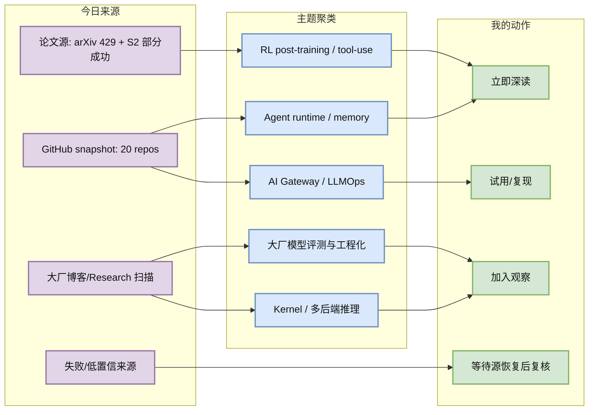
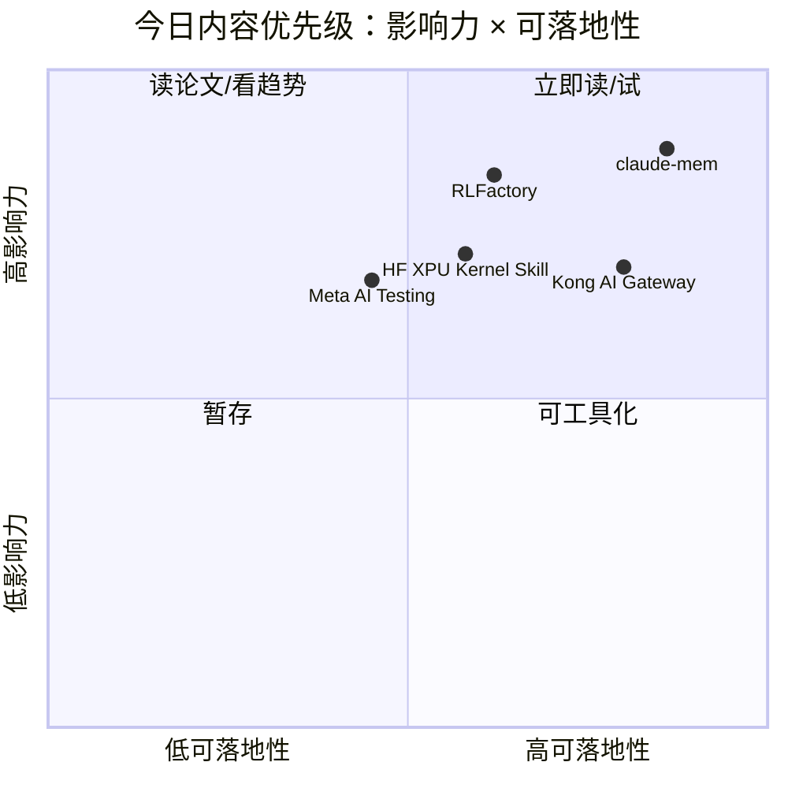

# AI Radar Daily - 2026-06-22

> 生成时间：2026-06-22 09:00 北京时间  
> 范围：AI Infra / LLM / RL / Agent / Eval / Serving / Training / 大厂博客 / 论文 / GitHub  
> 说明：日报是导航入口；深度理解请进入 Obsidian 详情页。今日 GitHub 与 arXiv/Semantic Scholar 存在限流，低置信项已显式标注。

## 0. 今日结论

- 今日最值得关注：Agent 长期记忆与开发代理生态继续升温，`thedotmack/claude-mem` 单日 +170 stars，`OpenHands` +89 stars，说明“跨会话上下文 + 工程执行代理”仍是工具层增长主线。
- 对 AI Infra 的直接影响：Kong 的 AI Gateway、Flowise/AutoGPT/OpenHands 这类 agent runtime 都在把 LLM 调用变成可治理的生产流量；后续要重点看 gateway、memory、tool-call tracing、eval 的统一观测面。
- 对 LLM 训练 / 推理 / Agent 的影响：Hugging Face 的 Intel XPU Triton kernel 方向值得关注，说明 kernel 自动优化正在从 NVIDIA/CUDA 语境扩到多后端；RLFactory 论文则把 tool-use RL post-training 做成异步工具调用和奖励层框架。
- 对 RL / 游戏模型训练的影响：今日高置信新论文不足，但 RL post-training 的 contamination、multi-agent co-training、tool-use MDP 重构都和游戏 agent 的 rollout/reward/eval 管线高度同构。
- 建议今天深读：[[GitHub/2026-06-22/claude-mem-agent-memory]]、[[Papers/2026-06-22/RLFactory-tool-use-rl-post-training]]、[[Industry/2026-06-22/huggingface-intel-xpu-kernel-skill]]、[[Industry/2026-06-22/meta-scaling-advanced-ai-testing]]。

## 1. 今日态势图

## 2. 必读卡片区

> [!important] claude-mem：Agent 长期记忆成为今日 GitHub 增长最强信号
> - 大类：GitHub
> - 小类：Agent Memory / RAG / Developer Agent
> - 重点：该项目把 agent session 压缩、嵌入、SQLite/向量检索和未来会话上下文注入串成闭环，今日真实 snapshot 增长 +170 stars。
> - 为什么重要：对长期运行的 coding agent / ops agent 来说，记忆不是聊天体验问题，而是任务恢复、约束保持、评估归因和跨工具上下文治理问题。
> - 详情：[[GitHub/2026-06-22/claude-mem-agent-memory]] / [网页详情](https://github.com/dyt27666-oss/AI-news-report-obsidians/blob/main/GitHub/2026-06-22/claude-mem-agent-memory.md) / [原文](https://github.com/thedotmack/claude-mem)

> [!important] RLFactory：把多轮工具调用 RL post-training 工程化
> - 大类：论文
> - 小类：RL Post-training / Tool-use Agent
> - 重点：论文提出异步 tool caller、解耦 tool/training 架构和 reward layer，将 generate-parse-invoke-update 做成可插拔框架。
> - 为什么重要：它直接对应你关心的 RL rollout、环境交互、reward design 和训练吞吐瓶颈；论文声称在 Search-R1/Qwen3-4B 上训练吞吐提升 6.8x。
> - 详情：[[Papers/2026-06-22/RLFactory-tool-use-rl-post-training]] / [网页详情](https://github.com/dyt27666-oss/AI-news-report-obsidians/blob/main/Papers/2026-06-22/RLFactory-tool-use-rl-post-training.md) / [原文](https://arxiv.org/abs/2509.06980)

> [!tip] Hugging Face + Intel XPU Kernel Skill：Triton kernel 自动优化走向多硬件后端
> - 大类：博客
> - 小类：Kernel / Triton / Inference Infra
> - 重点：Hugging Face blog 出现 Intel XPU Kernel Skill，信号是 kernel hub 与 LLM-driven kernel optimization 不再只围绕 CUDA。
> - 为什么重要：Serving 工程里 kernel 选择、benchmark、fallback 和硬件抽象会成为多云/多芯片部署的基础能力。
> - 详情：[[Industry/2026-06-22/huggingface-intel-xpu-kernel-skill]] / [网页详情](https://github.com/dyt27666-oss/AI-news-report-obsidians/blob/main/Industry/2026-06-22/huggingface-intel-xpu-kernel-skill.md) / [原文](https://huggingface.co/blog/danf/intel-xpu-kernels-skill)

> [!tip] Meta：Scaling How We Build and Test Our Most Advanced AI
> - 大类：博客
> - 小类：大厂工程化 / Evaluation / Model Shipping
> - 重点：Meta 的标题级信号集中在 advanced AI 的构建与测试规模化，适合跟踪大厂如何把 eval、安全、发布 gate 接入模型迭代。
> - 为什么重要：训练/推理能力之外，真正决定模型能否进入生产的是大规模测试体系、回归防线和上线治理。
> - 详情：[[Industry/2026-06-22/meta-scaling-advanced-ai-testing]] / [网页详情](https://github.com/dyt27666-oss/AI-news-report-obsidians/blob/main/Industry/2026-06-22/meta-scaling-advanced-ai-testing.md) / [原文](https://ai.meta.com/blog/scaling-how-we-build-test-advanced-ai/)

## 3. 优先级矩阵

## 4. 分类清单

| 标签 | 大类 | 小类 | 标题 | 重点概括 | 为什么重要 | Obsidian 详情 | 网页详情 | 原文 |
|---|---|---|---|---|---|---|---|---|
| 必读 | GitHub | Agent Memory | claude-mem | Agent 会话压缩、长期记忆与未来上下文注入，今日 +170 stars。 | 长期 agent 的状态恢复、经验复用和约束保持是下一阶段 agent infra 核心问题。 | [[GitHub/2026-06-22/claude-mem-agent-memory]] | [网页详情](https://github.com/dyt27666-oss/AI-news-report-obsidians/blob/main/GitHub/2026-06-22/claude-mem-agent-memory.md) | [原文](https://github.com/thedotmack/claude-mem) |
| 必读 | 论文 | RL post-training | RLFactory | 面向多轮工具调用的 RL post-training 框架，包含异步工具调用与奖励层。 | 和 RL agent 环境交互、rollout throughput、tool verification 强相关。 | [[Papers/2026-06-22/RLFactory-tool-use-rl-post-training]] | [网页详情](https://github.com/dyt27666-oss/AI-news-report-obsidians/blob/main/Papers/2026-06-22/RLFactory-tool-use-rl-post-training.md) | [原文](https://arxiv.org/abs/2509.06980) |
| 可 skim | 博客 | Kernel / XPU | Intel XPU Kernel Skill | HF blog 候选显示 LLM-driven Triton kernel optimization 正在扩展到 Intel XPU。 | 多后端推理部署需要 kernel benchmark、选择和 fallback 机制。 | [[Industry/2026-06-22/huggingface-intel-xpu-kernel-skill]] | [网页详情](https://github.com/dyt27666-oss/AI-news-report-obsidians/blob/main/Industry/2026-06-22/huggingface-intel-xpu-kernel-skill.md) | [原文](https://huggingface.co/blog/danf/intel-xpu-kernels-skill) |
| 可 skim | 博客 | Eval / 大厂工程 | Meta advanced AI build/test | Meta 释放 advanced AI 构建与测试规模化信号。 | 大厂模型上线的核心护城河越来越偏 eval infra、regression gate 和安全测试。 | [[Industry/2026-06-22/meta-scaling-advanced-ai-testing]] | [网页详情](https://github.com/dyt27666-oss/AI-news-report-obsidians/blob/main/Industry/2026-06-22/meta-scaling-advanced-ai-testing.md) | [原文](https://ai.meta.com/blog/scaling-how-we-build-test-advanced-ai/) |
| 后续 | 博客 | Anthropic Product / Agentic coding | Claude Opus 4.8 | Anthropic news 候选显示 Opus class 模型在 coding、agentic tasks 上升级。 | 对 coding agent benchmark、工具使用稳定性和模型路由策略有参考价值，但正文未完全抓取，需复核。 | [[Industry/2026-06-22/anthropic-claude-opus-4-8]] | [网页详情](https://github.com/dyt27666-oss/AI-news-report-obsidians/blob/main/Industry/2026-06-22/anthropic-claude-opus-4-8.md) | [原文](https://www.anthropic.com/news/claude-opus-4-8) |

## 5. 大厂资讯 / 工程博客 / Research

### 5.1 公司来源扫描矩阵

| 公司/实验室 | 来源/栏目 | 今日状态 | 高相关条数 | 代表条目 | 备注 |
|---|---|---|---:|---|---|
| OpenAI | News / Research | 访问失败 | 0 | 无 | 官网返回 403；已记录为采集失败，未臆造新项。 |
| Anthropic | News / Research / Engineering | 有候选 | 3 | Introducing Claude Opus 4.8；Teaching Claude why；Natural Language Autoencoders | 页面可访问；部分条目不是当天发布，但和 agentic coding、alignment、interpretability 相关。 |
| Google DeepMind | Blog / Research | 低置信 | 0 | Google Antigravity / AI Studio 导航项 | 抓到多为导航链接，未发现高置信新 blog 条目。 |
| Meta AI | Blog / Research | 有候选 | 4 | Scaling How We Build and Test Our Most Advanced AI；SAM 3.1；MTIA chips | Advanced AI testing 与芯片规模化和 AI Infra 相关。 |
| NVIDIA | Technical Blog / AI | 访问失败 | 0 | 无 | 配置 URL 返回 404；需后续更新 source URL 或改用 RSS。 |
| Microsoft | Research AI | 低置信 | 0 | AI for Science / Search & IR | 页面可访问但抓到的是研究方向导航，非明确新条目。 |
| Hugging Face | Blog / Papers / Releases | 有候选 | 3 | Intel XPU Kernel Skill；ColBERT regularization；North Mini Code | Kernel Skill 与推理 infra 最相关。 |
| 腾讯 | AI Lab / 技术博客 | 无高相关新项 | 0 | 无 | 页面可访问但本轮未抓到高相关候选链接。 |
| 字节 | Seed / 技术博客 | 无高相关新项 | 0 | 无 | 页面可访问但本轮未抓到高相关候选链接。 |
| SpaceAI | Blog / News | 低置信 | 0 | Join Waitlist | 页面可访问但仅抓到 waitlist，未发现 AI Infra/LLM/RL 高相关内容。 |

### 5.2 高相关大厂条目

| 标签 | 发布方/大厂 | 栏目/来源 | 标题 | 重点概括 | 工程/算法影响 | Obsidian 详情 | 网页详情 | 原文 |
|---|---|---|---|---|---|---|---|---|
| 可 skim | Hugging Face | Blog / Technical Blog | Intel XPU Kernel Skill: LLM-driven Triton kernel optimization for the Hugging Face Kernel Hub | 多后端 kernel 优化信号，指向 XPU 上 Triton kernel 自动生成/调优。 | Serving 平台未来需要按硬件后端做 kernel registry、benchmark 和灰度选择。 | [[Industry/2026-06-22/huggingface-intel-xpu-kernel-skill]] | [网页详情](https://github.com/dyt27666-oss/AI-news-report-obsidians/blob/main/Industry/2026-06-22/huggingface-intel-xpu-kernel-skill.md) | [原文](https://huggingface.co/blog/danf/intel-xpu-kernels-skill) |
| 可 skim | Meta AI | Blog / Engineering Research | Scaling How We Build and Test Our Most Advanced AI | 大厂 advanced AI 构建与测试规模化信号。 | 对 eval pipeline、release gate、regression suite 和安全测试有参考价值。 | [[Industry/2026-06-22/meta-scaling-advanced-ai-testing]] | [网页详情](https://github.com/dyt27666-oss/AI-news-report-obsidians/blob/main/Industry/2026-06-22/meta-scaling-advanced-ai-testing.md) | [原文](https://ai.meta.com/blog/scaling-how-we-build-test-advanced-ai/) |
| 后续 | Anthropic | News / Product Announcement | Introducing Claude Opus 4.8 | Opus class 模型在 coding、agentic tasks、professional work 上升级的产品信号。 | 需要复核 benchmark 与 tool-use 稳定性；可影响 coding agent 模型路由。 | [[Industry/2026-06-22/anthropic-claude-opus-4-8]] | [网页详情](https://github.com/dyt27666-oss/AI-news-report-obsidians/blob/main/Industry/2026-06-22/anthropic-claude-opus-4-8.md) | [原文](https://www.anthropic.com/news/claude-opus-4-8) |
| 后续 | Anthropic | Research / Alignment | Teaching Claude why | Anthropic 研究页候选，主题是降低 agentic misalignment。 | 对 agent safety eval、reward shaping 和行为解释有参考价值；需等待完整正文复核。 | [[Industry/2026-06-22/anthropic-claude-opus-4-8]] | [网页详情](https://github.com/dyt27666-oss/AI-news-report-obsidians/blob/main/Industry/2026-06-22/anthropic-claude-opus-4-8.md) | [原文](https://www.anthropic.com/research/teaching-claude-why) |

## 6. GitHub 高 star Top 10

| 排名 | repo | stars | forks | language | updated_at | topics | 重点概括 | 是否值得试用 | Obsidian 详情 | 原文 |
|---:|---|---:|---:|---|---|---|---|---|---|---|
| 1 | Significant-Gravitas/AutoGPT | 185061 | 46120 | Python | 2026-06-22T00:56:33Z | agentic-ai, agents, llm, autonomous-agents | 老牌 autonomous agent 框架，仍保持活跃更新。 | 可作为 agent orchestration/benchmark 对照，不建议直接当生产底座。 | [[GitHub/2026-06-22/AutoGPT]] | [原文](https://github.com/Significant-Gravitas/AutoGPT) |
| 2 | f/prompts.chat | 164045 | 21256 | HTML | 2026-06-22T00:55:39Z | llm, prompt-engineering, prompts | prompt 库和私有化 prompt 目录，偏应用层。 | 可 skim；对 infra 价值有限，适合看 prompt 管理需求。 | [[GitHub/2026-06-22/prompts-chat]] | [原文](https://github.com/f/prompts.chat) |
| 3 | rasbt/LLMs-from-scratch | 97501 | 14937 | Jupyter Notebook | 2026-06-21T23:39:52Z | llm, pretraining, finetuning, tokenizer | 从零实现 LLM 的教学代码库。 | 值得收藏，用于训练/推理机制复盘，不是生产工具。 | [[GitHub/2026-06-22/LLMs-from-scratch]] | [原文](https://github.com/rasbt/LLMs-from-scratch) |
| 4 | hacksider/Deep-Live-Cam | 94036 | 13702 | Python | 2026-06-22T00:10:24Z | realtime, ai, deepfake | 实时 deepfake 工具，和本 radar 主题弱相关。 | 不建议试用；作为安全/滥用风险观察。 | [[GitHub/2026-06-22/Deep-Live-Cam]] | [原文](https://github.com/hacksider/Deep-Live-Cam) |
| 5 | thedotmack/claude-mem | 83571 | 7230 | JavaScript | 2026-06-22T00:57:21Z | ai-memory, ai-agents, embeddings, sqlite, rag | Agent 长期记忆层，支持多种 coding agent。 | 值得试用：优先验证存储、压缩、召回和隐私边界。 | [[GitHub/2026-06-22/claude-mem-agent-memory]] | [原文](https://github.com/thedotmack/claude-mem) |
| 6 | OpenHands/OpenHands | 77936 | 9906 | Python | 2026-06-22T00:50:40Z | agent, developer-tools, llm, cli | AI-driven development agent 框架。 | 值得在沙箱任务中试用，并对比 Codex/Claude Code。 | [[GitHub/2026-06-22/OpenHands]] | [原文](https://github.com/OpenHands/OpenHands) |
| 7 | FlowiseAI/Flowise | 53874 | 24568 | TypeScript | 2026-06-22T00:56:27Z | agentic-workflow, agents, rag, multiagent-systems | 可视化 agent/RAG workflow builder。 | 可试用于低代码 orchestration 原型；生产需关注 observability。 | [[GitHub/2026-06-22/Flowise]] | [原文](https://github.com/FlowiseAI/Flowise) |
| 8 | jingyaogong/minimind | 52016 | 6689 | Python | 2026-06-22T00:48:45Z | large-language-model | 2 小时从零训练 64M LLM 的教学/实验项目。 | 值得收藏；适合教学与小规模训练管线验证。 | [[GitHub/2026-06-22/minimind]] | [原文](https://github.com/jingyaogong/minimind) |
| 9 | microsoft/AI-For-Beginners | 48342 | 10024 | Jupyter Notebook | 2026-06-21T23:39:52Z | ai, deep-learning, machine-learning | 入门课程库。 | 可 skim；对高级 infra 价值低。 | [[GitHub/2026-06-22/AI-For-Beginners]] | [原文](https://github.com/microsoft/AI-For-Beginners) |
| 10 | Kong/kong | 43636 | 5155 | Lua | 2026-06-21T23:54:14Z | ai-gateway, llm-gateway, mcp-gateway, kubernetes | API and AI Gateway，开始承载 LLM/MCP gateway 语义。 | 值得试用：适合作为模型调用入口治理和限流层候选。 | [[GitHub/2026-06-22/Kong-AI-Gateway]] | [原文](https://github.com/Kong/kong) |

## 7. GitHub star 增长最快 Top 10

> 增长依据：已读取历史 snapshot，今日不是冷启动；`stars_delta` 为相对最近历史 snapshot 的真实差值。GitHub API 部分查询 403 rate limit，因此候选池只有 20 个 repo，榜单仍满足 10 条但可能漏掉部分项目。

| 排名 | repo | stars_delta | stars | forks | language | updated_at | 增长依据 | 重点概括 | Obsidian 详情 | 原文 |
|---:|---|---:|---:|---:|---|---|---|---|---|---|
| 1 | thedotmack/claude-mem | 170 | 83571 | 7230 | JavaScript | 2026-06-22T00:57:21Z | historical_snapshot | Agent 长期记忆与跨会话上下文注入，今日最强增长。 | [[GitHub/2026-06-22/claude-mem-agent-memory]] | [原文](https://github.com/thedotmack/claude-mem) |
| 2 | OpenHands/OpenHands | 89 | 77936 | 9906 | Python | 2026-06-22T00:50:40Z | historical_snapshot | AI coding agent 框架持续增长。 | [[GitHub/2026-06-22/OpenHands]] | [原文](https://github.com/OpenHands/OpenHands) |
| 3 | f/prompts.chat | 60 | 164045 | 21256 | HTML | 2026-06-22T00:55:39Z | historical_snapshot | prompt 资产管理仍有大众需求。 | [[GitHub/2026-06-22/prompts-chat]] | [原文](https://github.com/f/prompts.chat) |
| 4 | rasbt/LLMs-from-scratch | 46 | 97501 | 14937 | Jupyter Notebook | 2026-06-21T23:39:52Z | historical_snapshot | LLM 机制教学项目保持增长。 | [[GitHub/2026-06-22/LLMs-from-scratch]] | [原文](https://github.com/rasbt/LLMs-from-scratch) |
| 5 | FlowiseAI/Flowise | 41 | 53874 | 24568 | TypeScript | 2026-06-22T00:56:27Z | historical_snapshot | 低代码 agent workflow builder。 | [[GitHub/2026-06-22/Flowise]] | [原文](https://github.com/FlowiseAI/Flowise) |
| 6 | ashishpatel26/500-AI-Machine-learning-Deep-learning-Computer-vision-NLP-Projects-with-code | 34 | 34751 | 7287 | Unknown | 2026-06-22T00:28:44Z | historical_snapshot | 项目合集，偏学习资料。 | [[GitHub/2026-06-22/AI-projects-code-list]] | [原文](https://github.com/ashishpatel26/500-AI-Machine-learning-Deep-learning-Computer-vision-NLP-Projects-with-code) |
| 7 | jingyaogong/minimind | 29 | 52016 | 6689 | Python | 2026-06-22T00:48:45Z | historical_snapshot | 小模型训练教学项目。 | [[GitHub/2026-06-22/minimind]] | [原文](https://github.com/jingyaogong/minimind) |
| 8 | microsoft/AI-For-Beginners | 29 | 48342 | 10024 | Jupyter Notebook | 2026-06-21T23:39:52Z | historical_snapshot | AI 入门课程，弱相关。 | [[GitHub/2026-06-22/AI-For-Beginners]] | [原文](https://github.com/microsoft/AI-For-Beginners) |
| 9 | hacksider/Deep-Live-Cam | 23 | 94036 | 13702 | Python | 2026-06-22T00:10:24Z | historical_snapshot | 实时 deepfake 工具，安全风险观察。 | [[GitHub/2026-06-22/Deep-Live-Cam]] | [原文](https://github.com/hacksider/Deep-Live-Cam) |
| 10 | Significant-Gravitas/AutoGPT | 13 | 185061 | 46120 | Python | 2026-06-22T00:56:33Z | historical_snapshot | 老牌 autonomous agent 框架。 | [[GitHub/2026-06-22/AutoGPT]] | [原文](https://github.com/Significant-Gravitas/AutoGPT) |

## 8. 论文

### 8.1 RL post-training / Tool-use Agent

| 标签 | 论文来源 | 论文 | 作者/机构 | 重点概括 | 工程/研究价值 | Obsidian 详情 | 网页详情 | PDF/原文 |
|---|---|---|---|---|---|---|---|---|
| 必读 | Semantic Scholar + arXiv；预印本/论文索引 | RLFactory: A Plug-and-Play Reinforcement Learning Post-Training Framework for LLM Multi-Turn Tool-Use | Jiajun Chai 等 | 多轮工具调用 RL post-training，异步调用器 + 解耦 tool/training + reward layer；摘要声称训练吞吐 +6.8x。 | 直接对应 tool-use agent 的 MDP 重构、reward verification 与 rollout throughput。 | [[Papers/2026-06-22/RLFactory-tool-use-rl-post-training]] | [网页详情](https://github.com/dyt27666-oss/AI-news-report-obsidians/blob/main/Papers/2026-06-22/RLFactory-tool-use-rl-post-training.md) | [abs](https://arxiv.org/abs/2509.06980) / [pdf](https://arxiv.org/pdf/2509.06980) |
| 后续 | Semantic Scholar + arXiv；预印本/论文索引 | Detecting Data Contamination from Reinforcement Learning Post-training for Large Language Models | Yongding Tao 等 | 针对 RL post-training 阶段 contamination detection，提出 Self-Critique/RL-MIA。 | 对评估可信度重要；尤其是 RL 后模型可能产生 policy collapse 和 entropy 变化。 | [[Papers/2026-06-22/RL-post-training-contamination]] | [网页详情](https://github.com/dyt27666-oss/AI-news-report-obsidians/blob/main/Papers/2026-06-22/RL-post-training-contamination.md) | [abs](https://arxiv.org/abs/2510.09259) |
| 后续 | Semantic Scholar + arXiv；预印本/ACL 索引 | MAPoRL: Multi-Agent Post-Co-Training for Collaborative LLMs with Reinforcement Learning | Chanwoo Park 等 | 多个 LLM 通过讨论和 verifier reward 进行 multi-agent co-training。 | 对 multi-agent RL、合作行为诱导、游戏/工具 agent 群体训练有参考。 | [[Papers/2026-06-22/MAPoRL-multi-agent-post-training]] | [网页详情](https://github.com/dyt27666-oss/AI-news-report-obsidians/blob/main/Papers/2026-06-22/MAPoRL-multi-agent-post-training.md) | [abs](https://arxiv.org/abs/2502.18439) |
| 后续 | Semantic Scholar + arXiv；预印本/论文索引 | Scaling Behaviors of LLM Reinforcement Learning Post-Training | Zelin Tan 等 | 系统研究 Qwen2.5 系列在 RL 数学推理 post-training 下的规模化行为。 | 对选择模型规模、数据复用、优化步数和 compute budget 有指导意义。 | [[Papers/2026-06-22/RL-post-training-scaling]] | [网页详情](https://github.com/dyt27666-oss/AI-news-report-obsidians/blob/main/Papers/2026-06-22/RL-post-training-scaling.md) | [abs](https://arxiv.org/abs/2509.25300) |

## 9. 资讯 / 其他 GitHub 项目

### 9.1 Agent / LLMOps / Gateway

| 标签 | 来源 | 标题 | 重点概括 | 对我有什么用 | Obsidian 详情 | 网页详情 | 原文 |
|---|---|---|---|---|---|---|---|
| 可 skim | GitHub | Kong/kong | API and AI Gateway，topics 已包含 llm-gateway/mcp-gateway。 | 可作为模型调用治理入口候选：限流、鉴权、路由、MCP gateway。 | [[GitHub/2026-06-22/Kong-AI-Gateway]] | [网页详情](https://github.com/dyt27666-oss/AI-news-report-obsidians/blob/main/GitHub/2026-06-22/Kong-AI-Gateway.md) | [原文](https://github.com/Kong/kong) |
| 可 skim | GitHub | FlowiseAI/Flowise | 可视化 agent/RAG workflow builder。 | 快速搭 demo 可用；生产要额外验证 observability、版本管理和安全边界。 | [[GitHub/2026-06-22/Flowise]] | [网页详情](https://github.com/dyt27666-oss/AI-news-report-obsidians/blob/main/GitHub/2026-06-22/Flowise.md) | [原文](https://github.com/FlowiseAI/Flowise) |

## 10. 按主题索引

### AI Infra / Serving / Training

- [[Industry/2026-06-22/huggingface-intel-xpu-kernel-skill]] - 多后端 kernel optimization 信号。
- [[GitHub/2026-06-22/Kong-AI-Gateway]] - LLM/MCP gateway 方向观察。
- [[GitHub/2026-06-22/minimind]] - 小模型训练管线教学/验证。

### LLM / Agent / RAG / Evaluation

- [[GitHub/2026-06-22/claude-mem-agent-memory]] - Agent 长期记忆与跨会话上下文。
- [[GitHub/2026-06-22/OpenHands]] - AI coding agent 框架。
- [[Industry/2026-06-22/meta-scaling-advanced-ai-testing]] - 大厂 advanced AI 测试与发布体系。

### RL / Game AI / World Model

- [[Papers/2026-06-22/RLFactory-tool-use-rl-post-training]] - tool-use RL post-training 工程化。
- [[Papers/2026-06-22/MAPoRL-multi-agent-post-training]] - multi-agent co-training 方向。
- [[Papers/2026-06-22/RL-post-training-scaling]] - RL post-training scaling 行为。

### 公司 / 实验室

- Anthropic: [[Industry/2026-06-22/anthropic-claude-opus-4-8]]
- Meta: [[Industry/2026-06-22/meta-scaling-advanced-ai-testing]]
- Hugging Face: [[Industry/2026-06-22/huggingface-intel-xpu-kernel-skill]]

## 11. 值得后续深挖

| 标签 | 大类 | 小类 | 标题 | 后续动作 | Obsidian 详情 | 原文 |
|---|---|---|---|---|---|---|
| 后续 | 论文 | Eval / contamination | RL post-training contamination detection | arXiv 恢复后抓完整 PDF，补充 benchmark 与方法细节。 | [[Papers/2026-06-22/RL-post-training-contamination]] | [原文](https://arxiv.org/abs/2510.09259) |
| 后续 | GitHub | Gateway | Kong AI Gateway | 拉取 docs/release，验证 LLM gateway、MCP gateway 和 plugin 能力。 | [[GitHub/2026-06-22/Kong-AI-Gateway]] | [原文](https://github.com/Kong/kong) |
| 后续 | 大厂 | Anthropic alignment | Teaching Claude why | 源页面复核后单独做 alignment/agentic misalignment 详情页。 | [[Industry/2026-06-22/anthropic-claude-opus-4-8]] | [原文](https://www.anthropic.com/research/teaching-claude-why) |

## 12. 采集失败或低置信来源

- GitHub API：今日 snapshot 成功保存，但大部分 query 后续请求返回 `HTTP Error 403: rate limit exceeded`；榜单来自已成功采集的 20 个 repo，可能漏掉部分高增长项目。
- arXiv API：多次返回 429/timeouts，改用 Semantic Scholar 部分结果；论文区明确标注来源与低置信限制。
- OpenAI：News/Research 返回 403，未采集到高相关新项。
- NVIDIA：配置 URL 返回 404，建议后续更新为可用 technical blog/RSS 地址。
- Google DeepMind / Microsoft / SpaceAI：页面可访问但抓到多为导航或 waitlist，未发现高置信新条目。
- 腾讯 / 字节：页面可访问但本轮未抓到高相关候选链接。

## 13. 运行验收

| 检查项 | 状态 | 说明 |
|---|---|---|
| 大厂扫描矩阵 | 已生成 | 覆盖 OpenAI、Anthropic、Google DeepMind、Meta AI、NVIDIA、Microsoft、Hugging Face、腾讯、字节、SpaceAI。 |
| GitHub 高 star Top 10 | 已生成 | 单独 10 条表格。 |
| GitHub 增长 Top 10 | 已生成 | 使用历史 snapshot，非冷启动。 |
| GitHub snapshot | 已生成 | `Automation/state/github-stars-2026-06-22.json`。 |
| 详情页 | 已生成 | 5 个重点详情页。 |

## 14. 归档标签

#ai-radar #daily #ai-infra #llm #rl #agent #eval
