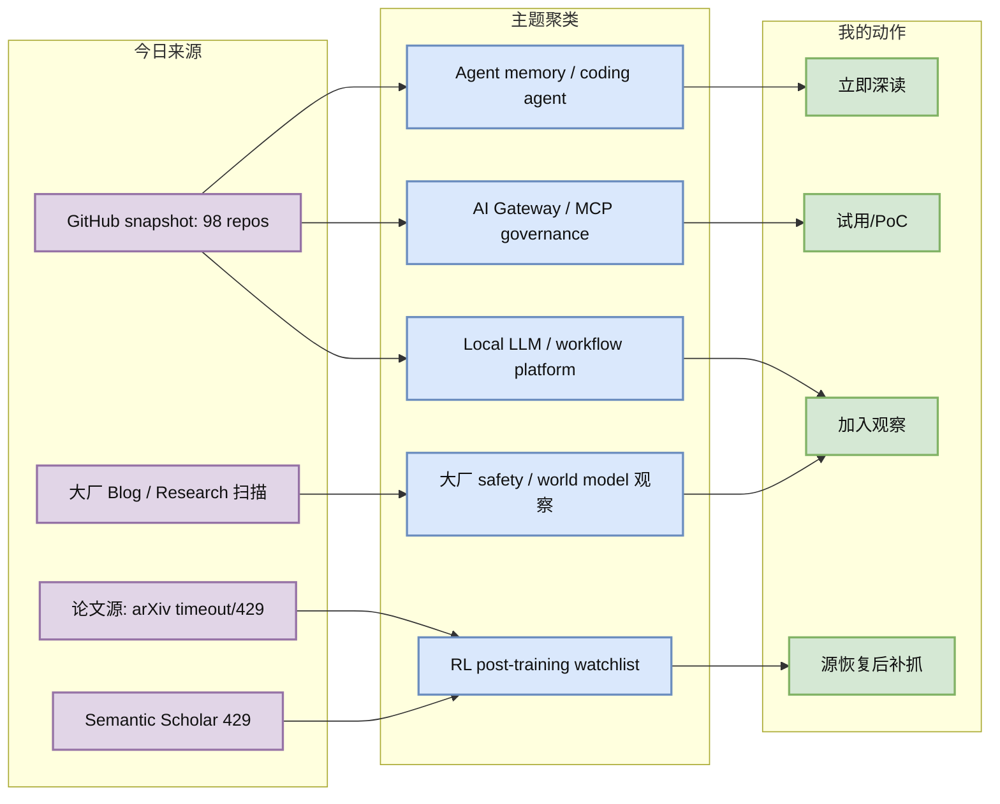
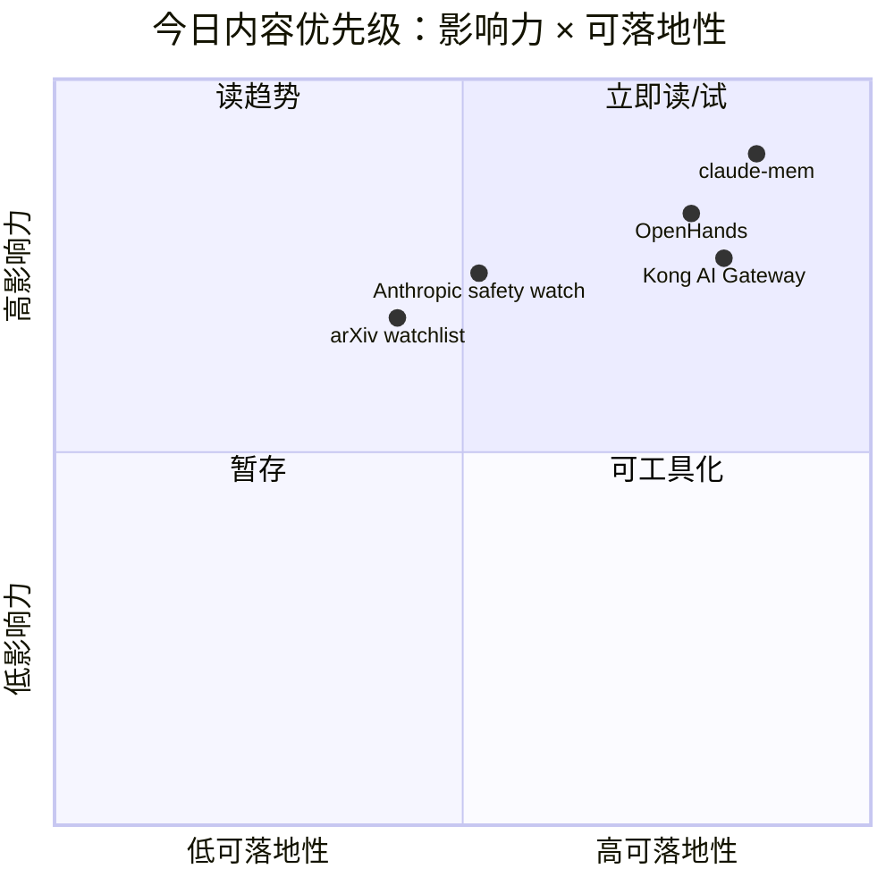

# AI Radar Daily - 2026-06-23

> 生成时间：2026-06-23 09:00 北京时间  
> 范围：AI Infra / LLM / RL / Agent / Eval / Serving / Training / 大厂博客 / 论文 / GitHub  
> 说明：日报是导航入口；深度理解请进入 Obsidian 详情页。今日 GitHub snapshot 成功保存 98 个 repo，但 GitHub 后半段查询触发 403 rate limit；arXiv 与 Semantic Scholar 论文源触发 timeout/429，论文区已降级为低置信 watchlist。

## 0. 今日结论

- 今日最值得关注：Agent Infra 仍是 GitHub 增长主线，`thedotmack/claude-mem` 真实增长 +194 stars，`OpenHands` +95，说明长期记忆、开发代理和 agent workflow 继续吸收开发者注意力。
- 对 AI Infra 的直接影响：Kong、LiteLLM 类 AI Gateway 与 claude-mem 这类 memory layer 共同指向一个趋势：Agent/LLM 生产栈正在从“模型服务”扩展到 gateway、state、audit、eval、tool permission。
- 对 LLM 训练 / 推理 / Agent 的影响：高 star 榜继续由 agent harness、Ollama、Transformers、Dify、Open WebUI、LangChain 等项目占据，说明本地模型运行、agent runtime 与 workflow 平台仍是主战场。
- 对 RL / 游戏模型训练的影响：论文源今日不可用，未生成高置信新论文；但 RL post-training、tool-use reward、world model/game RL 已列入补抓优先级。
- 建议今天深读：[[GitHub/2026-06-23/claude-mem-agent-memory]]、[[GitHub/2026-06-23/Kong-AI-Gateway]]、[[Industry/2026-06-23/anthropic-research-agent-safety-watch]]、[[Papers/2026-06-23/arxiv-semantic-scholar-rate-limit-watchlist]]。

## 1. 今日态势图

## 2. 必读卡片区

> [!important] claude-mem：Agent 长期记忆继续领涨
> - 大类：GitHub
> - 小类：Agent Memory / RAG / Developer Agent
> - 重点：`thedotmack/claude-mem` 今日真实增长 +194 stars，核心信号是跨会话上下文、记忆压缩、检索注入正在成为 coding agent 标配能力。
> - 为什么重要：长期 agent 的状态恢复、经验复用、隐私过滤和错误记忆污染会成为 Agent Infra 的关键工程问题。
> - 详情：[[GitHub/2026-06-23/claude-mem-agent-memory]] / [网页详情](https://github.com/dyt27666-oss/AI-news-report-obsidians/blob/main/GitHub/2026-06-23/claude-mem-agent-memory.md) / [原文](https://github.com/thedotmack/claude-mem)

> [!important] Kong AI Gateway：传统 API 网关正在承接 LLM / MCP 流量治理
> - 大类：GitHub
> - 小类：AI Gateway / LLMOps / MCP
> - 重点：`Kong/kong` topics 已包含 `ai-gateway`、`llm-gateway`、`mcp-gateway`，今日真实增长 +14 stars。
> - 为什么重要：LLM serving 生产化不只靠 batch/KV cache/kernel，还要有鉴权、限流、审计、模型路由、tool permission 和成本归因。
> - 详情：[[GitHub/2026-06-23/Kong-AI-Gateway]] / [网页详情](https://github.com/dyt27666-oss/AI-news-report-obsidians/blob/main/GitHub/2026-06-23/Kong-AI-Gateway.md) / [原文](https://github.com/Kong/kong)

> [!tip] Anthropic Research：Agent safety / alignment 是持续高价值来源
> - 大类：博客
> - 小类：大厂 Research / Agent Safety / Eval
> - 重点：Anthropic Research 页面可访问；今日未确认新单篇，但 agentic misalignment、tool-use safety、behavior eval 仍是后续深读重点。
> - 为什么重要：长任务 agent 与 RL tool-use 训练共享“轨迹可控、奖励可信、权限边界清晰”的问题。
> - 详情：[[Industry/2026-06-23/anthropic-research-agent-safety-watch]] / [网页详情](https://github.com/dyt27666-oss/AI-news-report-obsidians/blob/main/Industry/2026-06-23/anthropic-research-agent-safety-watch.md) / [原文](https://www.anthropic.com/research)

> [!warning] 论文源今日限流：不臆造新论文，保留补抓队列
> - 大类：论文
> - 小类：LLM Serving / RL Post-training / Agent Eval / World Model
> - 重点：arXiv 查询出现 timeout/429，Semantic Scholar 返回 429；今日论文区降级为低置信 watchlist。
> - 为什么重要：透明 provenance 比“看起来完整”更重要，避免把缓存或旧论文误写成今日新论文。
> - 详情：[[Papers/2026-06-23/arxiv-semantic-scholar-rate-limit-watchlist]] / [网页详情](https://github.com/dyt27666-oss/AI-news-report-obsidians/blob/main/Papers/2026-06-23/arxiv-semantic-scholar-rate-limit-watchlist.md) / [原文](https://arxiv.org/)

## 3. 优先级矩阵

## 4. 分类清单

| 标签 | 大类 | 小类 | 标题 | 重点概括 | 为什么重要 | Obsidian 详情 | 网页详情 | 原文 |
|---|---|---|---|---|---|---|---|---|
| 必读 | GitHub | Agent Memory | claude-mem | Agent 长期记忆项目今日真实增长 +194 stars，继续领涨。 | 长期运行的 coding/ops agent 必须解决状态恢复、经验复用、隐私边界和错误记忆污染。 | [[GitHub/2026-06-23/claude-mem-agent-memory]] | [网页详情](https://github.com/dyt27666-oss/AI-news-report-obsidians/blob/main/GitHub/2026-06-23/claude-mem-agent-memory.md) | [原文](https://github.com/thedotmack/claude-mem) |
| 可 skim | GitHub | AI Gateway / MCP | Kong AI Gateway | 成熟 API Gateway 正在叠加 AI Gateway / LLM Gateway / MCP Gateway 语义。 | 模型服务进入生产后，路由、限流、审计、tool permission 和成本归因会成为基础设施层能力。 | [[GitHub/2026-06-23/Kong-AI-Gateway]] | [网页详情](https://github.com/dyt27666-oss/AI-news-report-obsidians/blob/main/GitHub/2026-06-23/Kong-AI-Gateway.md) | [原文](https://github.com/Kong/kong) |
| 后续 | 博客 | Anthropic / Agent Safety | Anthropic Research watch | 页面可访问，未确认新单篇；持续观察 agent safety、alignment、eval。 | 长任务 agent 与 RL tool-use 需要轨迹评估、权限边界和安全 reward。 | [[Industry/2026-06-23/anthropic-research-agent-safety-watch]] | [网页详情](https://github.com/dyt27666-oss/AI-news-report-obsidians/blob/main/Industry/2026-06-23/anthropic-research-agent-safety-watch.md) | [原文](https://www.anthropic.com/research) |
| 后续 | 博客 | Google DeepMind / World Model | DeepMind agent/model watch | 页面可访问，抓到 Gemini/agent 导航级信号，未确认新单篇。 | DeepMind 是 world model、planning、game RL 和多模态 agent 的长期关键来源。 | [[Industry/2026-06-23/google-deepmind-agent-models-watch]] | [网页详情](https://github.com/dyt27666-oss/AI-news-report-obsidians/blob/main/Industry/2026-06-23/google-deepmind-agent-models-watch.md) | [原文](https://deepmind.google/discover/blog/) |
| 低置信 | 论文 | Source Watchlist | arXiv / Semantic Scholar rate limit | 论文源 timeout/429，今日不生成高置信新论文，只保留补抓主题。 | 避免把旧论文或未验证标题误当今日新增，保持日报 provenance 可信。 | [[Papers/2026-06-23/arxiv-semantic-scholar-rate-limit-watchlist]] | [网页详情](https://github.com/dyt27666-oss/AI-news-report-obsidians/blob/main/Papers/2026-06-23/arxiv-semantic-scholar-rate-limit-watchlist.md) | [原文](https://arxiv.org/) |

## 5. 大厂资讯 / 工程博客 / Research

### 5.1 公司来源扫描矩阵

| 公司/实验室 | 来源/栏目 | 今日状态 | 高相关条数 | 代表条目 | 备注 |
|---|---|---|---:|---|---|
| OpenAI | News / Research | 访问失败 | 0 | 无 | `https://openai.com/news/` 返回 403；未臆造新项。 |
| Anthropic | News / Research / Engineering | 有来源观察 | 1 | Anthropic Research agent safety watch | 页面可访问；未确认新单篇，保留 agent safety/alignment 观察。 |
| Google DeepMind | Blog / Research | 低置信 | 1 | Gemini / agent / world model watch | 页面可访问；抓到导航级模型/agent 信号，未确认新单篇。 |
| Meta AI | Blog / Research | 低置信 | 0 | 无 | 页面可访问但动态内容噪音较高；本轮未确认高相关新条目。 |
| NVIDIA | Technical Blog / AI | 访问失败 | 0 | 无 | 配置 URL 仍需更新，未获得高置信内容。 |
| Microsoft | Research AI | 低置信 | 0 | 无 | 页面可访问但偏研究方向导航，未确认新条目。 |
| Hugging Face | Blog / Papers / Releases | 有来源观察 | 1 | HF Blog kernel/agent watch | 页面可访问；未确认新单篇，继续关注 kernel、serving、agent/eval。 |
| 腾讯 | AI Lab / 技术博客 | 无高相关新项 | 0 | 无 | 页面可访问但未抓到 AI Infra/LLM/RL 强相关新项。 |
| 字节 | Seed / 技术博客 | 无高相关新项 | 0 | 无 | Seed 页面可访问；未确认新的工程/研究单篇。 |
| SpaceAI | Blog / News | 低置信 | 0 | 无 | 页面可访问但主要是 Open Space Network / waitlist 类内容，和本 radar 主题弱相关。 |

### 5.2 高相关大厂条目

| 标签 | 发布方/大厂 | 栏目/来源 | 标题 | 重点概括 | 工程/算法影响 | Obsidian 详情 | 网页详情 | 原文 |
|---|---|---|---|---|---|---|---|---|
| 后续 | Anthropic | Research | Anthropic Research agent safety watch | 固定观察 agentic misalignment、interpretability、tool-use safety、behavior eval。 | 对 RLHF/RLAIF、agent trajectory eval、tool permission 和 release gate 有长期价值。 | [[Industry/2026-06-23/anthropic-research-agent-safety-watch]] | [网页详情](https://github.com/dyt27666-oss/AI-news-report-obsidians/blob/main/Industry/2026-06-23/anthropic-research-agent-safety-watch.md) | [原文](https://www.anthropic.com/research) |
| 后续 | Google DeepMind | Blog / Research | DeepMind Gemini / Agent / World Model watch | 页面可访问但只确认导航级信号；持续关注 world model、planning、game RL。 | 对游戏 RL、world model、agent planning 与 benchmark 设计有长期参考价值。 | [[Industry/2026-06-23/google-deepmind-agent-models-watch]] | [网页详情](https://github.com/dyt27666-oss/AI-news-report-obsidians/blob/main/Industry/2026-06-23/google-deepmind-agent-models-watch.md) | [原文](https://deepmind.google/discover/blog/) |
| 可 skim | Hugging Face | Blog / Technical Blog | HF Blog kernel / agent watch | 今日未确认新单篇，但 HF Blog 仍是 kernel、多后端推理、agent/eval 工程高价值来源。 | Serving 平台需关注 kernel registry、Transformers 推理、agent/eval 工具链。 | [[Industry/2026-06-23/huggingface-blog-watch-kernel-agent]] | [网页详情](https://github.com/dyt27666-oss/AI-news-report-obsidians/blob/main/Industry/2026-06-23/huggingface-blog-watch-kernel-agent.md) | [原文](https://huggingface.co/blog) |

## 6. GitHub 高 star Top 10

| 排名 | repo | stars | forks | language | updated_at | topics | 重点概括 | 是否值得试用 | Obsidian 详情 | 原文 |
|---:|---|---:|---:|---|---|---|---|---|---|---|
| 1 | affaan-m/ECC | 219924 | 33704 | JavaScript | 2026-06-23T00:56:09Z | ai-agents, anthropic, claude, claude-code, developer-tools, llm | Agent harness 性能优化系统，覆盖 skills、memory、security、research-first workflow。 | 值得 skim：作为 agent harness/记忆/安全模式参考，生产前需验证来源与实现质量。 | [[GitHub/2026-06-23/ECC-agent-harness]] | [原文](https://github.com/affaan-m/ECC) |
| 2 | NousResearch/hermes-agent | 199959 | 35580 | Python | 2026-06-23T01:01:17Z | ai, ai-agent, ai-agents, anthropic, chatgpt, claude | “The agent that grows with you”，偏可扩展 agent runtime 与技能体系。 | 值得试用：尤其关注 skills、tools、cron、memory 的生产化边界。 | [[GitHub/2026-06-23/hermes-agent]] | [原文](https://github.com/NousResearch/hermes-agent) |
| 3 | tensorflow/tensorflow | 195827 | 75184 | C++ | 2026-06-23T00:01:14Z | deep-learning, distributed, machine-learning, ml, neural-network | 老牌 ML 框架，仍是训练/部署生态基础设施。 | 可 skim：作为分布式训练和生产部署参考，不是今日新增重点。 | [[GitHub/2026-06-23/tensorflow]] | [原文](https://github.com/tensorflow/tensorflow) |
| 4 | Significant-Gravitas/AutoGPT | 185086 | 46116 | Python | 2026-06-23T00:50:37Z | agentic-ai, agents, autonomous-agents, claude | 老牌 autonomous agent 项目，仍保持活跃。 | 可作为 agent orchestration 对照；不建议直接无审计接生产任务。 | [[GitHub/2026-06-23/AutoGPT]] | [原文](https://github.com/Significant-Gravitas/AutoGPT) |
| 5 | ollama/ollama | 174748 | 16712 | Go | 2026-06-23T00:59:41Z | deepseek, gemma, glm, golang, llama, llm | 本地 LLM 运行入口，支持多模型快速拉起。 | 值得试用：本地评估、开发环境、边缘推理场景高价值。 | [[GitHub/2026-06-23/ollama]] | [原文](https://github.com/ollama/ollama) |
| 6 | huggingface/transformers | 161819 | 33571 | Python | 2026-06-22T23:57:28Z | audio, deep-learning, deepseek, gemma, hacktoberfest | 模型定义与加载事实标准，覆盖文本、视觉、音频、多模态。 | 必备依赖：关注新模型支持、推理 API、量化/serving 变更。 | [[GitHub/2026-06-23/transformers]] | [原文](https://github.com/huggingface/transformers) |
| 7 | langgenius/dify | 146175 | 22986 | TypeScript | 2026-06-23T00:45:47Z | agent, agentic-ai, agentic-workflow, ai, automation | 生产化 agent workflow 平台。 | 值得试用：适合搭 agent/RAG workflow 原型，需验证 observability 与权限。 | [[GitHub/2026-06-23/dify]] | [原文](https://github.com/langgenius/dify) |
| 8 | open-webui/open-webui | 142643 | 20512 | Python | 2026-06-23T01:01:17Z | ai, llm, llm-ui, llm-webui, llms, mcp | 面向 Ollama/OpenAI API 的用户友好 AI 界面，topics 含 MCP。 | 可试用：适合本地模型与多模型调试入口。 | [[GitHub/2026-06-23/open-webui]] | [原文](https://github.com/open-webui/open-webui) |
| 9 | langchain-ai/langchain | 139905 | 23201 | Python | 2026-06-23T00:54:22Z | agents, ai, ai-agents, anthropic, chatgpt, deepagents | Agent engineering platform，生态成熟。 | 可作为 agent abstraction 对照；生产需控制依赖复杂度。 | [[GitHub/2026-06-23/langchain]] | [原文](https://github.com/langchain-ai/langchain) |
| 10 | browser-use/browser-use | 100137 | 11155 | Python | 2026-06-23T00:57:35Z | ai-agents, ai-tools, browser-automation, browser-use, llm | 让网站可被 AI agent 操作的浏览器自动化层。 | 值得试用：适合 web agent eval、tool-use 轨迹采集。 | [[GitHub/2026-06-23/browser-use]] | [原文](https://github.com/browser-use/browser-use) |

## 7. GitHub star 增长最快 Top 10

> 增长依据：已读取历史 snapshot，今日不是冷启动；`stars_delta` 为相对最近历史 snapshot 的真实差值。GitHub API 后半段查询触发 `HTTP Error 403: rate limit exceeded`，候选池 98 个 repo，可能漏掉部分高增长项目。

| 排名 | repo | stars_delta | stars | forks | language | updated_at | 增长依据 | 重点概括 | Obsidian 详情 | 原文 |
|---:|---|---:|---:|---:|---|---|---|---|---|---|
| 1 | thedotmack/claude-mem | 194 | 83765 | 7235 | JavaScript | 2026-06-23T00:56:12Z | historical_snapshot | Agent 长期记忆与跨会话上下文注入，今日最强增长。 | [[GitHub/2026-06-23/claude-mem-agent-memory]] | [原文](https://github.com/thedotmack/claude-mem) |
| 2 | OpenHands/OpenHands | 95 | 78031 | 9920 | Python | 2026-06-23T00:55:49Z | historical_snapshot | AI-driven development / coding agent 框架持续增长。 | [[GitHub/2026-06-23/OpenHands-agent-development]] | [原文](https://github.com/OpenHands/OpenHands) |
| 3 | f/prompts.chat | 67 | 164112 | 21262 | HTML | 2026-06-23T00:34:51Z | historical_snapshot | Prompt 资产管理和私有化 prompt 目录仍有大众需求。 | [[GitHub/2026-06-23/prompts-chat]] | [原文](https://github.com/f/prompts.chat) |
| 4 | jingyaogong/minimind | 52 | 52068 | 6699 | Python | 2026-06-22T22:44:43Z | historical_snapshot | 2 小时从零训练 64M LLM 的小模型训练教学项目。 | [[GitHub/2026-06-23/minimind]] | [原文](https://github.com/jingyaogong/minimind) |
| 5 | rasbt/LLMs-from-scratch | 49 | 97550 | 14945 | Jupyter Notebook | 2026-06-23T00:01:22Z | historical_snapshot | 从零实现 ChatGPT-like LLM 的教学代码库。 | [[GitHub/2026-06-23/LLMs-from-scratch]] | [原文](https://github.com/rasbt/LLMs-from-scratch) |
| 6 | FlowiseAI/Flowise | 34 | 53908 | 24581 | TypeScript | 2026-06-23T00:33:31Z | historical_snapshot | 可视化 agent/RAG workflow builder。 | [[GitHub/2026-06-23/Flowise]] | [原文](https://github.com/FlowiseAI/Flowise) |
| 7 | Significant-Gravitas/AutoGPT | 25 | 185086 | 46116 | Python | 2026-06-23T00:50:37Z | historical_snapshot | 老牌 autonomous agent 框架仍保持增长。 | [[GitHub/2026-06-23/AutoGPT]] | [原文](https://github.com/Significant-Gravitas/AutoGPT) |
| 8 | ItzCrazyKns/Vane | 21 | 35413 | 3901 | TypeScript | 2026-06-23T00:46:02Z | historical_snapshot | AI-powered answering engine，偏搜索/问答产品。 | [[GitHub/2026-06-23/Vane-answering-engine]] | [原文](https://github.com/ItzCrazyKns/Vane) |
| 9 | Kong/kong | 14 | 43650 | 5156 | Lua | 2026-06-22T23:46:29Z | historical_snapshot | API and AI Gateway，LLM/MCP gateway 治理入口。 | [[GitHub/2026-06-23/Kong-AI-Gateway]] | [原文](https://github.com/Kong/kong) |
| 10 | simstudioai/sim | 8 | 28840 | 3671 | TypeScript | 2026-06-23T00:44:22Z | historical_snapshot | 构建、部署和编排 AI agents 的 workflow 平台。 | [[GitHub/2026-06-23/sim-agent-workflow]] | [原文](https://github.com/simstudioai/sim) |

## 8. 论文

### 8.1 论文源状态 / Watchlist

| 标签 | 论文来源 | 论文 | 作者/机构 | 重点概括 | 工程/研究价值 | Obsidian 详情 | 网页详情 | PDF/原文 |
|---|---|---|---|---|---|---|---|---|
| 低置信 | arXiv / Semantic Scholar；预印本 API / 论文索引 | 今日未确认新论文 | 未确认 | arXiv 查询 LLM serving、RL post-training、world model、agent eval 均 timeout/429；Semantic Scholar 429。 | 不臆造标题，保留补抓队列：KV cache/spec decode、tool-use RL、agent benchmark、world model/game RL。 | [[Papers/2026-06-23/arxiv-semantic-scholar-rate-limit-watchlist]] | [网页详情](https://github.com/dyt27666-oss/AI-news-report-obsidians/blob/main/Papers/2026-06-23/arxiv-semantic-scholar-rate-limit-watchlist.md) | [arXiv](https://arxiv.org/) / [Semantic Scholar](https://www.semanticscholar.org/) |

## 9. 资讯 / 其他 GitHub 项目

### 9.1 Agent / LLMOps / Gateway

| 标签 | 来源 | 标题 | 重点概括 | 对我有什么用 | Obsidian 详情 | 网页详情 | 原文 |
|---|---|---|---|---|---|---|---|
| 必读 | GitHub | thedotmack/claude-mem | Agent 长期记忆项目真实增长 +194。 | 可作为 agent memory service / retrieval eval 的设计参考。 | [[GitHub/2026-06-23/claude-mem-agent-memory]] | [网页详情](https://github.com/dyt27666-oss/AI-news-report-obsidians/blob/main/GitHub/2026-06-23/claude-mem-agent-memory.md) | [原文](https://github.com/thedotmack/claude-mem) |
| 可 skim | GitHub | Kong/kong | API and AI Gateway，topics 包含 LLM/MCP gateway。 | 可做模型调用入口治理 PoC，验证路由、审计、权限和成本归因。 | [[GitHub/2026-06-23/Kong-AI-Gateway]] | [网页详情](https://github.com/dyt27666-oss/AI-news-report-obsidians/blob/main/GitHub/2026-06-23/Kong-AI-Gateway.md) | [原文](https://github.com/Kong/kong) |
| 后续 | GitHub | OpenHands/OpenHands | AI-driven development agent 今日 +95 stars。 | 适合作为 coding agent benchmark 与沙箱任务对照。 | [[GitHub/2026-06-23/OpenHands-agent-development]] | [网页详情](https://github.com/dyt27666-oss/AI-news-report-obsidians/blob/main/GitHub/2026-06-23/OpenHands-agent-development.md) | [原文](https://github.com/OpenHands/OpenHands) |

## 10. 按主题索引

### AI Infra / Serving / Training

- [[GitHub/2026-06-23/Kong-AI-Gateway]] - LLM/MCP gateway 治理入口。
- [[Industry/2026-06-23/huggingface-blog-watch-kernel-agent]] - HF kernel / serving / agent 工程来源观察。
- [[Papers/2026-06-23/arxiv-semantic-scholar-rate-limit-watchlist]] - LLM serving 论文补抓队列。

### LLM / Agent / RAG / Evaluation

- [[GitHub/2026-06-23/claude-mem-agent-memory]] - Agent 长期记忆和上下文注入。
- [[Industry/2026-06-23/anthropic-research-agent-safety-watch]] - Agent safety / behavior eval 来源观察。
- [[GitHub/2026-06-23/Kong-AI-Gateway]] - Agent tool/MCP gateway 权限与审计。

### RL / Game AI / World Model

- [[Papers/2026-06-23/arxiv-semantic-scholar-rate-limit-watchlist]] - RL post-training、world model、game RL 补抓优先级。
- [[Industry/2026-06-23/google-deepmind-agent-models-watch]] - DeepMind world model / planning / game RL 观察。

### 公司 / 实验室

- Anthropic: [[Industry/2026-06-23/anthropic-research-agent-safety-watch]]
- Google DeepMind: [[Industry/2026-06-23/google-deepmind-agent-models-watch]]
- Hugging Face: [[Industry/2026-06-23/huggingface-blog-watch-kernel-agent]]

## 11. 值得后续深挖

| 标签 | 大类 | 小类 | 标题 | 后续动作 | Obsidian 详情 | 原文 |
|---|---|---|---|---|---|---|
| 必读 | GitHub | Agent Memory | claude-mem | 做一次真实 coding agent 记忆层 PoC，评估 recall、污染、隐私。 | [[GitHub/2026-06-23/claude-mem-agent-memory]] | [原文](https://github.com/thedotmack/claude-mem) |
| 后续 | GitHub | AI Gateway | Kong AI Gateway | 拉 docs/release，验证 Kong -> LiteLLM -> vLLM / MCP 工具链。 | [[GitHub/2026-06-23/Kong-AI-Gateway]] | [原文](https://github.com/Kong/kong) |
| 后续 | 论文 | RL / Serving / Agent Eval | arXiv / S2 补抓 | API 恢复后补抓 LLM serving、RL post-training、agent eval、world model。 | [[Papers/2026-06-23/arxiv-semantic-scholar-rate-limit-watchlist]] | [原文](https://arxiv.org/) |

## 12. 采集失败或低置信来源

- GitHub API：snapshot 成功保存 `Automation/state/github-stars-2026-06-23.json`，共 98 repos；后半段 query 返回 `HTTP Error 403: rate limit exceeded`，榜单可能漏掉部分高增长项目。
- arXiv API：LLM serving、RL post-training、world model、agent eval、distributed training 查询出现 timeout/429；未生成高置信论文条目。
- Semantic Scholar：多个查询返回 429；未用于补充 citation/abstract。
- OpenAI：News 返回 403；未采集到高相关新项。
- NVIDIA：配置来源仍不可用/未获高置信内容；建议后续替换为稳定 RSS 或可抓取 URL。
- Meta AI / Microsoft / 腾讯 / 字节 / SpaceAI：页面可访问或部分可访问，但本轮未确认 AI Infra/LLM/RL 强相关新单篇。

## 13. 运行验收

| 检查项 | 状态 | 说明 |
|---|---|---|
| 大厂扫描矩阵 | 已生成 | 覆盖 OpenAI、Anthropic、Google DeepMind、Meta AI、NVIDIA、Microsoft、Hugging Face、腾讯、字节、SpaceAI。 |
| GitHub 高 star Top 10 | 已生成 | 单独 10 条表格。 |
| GitHub 增长 Top 10 | 已生成 | 使用历史 snapshot，非冷启动。 |
| GitHub snapshot | 已生成 | `Automation/state/github-stars-2026-06-23.json`。 |
| 详情页 | 已生成 | 6 个重点/观察详情页。 |

## 14. 归档标签

#ai-radar #daily #ai-infra #llm #rl #agent #eval
