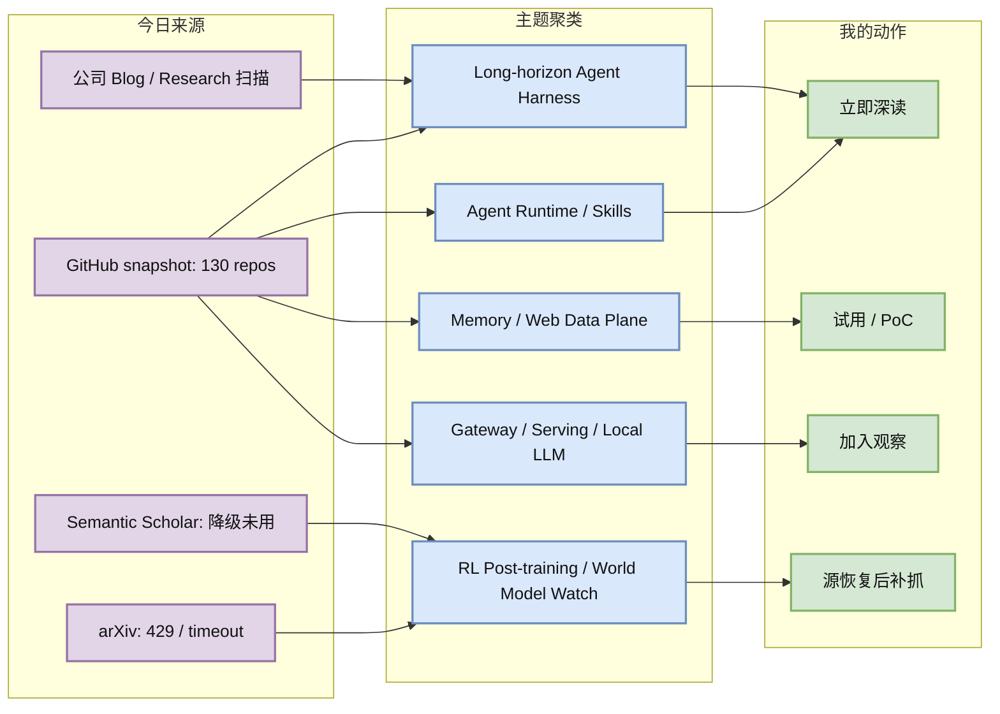
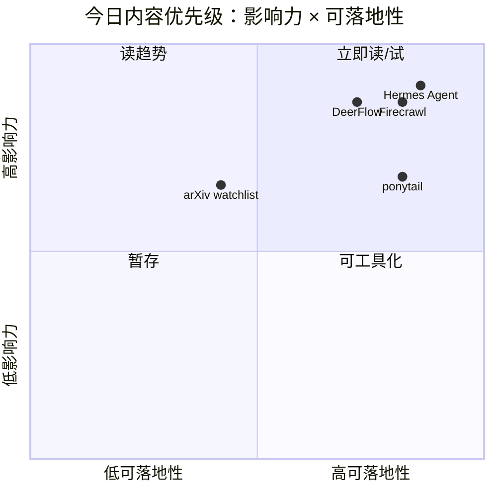

# AI Radar Daily - 2026-06-24

> 生成时间：2026-06-24 09:00 北京时间  
> 范围：AI Infra / LLM / RL / Agent / Eval / Serving / Training / 大厂博客 / 论文 / GitHub  
> 说明：日报是导航入口；深度理解请进入 Obsidian 详情页。今日 GitHub snapshot 成功保存 130 个 repo，并读取历史 snapshot 计算真实增长；GitHub 后半段查询触发 403 rate limit，arXiv 触发 429/timeout，论文区按低置信 watchlist 处理。

## 0. 今日结论

- 今日最值得关注：Agent Infra 继续强势，但热点从“agent 框架”扩展到 policy、memory、web data plane 和 long-horizon harness：`ponytail` +2693、`hermes-agent` +982、`firecrawl` +892、`deer-flow` +666。
- 对 AI Infra 的直接影响：Agent 生产栈正在显式分层为 runtime、memory、gateway、web ingestion、sandbox、policy/eval；这些比单纯模型调用更接近真实基础设施工程。
- 对 LLM 训练 / 推理 / Agent 的影响：高 star 榜仍由 Ollama、Transformers、Dify、Open WebUI、LangChain 等占据；增长榜则偏 agent skills、memory、scraping、长程 harness。
- 对 RL / 游戏模型训练的影响：arXiv/Semantic Scholar 限流导致今日无高置信新论文；补抓重点仍是 RL post-training、agent tool-use reward、world model/game RL。
- 建议今天深读：[[GitHub/2026-06-24/ponytail-agent-skill-token-economy]]、[[GitHub/2026-06-24/hermes-agent-self-growing-agent-runtime]]、[[GitHub/2026-06-24/firecrawl-agent-web-data-plane]]、[[GitHub/2026-06-24/deer-flow-long-horizon-superagent]]、[[Industry/2026-06-24/company-source-scan-matrix]]。

## 1. 今日态势图

## 2. 必读卡片区

> [!important] ponytail：Agent Skill 的 Token Economy 信号
> - 大类：GitHub
> - 小类：Agent Skills / Token Economy / Developer Agent
> - 重点：`DietrichGebert/ponytail` 今日真实增长 +2693 stars，说明开发者开始显式控制 coding agent 的 token 预算、输出长度和过度工程。
> - 为什么重要：长程 agent 的成本不只是模型费用，还包括上下文污染、无效工具调用、无效 diff 和 review 时间。
> - 详情：[[GitHub/2026-06-24/ponytail-agent-skill-token-economy]] / [网页详情](https://github.com/dyt27666-oss/AI-news-report-obsidians/blob/main/GitHub/2026-06-24/ponytail-agent-skill-token-economy.md) / [原文](https://github.com/DietrichGebert/ponytail)

> [!important] Hermes Agent：可生长 Agent Runtime
> - 大类：GitHub
> - 小类：Agent Runtime / Skills / Cron / Memory
> - 重点：`NousResearch/hermes-agent` 今日 +982 stars，高 star 与高增长同时出现，代表带工具、技能、记忆、定时任务的 agent OS 形态被快速关注。
> - 为什么重要：Agent Infra 正从单次 API 调用转向长期运行、可验证、可扩展、可沉淀经验的执行系统。
> - 详情：[[GitHub/2026-06-24/hermes-agent-self-growing-agent-runtime]] / [网页详情](https://github.com/dyt27666-oss/AI-news-report-obsidians/blob/main/GitHub/2026-06-24/hermes-agent-self-growing-agent-runtime.md) / [原文](https://github.com/NousResearch/hermes-agent)

> [!tip] Firecrawl：Agent Web Data Plane
> - 大类：GitHub
> - 小类：Web Data / Agent Tools / RAG
> - 重点：`firecrawl/firecrawl` 今日 +892 stars，说明 agent/RAG 的关键瓶颈继续转向稳定、结构化、可追溯的网页数据获取。
> - 为什么重要：自动研究、RAG ingestion、browser agent 都依赖外部数据平面；抓取失败和 provenance 缺失会直接污染知识库。
> - 详情：[[GitHub/2026-06-24/firecrawl-agent-web-data-plane]] / [网页详情](https://github.com/dyt27666-oss/AI-news-report-obsidians/blob/main/GitHub/2026-06-24/firecrawl-agent-web-data-plane.md) / [原文](https://github.com/firecrawl/firecrawl)

> [!tip] DeerFlow：长程 SuperAgent Harness
> - 大类：GitHub
> - 小类：Long-horizon Agent / Sandbox / Memory / Multi-agent
> - 重点：`bytedance/deer-flow` 今日 +666 stars，强调 sandboxes、memories、tools、skills、subagents 和 message gateway。
> - 为什么重要：分钟到小时级任务需要像分布式系统一样设计 agent runtime，包括隔离、状态、权限、审计和失败恢复。
> - 详情：[[GitHub/2026-06-24/deer-flow-long-horizon-superagent]] / [网页详情](https://github.com/dyt27666-oss/AI-news-report-obsidians/blob/main/GitHub/2026-06-24/deer-flow-long-horizon-superagent.md) / [原文](https://github.com/bytedance/deer-flow)

> [!warning] 论文源限流：今日不臆造新论文
> - 大类：论文
> - 小类：Source Watch / LLM Serving / RL / Agent Eval
> - 重点：arXiv 查询 LLM serving、RL post-training、agent eval、world model 时出现 429/timeout。
> - 为什么重要：透明 provenance 比“看起来完整”更重要；未验证论文不应进入高置信清单。
> - 详情：[[Papers/2026-06-24/arxiv-rate-limit-watchlist]] / [网页详情](https://github.com/dyt27666-oss/AI-news-report-obsidians/blob/main/Papers/2026-06-24/arxiv-rate-limit-watchlist.md) / [原文](https://arxiv.org/)

## 3. 优先级矩阵

## 4. 分类清单

| 标签 | 大类 | 小类 | 标题 | 重点概括 | 为什么重要 | Obsidian 详情 | 网页详情 | 原文 |
|---|---|---|---|---|---|---|---|---|
| 必读 | GitHub | Agent Skills | ponytail | 今日 +2693 stars，用 meme 方式表达 token 预算、少改代码、少过度工程的 agent policy。 | 可转化为 coding-agent eval：tokens、tool calls、diff size、review comments。 | [[GitHub/2026-06-24/ponytail-agent-skill-token-economy]] | [网页详情](https://github.com/dyt27666-oss/AI-news-report-obsidians/blob/main/GitHub/2026-06-24/ponytail-agent-skill-token-economy.md) | [原文](https://github.com/DietrichGebert/ponytail) |
| 必读 | GitHub | Agent Runtime | Hermes Agent | 今日 +982 stars，skills/tools/cron/memory 组成可生长 agent runtime。 | 对长期任务、自动研究、知识库写入和 agent ops 都有直接参考价值。 | [[GitHub/2026-06-24/hermes-agent-self-growing-agent-runtime]] | [网页详情](https://github.com/dyt27666-oss/AI-news-report-obsidians/blob/main/GitHub/2026-06-24/hermes-agent-self-growing-agent-runtime.md) | [原文](https://github.com/NousResearch/hermes-agent) |
| 必读 | GitHub | Web Data Plane | Firecrawl | 今日 +892 stars，面向 agent/RAG 的 search、scrape、HTML-to-markdown、structured extraction。 | Agent 的上下文质量取决于外部数据平面，尤其自动研究和 RAG ingestion。 | [[GitHub/2026-06-24/firecrawl-agent-web-data-plane]] | [网页详情](https://github.com/dyt27666-oss/AI-news-report-obsidians/blob/main/GitHub/2026-06-24/firecrawl-agent-web-data-plane.md) | [原文](https://github.com/firecrawl/firecrawl) |
| 必读 | GitHub | Long-horizon Agent | DeerFlow | 今日 +666 stars，长程 SuperAgent harness 强调 sandbox、memory、tools、subagents、message gateway。 | 长任务 agent 需要像分布式系统一样处理状态、权限、失败恢复和审计。 | [[GitHub/2026-06-24/deer-flow-long-horizon-superagent]] | [网页详情](https://github.com/dyt27666-oss/AI-news-report-obsidians/blob/main/GitHub/2026-06-24/deer-flow-long-horizon-superagent.md) | [原文](https://github.com/bytedance/deer-flow) |
| 后续 | Industry | Company Source Watch | 公司来源扫描矩阵 | 今日 OpenAI 403、NVIDIA 404；多数其他来源可访问但未确认高置信新单篇。 | 固定矩阵保证日报覆盖，不把访问失败误判为“无行业变化”。 | [[Industry/2026-06-24/company-source-scan-matrix]] | [网页详情](https://github.com/dyt27666-oss/AI-news-report-obsidians/blob/main/Industry/2026-06-24/company-source-scan-matrix.md) | [原文](https://huggingface.co/blog) |
| 低置信 | 论文 | Source Watch | arXiv 限流 Watchlist | arXiv 429/timeout，今日不纳入未验证论文。 | 保持论文 provenance 可信，源恢复后补抓 Serving/RL/Agent Eval/World Model。 | [[Papers/2026-06-24/arxiv-rate-limit-watchlist]] | [网页详情](https://github.com/dyt27666-oss/AI-news-report-obsidians/blob/main/Papers/2026-06-24/arxiv-rate-limit-watchlist.md) | [原文](https://arxiv.org/) |

## 5. 大厂资讯 / 工程博客 / Research

### 5.1 公司来源扫描矩阵

| 公司/实验室 | 来源/栏目 | 今日状态 | 高相关条数 | 代表条目 | 备注 |
|---|---|---|---:|---|---|
| OpenAI | News / Research | 访问失败 | 0 | 无 | `https://openai.com/news/` 与 research 返回 403；未臆造新项。 |
| Anthropic | News / Research / Engineering | 有来源观察 | 1 | Agent safety / alignment watch | 页面 200；未确认新单篇，继续关注 tool-use safety、behavior eval。 |
| Google DeepMind | Blog / Research | 有来源观察 | 1 | Agent / world model watch | 页面 200；未确认新单篇，继续关注 planning、game RL、world model。 |
| Meta AI | Blog / Research | 低置信 | 0 | 无 | 页面 200，但动态内容噪音较高；本轮未确认 AI Infra/LLM/RL 强相关新项。 |
| NVIDIA | Technical Blog / AI | 访问失败 | 0 | 无 | 配置 URL 返回 404；需要替换稳定来源/RSS。 |
| Microsoft | Research AI | 低置信 | 0 | 无 | 页面 200，但偏研究方向导航；GitHub `microsoft/agent-lightning` 进入候选池。 |
| Hugging Face | Blog / Papers / Releases | 有来源观察 | 1 | Transformers / serving watch | Blog 页面 200；GitHub `transformers` 仍高活跃，继续关注推理与模型支持。 |
| 腾讯 | AI Lab / 技术博客 | 无高相关新项 | 0 | 无 | 页面 200；本轮未抓到 AI Infra/LLM/RL 强相关新项。 |
| 字节 | Seed / 技术博客 | 有 GitHub 信号 | 1 | DeerFlow long-horizon agent | Seed 页面 200；`bytedance/deer-flow` 今日 +666 stars。 |
| SpaceAI | Blog / News | 低置信 | 0 | 无 | 页面 200，但主要是 Open Space Network / waitlist，和本 radar 主题弱相关。 |

### 5.2 高相关大厂条目

| 标签 | 发布方/大厂 | 栏目/来源 | 标题 | 重点概括 | 工程/算法影响 | Obsidian 详情 | 网页详情 | 原文 |
|---|---|---|---|---|---|---|---|---|
| 必读 | 字节 | GitHub / Agent Framework | DeerFlow long-horizon SuperAgent | 长程 agent harness 以 sandbox、memory、tools、subagents、message gateway 组织复杂任务。 | 对 agent runtime、任务状态机、长任务 eval、工具权限边界有直接工程参考。 | [[GitHub/2026-06-24/deer-flow-long-horizon-superagent]] | [网页详情](https://github.com/dyt27666-oss/AI-news-report-obsidians/blob/main/GitHub/2026-06-24/deer-flow-long-horizon-superagent.md) | [原文](https://github.com/bytedance/deer-flow) |
| 后续 | Anthropic | Research / Safety | Anthropic Research watch | 页面可访问；持续观察 agentic misalignment、tool-use safety、behavior eval。 | 长任务 agent 与 RL tool-use 共享轨迹评估、权限边界和 reward 可信问题。 | [[Industry/2026-06-24/company-source-scan-matrix]] | [网页详情](https://github.com/dyt27666-oss/AI-news-report-obsidians/blob/main/Industry/2026-06-24/company-source-scan-matrix.md) | [原文](https://www.anthropic.com/research) |
| 后续 | Google DeepMind | Blog / Research | DeepMind agent / world model watch | 页面可访问；未确认新单篇，继续关注 world model、planning、game RL。 | 对游戏 RL、环境模拟、规划模型和 benchmark 设计有长期价值。 | [[Industry/2026-06-24/company-source-scan-matrix]] | [网页详情](https://github.com/dyt27666-oss/AI-news-report-obsidians/blob/main/Industry/2026-06-24/company-source-scan-matrix.md) | [原文](https://deepmind.google/discover/blog/) |
| 可 skim | Hugging Face | Blog / GitHub | HF Transformers / serving watch | Blog 可访问，Transformers repo 高活跃；继续关注推理 API、多模态模型和 serving 生态变更。 | Serving 平台需跟踪模型加载、量化、多后端推理和 tokenizer/model API 变更。 | [[Industry/2026-06-24/company-source-scan-matrix]] | [网页详情](https://github.com/dyt27666-oss/AI-news-report-obsidians/blob/main/Industry/2026-06-24/company-source-scan-matrix.md) | [原文](https://huggingface.co/blog) |

## 6. GitHub 高 star Top 10

| 排名 | repo | stars | forks | language | updated_at | topics | 重点概括 | 是否值得试用 | Obsidian 详情 | 原文 |
|---:|---|---:|---:|---|---|---|---|---|---|---|
| 1 | affaan-m/ECC | 220542 | 33783 | JavaScript | 2026-06-24T01:00:28Z | ai-agents, anthropic, claude, claude-code, developer-tools, llm | Agent harness performance optimization system，覆盖 skills、memory、security、research-first workflow。 | 值得 skim：作为 agent harness/记忆/安全模式参考，生产前需验证来源与实现质量。 | [[GitHub/2026-06-24/ECC-agent-harness]] | [原文](https://github.com/affaan-m/ECC) |
| 2 | NousResearch/hermes-agent | 200941 | 35839 | Python | 2026-06-24T01:00:22Z | ai, ai-agent, ai-agents, anthropic, chatgpt, claude | 可生长 agent runtime，包含 tools、skills、cron、memory 等工作流形态。 | 值得试用：重点关注长期任务、工具权限、skill 维护和输出验收。 | [[GitHub/2026-06-24/hermes-agent-self-growing-agent-runtime]] | [原文](https://github.com/NousResearch/hermes-agent) |
| 3 | tensorflow/tensorflow | 195924 | 75185 | C++ | 2026-06-24T00:56:53Z | deep-learning, distributed, machine-learning, ml, neural-network | 老牌 ML 框架，仍是训练/部署生态基础设施。 | 可 skim：作为分布式训练和部署生态参考，不是今日新增重点。 | [[GitHub/2026-06-24/tensorflow]] | [原文](https://github.com/tensorflow/tensorflow) |
| 4 | Significant-Gravitas/AutoGPT | 185117 | 46120 | Python | 2026-06-24T00:22:03Z | agentic-ai, agents, autonomous-agents, claude | 老牌 autonomous agent 项目，仍保持高星与活跃。 | 可作为 agent orchestration 对照；不建议无审计直接接生产任务。 | [[GitHub/2026-06-24/AutoGPT]] | [原文](https://github.com/Significant-Gravitas/AutoGPT) |
| 5 | ollama/ollama | 174806 | 16718 | Go | 2026-06-24T00:38:35Z | deepseek, gemma, glm, gpt-oss, llama, llm | 本地 LLM 运行入口，支持多模型快速拉起。 | 值得试用：本地评估、开发环境、边缘推理场景高价值。 | [[GitHub/2026-06-24/ollama]] | [原文](https://github.com/ollama/ollama) |
| 6 | f/prompts.chat | 164195 | 21262 | HTML | 2026-06-23T23:18:06Z | ai, awesome-list, chatgpt, claude, prompt-engineering | Prompt 资产集合与私有化 prompt 目录。 | 可 skim：更多是应用层资产，不是 infra 主线。 | [[GitHub/2026-06-24/prompts-chat]] | [原文](https://github.com/f/prompts.chat) |
| 7 | huggingface/transformers | 161846 | 33580 | Python | 2026-06-23T23:31:39Z | deep-learning, llm, model-hub, pytorch, transformer | 模型定义与加载事实标准，覆盖文本、视觉、音频、多模态。 | 必备依赖：关注新模型支持、推理 API、量化/serving 变更。 | [[GitHub/2026-06-24/transformers]] | [原文](https://github.com/huggingface/transformers) |
| 8 | langgenius/dify | 146327 | 23013 | TypeScript | 2026-06-24T00:57:50Z | agent, agentic-ai, workflow, mcp, rag | 生产化 agentic workflow development platform。 | 值得试用：适合搭 agent/RAG workflow 原型，需验证 observability 与权限。 | [[GitHub/2026-06-24/dify]] | [原文](https://github.com/langgenius/dify) |
| 9 | open-webui/open-webui | 142776 | 20544 | Python | 2026-06-24T00:38:45Z | ai, llm, llm-ui, mcp, ollama | 面向 Ollama/OpenAI API 的用户友好 AI 界面，topics 含 MCP。 | 可试用：适合本地模型与多模型调试入口。 | [[GitHub/2026-06-24/open-webui]] | [原文](https://github.com/open-webui/open-webui) |
| 10 | langchain-ai/langchain | 140009 | 23215 | Python | 2026-06-24T00:47:32Z | agents, ai-agents, langgraph, llm, rag | Agent engineering platform，生态成熟。 | 可作为 agent abstraction 对照；生产需控制依赖复杂度。 | [[GitHub/2026-06-24/langchain]] | [原文](https://github.com/langchain-ai/langchain) |

## 7. GitHub star 增长最快 Top 10

> 增长依据：已读取历史 snapshot，今日不是冷启动；`stars_delta` 为相对最近历史 snapshot 的真实差值。GitHub API 后半段查询触发 `HTTP Error 403: rate limit exceeded`，候选池 130 个 repo，可能漏掉部分高增长项目。

| 排名 | repo | stars_delta | stars | forks | language | updated_at | 增长依据 | 重点概括 | Obsidian 详情 | 原文 |
|---:|---|---:|---:|---:|---|---|---|---|---|---|
| 1 | DietrichGebert/ponytail | 2693 | 52503 | 2619 | JavaScript | 2026-06-24T01:00:11Z | historical_snapshot | Claude Code / coding agent skill，以 token economy、少改、YAGNI 为核心信号。 | [[GitHub/2026-06-24/ponytail-agent-skill-token-economy]] | [原文](https://github.com/DietrichGebert/ponytail) |
| 2 | NousResearch/hermes-agent | 982 | 200941 | 35839 | Python | 2026-06-24T01:00:22Z | historical_snapshot | 可生长 agent runtime：tools、skills、cron、memory、knowledge workflows。 | [[GitHub/2026-06-24/hermes-agent-self-growing-agent-runtime]] | [原文](https://github.com/NousResearch/hermes-agent) |
| 3 | firecrawl/firecrawl | 892 | 138184 | 7986 | TypeScript | 2026-06-24T00:56:36Z | historical_snapshot | 面向 agent/RAG 的 web search、scrape、HTML-to-markdown、data extraction API。 | [[GitHub/2026-06-24/firecrawl-agent-web-data-plane]] | [原文](https://github.com/firecrawl/firecrawl) |
| 4 | bytedance/deer-flow | 666 | 73918 | 9973 | Python | 2026-06-24T00:57:05Z | historical_snapshot | 字节 long-horizon SuperAgent harness，强调 sandbox、memory、tools、subagents。 | [[GitHub/2026-06-24/deer-flow-long-horizon-superagent]] | [原文](https://github.com/bytedance/deer-flow) |
| 5 | affaan-m/ECC | 618 | 220542 | 33783 | JavaScript | 2026-06-24T01:00:28Z | historical_snapshot | Agent harness performance optimization system，skills/memory/security/research-first。 | [[GitHub/2026-06-24/ECC-agent-harness]] | [原文](https://github.com/affaan-m/ECC) |
| 6 | asgeirtj/system_prompts_leaks | 381 | 45410 | 7464 | JavaScript | 2026-06-24T01:01:04Z | historical_snapshot | 多家 AI 产品 system prompt 泄露集合，适合 prompt/policy 观察但需注意合规。 | [[GitHub/2026-06-24/system-prompts-leaks]] | [原文](https://github.com/asgeirtj/system_prompts_leaks) |
| 7 | JuliusBrussee/caveman | 375 | 76238 | 4323 | JavaScript | 2026-06-24T01:00:47Z | historical_snapshot | Claude Code skill，用极简表达降低 token；和 ponytail 同属 agent policy 热点。 | [[GitHub/2026-06-24/caveman-token-skill]] | [原文](https://github.com/JuliusBrussee/caveman) |
| 8 | browser-use/browser-use | 206 | 100343 | 11171 | Python | 2026-06-24T00:53:47Z | historical_snapshot | 让网站可被 AI agents 操作的 browser automation 层。 | [[GitHub/2026-06-24/browser-use]] | [原文](https://github.com/browser-use/browser-use) |
| 9 | TauricResearch/TradingAgents | 174 | 88183 | 17031 | Python | 2026-06-24T00:40:27Z | historical_snapshot | 多 agent LLM 金融交易框架；对 multi-agent decision workflow 有参考但偏金融。 | [[GitHub/2026-06-24/TradingAgents]] | [原文](https://github.com/TauricResearch/TradingAgents) |
| 10 | thedotmack/claude-mem | 169 | 83934 | 7247 | JavaScript | 2026-06-24T00:52:05Z | historical_snapshot | Agent 跨会话长期记忆，captures/compresses/injects context。 | [[GitHub/2026-06-24/claude-mem-agent-memory]] | [原文](https://github.com/thedotmack/claude-mem) |

## 8. 论文

### 8.1 论文源状态 / Watchlist

| 标签 | 论文来源 | 论文 | 作者/机构 | 重点概括 | 工程/研究价值 | Obsidian 详情 | 网页详情 | PDF/原文 |
|---|---|---|---|---|---|---|---|---|
| 低置信 | arXiv；预印本 API | 今日未确认新论文 | 未确认 | LLM serving / KV cache / speculative decoding 查询返回 429 或 timeout。 | API 恢复后优先补抓 scheduler、KV/cache、continuous batching、spec decode。 | [[Papers/2026-06-24/arxiv-rate-limit-watchlist]] | [网页详情](https://github.com/dyt27666-oss/AI-news-report-obsidians/blob/main/Papers/2026-06-24/arxiv-rate-limit-watchlist.md) | [arXiv](https://arxiv.org/) |
| 低置信 | arXiv / Semantic Scholar；论文索引 | 今日未确认新论文 | 未确认 | RL post-training / GRPO / reward design 查询受限。 | 对 RLHF/RLAIF、agent tool-use reward、game RL 训练仍是补抓重点。 | [[Papers/2026-06-24/arxiv-rate-limit-watchlist]] | [网页详情](https://github.com/dyt27666-oss/AI-news-report-obsidians/blob/main/Papers/2026-06-24/arxiv-rate-limit-watchlist.md) | [Semantic Scholar](https://www.semanticscholar.org/) |
| 低置信 | arXiv；预印本 API | 今日未确认新论文 | 未确认 | Agent evaluation / world model / game RL 查询 timeout/429。 | 保留 long-horizon agent eval、world model、simulation parallelism 的补抓队列。 | [[Papers/2026-06-24/arxiv-rate-limit-watchlist]] | [网页详情](https://github.com/dyt27666-oss/AI-news-report-obsidians/blob/main/Papers/2026-06-24/arxiv-rate-limit-watchlist.md) | [arXiv](https://arxiv.org/) |

## 9. 资讯 / 其他 GitHub 项目

### 9.1 Agent / Memory / Web Data / Gateway

| 标签 | 来源 | 标题 | 重点概括 | 对我有什么用 | Obsidian 详情 | 网页详情 | 原文 |
|---|---|---|---|---|---|---|---|
| 必读 | GitHub | DietrichGebert/ponytail | Agent skill / token budget 今日最强增长。 | 把“少 token、小 diff、少工具调用”转化为 coding-agent eval 指标。 | [[GitHub/2026-06-24/ponytail-agent-skill-token-economy]] | [网页详情](https://github.com/dyt27666-oss/AI-news-report-obsidians/blob/main/GitHub/2026-06-24/ponytail-agent-skill-token-economy.md) | [原文](https://github.com/DietrichGebert/ponytail) |
| 必读 | GitHub | NousResearch/hermes-agent | 可生长 agent runtime 高 star + 高增长。 | 对 skills、cron、tools、memory、Obsidian/GitHub 工作流有直接参考。 | [[GitHub/2026-06-24/hermes-agent-self-growing-agent-runtime]] | [网页详情](https://github.com/dyt27666-oss/AI-news-report-obsidians/blob/main/GitHub/2026-06-24/hermes-agent-self-growing-agent-runtime.md) | [原文](https://github.com/NousResearch/hermes-agent) |
| 必读 | GitHub | firecrawl/firecrawl | Agent web data plane 今日 +892。 | 可作为自动研究、RAG ingestion、web agent 工具的 baseline。 | [[GitHub/2026-06-24/firecrawl-agent-web-data-plane]] | [网页详情](https://github.com/dyt27666-oss/AI-news-report-obsidians/blob/main/GitHub/2026-06-24/firecrawl-agent-web-data-plane.md) | [原文](https://github.com/firecrawl/firecrawl) |
| 必读 | GitHub | bytedance/deer-flow | 长程 SuperAgent harness 今日 +666。 | 对 sandbox、subagents、message gateway、任务状态机有架构参考。 | [[GitHub/2026-06-24/deer-flow-long-horizon-superagent]] | [网页详情](https://github.com/dyt27666-oss/AI-news-report-obsidians/blob/main/GitHub/2026-06-24/deer-flow-long-horizon-superagent.md) | [原文](https://github.com/bytedance/deer-flow) |
| 可 skim | GitHub | BerriAI/litellm | AI Gateway / LLM proxy 今日 +151。 | 可用于模型路由、成本追踪、guardrails、load balancing 对照。 | [[GitHub/2026-06-24/litellm-ai-gateway]] | [网页详情](https://github.com/dyt27666-oss/AI-news-report-obsidians/blob/main/GitHub/2026-06-24/litellm-ai-gateway.md) | [原文](https://github.com/BerriAI/litellm) |
| 后续 | GitHub | microsoft/agent-lightning | Agent training / RL / MLOps 候选池项目。 | 值得后续看是否能连接 agent trajectory 与 RL training。 | [[GitHub/2026-06-24/agent-lightning]] | [网页详情](https://github.com/dyt27666-oss/AI-news-report-obsidians/blob/main/GitHub/2026-06-24/agent-lightning.md) | [原文](https://github.com/microsoft/agent-lightning) |

## 10. 按主题索引

### AI Infra / Serving / Training

- [[GitHub/2026-06-24/firecrawl-agent-web-data-plane]] - Agent/RAG 的 web data plane baseline。
- [[Industry/2026-06-24/company-source-scan-matrix]] - 大厂来源可用性与 provenance。
- [[Papers/2026-06-24/arxiv-rate-limit-watchlist]] - Serving/RL/Agent Eval 论文补抓队列。

### LLM / Agent / RAG / Evaluation

- [[GitHub/2026-06-24/hermes-agent-self-growing-agent-runtime]] - Agent runtime / skills / cron / memory。
- [[GitHub/2026-06-24/ponytail-agent-skill-token-economy]] - Agent skill 的 token economy 和小 diff policy。
- [[GitHub/2026-06-24/firecrawl-agent-web-data-plane]] - RAG/agent 外部数据采集。
- [[GitHub/2026-06-24/deer-flow-long-horizon-superagent]] - 长程 agent harness。

### RL / Game AI / World Model

- [[Papers/2026-06-24/arxiv-rate-limit-watchlist]] - RL post-training、world model、game RL 补抓优先级。
- [[Industry/2026-06-24/company-source-scan-matrix]] - DeepMind / Meta / Microsoft / 字节来源观察。

### 公司 / 实验室

- OpenAI: [[Industry/2026-06-24/company-source-scan-matrix]]
- Anthropic: [[Industry/2026-06-24/company-source-scan-matrix]]
- Google DeepMind: [[Industry/2026-06-24/company-source-scan-matrix]]
- Meta AI: [[Industry/2026-06-24/company-source-scan-matrix]]
- NVIDIA: [[Industry/2026-06-24/company-source-scan-matrix]]
- Microsoft: [[Industry/2026-06-24/company-source-scan-matrix]]
- Hugging Face: [[Industry/2026-06-24/company-source-scan-matrix]]
- 腾讯 / 字节 / SpaceAI: [[Industry/2026-06-24/company-source-scan-matrix]]

## 11. 值得后续深挖

| 标签 | 大类 | 小类 | 标题 | 后续动作 | Obsidian 详情 | 原文 |
|---|---|---|---|---|---|---|
| 必读 | GitHub | Agent Policy | ponytail / caveman token skills | 抽象成 coding-agent eval：token、tool calls、diff size、成功率。 | [[GitHub/2026-06-24/ponytail-agent-skill-token-economy]] | [原文](https://github.com/DietrichGebert/ponytail) |
| 必读 | GitHub | Agent Runtime | Hermes Agent | 对比 Hermes、DeerFlow、OpenHands、Dify 的 runtime/control-plane。 | [[GitHub/2026-06-24/hermes-agent-self-growing-agent-runtime]] | [原文](https://github.com/NousResearch/hermes-agent) |
| 必读 | GitHub | Web Data | Firecrawl | 做 AI blog / paper 页面抓取保真度测试。 | [[GitHub/2026-06-24/firecrawl-agent-web-data-plane]] | [原文](https://github.com/firecrawl/firecrawl) |
| 后续 | 论文 | LLM Serving / RL | arXiv 补抓 | API 恢复后补查 KV cache、scheduler、GRPO、agent eval、world model。 | [[Papers/2026-06-24/arxiv-rate-limit-watchlist]] | [原文](https://arxiv.org/) |
| 后续 | Industry | Source Reliability | OpenAI/NVIDIA 来源替换 | 为 403/404 来源替换 RSS/API/镜像或 GitHub release watch。 | [[Industry/2026-06-24/company-source-scan-matrix]] | [原文](https://openai.com/news/) |

## 12. 采集失败或低置信来源

- GitHub API：snapshot 成功保存 `Automation/state/github-stars-2026-06-24.json`，共 130 repos；后半段 query 返回 `HTTP Error 403: rate limit exceeded`，榜单可能漏掉部分高增长项目。
- arXiv API：LLM serving、RL post-training、agent eval、world model/game RL 查询出现 429/timeout；未生成高置信新论文条目。
- Semantic Scholar：今日未作为高置信补充来源使用；论文区降级为 watchlist。
- OpenAI：News / Research 返回 403；未采集到高相关新项。
- NVIDIA：配置 URL `https://developer.nvidia.com/blog/category/artificial-intelligence/` 返回 404；建议替换稳定来源。
- Meta AI / Microsoft / 腾讯 / SpaceAI：页面可访问或部分可访问，但本轮未确认 AI Infra/LLM/RL 强相关新单篇。

## 13. 运行验收

| 检查项 | 状态 | 说明 |
|---|---|---|
| 大厂扫描矩阵 | 已生成 | 覆盖 OpenAI、Anthropic、Google DeepMind、Meta AI、NVIDIA、Microsoft、Hugging Face、腾讯、字节、SpaceAI。 |
| GitHub 高 star Top 10 | 已生成 | 单独 10 条表格。 |
| GitHub 增长 Top 10 | 已生成 | 使用历史 snapshot，非冷启动。 |
| GitHub snapshot | 已生成 | `Automation/state/github-stars-2026-06-24.json`。 |
| 详情页 | 已生成 | 6 个重点/观察详情页。 |

## 14. 归档标签

#ai-radar #daily #ai-infra #llm #rl #agent #eval
