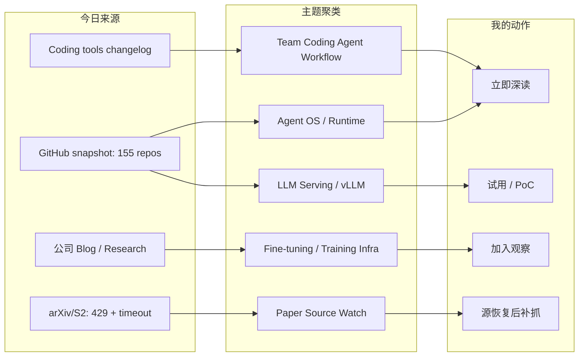
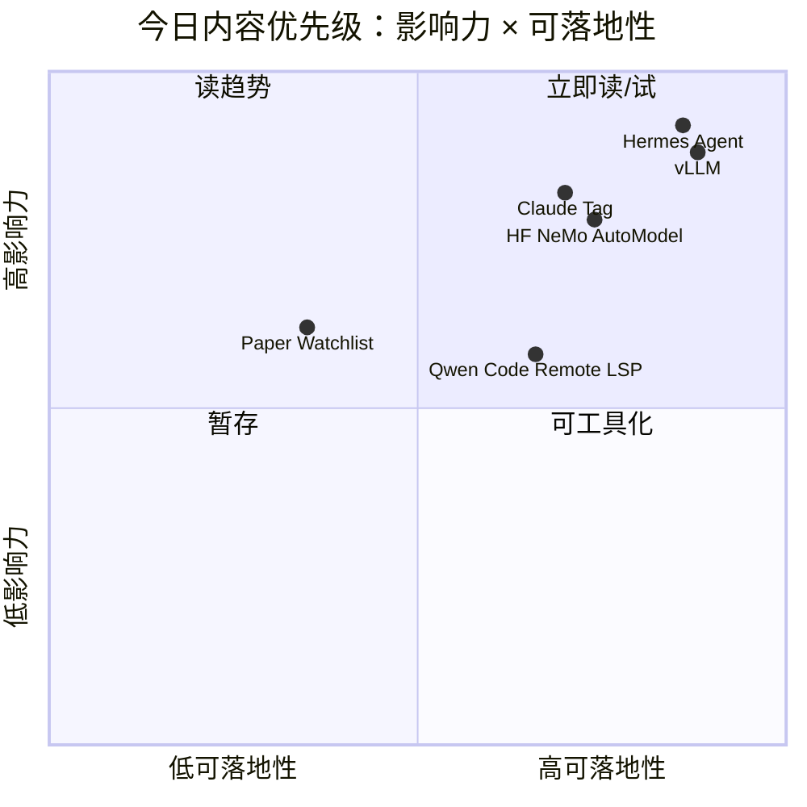

# AI Radar Daily - 2026-06-25

> 生成时间：2026-06-25 09:00 北京时间  
> 范围：AI Infra / LLM / RL / Agent / Eval / Serving / Training / 大厂博客 / 论文 / GitHub / Coding 工具  
> 说明：日报是导航入口；深度理解请进入 Obsidian 详情页。今日 GitHub snapshot 成功保存 155 个 repo，并读取历史 snapshot 计算真实增长；GitHub 后半段查询触发 403 rate limit，arXiv/Semantic Scholar 触发 429/timeout，论文区按低置信 watchlist 处理。

## 0. 今日结论

- 今日最值得关注：Agent OS / agent runtime 继续强势，`NousResearch/hermes-agent` 今日 +1112 stars，`bytedance/deer-flow` +527，说明 long-horizon agent 正在从 demo 走向 runtime/control-plane 问题。
- 对 AI Infra 的直接影响：增长榜同时出现 `vllm-project/vllm` +416，提醒我们 agent 热度背后仍依赖 serving scheduler、KV cache、GPU 利用率和 OpenAI-compatible API。
- 对 LLM 训练 / 推理 / Agent 的影响：Hugging Face 发布 “Accelerating Transformers Fine-Tuning with NVIDIA NeMo AutoModel”，训练栈继续向 Transformers × NVIDIA 自动化 recipe 收敛。
- 对 AI coding workflow 的影响：Anthropic Claude Tag、Cursor Customize、Copilot CLI GA、Qwen Code remote LSP status、Cline skills/MCP 都指向“团队级、可扩展、远程化”的 coding agent 工作流。
- 对 RL / 游戏模型训练的影响：论文源今日限流，不纳入未验证新论文；补抓队列锁定 GRPO/RLHF、agent tool-use reward、world model/game RL。

## 1. 今日态势图

## 2. 必读卡片区

> [!important] Hermes Agent：Agent OS Runtime 高增长
> - 大类：GitHub
> - 小类：Agent Runtime / Skills / Cron / Memory
> - 重点：`NousResearch/hermes-agent` 今日 +1112 stars，带 tools、skills、cron、memory 的长期 agent runtime 形态继续被关注。
> - 为什么重要：自动研究、代码执行、知识库写入和经验沉淀已经成为同一个 agent control-plane 问题。
> - 详情：[[GitHub/2026-06-25/hermes-agent-agent-os-runtime]] / [网页详情](https://github.com/dyt27666-oss/AI-news-report-obsidians/blob/main/GitHub/2026-06-25/hermes-agent-agent-os-runtime.md) / [原文](https://github.com/NousResearch/hermes-agent)

> [!important] vLLM：Serving Engine 回到增长榜前列
> - 大类：GitHub
> - 小类：LLM Serving / Inference / KV Cache
> - 重点：`vllm-project/vllm` 今日 +416 stars，在 agent 热点之外仍保持强增长。
> - 为什么重要：agent/RAG/coding workflow 的成本与延迟最终都受 scheduler、KV cache、batching 和硬件利用率约束。
> - 详情：[[GitHub/2026-06-25/vllm-serving-engine-growth]] / [网页详情](https://github.com/dyt27666-oss/AI-news-report-obsidians/blob/main/GitHub/2026-06-25/vllm-serving-engine-growth.md) / [原文](https://github.com/vllm-project/vllm)

> [!tip] Claude Tag：团队级 Coding Agent 工作流信号
> - 大类：Coding 工具 / 大厂产品
> - 小类：Team Agent Workflow
> - 重点：Anthropic News 显示 Jun 23 发布 “Introducing Claude Tag”，团队可以用新方式与 Claude 协作。
> - 为什么重要：tag agent 会把身份、权限、上下文边界、审计、rate limit 变成 coding 平台问题。
> - 详情：[[Industry/Tools/2026-06-25/claude-tag-team-agent-workflow]] / [网页详情](https://github.com/dyt27666-oss/AI-news-report-obsidians/blob/main/Industry/Tools/2026-06-25/claude-tag-team-agent-workflow.md) / [原文](https://www.anthropic.com/news)

> [!tip] Hugging Face × NVIDIA：Fine-tuning 工程栈收敛
> - 大类：大厂资讯 / 工程博客
> - 小类：Training Infra / Fine-tuning
> - 重点：Hugging Face 2026-06-24 发布 “Accelerating Transformers Fine-Tuning with NVIDIA NeMo AutoModel”。
> - 为什么重要：模型定义生态与 GPU 训练栈继续结合，可能降低 fine-tuning recipe 胶水代码和实验迭代成本。
> - 详情：[[Industry/2026-06-25/huggingface-nemo-automodel-finetuning]] / [网页详情](https://github.com/dyt27666-oss/AI-news-report-obsidians/blob/main/Industry/2026-06-25/huggingface-nemo-automodel-finetuning.md) / [原文](https://huggingface.co/blog/accelerating-fine-tuning-nvidia-nemo-automodel)

## 3. 优先级矩阵

## 4. 分类清单

| 标签 | 大类 | 小类 | 标题 | 重点概括 | 为什么重要 | Obsidian 详情 | 网页详情 | 原文 |
|---|---|---|---|---|---|---|---|---|
| 必读 | GitHub | Agent Runtime | Hermes Agent | 今日 +1112 stars，skills/tools/cron/memory 组成可生长 agent runtime。 | 对长期任务、自动研究、知识库写入和 agent ops 都有直接参考价值。 | [[GitHub/2026-06-25/hermes-agent-agent-os-runtime]] | [网页详情](https://github.com/dyt27666-oss/AI-news-report-obsidians/blob/main/GitHub/2026-06-25/hermes-agent-agent-os-runtime.md) | [原文](https://github.com/NousResearch/hermes-agent) |
| 必读 | GitHub | LLM Serving | vLLM | 今日 +416 stars，高吞吐与内存高效 serving 仍是 AI Infra 核心。 | Agent 规模化后最终瓶颈回到 KV cache、batching、scheduler 与 GPU 利用率。 | [[GitHub/2026-06-25/vllm-serving-engine-growth]] | [网页详情](https://github.com/dyt27666-oss/AI-news-report-obsidians/blob/main/GitHub/2026-06-25/vllm-serving-engine-growth.md) | [原文](https://github.com/vllm-project/vllm) |
| 必读 | GitHub | Web Data Plane | Firecrawl | 今日 +532 stars，面向 agent/RAG 的 search、scrape、HTML-to-markdown、structured extraction。 | Agent 的上下文质量取决于外部数据平面，尤其自动研究和 RAG ingestion。 | [[GitHub/2026-06-25/firecrawl-agent-web-data-plane]] | [网页详情](https://github.com/dyt27666-oss/AI-news-report-obsidians/blob/main/GitHub/2026-06-25/firecrawl-agent-web-data-plane.md) | [原文](https://github.com/firecrawl/firecrawl) |
| 必读 | Industry | Coding Agent | Claude Tag | Anthropic Product News, Jun 23：团队与 Claude 协作的新方式。 | 团队级 agent 会带来权限、审计、上下文和任务分派的新平台需求。 | [[Industry/Tools/2026-06-25/claude-tag-team-agent-workflow]] | [网页详情](https://github.com/dyt27666-oss/AI-news-report-obsidians/blob/main/Industry/Tools/2026-06-25/claude-tag-team-agent-workflow.md) | [原文](https://www.anthropic.com/news) |
| 必读 | Industry | Training Infra | HF × NVIDIA NeMo AutoModel | Hugging Face 2026-06-24 发布 Transformers fine-tuning 加速文章。 | 训练栈接口收敛，可能影响 post-training / reward model fine-tuning 的工程路径。 | [[Industry/2026-06-25/huggingface-nemo-automodel-finetuning]] | [网页详情](https://github.com/dyt27666-oss/AI-news-report-obsidians/blob/main/Industry/2026-06-25/huggingface-nemo-automodel-finetuning.md) | [原文](https://huggingface.co/blog/accelerating-fine-tuning-nvidia-nemo-automodel) |
| 可 skim | Coding 工具 | Qwen Code | Qwen Code v0.19.2 | remote LSP status route；nightly 修复 web_fetch JSON fallback。 | 远程开发、LSP 可观测和工具失败降级是 coding agent 生产体验的关键小能力。 | [[Industry/Tools/2026-06-25/qwen-code-remote-lsp-status]] | [网页详情](https://github.com/dyt27666-oss/AI-news-report-obsidians/blob/main/Industry/Tools/2026-06-25/qwen-code-remote-lsp-status.md) | [原文](https://github.com/QwenLM/qwen-code/releases/tag/v0.19.2) |
| 低置信 | 论文 | Source Watch | arXiv / Semantic Scholar 限流 | 今日 serving、RL、agent eval、world model 查询 timeout/429。 | 保持论文 provenance 可信，源恢复后补抓，不把低置信论文写入知识库。 | [[Papers/2026-06-25/arxiv-semantic-scholar-rate-limit-watchlist]] | [网页详情](https://github.com/dyt27666-oss/AI-news-report-obsidians/blob/main/Papers/2026-06-25/arxiv-semantic-scholar-rate-limit-watchlist.md) | [原文](https://arxiv.org/) |

## 5. 大厂资讯 / 工程博客 / Research

### 5.1 公司来源扫描矩阵

| 公司/实验室 | 来源/栏目 | 今日状态 | 高相关条数 | 代表条目 | 备注 |
|---|---|---|---:|---|---|
| OpenAI | News / Research | 访问失败 | 0 | 无 | `https://openai.com/news/` 与 research 返回 403；未臆造新项。 |
| Anthropic | News / Research / Engineering | 有高相关新项 | 1 | Introducing Claude Tag | News 页面 200；Product，Jun 23 2026。 |
| Google DeepMind | Blog / Research | 有来源观察 | 0 | 无高相关新单篇 | 页面 200；继续关注 world model、planning、game RL。 |
| Meta AI | Blog / Research | 低置信 | 0 | 无 | 页面 200，但动态内容噪音较高；本轮未确认 AI Infra/LLM/RL 强相关新项。 |
| NVIDIA | Technical Blog / AI | 访问失败 | 0 | 无 | 配置 URL 返回 404；但 Hugging Face 今日有 NVIDIA NeMo AutoModel 相关工程文章。 |
| Microsoft | Research AI | 低置信 | 0 | 无 | 页面 200，偏研究方向导航；GitHub `microsoft/agent-lightning` 继续观察。 |
| Hugging Face | Blog / Papers / Releases | 有高相关新项 | 2 | NeMo AutoModel fine-tuning；CUGA agent apps | Blog 页面 200；训练 infra 与 agent harness 均相关。 |
| 腾讯 | AI Lab / 技术博客 | 无高相关新项 | 0 | 无 | 页面 200；本轮未抓到 AI Infra/LLM/RL 强相关新项。 |
| 字节 | Seed / GitHub | 有 GitHub 信号 | 1 | DeerFlow long-horizon agent | Seed 页面 200；`bytedance/deer-flow` 今日 +527 stars。 |
| SpaceAI | Blog / News | 低置信 | 0 | 无 | 页面 200，但主要是 Open Space Network / waitlist，和本 radar 主题弱相关。 |

### 5.2 高相关大厂条目

| 标签 | 发布方/大厂 | 栏目/来源 | 标题 | 重点概括 | 工程/算法影响 | Obsidian 详情 | 网页详情 | 原文 |
|---|---|---|---|---|---|---|---|---|
| 必读 | Anthropic | Product Announcement / News | Introducing Claude Tag | Claude Tag 是团队与 Claude 协作的新方式，发布于 Jun 23 2026。 | 对 AI coding workflow 的身份、权限、上下文和审计设计有直接影响。 | [[Industry/Tools/2026-06-25/claude-tag-team-agent-workflow]] | [网页详情](https://github.com/dyt27666-oss/AI-news-report-obsidians/blob/main/Industry/Tools/2026-06-25/claude-tag-team-agent-workflow.md) | [原文](https://www.anthropic.com/news) |
| 必读 | Hugging Face / NVIDIA | Engineering Blog / Training Infra | Accelerating Transformers Fine-Tuning with NVIDIA NeMo AutoModel | Transformers fine-tuning 与 NVIDIA NeMo AutoModel 结合。 | 影响 fine-tuning recipe、分布式训练、GPU 利用率和 post-training 工程栈选择。 | [[Industry/2026-06-25/huggingface-nemo-automodel-finetuning]] | [网页详情](https://github.com/dyt27666-oss/AI-news-report-obsidians/blob/main/Industry/2026-06-25/huggingface-nemo-automodel-finetuning.md) | [原文](https://huggingface.co/blog/accelerating-fine-tuning-nvidia-nemo-automodel) |
| 必读 | 字节 | GitHub / Agent Framework | DeerFlow long-horizon SuperAgent | 长程 agent harness 以 sandbox、memory、tools、subagents、message gateway 组织复杂任务。 | 对 agent runtime、任务状态机、长任务 eval、工具权限边界有直接工程参考。 | [[GitHub/2026-06-25/deer-flow-long-horizon-superagent]] | [网页详情](https://github.com/dyt27666-oss/AI-news-report-obsidians/blob/main/GitHub/2026-06-25/deer-flow-long-horizon-superagent.md) | [原文](https://github.com/bytedance/deer-flow) |
| 可 skim | Hugging Face | Blog / Agent Apps | Build real agentic apps using CUGA | Hugging Face blog 2026-06-23：轻量 harness + 两 dozen working examples。 | 适合观察 agentic app 示例如何组织工具、状态和示例评估。 | [[Industry/2026-06-25/company-source-scan-matrix]] | [网页详情](https://github.com/dyt27666-oss/AI-news-report-obsidians/blob/main/Industry/2026-06-25/company-source-scan-matrix.md) | [原文](https://huggingface.co/blog/cuga-apps) |

## 6. GitHub 高 star Top 10

| 排名 | repo | stars | forks | language | updated_at | topics | 重点概括 | 是否值得试用 | Obsidian 详情 | 原文 |
|---:|---|---:|---:|---|---|---|---|---|---|---|
| 1 | affaan-m/ECC | 221195 | 33875 | JavaScript | 2026-06-25T01:01:42Z | ai-agents, anthropic, claude, claude-code, developer-tools, llm, mcp, productivity | Agent harness performance optimization system，skills/memory/security/research-first workflow。 | 可 skim：作为 agent harness/记忆/安全模式参考，生产前需验证来源与实现质量。 | [[GitHub/2026-06-25/github-snapshot-top10]] | [原文](https://github.com/affaan-m/ECC) |
| 2 | NousResearch/hermes-agent | 202053 | 36113 | Python | 2026-06-25T00:51:50Z | ai, ai-agent, ai-agents, anthropic, chatgpt, claude, claude-code | 可生长 agent runtime，包含 tools、skills、cron、memory 等工作流形态。 | 值得试用：重点关注长期任务、工具权限、skill 维护和输出验收。 | [[GitHub/2026-06-25/hermes-agent-agent-os-runtime]] | [原文](https://github.com/NousResearch/hermes-agent) |
| 3 | tensorflow/tensorflow | 196016 | 75190 | C++ | 2026-06-25T00:56:40Z | deep-learning, distributed, machine-learning, tensorflow | 老牌 ML 框架，仍是训练/部署生态基础设施。 | 可 skim：作为分布式训练和部署生态参考，不是今日新增重点。 | [[GitHub/2026-06-25/github-snapshot-top10]] | [原文](https://github.com/tensorflow/tensorflow) |
| 4 | Significant-Gravitas/AutoGPT | 185152 | 46124 | Python | 2026-06-25T00:53:23Z | agentic-ai, agents, autonomous-agents, claude | 老牌 autonomous agent 项目，仍保持高星与活跃。 | 可作为 agent orchestration 对照；不建议无审计直接接生产任务。 | [[GitHub/2026-06-25/github-snapshot-top10]] | [原文](https://github.com/Significant-Gravitas/AutoGPT) |
| 5 | ollama/ollama | 174867 | 16718 | Go | 2026-06-25T01:01:21Z | deepseek, gemma, glm, gpt-oss, llama, llm | 本地 LLM 运行入口，支持多模型快速拉起。 | 值得试用：本地评估、开发环境、边缘推理场景高价值。 | [[GitHub/2026-06-25/github-snapshot-top10]] | [原文](https://github.com/ollama/ollama) |
| 6 | f/prompts.chat | 164266 | 21270 | HTML | 2026-06-25T00:42:18Z | ai, awesome-list, chatgpt, claude, prompt-engineering | Prompt 资产集合与私有化 prompt 目录。 | 可 skim：更多是应用层资产，不是 infra 主线。 | [[GitHub/2026-06-25/github-snapshot-top10]] | [原文](https://github.com/f/prompts.chat) |
| 7 | huggingface/transformers | 161877 | 33589 | Python | 2026-06-24T21:59:32Z | deep-learning, llm, model-hub, pytorch, transformer | 模型定义与加载事实标准，覆盖文本、视觉、音频、多模态。 | 必备依赖：关注新模型支持、推理 API、量化/serving 变更。 | [[Industry/2026-06-25/huggingface-nemo-automodel-finetuning]] | [原文](https://github.com/huggingface/transformers) |
| 8 | langflow-ai/langflow | 150042 | 9332 | Python | 2026-06-25T00:43:28Z | agents, generative-ai, large-language-models, multiagent | 构建和部署 AI-powered agents/workflows 的平台。 | 值得试用：适合 agent workflow 原型和可视化编排对照。 | [[GitHub/2026-06-25/github-snapshot-top10]] | [原文](https://github.com/langflow-ai/langflow) |
| 9 | langgenius/dify | 146469 | 23043 | TypeScript | 2026-06-25T00:48:28Z | agent, agentic-ai, workflow, mcp, rag | 生产化 agentic workflow development platform。 | 值得试用：适合搭 agent/RAG workflow 原型，需验证 observability 与权限。 | [[GitHub/2026-06-25/github-snapshot-top10]] | [原文](https://github.com/langgenius/dify) |
| 10 | open-webui/open-webui | 142902 | 20588 | Python | 2026-06-25T00:44:41Z | ai, llm, llm-ui, mcp, ollama | 面向 Ollama/OpenAI API 的用户友好 AI 界面，topics 含 MCP。 | 可试用：适合本地模型与多模型调试入口。 | [[GitHub/2026-06-25/github-snapshot-top10]] | [原文](https://github.com/open-webui/open-webui) |

## 7. GitHub star 增长最快 Top 10

> 增长依据：已读取历史 snapshot，今日不是冷启动；`stars_delta` 为相对最近历史 snapshot 的真实差值。GitHub API 后半段查询触发 `HTTP Error 403: rate limit exceeded`，候选池 155 个 repo，可能漏掉部分高增长项目。

| 排名 | repo | stars_delta | stars | forks | language | updated_at | 增长依据 | 重点概括 | Obsidian 详情 | 原文 |
|---:|---|---:|---:|---:|---|---|---|---|---|---|
| 1 | NousResearch/hermes-agent | 1112 | 202053 | 36113 | Python | 2026-06-25T00:51:50Z | historical_snapshot | 可生长 agent runtime：tools、skills、cron、memory、knowledge workflows。 | [[GitHub/2026-06-25/hermes-agent-agent-os-runtime]] | [原文](https://github.com/NousResearch/hermes-agent) |
| 2 | affaan-m/ECC | 653 | 221195 | 33875 | JavaScript | 2026-06-25T01:01:42Z | historical_snapshot | Agent harness performance optimization system，skills/memory/security/research-first。 | [[GitHub/2026-06-25/github-snapshot-top10]] | [原文](https://github.com/affaan-m/ECC) |
| 3 | firecrawl/firecrawl | 532 | 138716 | 7999 | TypeScript | 2026-06-25T00:59:44Z | historical_snapshot | 面向 agent/RAG 的 web search、scrape、HTML-to-markdown、data extraction API。 | [[GitHub/2026-06-25/firecrawl-agent-web-data-plane]] | [原文](https://github.com/firecrawl/firecrawl) |
| 4 | bytedance/deer-flow | 527 | 74445 | 10021 | Python | 2026-06-25T00:59:46Z | historical_snapshot | 字节 long-horizon SuperAgent harness，强调 sandbox、memory、tools、subagents。 | [[GitHub/2026-06-25/deer-flow-long-horizon-superagent]] | [原文](https://github.com/bytedance/deer-flow) |
| 5 | vllm-project/vllm | 416 | 84074 | 18445 | Python | 2026-06-25T00:51:41Z | historical_snapshot | 高吞吐、内存高效 LLM inference/serving engine。 | [[GitHub/2026-06-25/vllm-serving-engine-growth]] | [原文](https://github.com/vllm-project/vllm) |
| 6 | JuliusBrussee/caveman | 349 | 76587 | 4337 | JavaScript | 2026-06-25T00:54:57Z | historical_snapshot | Claude Code skill，用极简表达降低 token；agent policy 热点。 | [[GitHub/2026-06-25/github-snapshot-top10]] | [原文](https://github.com/JuliusBrussee/caveman) |
| 7 | asgeirtj/system_prompts_leaks | 321 | 45731 | 7510 | JavaScript | 2026-06-25T01:00:14Z | historical_snapshot | 多家 AI 产品 system prompt 泄露集合，适合 prompt/policy 观察但需注意合规。 | [[GitHub/2026-06-25/github-snapshot-top10]] | [原文](https://github.com/asgeirtj/system_prompts_leaks) |
| 8 | rohitg00/ai-engineering-from-scratch | 206 | 36191 | 5936 | Python | 2026-06-25T00:47:44Z | historical_snapshot | AI engineering from scratch 课程与实战集合。 | [[GitHub/2026-06-25/github-snapshot-top10]] | [原文](https://github.com/rohitg00/ai-engineering-from-scratch) |
| 9 | thedotmack/claude-mem | 202 | 84136 | 7262 | JavaScript | 2026-06-25T00:51:41Z | historical_snapshot | Agent 跨会话长期记忆，captures/compresses/injects context。 | [[GitHub/2026-06-25/github-snapshot-top10]] | [原文](https://github.com/thedotmack/claude-mem) |
| 10 | TauricResearch/TradingAgents | 182 | 88365 | 17067 | Python | 2026-06-25T01:00:21Z | historical_snapshot | 多 agent LLM 金融交易框架；对 multi-agent decision workflow 有参考但偏金融。 | [[GitHub/2026-06-25/github-snapshot-top10]] | [原文](https://github.com/TauricResearch/TradingAgents) |

## 8. Coding 工具 / AI 工具功能更新

### 8.1 Coding 工具扫描矩阵

| 工具 | 厂商 | 来源类型 | 今日状态 | 代表更新 | 对我的影响 | 原文 |
|---|---|---|---|---|---|---|
| Claude Code | Anthropic | Changelog / Release Notes | 页面 200，未从 changelog 抽到清晰正文；产品新闻有高相关 | Claude Tag（Anthropic News, Jun 23） | 团队 tag agent 影响 issue 分派、代码审查、权限和审计 | [Claude Code RN](https://docs.anthropic.com/en/release-notes/claude-code) / [Claude Tag](https://www.anthropic.com/news) |
| OpenAI Codex | OpenAI | Changelog / Docs | 页面 200，未确认今日新单条 | Docs 显示 MCP/connectors、skills、shell、background mode 等导航 | 继续关注 Codex CLI/IDE、远程执行、权限模式和 rate limits | [原文](https://developers.openai.com/codex/changelog) |
| Cursor | Cursor | Changelog | 有高相关近更新 | 3.9 Jun 22: Customize 页面统一 plugins、skills、MCPs、subagents、rules、commands、hooks | Cursor 正把 agent 扩展面集中到 team/workspace 管理，影响多 agent 配置治理 | [原文](https://cursor.com/changelog) |
| Windsurf | Windsurf | Changelog | 页面 200，低置信 | 文档导航显示 Devin/Agent Command Center/ACP/CLI | 继续观察 Agent Client Protocol、远程/本地 agent 形态 | [原文](https://windsurf.com/changelog) |
| GitHub Copilot | GitHub | Changelog / Blog | 有高相关近更新 | Jun 23 Copilot CLI terminal interface GA；Jun 24 Free/Student model selection changes | CLI 化与 plan/model 限制会影响终端 coding workflow 和成本策略 | [原文](https://github.blog/changelog/label/copilot/) |
| Gemini Code Assist | Google | Release Notes | 有重大迁移/弃用信号 | Jun 18 起个人/AI Pro/Ultra tiers 停止服务，迁移到 Antigravity / Antigravity CLI | 影响 Gemini CLI/IDE 用户，说明 Google coding agent 线并入多 agent 平台 | [原文](https://cloud.google.com/gemini/docs/codeassist/release-notes) |
| Qwen Code | Alibaba/Qwen | GitHub Releases | 有今日 release | v0.19.2 / nightly: remote LSP status route；web_fetch JSON fallback | 强化远程开发、LSP 可观测和工具失败降级 | [原文](https://github.com/QwenLM/qwen-code/releases) |
| Roo Code | Roo Code | GitHub Releases | 无今日新 release | 最新 v3.54.0（May 15） | 继续观察 VS Code agent extension 能力，今日无高相关新项 | [原文](https://github.com/RooCodeInc/Roo-Code/releases) |
| Cline | Cline | GitHub Releases | 有近更新 | CLI v3.0.29（Jun 20）；v3.0.27 增加 `cline skill` 与 MCP install wizard | skills/MCP 进入 Cline CLI，和 Claude Code/Cursor 的可扩展方向一致 | [原文](https://github.com/cline/cline/releases) |
| Continue | Continue | GitHub Releases | 有近更新 | v2.1.0-vscode / v2.0.0-vscode（Jun 19） | VS Code extension 更新，今日未抽到明确 agent/MCP 新功能 | [原文](https://github.com/continuedev/continue/releases) |

### 8.2 高相关工具更新

| 标签 | 工具/厂商 | 来源类型 | 标题/功能 | 重点概括 | 对 AI coding 工作流的影响 | Obsidian 详情 | 网页详情 | 原文 |
|---|---|---|---|---|---|---|---|---|
| 必读 | Claude / Anthropic | Product Announcement | Claude Tag | 团队与 Claude 协作的新方式，发布于 Jun 23。 | 把 agent 纳入团队任务分派、权限、上下文和审计链路。 | [[Industry/Tools/2026-06-25/claude-tag-team-agent-workflow]] | [网页详情](https://github.com/dyt27666-oss/AI-news-report-obsidians/blob/main/Industry/Tools/2026-06-25/claude-tag-team-agent-workflow.md) | [原文](https://www.anthropic.com/news) |
| 必读 | Cursor | Changelog | Cursor 3.9 Customize | Plugins、skills、MCPs、subagents、rules、commands、hooks 统一管理。 | AI IDE 正在把 agent 扩展点团队化、workspace 化。 | [[Industry/2026-06-25/company-source-scan-matrix]] | [网页详情](https://github.com/dyt27666-oss/AI-news-report-obsidians/blob/main/Industry/2026-06-25/company-source-scan-matrix.md) | [原文](https://cursor.com/changelog) |
| 可 skim | GitHub Copilot | Changelog | Copilot CLI terminal interface GA | Jun 23 Copilot CLI 终端接口 GA；Jun 24 调整 Free/Student model selection。 | 终端 coding agent 能力普及，但 plan/rate/model 策略会影响可用性。 | [[Industry/2026-06-25/company-source-scan-matrix]] | [网页详情](https://github.com/dyt27666-oss/AI-news-report-obsidians/blob/main/Industry/2026-06-25/company-source-scan-matrix.md) | [原文](https://github.blog/changelog/label/copilot/) |
| 可 skim | Qwen Code | GitHub Release | v0.19.2 remote LSP status route | release notes 显示 remote LSP status route，nightly 修复 web_fetch JSON fallback。 | 远程开发和工具 fallback 是 agent 稳定性的细粒度能力。 | [[Industry/Tools/2026-06-25/qwen-code-remote-lsp-status]] | [网页详情](https://github.com/dyt27666-oss/AI-news-report-obsidians/blob/main/Industry/Tools/2026-06-25/qwen-code-remote-lsp-status.md) | [原文](https://github.com/QwenLM/qwen-code/releases/tag/v0.19.2) |
| 可 skim | Cline | GitHub Release | Cline CLI skills / MCP wizard | v3.0.27 引入 `cline skill` 与 MCP install wizard，v3.0.29 修复模型显示/成本。 | skills/MCP 成为 coding agent 标配扩展面。 | [[Industry/2026-06-25/company-source-scan-matrix]] | [网页详情](https://github.com/dyt27666-oss/AI-news-report-obsidians/blob/main/Industry/2026-06-25/company-source-scan-matrix.md) | [原文](https://github.com/cline/cline/releases) |

## 9. 论文

### 9.1 论文源状态 / Watchlist

| 标签 | 论文来源 | 论文 | 作者/机构 | 重点概括 | 工程/研究价值 | Obsidian 详情 | 网页详情 | PDF/原文 |
|---|---|---|---|---|---|---|---|---|
| 低置信 | arXiv；预印本 API | 今日未确认新论文 | 未确认 | LLM serving / KV cache / speculative decoding 查询 timeout 或 429。 | API 恢复后优先补抓 scheduler、KV cache、continuous batching、spec decode。 | [[Papers/2026-06-25/arxiv-semantic-scholar-rate-limit-watchlist]] | [网页详情](https://github.com/dyt27666-oss/AI-news-report-obsidians/blob/main/Papers/2026-06-25/arxiv-semantic-scholar-rate-limit-watchlist.md) | [arXiv](https://arxiv.org/) |
| 低置信 | arXiv / Semantic Scholar；论文索引 | 今日未确认新论文 | 未确认 | RL post-training / GRPO / reward design 查询受限。 | 对 RLHF/RLAIF、agent tool-use reward、game RL 训练仍是补抓重点。 | [[Papers/2026-06-25/arxiv-semantic-scholar-rate-limit-watchlist]] | [网页详情](https://github.com/dyt27666-oss/AI-news-report-obsidians/blob/main/Papers/2026-06-25/arxiv-semantic-scholar-rate-limit-watchlist.md) | [Semantic Scholar](https://www.semanticscholar.org/) |
| 低置信 | arXiv；预印本 API | 今日未确认新论文 | 未确认 | Agent evaluation / world model / game RL 查询 timeout/429。 | 保留 long-horizon agent eval、world model、simulation parallelism 的补抓队列。 | [[Papers/2026-06-25/arxiv-semantic-scholar-rate-limit-watchlist]] | [网页详情](https://github.com/dyt27666-oss/AI-news-report-obsidians/blob/main/Papers/2026-06-25/arxiv-semantic-scholar-rate-limit-watchlist.md) | [arXiv](https://arxiv.org/) |

## 10. 资讯 / 其他 GitHub 项目

| 标签 | 来源 | 标题 | 重点概括 | 对我有什么用 | Obsidian 详情 | 网页详情 | 原文 |
|---|---|---|---|---|---|---|---|
| 必读 | GitHub | NousResearch/hermes-agent | 可生长 agent runtime 高 star + 高增长。 | 对 skills、cron、tools、memory、Obsidian/GitHub 工作流有直接参考。 | [[GitHub/2026-06-25/hermes-agent-agent-os-runtime]] | [网页详情](https://github.com/dyt27666-oss/AI-news-report-obsidians/blob/main/GitHub/2026-06-25/hermes-agent-agent-os-runtime.md) | [原文](https://github.com/NousResearch/hermes-agent) |
| 必读 | GitHub | vllm-project/vllm | 高吞吐 LLM serving engine 今日 +416。 | 对模型服务、agent 推理成本和 GPU 利用率有直接价值。 | [[GitHub/2026-06-25/vllm-serving-engine-growth]] | [网页详情](https://github.com/dyt27666-oss/AI-news-report-obsidians/blob/main/GitHub/2026-06-25/vllm-serving-engine-growth.md) | [原文](https://github.com/vllm-project/vllm) |
| 必读 | GitHub | firecrawl/firecrawl | Agent web data plane 今日 +532。 | 可作为自动研究、RAG ingestion、web agent 工具的 baseline。 | [[GitHub/2026-06-25/firecrawl-agent-web-data-plane]] | [网页详情](https://github.com/dyt27666-oss/AI-news-report-obsidians/blob/main/GitHub/2026-06-25/firecrawl-agent-web-data-plane.md) | [原文](https://github.com/firecrawl/firecrawl) |
| 必读 | GitHub | bytedance/deer-flow | 长程 SuperAgent harness 今日 +527。 | 对 sandbox、subagents、message gateway、任务状态机有架构参考。 | [[GitHub/2026-06-25/deer-flow-long-horizon-superagent]] | [网页详情](https://github.com/dyt27666-oss/AI-news-report-obsidians/blob/main/GitHub/2026-06-25/deer-flow-long-horizon-superagent.md) | [原文](https://github.com/bytedance/deer-flow) |

## 11. 按主题索引

### AI Infra / Serving / Training

- [[GitHub/2026-06-25/vllm-serving-engine-growth]] - LLM serving baseline 与增长信号。
- [[Industry/2026-06-25/huggingface-nemo-automodel-finetuning]] - HF × NVIDIA fine-tuning 工程栈。
- [[GitHub/2026-06-25/firecrawl-agent-web-data-plane]] - Agent/RAG 的 web data plane baseline。
- [[Industry/2026-06-25/company-source-scan-matrix]] - 大厂来源可用性与 provenance。

### LLM / Agent / RAG / Evaluation

- [[GitHub/2026-06-25/hermes-agent-agent-os-runtime]] - Agent runtime / skills / cron / memory。
- [[GitHub/2026-06-25/deer-flow-long-horizon-superagent]] - 长程 agent harness。
- [[Industry/Tools/2026-06-25/claude-tag-team-agent-workflow]] - 团队级 Claude 工作流。
- [[Industry/Tools/2026-06-25/qwen-code-remote-lsp-status]] - coding agent remote LSP / tool fallback。

### RL / Game AI / World Model

- [[Papers/2026-06-25/arxiv-semantic-scholar-rate-limit-watchlist]] - RL post-training、world model、game RL 补抓优先级。
- [[Industry/2026-06-25/company-source-scan-matrix]] - DeepMind / Meta / Microsoft / 字节来源观察。

### 公司 / 实验室

- OpenAI: [[Industry/2026-06-25/company-source-scan-matrix]]
- Anthropic: [[Industry/Tools/2026-06-25/claude-tag-team-agent-workflow]]
- Google DeepMind: [[Industry/2026-06-25/company-source-scan-matrix]]
- Meta AI: [[Industry/2026-06-25/company-source-scan-matrix]]
- NVIDIA: [[Industry/2026-06-25/huggingface-nemo-automodel-finetuning]]
- Microsoft: [[Industry/2026-06-25/company-source-scan-matrix]]
- Hugging Face: [[Industry/2026-06-25/huggingface-nemo-automodel-finetuning]]
- 腾讯 / 字节 / SpaceAI: [[Industry/2026-06-25/company-source-scan-matrix]]、[[GitHub/2026-06-25/deer-flow-long-horizon-superagent]]

## 12. 值得后续深挖

| 标签 | 大类 | 小类 | 标题 | 后续动作 | Obsidian 详情 | 原文 |
|---|---|---|---|---|---|---|
| 必读 | GitHub | Agent Runtime | Hermes / DeerFlow 对照 | 对比 runtime、sandbox、memory、message gateway、trace replay。 | [[GitHub/2026-06-25/hermes-agent-agent-os-runtime]] | [原文](https://github.com/NousResearch/hermes-agent) |
| 必读 | GitHub | Serving | vLLM / SGLang / TensorRT-LLM | 明日补抓 serving release/benchmark，关注 KV cache 和 Blackwell。 | [[GitHub/2026-06-25/vllm-serving-engine-growth]] | [原文](https://github.com/vllm-project/vllm) |
| 必读 | Coding 工具 | Team Agent | Claude Tag / Cursor Customize / Copilot CLI | 抽象 team-level coding agent 权限与审计模型。 | [[Industry/Tools/2026-06-25/claude-tag-team-agent-workflow]] | [原文](https://www.anthropic.com/news) |
| 后续 | 论文 | LLM Serving / RL | arXiv 补抓 | API 恢复后补查 KV cache、scheduler、GRPO、agent eval、world model。 | [[Papers/2026-06-25/arxiv-semantic-scholar-rate-limit-watchlist]] | [原文](https://arxiv.org/) |

## 13. 采集失败或低置信来源

- GitHub API：snapshot 成功保存 `Automation/state/github-stars-2026-06-25.json`，共 155 repos；后半段 query 返回 `HTTP Error 403: rate limit exceeded`，榜单可能漏掉部分高增长项目。
- arXiv API：LLM serving、RL post-training、agent eval、world model/game RL 查询出现 timeout/429；未生成高置信新论文条目。
- Semantic Scholar：所有测试 query 返回 429；论文区降级为 watchlist。
- OpenAI：News / Research 返回 403；未采集到高相关新项。
- NVIDIA：配置 URL `https://developer.nvidia.com/blog/category/artificial-intelligence/` 返回 404；但 Hugging Face 发布了 NVIDIA NeMo AutoModel 相关工程文章。
- Meta AI / Microsoft / 腾讯 / SpaceAI：页面可访问或部分可访问，但本轮未确认 AI Infra/LLM/RL 强相关新单篇。

## 14. 运行验收

| 检查项 | 状态 | 说明 |
|---|---|---|
| 大厂扫描矩阵 | 已生成 | 覆盖 OpenAI、Anthropic、Google DeepMind、Meta AI、NVIDIA、Microsoft、Hugging Face、腾讯、字节、SpaceAI。 |
| GitHub 高 star Top 10 | 已生成 | 单独 10 条表格。 |
| GitHub 增长 Top 10 | 已生成 | 使用历史 snapshot，非冷启动。 |
| Coding 工具更新 | 已生成 | 覆盖 Claude Code、OpenAI Codex、Cursor、Windsurf、GitHub Copilot、Gemini Code Assist、Qwen Code、Roo Code、Cline、Continue。 |
| GitHub snapshot | 已生成 | `Automation/state/github-stars-2026-06-25.json`。 |
| 详情页 | 已生成 | 重点/观察详情页。 |

## 15. 归档标签

#ai-radar #daily #ai-infra #llm #rl #agent #eval #coding-tools
